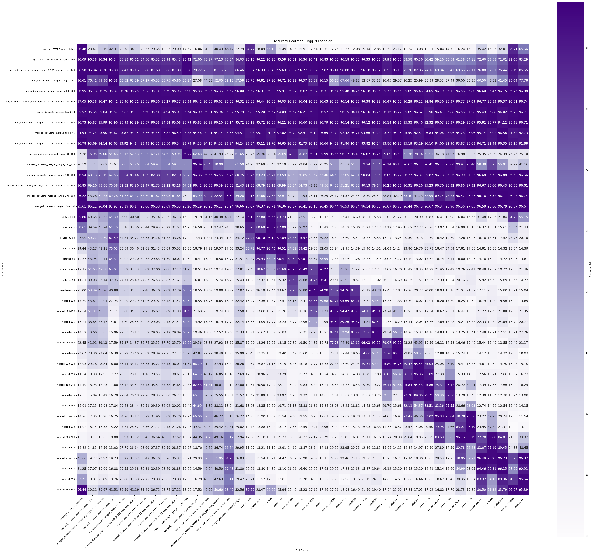
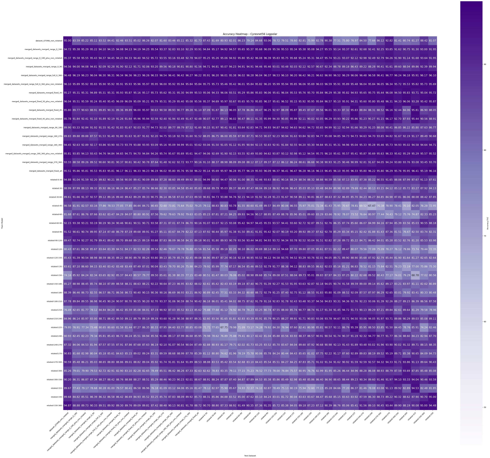
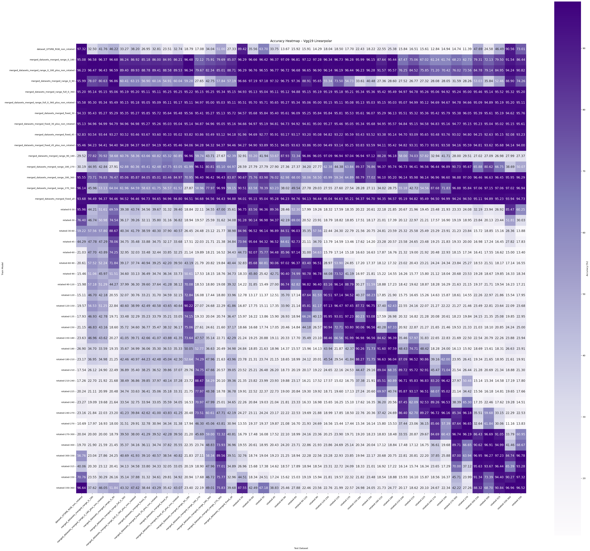
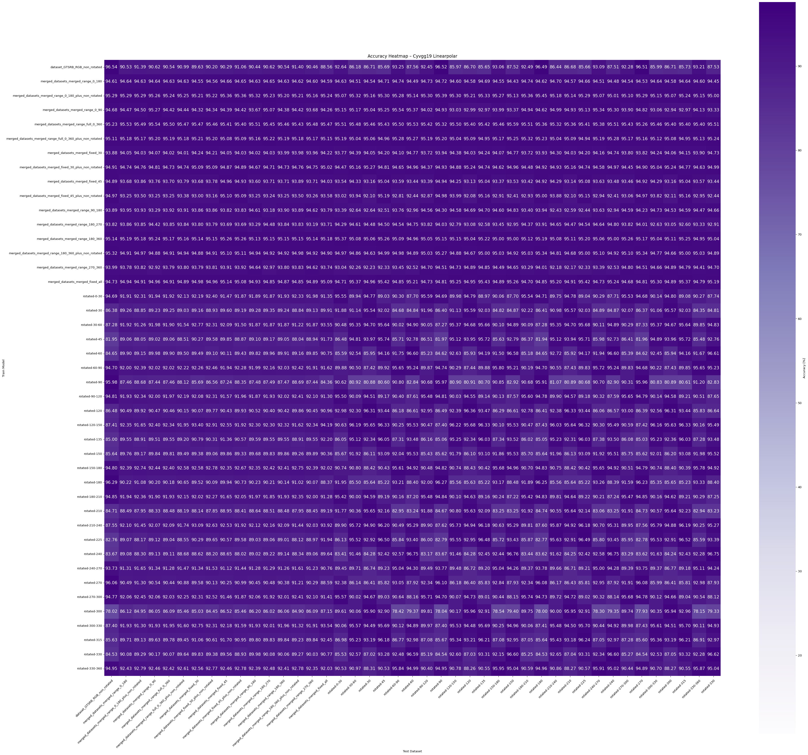
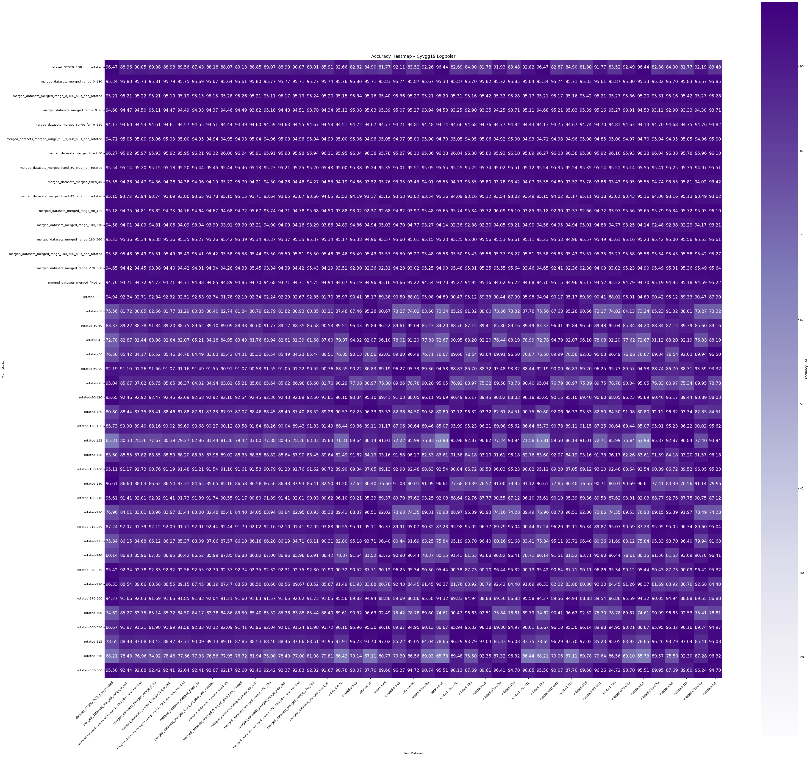
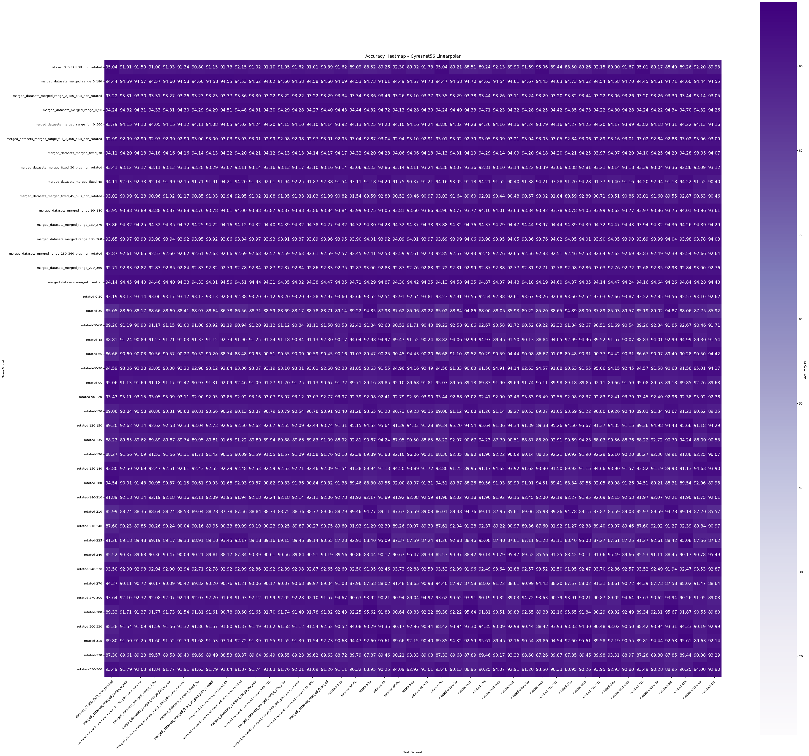
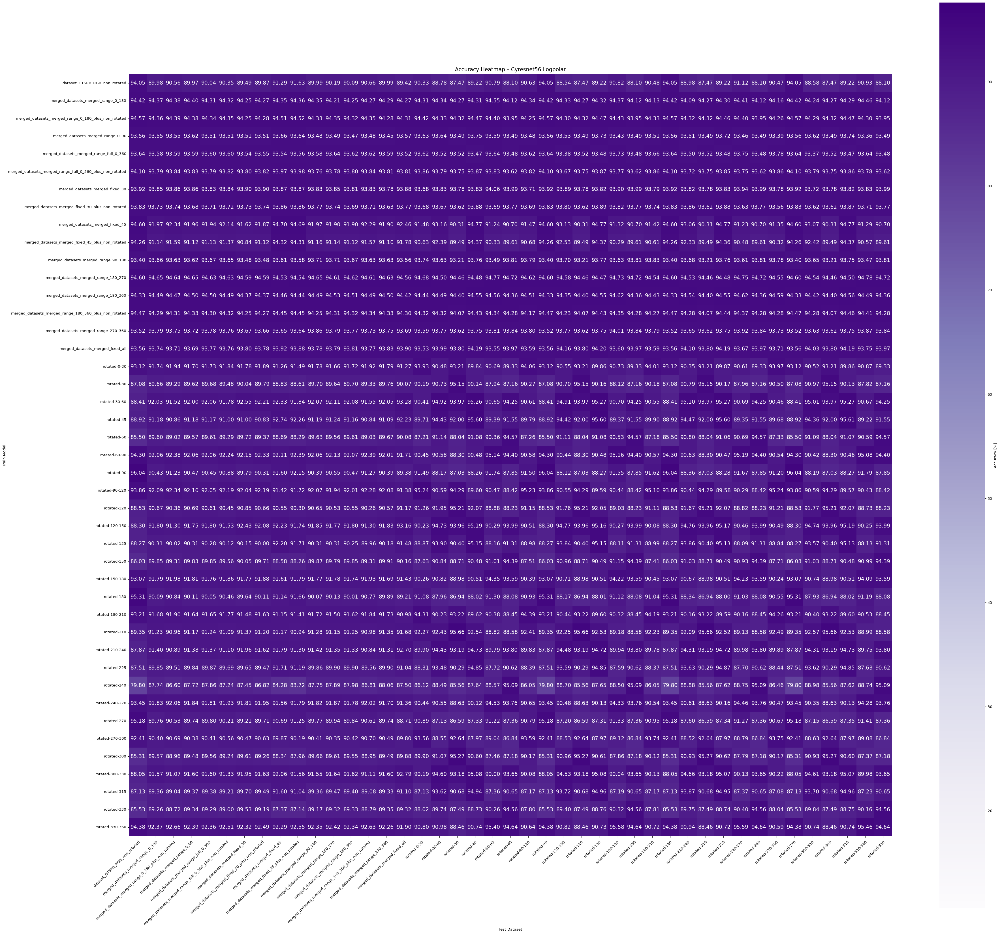

---
header-includes:
  - \usepackage{graphicx}
  - \usepackage{multicol}
  - \usepackage{ragged2e}
  - \usepackage{tocloft}
  - \renewcommand{\cftsecleader}{\cftdotfill{\cftdotsep}}

---


\begin{titlepage}
\centering


\includegraphics[width=0.7 \textwidth]{media/ul_logo.png}

\vspace{1cm}

{\LARGE \textbf{Maciej Bujalski}} \\[1cm]

\RaggedRight
{\large
\textbf{Kierunek:} informatyka\\
\textbf{Specjalność:} informatyka stosowana\\
\textbf{Specjalizacja:} aplikacje mobilne\\
\textbf{Numer albumu:} 386012\\
}

\vspace{2.5cm}

\centering
{\Large \textbf{Rotacyjnie inwariantne sieci neuronowe}} \\[2cm]

\begin{flushright}
\large
\textbf{Praca magisterska} \\
wykonana pod kierunkiem \\
dr Krzysztofa Podlaskiego \\
w Katedrze Systemów Inteligentnych, WFiIS UŁ
\end{flushright}

\vfill

{\large Łódź 2025}

\end{titlepage}

\newpage
  \
\newpage

\tableofcontents

\newpage

# Wstęp

Obrazy otaczają nas z każdej strony, od zdjęć ze smartfonów, zdjęcia
satelitarne, przez monitoring miejski, katalogi produktów i systemy
kontroli jakości na liniach produkcyjnych, po systemy wspomagania jazdy.
Choć współczesne modele rozpoznawania obrazu radzą sobie bardzo dobrze,
w praktyce bywają wrażliwe na pozornie drobne zmiany takie jak
obrócenie obiektu o kilkanaście stopni czy niewielki przechył kamery.
To, co dla człowieka jest naturalne i natychmiast rozpoznawalne (znak
drogowy pod kątem, cyfra obrócona na kartce), dla klasycznej konwolucyjnej 
sieci neuronowej (ang. Convolutional Neural Network, CNN) bywa problemem. 
Największy problem to brak naturalnej inwariantności względem rotacji, 
standardowe CNN-y z definicji lepiej radzą sobie z przesunięciami niż z obrotami
[@goodfellow2016deep; @dumoulin2016guide].

W ostatnich latach pojawiło się kilka propozycji rozwiązania tego problemu. 
Jedna z nich to poszerzanie danych o zrotowane przykłady, które poprawiają 
odporność, ale wydłużają trening i nie gwarantują uogólnienia na wszystkie kąty. 
Druga to architektury z wbudowaną geometrią: sieci grupowo równoważne 
(ang. Group Equivariant Convolutional Neural Networks, G-CNN), w tym sieci 
równoważne względem grupy przekształceń euklidesowych w dwóch wymiarach 
(ang. Euclidean(2)-equivariant networks, E(2)-equivariant) [@cohen2016group; @kim2020cycnn], 
oraz modele oparte na mapowaniu polarnym i konwolucjach cylindrycznych 
(ang. Cylindrical Convolutional Neural Networks, CyCNN, a w szczególności CyVGG i CyResNet) 
operujące na wielu orientacjach, a także przekształcenia do układów polarnych 
(linear-polar i log-polar), które przekształcają rotacje do przesunięć. Cel jest wspólny,
mianowicie by model rozpoznawał tak samo niezależnie od orientacji,
bez agresywnego dublowania danych i powiększania datasetu o te same, 
lecz zrotowane dane.

Niniejsza praca skupia się na praktycznej weryfikacji tych podejść.
Przygotowano zbiory obejmujące m.in. odręcznie napisane cyfry, znaki
drogowe (w kolorze i w odcieniach szarości) oraz syntetyczne obiekty 3D
rzutowane na 2D (klocki LEGO), a następnie rozszerzono je o kontrolowane
rotacje. Zaimplementowano i porównano wybrane architektury rotacyjnie
inwariantne i ich warianty bazowe w PyTorchu [@paszke2019pytorch],
mierząc wpływ transformacji (linear-polar vs. log-polar), wyboru
architektury i zakresu kątów na jakość predykcji. Obliczenia realizowane 
zostały na nastpępujących kartach graficznych: 
NVIDIA GeForce RTX 3070 Ti 8 GB oraz RTX 3060 12 GB,
co skróciło czas trenowania i umożliwiło szeroki przegląd eksperymentów.
Środowisko uruchomieniowe ustandaryzowane zostało z użyciem Dockera
celem użyskania powtarzalności i przenośności.

Celem pracy jest nie tylko pokazanie, że jest możliwe uzyskanie odporności na
rotacje, ale przede wszystkim wskazanie, kiedy i jakim kosztem
ją osiągamy oraz które techniki przynoszą największy zysk względem
klasycznych CNN-ów, ich wpływ na stabilność i szybkość uczenia, a także 
które konfiguracje są najpraktyczniejsze w realnych zastosowaniach 
(ang. Optical Character Recognition, OCR - optyczne rozpoznawanie znaków, analiza obiektów technicznych).
W dalszej części pracy przedstawiono podstawy, dane i augmentację,
architektury, środowisko eksperymentalne, protokoły ewaluacji oraz
wyniki z analizą i wnioskami.

\newpage

## Cel i motywacja pracy

Konwolucyjne sieci neuronowe (CNN) charakteryzują się zdolnością do
analizy obrazów z zachowaniem niezmieności względem translacji.
Jednak wciąż brakuje powszechnie uznanych architektur, które
zapewniałyby inwariantność względem rotacji. Celem niniejszej pracy
jest analiza skuteczności rozwiązań zaproponowanych w literaturze,
ukierunkowanych na odporność modeli na rotację danych wejściowych
(np. CyCNN [@kim2020cycnn]).

W ramach pracy zostały przygotowane wzbogacone zbiory danych,
obejmujące m.in. zdjęcia odręcznie napisanych liter, znaków drogowych
(zarówno w kolorze, jak i w odcieniach szarości) oraz obiektów 3D
rzutowanych na 2D (klocki LEGO), rozszerzone o kontrolowane rotacje
obrazów.

Na podstawie tych zbiorów została przeprowadzona implementacja i
ewaluacja wybranych architektur rotacyjnie inwariantnych z wykorzystaniem
PyTorch. Obliczenia zostały wykonane przy użyciu wcześniej 
wymienionych kart graficznych NVIDIA, co umożliwiło przyspieszenie trenowania 
i testowania. Otrzymane wyniki zostały porównane z rezultatami 
klasycznych sieci konwolucyjnych w celu oceny realnych korzyści z użycia
rozwiązań inwariantnych do zbiorów z rotacją.

## Opis pracy

Praca magisterska wykorzystuje zaawansowane technologie i narzędzia
wspierające badania nad rotacyjnie inwariantnymi sieciami neuronowymi
oraz ich zastosowaniem w przetwarzaniu obrazów. W realizacji projektu
zastosowano następujące rozwiązania technologiczne:

- **Język programowania Python** - podstawowe narzędzie do implementacji
  algorytmów oraz obsługi frameworków uczenia maszynowego, dzięki jego
  wszechstronności i bogatemu ekosystemowi bibliotek [@python-docs]. 
  Środowiska uruchomieniowe były izolowane dzięki użyciu wirtualnych 
  środowisk Pythona (`venv`).

- **Frameworki uczenia maszynowego:**  \
  - **PyTorch** - PyTorch - elastyczny framework do budowy, trenowania i wdrażania
  modeli uczenia maszynowego (ML) i głębokiego uczenia (DL) (w tym własnych warstw, 
  takich jak konwolucja cylindryczna,`CyConv`) [@pytorch-docs].  \
  - **Optuna** - biblioteka do automatycznej optymalizacji hiperparametrów (HPO) z 
  obsługą strategii TPE (Tree-structured Parzen Estimator) oraz mechanizmów 
  wczesnego przerywania treningów (np. MedianPruner).
  Umożliwia ona definiowanie przestrzeni poszukiwań, rejestrowanie metryk,
  zapisywanie wyników (np. do CSV (Comma-Separated Values) lub 
  JSON (JavaScript Object Notation)) oraz łatwe odtwarzanie najlepszych
  konfiguracji w postaci *study*. Integracja z PyTorchem odbywa się bez
  zmian w architekturze modeli i pozwala skrócić czas eksperymentów bez
  utraty jakości [@akiba2019optuna].  \

- **Model CyCNN (ang. Cylindrical Convolutional Neural Network).** 
  W mojej pracy zostało przyjęte podejście, w  którym obraz został przemapowany 
  do współrzędnych $(\rho,\varphi)$.
  Dzięki temu obrót $R_\alpha$ staje się przesunięciem o $\alpha$ po osi
  $\varphi$. Warstwy konwolucyjne zostały zastąpione warstwami cylindrycznymi
  (CyConv) z cyklicznym paddingiem po $\varphi$. Dla każdego filtra
  zostało przygotowanych $n$ orientacji, a odpowiedzi zostały złożone z
  dodatkową osią „orientacja”. Obrót wejścia powoduje cykliczne przesunięcie
  po tej osi, a pooling po orientacjach daje inwariancję względem
  rotacji. Został ustawione takie parametry jak stały środek układu polarnych,
  stała siatka próbkowania oraz biliniarna interpolacja. Padding po
  $\varphi$ został ustawiony na cykliczny. Implementacja została wykonana
  w PyTorchu (punkt odniesienia: CyCNN [@kim2020cycnn]).

- **Wykorzystanie akceleracji GPU (NVIDIA)** - obliczenia zostały
  znacząco przyspieszone dzięki użyciu kart RTX 3070 Ti 8 GB oraz
  RTX 3060 12 GB. Frameworki takie jak PyTorch wspierają CUDA (Compute Unified Device Architecture) 
  oraz cuDNN (CUDA Deep Neural Network library) i potrafią wykorzystywać 
  rdzenie Tensor (Tensor Cores) co umożliwia efektywne wykorzystanie 
  zasobów GPU [@cuda-docs; @cudnn-docs].
  Monitorowanie i diagnostyka zostały wykonane z użyciem narzędzia `nvidia-smi`.

- **Rdzenie CUDA (CUDA Cores).** To podstawowe jednostki obliczeniowe
  w multiprocesorach strumieniowych (SM - Streaming Multiprocessors), 
  odpowiedzialne za operacje arytmetyczne w precyzji FP32/INT32. 
  Gdy nie korzystamy z Tensor Cores (np. trening w czystym FP32, bez 
  TF32 (TensorFloat-32)/AMP (Automatic Mixed Precision)), 
  sploty i mnożenia macierzy wykonują właśnie rdzenie CUDA. Na wydajność wpływa
  przede wszystkim occupancy SM-ów (obsadzenie wątkami), właściwy
  dobór rozmiaru bloków (w praktyce wielokrotność 32 wątków jest równy warp),
  scalony dostęp do pamięci globalnej oraz sensowne użycie
  pamięci współdzielonej. Warstwa `CyConv2d` wymusza
  `contiguous()` i obecność tensora na CUDA przed wywołaniem jądra,
  duży `workspace` sprzyja kafelkowaniu (podziale danych) i ogranicza 
  liczbę odczytów z DRAM, co poprawia przepływ danych na SM-ach [@cuda-docs].

- **Tensor Cores (Ampere).** Zastosowane karty graficzne RTX (3070 Ti, 3060) mają
  rdzenie Tensor, które sprzętowo przyspieszają operacje macierzowe
  (konwolucje/matmul). Biblioteki cuDNN (CUDA Deep Neural Network) / 
  cuBLAS (CUDA Basic Linear Algebra Subprograms) na architekturze
  Ampere domyślnie mogą używać trybu TF32 dla obciążeń FP32,
  co daje dodatkowe przyspieszenie bez zmian w modelu.
  Dodatkowo, w PyTorchu możliwe jest włączenie mieszanej precyzji
  (FP16/BF16 - bfloat16) przez AMP w miejscach, gdzie to bezpieczne, co przy
  włączeniu tego feature, zwykle przyspiesza to trening przy
  porównywalnej jakości (szczegóły znajdują się w dokumentacji).
  [@nvidia_tensorcores; @nvidia_tf32; @micikevicius2018mixed; @pytorch_amp]

- **System operacyjny: Linux (Ubuntu 24.04.2 LTS - Long-Term Support).** - Główne środowisko 
  uruchomieniowe stanowił system operacyjny Ubuntu (dystrybucja LTS) 
  posiadający stabilne jądro, pakiety z APT (Advanced Package Tool), łatwą integrację ze 
  sterownikami NVIDIA i CUDA. Treningi uruchamiane były lokalnie na 
  maszynach z GPU NVIDII. [@ubuntu_docs]. Dla zgodności ze środowiskami 
  Windows używano też wariantu WSL2 (Windows Subsystem for Linux 2) (ten sam obraz Dockera i ta sama konfiguracja)
  [@wsl_docs].

- **Konteneryzacja za pomocą Dockera** - odizolowane środowiska
  uruchomieniowe ułatwiły replikację i współdzielenie projektu, także
  z obsługą GPU [@docker-docs].

\newpage

## Zakres tematyczny

Niniejsza praca dotyczy odporności modeli klasyfikacji obrazów na rotacje
w płaszczyźnie 2d. Skupiono się na porównaniu klasycznych architektur z ich
wersjami rotacyjnie inwariantnymi oraz na wpływie przekształceń polarnych
na jakość predykcji. Badania zostały przeprowadzone na obrazach 2D i ich
rotacjach planarnych. W szczególności zostały porównane warianty bazowe
VGG/ResNet z wersjami cyklicznymi CyVGG/CyResNet, a także wpływ
mapowania linear-polar i log-polar. Eksperymenty zostały wykonane
na zbiorach MNIST, GTSRB_gray, GTSRB RGB i LEGO z
kontrolowanymi rotacjami.

### Ujęte w zakresie
W pracy zostały poruszone poniższe wątki badawcze:

**Architektury modeli:** zostały zaimplementowane i porównane warianty
bazowe VGG oraz ResNet [@simonyan2014vgg; @he2016resnet], a także
ich wersje cykliczne CyVGG i CyResNet (modele rotacyjnie
inwariantne) [@kim2020cycnn].

**Przekształcenia polarne:** została oceniona użyteczność mapowania
linear-polar oraz log-polar jako etapów wstępnego
przetwarzania służących „prostowaniu” rotacji do przesunięć
[@reddy1996logpolar; @kim2020cycnn].

**Zbiory danych:** zostały wykorzystane następujące zbiory:
MNIST (odręczne cyfry, 28x28 przeskalowane do 32x32, grayscale) [@lecun1998mnist],
LEGO (syntetyczne obiekty 3D rzutowane na 2D, 96x96, grayscale),
GTSRB (znaki drogowe, 32x32, grayscale) oraz GTSRB RGB
(wersja kolorowa) [@stallkamp2011gtsrb]. Zbiory zostały rozszerzone
o kontrolowane rotacje oraz zostały przygotowane spójne podziały zbiorów na
train/val/test.

**Augmentacja i protokół nauki, validacji oraz testów:**
zostały zdefiniowane zakresy kątów do sprawdzenia,
liczba treningów, podział na zbiory train/val/test (uczący/
walidacyjny/testowy), z możliwością powtórzenia trenowań.

**Środowisko i implementacja:** został wykorzystany PyTorch z
akceleracją CUDA/cuDNN na kartach NVIDIA GeForce RTX 3070 Ti 8 GB
oraz NVIDIA GeForce RTX 3060 12 GB [@pytorch-docs; @cuda-docs;
@cudnn-docs]. Przygotowane zostały skrypty w
Pythonie do trenowania, testowania i ewaluacji [@python-docs].
Środowisko uruchomieniowe zostało ustandaryzowane z
użyciem Dockera [@docker-docs].

**Metryki i analiza:** została przeprowadzona ocena jakości (accuracy,
macierze pomyłek), analiza stabilności (średnia/mediana/odchylenie
standardowe), wpływ kąta rotacji na skuteczność oraz koszt
obliczeniowy (czas trenowania, rozmiar modelu).

### Poza zakresem
W pracy nie zostały poruszone następujące wątki badawcze:

- Detekcja obiektów i segmentacja - w pracy rozpatrywana jest wyłącznie
  klasyfikacja [@he2017mask; @ronneberger2015unet].

- Inwariancja względem skali, ścinania i pełnych przekształceń afinicznych -
  analizowana jest tylko rotacja w płaszczyźnie [@lowe2004sift; @jaderberg2015stn].

- Rotacje w geometrii 3D oraz zagadnienia widzenia stereo - pozostają
  poza zakresem [@esteves2018spherical; @hartley2004mv].

- Trening na bardzo dużych korpusach z pre-treningiem self-supervised oraz
  szerokim AutoML/hyper-search - nie został realizowany
  [@chen2020simclr; @he2020moco; @li2018hyperband].

- Odporność na silne zakłócenia (szum, okluzje) - poza zakresem, gdyż skupiono
  się wyłącznie na rotacji [@hendrycks2019imagenetc; @devries2017cutout].


### Artefakty pracy

W ramach pracy przygotowano komplet materiałów umożliwiających replikację
eksperymentów oraz weryfikację wyników. Zgromadzone artefakty 
(linki do niech znajdują się w rozdziale Aneks), obejmują one
repozytoria z kodem źródłowym, skryptami uruchomieniowymi oraz plikami
konfiguracyjnymi wykorzystywanymi w procesie trenowania i ewaluacji.
Dołączono również zestaw plików opisujących zbiory danych oraz parametry
eksperymentów, a także wybrane pliki wag modeli (checkpointy) i raporty
z przebiegu testów. Całość uzupełnia tekst pracy zawierający opis
metodyki, dokumentację eksperymentalną oraz wnioski końcowe.

### Organizacja pracy

Struktura pracy została zaprojektowana tak, aby w sposób spójny
prowadzić czytelnika od zagadnień teoretycznych do analizy wyników
eksperymentalnych. W rozdziale Podstawy teoretyczne przedstawiono
kluczowe pojęcia i narzędzia: sieci konwolucyjne (CNN), inwariancję i
ekwiwariancję, przekształcenia polarne oraz najważniejsze podejścia
pokrewne, takie jak G-CNN, E(2)-Equivariant Networks i CyCNN.
Rozdział Opis zbiorów danych zawiera charakterystykę wykorzystanych
zestawów: MNIST, LEGO, GTSRB_gray oraz GTSRB RGB 
oraz sposób augmentacji, obejmujący rotacje i podział na zbiory
treningowe, walidacyjne i testowe. W części Architektury modeli
omówiono konstrukcję sieci bazowych (VGG19, ResNet56) oraz ich
wariantów cyklicznych (CyVGG19, CyResNet56) wraz z zastosowanymi
odwzorowaniami linear-polar i log-polar.  
Rozdział Implementacja i środowisko eksperymentalne opisuje aspekty
techniczne: biblioteki (PyTorch, CUDA, cuDNN), środowisko
obliczeniowe (RTX 3070 Ti 8 GB, RTX 3060 12 GB), konteneryzację
(Docker) oraz strukturę projektu i zestaw skryptów. W części
Eksperymenty określono scenariusze trenowania, metryki oraz sposób
oceny jakości modeli. Rozdział Porównanie wyników zestawia wyniki
dla poszczególnych architektur (VGG vs. CyVGG, ResNet vs. CyResNet) i
analizuje wpływ transformacji na stabilność oraz czas obliczeń.  
Ostatni rozdział, Wnioski, podsumowuje uzyskane rezultaty, wskazuje
kierunki dalszych badań oraz ocenę efektywności modeli cyklicznych.
Sekcja Aneks zawiera listingi kodów, dodatkowe wykresy oraz tabele
pomocnicze.

\newpage

# Podstawy teoretyczne

Celem tego rozdziału jest uporządkowanie pojęć, które są potrzebne do
zrozumienia dalszych eksperymentów. Najpierw zostały przedstawione podstawy
klasycznych sieci konwolucyjnych takich jak: idea splotu, lokalne pola recepcyjne,
współdzielenie wag i wynikająca z tego ekwiwariancja względem translacji
[@lecun1998gradient; @goodfellow2016deep; @dumoulin2016guide]. Następnie omawaine są
parametry geometrii warstwy (stride, padding, dylacja), zależności rozmiarów
wejścia i wyjścia oraz sposób, w jaki pooling buduje praktyczną inwariancję na
przesunięcia.

Następnie przedstawiona zostaje różnica między ekwiwariancją, a
inwariancją oraz pokazane są ograniczenia klasycznych CNN w kontekście
rotacji. Ten brak zgodności grupowej dla obrotów motywuje dwie ścieżki
rozwijane w literaturze, pierwsza  to mapowanie do układu biegunowego i operowanie na osi
kąta w sposób cykliczny (linia CyCNN), zaś druga to konstrukcje oparte o sploty grupowe 
i jądra sterowalne w grupie $\mathrm{E}(2)$ (ang. Euclidean group in 2D, obejmującej rotacje 
i translacje. W literaturze używa się również $\mathrm{SE}(2)$ dla wersji bez odbić), 
tzw. sieci E(2)-equivariant [@bronstein2021gdl; @kim2020cycnn; @cohen2016group]. W tej pracy wykorzystywana
jest pierwsza ścieżka, ponieważ pozwala zachować standardowy pipeline i
porównywalny budżet parametrów, a jednocześnie wprowadzić kontrolowaną
ekwiwariancję rotacyjną, która po agregacji orientacji przechodzi w inwariancję.

Dla kompletności omówione zostaną też praktyczne aspekty przekształceń polarnych
(linear-polar i log-polar), sposób liczenia pól recepcyjnych po takich
mapowaniach oraz wpływ decyzji implementacyjnych (interpolacja, wybór środka,
cykliczny padding po $\varphi$) na stabilność uczenia. Taki zestaw podstaw
pozwala czytelnie oddzielić wpływ augmentacji od wpływu architektury i
stanowi fundament pod analizę wyników w dalszych rozdziałach.


## Wprowadzenie do sieci konwolucyjnych - CNN

Sieci konwolucyjne (ang. Convolutional Neural Networks, CNN) zostały zaprojektowane
do przetwarzania danych o strukturze siatkowej, takich jak obrazy dwuwymiarowe.
Ich kluczowymi elementami są lokalne pola recepcyjne, współdzielone wagi oraz
operacja splotu, która umożliwia wykrywanie wzorców lokalnych przy jednoczesnym
zachowaniu translacyjnej struktury danych. Dzięki temu sieci konwolucyjne uczą się
detektorów prostych struktur, takich jak krawędzie lub tekstury, a w kolejnych
warstwach, reprezentacji coraz bardziej złożonych [@lecun1998gradient; @goodfellow2016deep].

Niech \(X:\mathbb{Z}^2\!\to\!\mathbb{R}\) oznacza obraz wejściowy, a
\(K\in\mathbb{R}^{m\times n}\) oznacza jądro (filtr) konwolucyjne. 
operator zapisywany jako „\(*\)” reprezentuje najczęściej korelację krzyżową,
czyli operację zdefiniowaną następująco:

\[
(Y = X * K)(u) \;=\; \sum_{v\in\Omega_K} X(u+v)\,K(v),
\]

gdzie \(Y\) stanowi mapę cech uzyskaną w wyniku zastosowania filtra \(K\)
do obrazu \(X\). Dla przejrzystości pominięto w tym zapisie kwestie związane
z wieloma kanałami, rozmiarem kroku (*stride*), dylacją oraz uzupełnianiem brzegów
(*padding*).

Przez \(\mathcal T_t\) oznacza się operator translacji o wektor
\(t\in\mathbb{Z}^2\), działający zgodnie z definicją:

\[
(\mathcal T_t X)(u) \;=\; X(u-t).
\]

Dla tak zdefiniowanych operatorów zachodzi własność
ekwiwariancji translacyjnej:

\[
\boxed{\;\mathcal T_t(X) * K \;=\; \mathcal T_t\!\big(X * K\big)\;}
\]

Oznacza to, że przesunięcie obrazu wejściowego o wektor \(t\)
powoduje przesunięcie mapy cech o ten sam wektor. W konsekwencji sieć
konwolucyjna reaguje w sposób zgodny z przesunięciami danych wejściowych,
co jest pożądane w zadaniach rozpoznawania wzorców. Inwariancja względem
translacji może być dodatkowo wzmacniana poprzez zastosowanie warstw
agregujących, takich jak pooling lokalny lub globalny, bądź poprzez
zwiększenie kroku (*stride*), co redukuje wpływ dokładnej pozycji obiektu
na wynik klasyfikacji [@dumoulin2016guide; @goodfellow2016deep].


### Operacja splotu

Operacja splotu stanowi podstawowy mechanizm działania sieci
konwolucyjnych. Intuicyjnie można ją rozumieć jako przesuwanie niewielkiego
filtru po obrazie i obliczanie w każdym położeniu ważonej sumy wartości
pikseli. Umożliwia to współdzielenie wag, gdyż liczba parametrów modelu
nie zależy bezpośrednio od rozdzielczości obrazu $(H, W)$ oraz
lokalność obliczeń, co istotnie ogranicza złożoność obliczeniową
[@dumoulin2016guide; @goodfellow2016deep].

**Kształty tensorów:**  
Wejście: \(X \in \mathbb{R}^{C_{\text{in}}\times H\times W}\),  
zestaw jąder: \(K \in \mathbb{R}^{C_{\text{out}}\times C_{\text{in}}\times k\times k}\),  
wyjście: \(Y \in \mathbb{R}^{C_{\text{out}}\times H'\times W'}\).

gdzie:
- \(C_{\text{in}}\) - liczba kanałów wejściowych (np. 3 dla obrazu RGB),  
- \(C_{\text{out}}\) - liczba filtrów, czyli kanałów wyjściowych,  
- \(H, W\) - wysokość i szerokość mapy wejściowej,  
- \(H', W'\) - wysokość i szerokość mapy wyjściowej po splotach i subsamplingu,  
- \(k\) - rozmiar jądra (filtra), zwykle niewielki, np. \(3\times3\) lub \(5\times5\).


**Definicja (dla pojedynczego kanału wyjściowego $c$):**
$$
Y_c(u,v)=\sum_{i=1}^{C_{\text{in}}}\sum_{a,b}
K_{c,i}(a,b)\,X_i(u-a,\;v-b).
$$

W praktyce większość frameworków oblicza korelację krzyżową, czyli
operację bez odwracania jądra, mimo że w interfejsach funkcje te często
oznaczane są jako `conv`. Różnica ta nie ma wpływu na proces uczenia,
ponieważ sieć w toku optymalizacji dobiera odpowiednie wagi.


Powyższy zapis odpowiada klasycznej definicji splotu, w której jądro
jest odwracane względem obu osi. W większości frameworków
uczenia głębokiego implementowana jest korelacja krzyżowa (bez tego odwrócenia),
mimo że w interfejsach funkcje te często oznaczane są jako `conv`,
jednak różnica ta nie wpływa na proces uczenia, ponieważ parametry jądra są
optymalizowane.

#### Parametry geometrii warstwy  \

Operację splotu opisują trzy podstawowe parametry:

- **padding** $p$ - liczba pikseli dodawanych na brzegach mapy wejściowej,
- **stride** $s$ - krok przesuwania okna konwolucyjnego,
- **dylacja** $d$ - odstęp pomiędzy próbkami w jądrze, pozwalający zwiększyć
  efektywne pole widzenia bez wprowadzania nowych parametrów.

#### Ekwiwariancja translacyjna i wpływ parametrów  \

Dokładna ekwiwariancja translacyjna zachodzi jedynie przy splocie bez
zmiany rozmiaru mapy cech. W praktyce jednak stosowanie opcji
padding "same", kroku stride > 1 czy operacji poolingu może
powodować drobne odchylenia wynikające z aliasingu siatki próbkowania,
co opisano m.in. w [@dumoulin2016guide; @azulay2019small].

Rozmiar wyjścia dla jądra o wymiarach $k\times k$ wyraża się wzorem:
$$
H'=\Big\lfloor \frac{H+2p-d\,(k-1)-1}{s}\Big\rfloor+1,\qquad
W'=\Big\lfloor \frac{W+2p-d\,(k-1)-1}{s}\Big\rfloor+1.
$$

**Typowe ustawienia:**  \
- *valid* ($p=0$) - mapy cech ulegają zmniejszeniu,  
- *same* (dla $s=1$) - zachowany rozmiar: $H'=H$, $W'=W$,  
- *stride > 1* - wbudowane podpróbkowanie, mniejsza rozdzielczość,  
- *dylacja > 1* - większe efektywne pole widzenia (często w detekcji lub segmentacji).

### Receptywne pole

Receptywne pole określa fragment obrazu, z którego dana aktywacja w mapie
cech pobiera informacje. Wraz ze wzrostem głębokości sieci rośnie jego
rozmiar, ponieważ kolejne warstwy agregują informacje z coraz większych
obszarów wejścia. Dla jąder o rozmiarach \(k_\ell\) i krokach \(s_\ell\) zachodzi zależność:
\[
R_1 = k_1, \qquad
R_\ell = R_{\ell-1} + (k_\ell - 1)\!\!\prod_{j<\ell}s_j.
\]
gdzie \(k_\ell\) oznacza rozmiar jądra (liczbę pikseli wzdłuż jednego wymiaru),
a \(s_\ell\) oznacza krok przesuwania filtra w warstwie \(\ell\).

W praktyce nie wszystkie piksele w obrębie receptywnego pola wpływają na
aktywację w tym samym stopniu, gdyż największe znaczenie ma część centralna,
a wpływ maleje ku brzegom, co przypomina rozkład Gaussa. Z tego powodu w
architekturach bazowych, takich jak VGG czy ResNet, dobiera się
głębokość sieci tak, aby pole receptywne obejmowało cały obiekt bez utraty
istotnego kontekstu [@luo2016erf].

W wariantach CyCNN, po przejściu do współrzędnych biegunowych
$(\rho,\varphi)$ i zastosowaniu cyklicznego paddingu wzdłuż osi
kątowej, sieć uzyskuje pełny zakres orientacji bez artefaktów brzegowych.
Pozwala to na stabilne uczenie cech niezależnych od kąta rotacji
[@kim2020cycnn].


#### Receptywne pole w układzie polarnym  \

Po mapowaniu $(x,y)\!\to\!(\rho,\varphi)$ receptywne pole staje się „wąskim paskiem”
wzdłuż promienia $\rho$ i przy czym stabilnym po kącie $\varphi$. Dzięki temu obrót
$\mathcal{R}_\alpha$ na wejściu jest równoważny przesunięciu o $\alpha$ po osi
$\varphi$. Warstwy typu `CyConv` z cyklicznym paddingiem wzdłuż $\varphi$ nie
ucinanają informacji na brzegach, co oczywiście wzmacnia ekwiwariancję rotacyjną [@kim2020cycnn].


### Nieliniowości i normalizacja

Blok konwolucyjny pozostaje taki sam we wszystkich wariantach (bazowych i
cyklicznych). Celem porównania jest wpływ rotacji, a nie dobór aktywacji.
Zastosowano standardową normalizację, celem stabilizacji uczenie. W wariantach
CyCNN statystyki normalizacji liczone są wspólnie po osi orientacji, tak aby
nie faworyzować żadnego kąta i nie naruszać własności rotacyjnych
[@ioffe2015batchnorm; @kim2020cycnn].

### Pooling i część klasyfikacyjna

W modelach CyCNN inwariancja względem rotacji uzyskiwana jest przez
agregację po orientacjach (pooling po osi kątów). Następnie, we wszystkich
modelach, stosowany jest global average pooling (GAP) oraz pojedyncza warstwa
liniowa w klasyfikatorze. GAP redukuje liczbę parametrów i zmniejsza zależność
od położenia w obrębie map cech [@lin2014network]. Część klasyfikacyjna pozostaje
taka sama w wariantach bazowych i cyklicznych, aby izolować wpływ części
„rotacyjnej” [@kim2020cycnn].

#### Pooling po orientacjach - szczegóły praktyczne  \

Agregacja po osi *orientacja* (avg lub max) realizuje inwariancję rotacyjną.
Na wynik końcowy wpływa liczba orientacji n, czyli większe n oznacza dokładniejszą
rozdzielczość kątową (mniejszy błąd zaokrąglenia $2\pi/n$), ale też wyższy koszt
obliczeń i pamięci. W eksperymentach utrzymano identyczny klasyfikator za
poolingiem, aby jednoznacznie mierzyć wpływ części „rotacyjnej”
[@kim2020cycnn].

### Trening

Protokół trenowania został zamrożony między wariantami (te same: liczba epok,
rozmiar batcha, budżet obliczeniowy, warunek wczesnego zatrzymania, tak by wszystko 
to było zgodnie z planem eksperymentu). Augmentacje ograniczono do tych 
niezależnych od rotacjiw testach „czysto architektonicznych”. Augmentację rotacją
zastosowano wyłącznie w eksperymentach kontrolnych, tak aby pokazać różnicę między 
augmentacją, a architekturą.

## Modele Cy oraz zmiany architektoniczne względem CNN

Jako bazy zastosowano VGG-19 (bloki 3×3) i ResNet-56 w wariancie
CIFAR (bloki 3×3). W wersjach cyklicznych każdą warstwę Conv2d zastąpiono
CyConv2d. Po stronie geometrii zastosowano cykliczny padding wzdłuż osi
kątowej $\varphi$. Układ bloków, liczby kanałów, BN/ReLU, GAP i
klasyfikator zostały pozostawione bez zmian, tak aby utrzymać porównywalny budżet
parametrów/FLOPs względem bazowych modeli. Na poziomie definicji modeli nie
dodano jawnej osi orientacji ani osobnego poolingu po orientacjach,
jeśli mechanizmy rotacyjne są użyte, są one enkapsulowane w implementacji
CyConv2d (jądro CUDA), a nie w topologii sieci. Nie zostały prowadzone modyfikacje
niezwiązane z rotacją (np. zmiana funkcji aktywacji, normalizacja, głębokość,
rozmiar jąder, liczby kanałów czy regularizacji), aby nie mieszać
ich wpływu z efektem komponentu rotacyjnego[@kim2020cycnn].

### Ekwiwariancja translacyjna

Niech \( \mathcal{T}_t \) oznacza operator translacji obrazu o wektor \(t\in\mathbb{Z}^2\):
\[
(\mathcal{T}_t X)(u) = X(u-t).
\]
Niech \(*\) oznacza korelację krzyżową (standard w DL). Dla splotu/korelacji zachodzi
ekwiwariancja translacyjna:
\[
\mathcal{T}_t(X) * K \;=\; \mathcal{T}_t\!\big(X * K\big),
\]
co wyjaśnia, dlaczego klasyczne CNN dobrze radzą sobie z przesunięciami wejścia
[@dumoulin2016guide]. Sam splot gwarantuje ekwiwariancję (odpowiedź przesuwa się o \(t\));
inwariancja wymaga dodatkowego operatora agregującego \(P\) (np. global average pooling),
dla którego \( P\circ\mathcal{T}_t = P \).

#### Ekwiwariancja rotacyjna w dyskretnej grupie \(C_n\)  \

Niech \(C_n\) oznacza cykliczną grupę rzędu \(n\) (rotacje o kątach \(\theta_k = 2\pi k/n\), \(k=0,\dots,n-1\)).
Przez \(\mathcal{R}_{\theta}\) oznaczamy operator obrotu obrazu: \((\mathcal{R}_{\theta}X)(x)=X(R_{-\theta}x)\) (z interpolacją biliniarną).
Niech \(\Phi\) będzie odwzorowaniem obrazu na przestrzeń cech z jawnie wydzieloną osią orientacji:
\[
\Phi(X)[u,v,m]\in\mathbb{R}^{C}, \quad m\in\{0,\dots,n-1\},
\]
gdzie \([u,v,\cdot]\) oznacza indeksy przestrzenne (kropka w skrócie).

W zapisie \([\cdot,m]\) kropka oznacza wszystkie indeksy przestrzenne \((u,v)\), które dla zwięzłości pomijamy, 
zaś indeks \(m\) odnosi się wyłącznie do osi orientacji.

Warunek ekwiwariancji względem \(C_n\) ma wtedy postać przesunięcia po osi orientacji:
\[
\Phi\!\big(\mathcal{R}_{\theta_k} X\big)[u,v,m] \;=\; \Phi(X)[u,v,\,m\!+\!k \bmod n].
\]
Innymi słowy, obrót wejścia o \(\theta_k\) odpowiada cyklicznemu przesunięciu indeksu orientacji o \(k\).
Poolowanie po osi \(m\) (np. maksimum lub średnia) usuwa zależność od \(m\), co prowadzi do inwariancji rotacyjnej.

Zjawisko ekwiwariancji ujmuje się formalnie przez działanie reprezentacji grupy na przestrzeni cech:
\[
\Phi(g\!\cdot\! X) \;=\; \rho(g)\,\Phi(X), \qquad g\in G,
\]
gdzie \(G\) jest grupą transformacji (np. \(G=\mathbb{Z}^2\) dla translacji lub \(G=C_n\) dla rotacji),
a \(\rho\) - odpowiadającą jej reprezentacją na przestrzeni cech. Dla translacji \(\rho(t)\) jest przesunięciem
w płaszczyźnie \((u,v)\), a dla rotacji \(\rho(\theta_k)\) jest cyklicznym przesunięciem wzdłuż osi orientacji \(m\).
[@goodfellow2016deep; @bronstein2021gdl].


### Inwariancja translacyjna i rotacyjna

Niech $\mathcal{T}_t$ oznacza przesunięcie o wektor $t$, a
$\mathcal{R}_\alpha$ - obrót o kąt $\alpha$. Niech $\Phi$ będzie
funkcją odwzorowującą obraz wejściowy na przestrzeń cech lub wynik modelu.

Inwariancja oznacza, że wynik działania modelu nie zależy od
zastosowanej transformacji:
$$
\Phi(\mathcal{T}_t X) = \Phi(X),\qquad
\Phi(\mathcal{R}_\alpha X) = \Phi(X).
$$

W praktyce inwariancję translacyjną uzyskuje się przez mechanizmy
uśredniania lub podpróbkowania (np. global average pooling, stride).
Odporność na rotacje można osiągać na trzy sposoby:
1. Augmentacją o obroty, 
2. Modyfikacją architektury o wymiar orientacji z poolingiem po kątach,
3. Mapowaniem do współrzędnych polarnych, w których obrót redukuje się do przesunięcia wzdłuż osi \(\varphi\) [@dumoulin2016guide; @reddy1996logpolar; @kim2020cycnn].  \

Ekwiwariancja translacyjna zachodzi na poziomie splotu/korelacji (przed agregacją), natomiast inwariancję translacyjną 
uzyskuje się dopiero przez mechanizmy uśredniania lub podpróbkowania (np. pooling globalny, stride).

### Linear-polar a log-polar

Transformacja linear-polar zakłada równomierny przyrost współrzędnych
zarówno w kierunku promienia $\rho$, jak i kąta $\varphi$. Umożliwia ona
stabilne odwzorowanie orientacji oraz prostą implementację, dzięki czemu
rozwiązanie to jest szczególnie użyteczne w kontekście
inwariancji rotacyjnej.

W przypadku odwzorowania log-polar współrzędna promieniowa rośnie
logarytmicznie, co sprawia, że zmiany skali w obrazie stają się
przesunięciami wzdłuż osi adialnej (osi $\rho$). Takie podejście jest szczególnie
korzystne przy jednoczesnym uwzględnianiu rotacji i zmian skali,
jednak w pobliżu środka układu zwiększa się gęstość próbkowania, a tym
samym wrażliwość na dokładność wyznaczenia środka transformacji
[@reddy1996logpolar].

W implementacjach praktycznych stosuje się interpolację biliniarną oraz
cykliczne dopełnienie (padding) wzdłuż osi $\varphi$, przy zachowaniu
stałego środka odwzorowania. W celu uniknięcia osobliwości w punkcie
$\rho = 0$ zaleca się dodatkowe wygładzanie lub pominięcie kilku
najbliższych próbek [@kim2020cycnn].

\newpage

## Problemy z rotacyjną inwariancją w klasycznych CNN

W praktyce klasyczne CNN zachowują ekwiwariancję względem przesunięć,
lecz nie zapewniają pełnej zgodności dla rotacji. Wynika to z dyskretnej
natury splotu, efektów interpolacji oraz braku jawnej reprezentacji kąta
w strumieniu cech. Poniżej zestawiono główne źródła problemów, 
które bezpośrednio wpływają na wyniki i ich interpretację:


- **Kierunkowość filtrów.** Małe jądra `3×3` i `5×5` reagują głównie na
  jedną orientację. Aby pokryć wiele kątów, sieć musiałaby nauczyć się
  wielu obróconych kopii tych samych detektorów, co zwiększa zapotrzebowanie
  na dane i parametry. Kompozycja kilku warstw częściowo pomaga, ale bez
  mechanizmów ukierunkowanych na kąt problem nie znika.

- **Augmentacja nie zapewnia pełnego pokrycia.** Obracanie wzbogaca dane, ale pokrywa
  tylko zbiór dyskretnych kątów. Między tymi wartościami pozostaje
  „szczelina” generalizacji, zwłaszcza przy rzadkiej siatce kątów i
  ograniczonym budżecie. Dodatkowo augmentacja wydłuża trening i wnosi
  wariancję związaną z losowym próbkowaniem kątów.

- **Aliasing i interpolacja.** Obrót danego rastra wymaga resamplingu i doboru
  jądra interpolacji. Pojawia się wtedy rozmycie lub aliasing, a wysokie
  częstotliwości są tłumione inaczej zależnie od kąta oraz implementacji
  [@azulay2019small]. Skutkiem jest niespójność odpowiedzi nawet przy
  niewielkich obrotach tego samego obiektu.

- **Krawędzie i padding.** Dopełnianie „same/zero” łamie symetrię przy
  brzegach. W pobliżu krawędzi zmienia się kontekst, więc odpowiedzi nie są
  idealnie ekwiwariantne. Stride i pooling pogłębiają ten efekt przez rzadsze
  próbkowanie i aliasing, co jeszcze dodatkowo obniża stabilność na małe obroty
  [@dumoulin2016guide].

- **Brak osi orientacji.** W typowych CNN nie zapisuje się jawnie informacji
  o kącie wykrytej cechy. Orientacje mieszają się w kanałach, więc późniejsze
  uśrednianie (np. przez pooling) nie ma do czego się odnieść.
  Stąd potrzeba osi orientacja i operacji cyklicznych lub mapowania do układu
  polarnego.

- **Brak zgodności grupowej.** Standardowy splot gwarantuje ekwiwariancję dla
  translacji, ale nie dla rotacji. Na siatce pikseli obrót nie komutuje
  ze splotem jak przesunięcie. Klasyczne CNN nie mają więc gwarancji, że
  $\Phi(\mathcal R_\alpha X)$ jest prostą transformacją $\Phi(X)$.

- **Wczesne warstwy i pole widzenia.** We wczesnych warstwach receptywne pole
  jest małe, przez co lokalne rotacje bywają nierozróżnialne od innych zmian.
  Szerszy kontekst pojawia się dopiero po poolingach i podpróbkowaniu, co
  jednocześnie obniża precyzję kątową.

- **Interakcja z rozmiarem i kształtem obiektu.** Rotacja zmienia relacje
  między detalami, a siatką próbkowania (np. inna liczba przecinanych
  pikseli wzdłuż krawędzi przy różnych kątach). Skutkiem są fluktuacje
  aktywacji i decyzji zależne od rasteryzacji i kąta, a nie od samej klasy.

\newpage

# Przegląd literatury: sieci ekwiwariantne E(2) oraz CyCNN

Literatura o sieciach ekwiwariantnych rozwija się zasadniczo w dwóch
kierunkach. Pierwszy nurt to podejścia o charakterze geometrycznym,
które mapują obraz do współrzędnych biegunowych i traktują oś kąta jako
wymiar cykliczny. Drugi nurt to modele o ściśle zdefiniowanej
ekwiwariancji względem grupy przekształceń w 2D, najczęściej \(SE(2)\)
(rotacje + translacje, w części prac naukowych używa się również \(E(2)\), uwzględniającej
odbicia). Budowane są one poprzez sploty grupowe oraz jądra sterowalne
projektowane zgodnie z reprezentacjami grupy. Oba podejścia dążą do
reprezentacji odpornej na obrót, a inwariancję uzyskuje się zwykle przez
agregację po orbicie (np. pooling po orientacjach). Różnią się jednak
stopniem formalizacji, kosztem obliczeniowym i wysiłkiem inżynierskim
potrzebnym do integracji z typowymi ciągami przetwarzania (pipeline).


## CyCNN

W rodzinie CyCNN obraz po przemapowaniu do układu \((\rho,\varphi)\) jest
przetwarzany warstwami konwolucji cylindrycznej z dopełnieniem cyklicznym w osi
kątowej \(\varphi\). Przyjmuje się dyskretny zbiór orientacji opisany grupą
cykliczną \(C_n=\{\theta_k=2\pi k/n\}\). Obrót wejścia o \(\theta_k\) odpowiada
cyklicznemu przesunięciu indeksu orientacji o \(k\) w mapach cech, co zapewnia
ekwiwariancję względem \(C_n\). Zastosowanie agregacji po orientacjach (np. maksimum
lub średnia w osi \(\varphi\)) prowadzi do inwariancji rotacyjnej. Istotne są
też decyzje implementacyjne takie jak: wybór środka, interpolacja przy odwzorowaniu oraz
właściwe dopełnienie brzegów dla \(\varphi=0\) i \(\varphi=2\pi\), tak aby uniknąć artefaktów.
Zaletą CyCNN jest zgodność z klasyczną praktyką tworzenia modeli. Zamiana klasycznej konwolucji na
odpowiednik cylindryczny odbywa się bez zmiany interfejsu warstwy, co
ułatwia kontrolowane porównania z wersjami bazowymi przy podobnym
budżecie parametrów i zapotrzebowaniu na moc obliczeniową (FLOPs) [@kim2020cycnn].

## SE(2)-ekwiwariantne sieci i jądra sterowalne

Drugi nurt nie zmienia układu współrzędnych; definiuje splot bezpośrednio na
grupie \(SE(2)\) lub na przestrzeniach z jej działaniem. Filtry konstruowane są
zgodnie z reprezentacjami grupy (tzw. jądra sterowalne), co zapewnia
ekwiwariancję względem rotacji i translacji w 2D.
W literaturze opisano zarówno wersje dyskretne w stylu G-CNN, jak i 
konstrukcje sterowalne, w których filtry rozwija się
w bazach harmonicznych i ogranicza regułami reprezentacji
[@cohen2016group; @weiler2019general; @cohen2019homogeneous]. Rozszerzenia
obejmują również grupy dihedralne $D_n$, które pozwalają modelować
rotacje i odbicia, a także modele na przestrzeniach jednorodnych, co
ułatwia precyzyjne wskazanie, gdzie ma zajść ekwiwariancja, a gdzie
inwariancja.

## Aspekty implementacyjne i koszt
Modele oparte na formalizmie \(SE(2)\) (lub szerzej \(E(2)\)) zapewniają ścisłe gwarancje
wynikające z własności algebry grupy oraz konstrukcji jąder opartych na jej
reprezentacjach. Grupa \(SE(2)\) opisuje wszystkie rotacje i translacje w płaszczyźnie,
natomiast \(E(2)\) stanowi jej rozszerzenie o odbicia (symetrie lustrzane).
Dzięki temu modele tego typu zachowują poprawne przekształcenia cech
dla dowolnych obrotów i przesunięć obrazu.
Osiąga się to jednak kosztem większych wymagań obliczeniowych i pamięciowych
oraz bardziej złożonej implementacji. Wymaga to definiowania typów pól cech
(*feature fields*), respektowania ograniczeń na kształt filtrów oraz pracy
w bazach harmonicznych (np. przy rozwinięciach Fouriera).  
Linia CyCNN jest lżejsza wdrożeniowo, ponieważ
wystarcza zastąpić standardowy operator splotu jego wariantem cylindrycznym
i traktować wymiar kąta jako cykliczny. Dokładność ekwiwariancji zależy tu
od liczby rozpatrywanych orientacji, jakości interpolacji oraz stabilnego
wyboru środka. W zamian zachowana jest zgodność z istniejącymi modelami
VGG i ResNet oraz ze standardowymi komponentami, takimi jak BatchNorm,
dropout i GAP.

## Wnioski w kontekście pracy 
Wybrana została architektura z rodziny CyCNN, ponieważ 
ułatwia porównanie z modelami bazowymi i pozwala kontrolować
informację o orientacji bez ingerencji w pozostałe elementy sieci. Mapowanie
do $(\rho,\varphi)$ oraz cykliczne traktowanie osi kąta umożliwiają
zrealizowanie ekwiwariancji na etapie ekstrakcji cech, a agregacja po
orientacjach zamienia ją w inwariancję. Taki układ sprzyja rzetelnemu
porównaniu augmentacji rotacją z architekturą z wbudowaną obsługą rotacji
przy tym samym klasyfikatorze i zbliżonym budżecie parametrów modeli
[@kim2020cycnn; @cohen2016group; @weiler2019general; @cohen2019homogeneous].

\newpage

# Opis zbiorów danych
W pracy wykorzystano cztery zbiory: MNIST, GTSRB (w dwóch wariantach: Gray i
RGB) oraz LEGO. Wszystkie dane zostały ujednolicone pod
kątem rozdzielczości i kanałów oraz znormalizowane per kanał. MNIST
przeskalowano do obrazów 32×32 w skali szarości o 10 klasach [@lecun1998gradient], zaś
GTSRB Gray do obrazów 32×32 w skali szarości mający 43 klasy, 
a GTSRB RGB również przeskalowano do rozdzielczości 32×32 z trzema kanałami 
(też 43 klasy jak w przypadku GTSRB Gray), z zachowaniem oficjalnego podziału na trening i
test zgodny z konkursem IJCNN 2011 [@stallkamp2011gtsrb; @gtsrb_site]. Zbiór LEGO przygotowano jako
obrazy 96×96 w skali szarości posiadający 50 klas [@hazelzet_lego_kaggle].
Część walidacyjną zbiorów wydzielono z części treningowej we wszystkich zbiorach,
pozostawiając test jak w oryginale. Ujednolicenie rozmiaru wejścia i części klasyfikacyjnej
pozwala porównywać modele bazowe i cykliczne przy tym samym budżecie obliczeń. Szczegóły
formatów (IDX/NPY), normalizacji oraz scenariuszy rotacyjnych zostaly opisane
rozdziałach poświęconych augmentacji i implementacji.

## MNIST - cyfry odręczne

Zbiór MNIST to klasyczny benchmark rozpoznawania cyfr 0-9
[@lecun1998gradient]. Obejmuje 60 000 próbek uczących i 10 000
testowych. Obrazy mają rozdzielczość 28×28, są w skali szarości, a
wartości pikseli mieszczą się w zakresie [0, 255]. W eksperymentach
wartości te są najpierw skalowane do [0, 1], a następnie standaryzowane
per kanał. Szczegóły formatu i struktury plików są dostępne na stronie
projektu [@mnist_web].

Na potrzeby porównań obrazy zostały przeskalowane do 32×32,
aby dopasować je do ustawień stosowanych w modelach VGG i ResNet.
Operacja ta polegała na interpolacji, a nie dopełnianiu marginesami
(*padding*), dzięki czemu obraz wypełniał całą nową siatkę pikseli.
Wejście ma 1 kanał, a liczba klas wynosi 10.
Normalizacja została obliczona na zbiorze uczącym, a dla zachowania
spójności zastosowano wartości używane w oficjalnych przykładach PyTorcha [@pytorch]:
średnia μ = 0.1307, odchylenie standardowe σ = 0.3081 (dla danych
w zakresie [0, 1]). Standaryzacja ma na celu stabilizację procesu
uczenia przez ujednolicenie skali wartości wejściowych. Podział 
na zbiory utrzymuje spójność z resztą eksperymentów: z części 
treningowej wydzielany jest zbiór walidacyjny (5 000 próbek), 
a test pozostaje jak w oryginale.

Wybór MNIST wynika z jego prostoty i rozmiaru co pozwala szybko
iterować i w kontrolowany sposób badać wpływ rotacji cyfr. Zbiór
dobrze nadaje się do uczciwego porównania modeli bazowych (VGG/ResNet) z
wersjami cyklicznymi (CyVGG/CyResNet) przy tej samej złożoności
obliczeniowej. Rotacje ujawniają też naturalne przypadki brzegowe, np. pary cyfr takie jak
6/9 czy 2/5, które przy większych kątach bywają mylone,
pozwala to wyraźniej odróżnić wpływ augmentacji od wpływu architektury.

W części poświęconej augmentacji wprowadzane są kontrolowane scenariusze
kątowe: wariant bez rotacji jako punkt odniesienia, warianty z
małymi i średnimi obrotami, a także pełny zakres 0-360°. Celem
jest wykazanie, kiedy architektura cykliczna zapewnia przewagę nad
samą augmentacją rotacją.  

\newpage 

*[Rys. 1: Próbki z MNIST (zbiór oryginalny)]*  \
  \
Rys. 1: Losowy zestaw dziesięciu przykładów z MNIST (28×28, skala szarości).  
Widoczne są różnice stylu pisma i grubości linii między próbkami.  \

*[Rys. 2: Próbki z MNIST po obrocie (kąty 0-360°)]*  \
  \
Rys. 2: Te same klasy po losowych rotacjach w pełnym zakresie 0-360°.  
Pojawiają się warianty 6↔9, 2↔5 itp., co ilustruje wrażliwość klasyfikacji  
na zmianę orientacji bez wsparcia architektury rotacyjnej.

\newpage 

## GTSRB Gray - znaki drogowe w odcieniach szarości

German Traffic Sign Recognition Benchmark (GTSRB) to zestaw znaków drogowych
z rzeczywistych nagrań, obejmujący 43 klasy, z oficjalnym podziałem na część
uczącą i testową zgodny z konkursem IJCNN 2011 [@stallkamp2011gtsrb; @gtsrb_site]. W literaturze
często przytaczana jest również analiza „man vs. computer” z metrykami
porównawczymi [@stallkamp2012manvscomputer].

W wariancie Gray zastosowanym w tej pracy wszystkie obrazy zostały
przeskalowane do 32×32 i skonwertowane do skali szarości (1 kanał), tak
aby dopasować je do ustawień wejścia modelu oraz wyizolować wpływ rotacji od
informacji barwnej. Zachowano 43 klasy; walidację wydzielono z oficjalnej
części treningowej (spójnie z pozostałymi zbiorami). Zastosowano normalizację
per-kanał wyliczaną na zbiorze uczącym.

Wybór wersji w odcieniach szarości motywowany jest tym, że kolor bywa silną
wskazówką (np. czerwone obramowania, niebieskie tła), podczas gdy celem jest
tu głównie geometria i ocena, co daje architektura rotacyjnie inwariantna
na tle bazowej, bez „pomocy” informacji barwnej. Taki wariant ułatwia też
czyste porównania z GTSRB RGB (sekcja poniżej), w których różnice można
przypisać właśnie dostępności koloru.

Zbiór GTSRB stawia kilka typowych wyzwań: nierównomierny rozkład klas, duża
zmienność skali i oświetlenia, efekty perspektywy oraz rozmycie w ruchu. Te
czynniki utrudniają proste uogólnianie i dobrze testują stabilność względem
rotacji [@stallkamp2011gtsrb; @stallkamp2012manvscomputer].

W eksperymentach wykorzystano scenariusze kątowe opisane w rozdziale
*Augmentacja i protokół*: wariant bez rotacji (baseline), zestawy
**małych/średnich obrotów**, połączenia różnych kombinacji kątów oraz
**pełen zakres 0-360°**. Pozwala to porównać VGG/ResNet z
**CyVGG/CyResNet** przy identycznym budżecie obliczeń.

\newpage 
*[Rys. 3: Próbki z GTSRB (zbiór oryginalny, skala szarości)]*  \
  \
Rys. 3: Losowy zestaw znaków drogowych z oryginalnego zbioru GTSRB_gray  
(43 klasy, skala szarości). Widoczne różnice w jasności, tle oraz kącie kamery,  
charakterystyczne dla warunków rzeczywistych.  \

*[Rys. 4: Próbki z GTSRB po obrocie (kąty 0-360°)]*  \
  \
Rys. 4: Te same klasy po losowych rotacjach w pełnym zakresie 0-360°.
Część znaków traci czytelność lub symetrię, co ilustruje wpływ rotacji  
na klasyfikację bez zastosowania architektur rotacyjnie ekwiwariantnych.  \


\newpage

## GTSRB RGB - znaki drogowe w kolorze

German Traffic Sign Recognition Benchmark (GTSRB) w wersji kolorowej to ten sam
zestaw 43 klas z oficjalnym podziałem na trening i test
[@stallkamp2011gtsrb; @gtsrb_site]. Na potrzeby eksperymentów obrazy są
przeskalowane do 32×32 z zachowaniem trzech kanałów
(RGB). Normalizacja wykonywana jest per kanał na zbiorze uczącym, a walidację
wydzielono z części treningowej analogicznie jak dla wariantu Gray
[@stallkamp2012manvscomputer].

Wersja RGB została włączona, aby ocenić, w jakim stopniu informacja barwna może
kompensować trudność związaną z rotacjami oraz na ile architektury rotacyjnie
inwariantne (CyVGG/CyResNet) nadal poprawiają wyniki względem bazowych modeli
(VGG/ResNet). Zastosowanie tych samych rozmiarów wejścia, tych samych podziałów
oraz tego samego klasyfikatora pozwala na porównanie RGB i Gray w układzie 1:1.

W praktyce kolor stanowi silny sygnał (np. czerwone obramowania zakazów, żółte
trójkąty ostrzegawcze, niebieskie nakazy), lecz nie eliminuje problemów
wynikających z dużej zmienności punktu widzenia, skali, oświetlenia i rozmycia
ruchu. Rotacje pozostają istotnym czynnikiem trudności, a informacja barwna
pomaga głównie odróżniać klasy o podobnych kształtach.

W części eksperymentalnej stosowane są te same scenariusze kątowe co wcześniej:
wariant bez rotacji jako punkt odniesienia, warianty z małymi i średnimi
obrotami, połączenia różnych kombinacji kątów oraz pełny zakres 0-360°. Dzięki
temu zachowana jest porównywalność między VGG/ResNet a CyVGG/CyResNet przy
jednakowym budżecie obliczeń.
\newpage 

*[Rys. 5: Próbki z GTSRB_RGB (zbiór oryginalny)]*  \
  \
Rys. 5: Przykładowe obrazy znaków drogowych z kolorowego zbioru GTSRB_RGB  
(43 klasy). Widoczna duża różnorodność oświetlenia, kontrastu i tła,  
co odzwierciedla rzeczywiste warunki rejestracji danych.  \

*[Rys. 6: Próbki z GTSRB_RGB po obrocie (kąty 0-360°)]*  \
  \
Rys. 6: Te same klasy po losowych rotacjach w zakresie 0-360°.  
Zmiana orientacji wprowadza znaczne zniekształcenia geometryczne i  
zaburzenia kolorystyczne, co utrudnia klasyfikację bez wsparcia  
rotacyjnie ekwiwariantnych architektur.  \

\newpage 

## LEGO - obiekty 3D rzutowane na 2D

Zbiór Images of LEGO Bricks [@hazelzet_lego_kaggle] obejmuje obrazy
elementów LEGO renderowanych jako rzuty 2D. W tej pracy obrazy zostały
skonwertowane do skali szarości i przeskalowane do 96×96, aby zachować
detale klocków. Ustalono 50 klas (wejście 1-kanałowe), walidację
wydzielono z części treningowej analogicznie jak w pozostałych zbiorach, a
normalizacja jest liczona per kanał na zbiorze uczącym.

Wybór zbioru LEGO motywowany jest tym, że obiekty mają złożone kształty i
drobne szczegóły, co stanowi naturalny test wrażliwości na orientację. W
odróżnieniu od MNIST (proste cyfry) i GTSRB (silny sygnał koloru), LEGO lepiej
izoluje geometrię obiektu, czyli układ wypustek i światłocień, dzięki czemu
różnice między podejściem augmentacyjnym a architektonicznym
(CyVGG/CyResNet vs VGG/ResNet) są czytelniejsze.

W eksperymentach zastosowano te same scenariusze kątowe co w innych zbiorach:
wariant bez rotacji jako punkt odniesienia, warianty z małymi i średnimi
obrotami, połączenia różnych kombinacji kątów oraz pełny zakres 0-360°.
Porównania są prowadzone przy tej samej części klasyfikacyjnej i tym samym
budżecie obliczeń, aby izolować wpływ komponentu rotacyjnego.

Przy przekształceniach log-polarnych i niewielkiej rozdzielczości rośnie
gęstość próbkowania w pobliżu środka. W przetwarzaniu wstępnym stosowana jest
interpolacja biliniarna i stały środek układu, co ogranicza artefakty i
utrzymuje porównywalność między wariantami.


*[Rys. 7: Próbki z LEGO (zbiór oryginalny)]*  \
  \
Rys. 7: Przykładowe renderowane elementy LEGO z klasyfikacyjnego zbioru danych.  
Obiekty prezentowane są w ustandaryzowanym ujęciu, z zachowaniem jednolitego oświetlenia  
i orientacji, co pozwala skupić się na różnicach kształtu i geometrii między klasami.  \


*[Rys. 8: Próbki z LEGO po obrocie (kąty 0-360°)]*  \
  \
Rys. 8: Te same elementy po losowych rotacjach w zakresie 0-360°.  
Zmiana orientacji wpływa na widoczność otworów, wypustek i cieni, co stanowi  
wyzwanie dla klasyfikacji opartej na klasycznych konwolucjach bez rotacyjnej ekwiwariancji.  \


\newpage

## Sposób augmentacji danych: zakresy rotacji, łączenie zbiorów

Kod w języku Python służący przetwarzania danych obsługuje dwa formaty wejścia. 
Pierwszy to klasyczny format IDX(ubyte), stosowany m.in. w zbiorze MNIST.
Drugi to tryb NPY, w którym dane zapisywane są jako `train_images.npy` i
`train_labels.npy`, zaś dla części testowej jako `test_images.npy` i `test_labels.npy`. 
Niezależnie od formatu zastosowana jest ta sama logika budowania zbiorów danych oraz 
ich podziału na`train` i `test`. W przypadku MNIST nazwa oryginalnego pliku
`t10k` (przeznaczynego dla zbioru test) jest automatycznie zamieniana na `test`, aby
ułatwić jednolite odwoływanie się do zbiorów w kodzie.

### Rotacje

Augmentacja rotacją występuje w dwóch wersjach. W pierwszej stosowane są kąty
stałe: dla każdej z góry zadanej wartości tworzony jest osobny zestaw nazwany
według szablonu `rotated-{theta}`. W praktyce wykorzystywane są dwie siatki
kątów: co 30° (30, 60, …, 330) oraz co 45° (45, 90, …, 315). Dostępny jest
również preset łączny `fixed_all`, który obejmuje te obie siatki. Dla każdej
wartości kąta przygotowywane są oddzielne zbiory treningowe i testowe.

Druga wersja opiera się na przedziałach kątów. Tworzone są zbiory
`rotated-a-b` dla dwunastu zakresów: [0,30), [30,60), …, [330,360).
Każdej próbce przypisywany jest losowy kąt z rozkładu jednostajnego w ramach
danego przedziału. Losowanie odbywa się niezależnie dla każdej próbki i
każdego przedziału, co zwiększa różnorodność danych.

Parametry przekształceń są stałe w obrębie formatu. W trybie NPY obrót
wykonywany jest wokół środka kadru, z interpolacją liniową, bez
rozszerzania płótna, a piksele wypadające poza obraz wypełniane są stałym
kolorem tła. W trybie IDX używana jest funkcja `PIL.Image.rotate` w
ustawieniach domyślnych, co utrzymuje stały rozmiar wyjściowy.

### Łączenie zbiorów

Na podstawie zbiorów obróconych tworzone są zbiory połączone. Zapisywane są
one w folderze `merged_datasets/`, a ich nazwy zaczynają się od prefiksu
`merged_`. Dla kątów stałych powstają zestawy `merged_fixed_30`,
`merged_fixed_45` oraz `merged_fixed_all`. Dla wariantu przedziałowego
dostępne są m.in. `merged_range_0_90`, `merged_range_90_180`,
`merged_range_180_270`, `merged_range_270_360`, a także szersze
`merged_range_0_180`, `merged_range_180_360` oraz pełny
`merged_range_full_0_360`. Każdy z tych presetów może być rozszerzany o zbiór
bez rotacji, co oznaczane jest dopiskiem `_plus_non_rotated`. Dla każdego
presetu przygotowywane są osobno zbiory `train` i `test`.

Sposób łączenia zależy od formatu. W IDX pliki `*-images-idx3-ubyte` i
`*-labels-idx1-ubyte` są sklejane, a nagłówki aktualizowane są o nową liczbę
próbek. W NPY wykonywana jest konkatenacja macierzy obrazów i wektorów
etykiet wzdłuż osi próbek.

### Organizacja katalogów

W katalogu bazowym znajduje się folder zbioru źródłowego, np. `dataset_X`, z
plikami `train_images.npy`, `train_labels.npy`, `test_images.npy`,
`test_labels.npy`. Obok tworzone są katalogi wariantów obrotowych, takie jak
`rotated-30` czy `rotated-0-30`, z analogicznymi plikami dla podziałów
`train` i `test`. Zbiory połączone zapisywane są w `merged_datasets/`, m.in.
w `merged_fixed_30`, `merged_range_180_360_plus_non_rotated` oraz
`merged_range_full_0_360_plus_non_rotated`, również z kompletami plików
treningowych i testowych.

### Scenariusze trenowanie - testowanie

Do porównań wykorzystywany jest plik JSON z opisem scenariuszy ewaluacji.
Nazwy w tym pliku odpowiadają ścieżkom na dysku. Przykładowe klucze
(wartości mają tę samą postać) to:  \
- `dataset_LEGO_non_rotated`,   
- `merged_datasets/merged_fixed_30`,  
- `merged_datasets/merged_fixed_30_plus_non_rotated`,   
- `merged_datasets/merged_range_0_180`,  
- `merged_datasets/merged_range_0_180_plus_non_rotated`,  
- `merged_datasets/merged_range_180_360_plus_non_rotated`,  
- `merged_datasets/merged_range_full_0_360_plus_non_rotated`,  
- `rotated-30`,     
- `rotated-45`,  
- `rotated-0-30`,   
- `rotated-90-120`.  
Dla każdego zbioru treningowego przypisywana jest lista zbiorów testowych. Zawsze
uwzględniany jest zbiór bazowy bez rotacji, sam zbiór treningowy oraz
dodatkowe zbiory rotowane dobrane zgodnie z ustalonym limitem.

\newpage

# Architektury modeli VGG-19, ResNet-56, CyCNN

W pracy wykorzystano bazowe architektury VGG (wariant E) i
ResNet (wariant 56) w ustawieniu dla obrazów `32×32`. Warstwy
splotowe to głównie `3×3` z `padding=1`. W VGG po każdym bloku stosowany jest
`MaxPool2d(2)`, a w ResNecie rozdzielczość zmniejszana jest przez `stride=2`.
Po części splotowej występuje global average pooling (GAP) oraz prosty
klasyfikator. W VGG używana jest wersja z normalizacją (VGG\_bn) oraz
dwustopniowy klasyfikator `512→512→C` z dropoutem (w implementacji`AdaptiveAvgPool2d((1,1))` + `nn.Sequential`
z dwiema warstwami liniowymi i wyjściem `C`).

## VGG-19

Wzorzec jak w [@simonyan2014vgg], zaadaptowany do wejścia 32×32 (CIFAR).
W implementacjach VGG/CyVGG wybrana konfiguracja ma postać:

```python
# cfg['E']
[64, 64, 'M',
 128, 128, 'M',
 256, 256, 256, 256, 'M',
 512, 512, 512, 512, 'M',
 512, 512, 512, 512, 'M']
```

Każdy element liczbowy odpowiada liczbie filtrów w warstwie `Conv2d`
z jądrem 3×3 i paddingiem 1.
Warstwy są łączone przez funkcję `make_layers(cfg['E'], ...)`,
tworząc sekwencję:
*Conv2d → (BatchNorm2d) → ReLU → MaxPool2d.*
Symbol `'M'` oznacza pooling (`kernel=2, stride=2`).

Za częścią splotową stosowany jest `AdaptiveAvgPool2d((1, 1))`, po czym
następuje spłaszczenie ang. flatten i dwie warstwy w pełni połączone:
*512 → 512 → C*, z dropoutem między nimi.
Wariant `_bn` dodatkowo zawiera normalizację BatchNorm po każdej warstwie splotowej.

* **Blok 1:** `64, 64` → **MaxPool** *(32 → 16)*
* **Blok 2:** `128, 128` → **MaxPool** *(16 → 8)*
* **Blok 3:** `256 × 4` → **MaxPool** *(8 → 4)*
* **Blok 4:** `512 × 4` → **MaxPool** *(4 → 2)*
* **Blok 5:** `512 × 4` → **MaxPool** *(2 → 1)*

### Wariant cylindryczny - CyVGG

W CyVGG każdą `nn.Conv2d` zastąpiono `CyConv2d` (API zgodne z
`Conv2d`: jądra `3×3`, `padding=1`, wsparcie `stride`/dylacji). Układ bloków,
GAP (`AdaptiveAvgPool2d`), dropout i klasyfikator pozostają bez zmian , bo
różnica dotyczy wyłącznie operatora splotu (implementacja cylindryczna).

## ResNet-56

Wykorzystano wariant opisany w [@he2016resnet] dostosowany do wejścia 32×32.
Głębokość 56 wynika ze wzoru 6n+2 dla n=9 bloków na każdą z trzech grup.

### Bloki, skróty oraz definicje
- **BasicBlock**: sekwencja `Conv 3×3 → BatchNorm → ReLU → Conv 3×3 → BatchNorm`,
  z dodaną ścieżką skrótową (*shortcut*, połączenie rezydualne) i końcowym `ReLU`.
- **BatchNorm (BN)**: normalizacja wsadowa po każdej konwolucji bloku.
- **Shortcut**: połączenie rezydualne dodawane (sumowane) do wyjścia drugiej konwolucji.
- **GAP**: *Global Average Pooling* (uśrednianie globalne w przestrzeni).

### Architektura
- **conv1**: `Conv 3×3, 16 kanałów, stride 1, padding 1` → BN → ReLU  
- **Grupa 1**: 9× `BasicBlock(16)`; pierwszy blok `stride 1`  
- **Grupa 2**: 9× `BasicBlock(32)`; pierwszy blok `stride 2` (redukcja H×W o 2)  
- **Grupa 3**: 9× `BasicBlock(64)`; pierwszy blok `stride 2`

Po zakończeniu trzeciej grupy stosowany jest Global Average Pooling (GAP),
po którym następuje pojedyncza warstwa liniowa `64 → C`, gdzie `C` oznacza liczbę klas.

### Cechy modelu
Sieć charakteryzuje się umiarkowaną głębokością i niewielką liczbą parametrów
(≈0,85 M). ResNet-56 stanowi dobry kompromis między złożonością a zdolnością
do reprezentacji - pozwala testować wpływ modyfikacji operatora splotu przy
zachowaniu rozsądnego budżetu obliczeniowego.

**Kształty (dla wejścia 3×32×32).**
- po conv1: `16 × 32 × 32`
- po Grupie 1: `16 × 32 × 32`
- po Grupie 2: `32 × 16 × 16`
- po Grupie 3: `64 × 8 × 8`
- po GAP: `64 × 1 × 1` → Linear `64 → C`


### Wariant cylindryczny modelu CyResNet-56

W CyResNet-56 wszystkie `nn.Conv2d` zastąpiono `CyConv2d` (również
`conv1` oraz obie konwolucje w każdym `BasicBlock`). Interfejs posiadający następujące 
parametry `kernel_size=3`,`padding=1` oraz `stride` zawierający się w przedziale {1,2}
Dzięki temu nie zmienia się ani topologia sieci, ani pozostałe
elementy bloku (resztowe połączenie skrótowe, normalizacja BN,
nieliniowość ReLU, globalne uśrednianie przestrzenne GAP oraz końcowa
warstwa liniowa odpowiedzialna za klasyfikację). Modyfikacja dotyczy
wyłącznie samego operatora splotu (implementacja cylindryczna), co
pozwala odseparować wpływ komponentu rotacyjnego przy zachowaniu budżetu
parametrów oraz porównywalnej złożoności obliczeniowej (FLOPs)


## Wersje cykliczne: CyVGG-E i CyResNet-56

Wersje cykliczne powstają przez zastąpienie każdej warstwy `Conv2d`
warstwą `CyConv2d`. Interfejs (`kernel size`, `stride`, `padding`) jest
zgodny z `Conv2d`, dzięki czemu topologia sieci i część klasyfikacyjna
pozostają bez zmian. `CyConv2d` opakowuje własną funkcję autograd
(`CyConv2dFunction`) i wywołuje rozszerzenie CUDA
`CyConv2d_cuda.forward/backward(...)`.

Tensory wag w warstwie `CyConv2d` mają standardową dla konwolucji
czterowymiarową strukturę:  
liczba filtrów wyjściowych × liczba kanałów wejściowych × wysokość jądra ×
szerokość jądra (w notacji skróconej: `[C_out, C_in, k, k]`.  
Wagi inicjalizowane są metodą Glorota (Xavier) [@glorot2010understanding],
co pozwala utrzymać zbliżoną wariancję sygnału w kolejnych warstwach i
ogranicza zjawisko zanikających lub eksplodujących gradientów. Moduł
korzysta dodatkowo z dużego bufora roboczego na GPU (w kodzie opisany jest on
jako „workspace for Cy-Winograd algorithm”), który służy do przyspieszenia
obliczeń kosztem zwiększonego zużycia pamięci.

W definicjach modeli nie pojawia się żaden dodatkowy, jawnie oznaczony
wymiar odpowiadający orientacji, ani osobna warstwa odpowiedzialna za
agregowanie wyników względem orientacji. Z punktu widzenia biblioteki
PyTorch parametry filtrów zachowują zwykłą postać tensora
`[C_out, C_in, k, k]`, tak jak w
klasycznych konwolucjach. Ewentualne mechanizmy związane z rotacjami są
realizowane wewnątrz jądra CUDA `CyConv2d_cuda`, niewidocznym na 
poziomie kodu modeli.

W praktyce inwariancja po stronie modeli nie jest wprowadzana osobno:
`GAP` oraz ewentualne uśrednianie w klasyfikatorze działają tak samo jak
w wersjach bazowych i nie ma dodatkowego uśredniania po orientacjach.

## Uzgodnienia I/O i selektor modeli

Aby uruchamianie eksperymentów było powtarzalne i przewidywalne, wszystkie modele korzystają
ze wspólnego stylu wejścia i wyjścia oraz prostego selektora architektury. 
Dzięki temu skrypty treningowe nie muszą znać szczegółów konkretnej sieci, gdyż 
wystarczy podać nazwę zbioru i skrót modelu, a resztą zajmuje się warstwa pomocnicza.

### Wejście i wyjście

Domyślnie używany jest jeden kanał wejściowy dla zbiorów w skali szarości 
(`mnist`, `mnist-custom`, `GTSRB-custom`, `LEGO`) oraz trzy kanały dla zbiorów RGB, 
takich jak `CIFAR-10/100` czy `GTSRB_RGB`.  
Liczba klas na wyjściu klasyfikatora ustalana jest automatycznie przez funkcję 
`get_num_classes(dataset)`. Przykładowo: `MNIST` i `CIFAR-10` mają po 10 klas, 
`GTSRB` - 43, `LEGO` - 50.

### Selektor modeli

Centralnym elementem jest fabryka modeli:

```python
model = get_model(model="cyresnet56",
                  dataset="GTSRB",
                  classify=True)
````

Argument `model` określa wariant architektury (`vgg*`, `cyvgg*`, `resnet*`, `cyresnet*`, np. `vgg19`, `cyvgg19`, `resnet56`, `cyresnet56`),
`dataset` wskazuje nazwę zbioru danych, na podstawie której ustalane są parametry `in_channels` i `num_classes`.
Flaga `classify=True` powoduje, że selektor domyka warstwę klasyfikacyjną (GAP + warstwa liniowa). 
Gdy flaga classify ustawiona jest na False, funkcja zwraca jedynie część odpowiedzialną za
ekstrakcję cech (ang. backbone), czyli sieć bez końcowej warstwy klasyfikacyjnej. 
Taki wariant jest przydatny przy analizie reprezentacji wewnętrznych lub w zadaniach transferu uczenia.
Funkcja automatycznie dobiera liczbę kanałów wejściowych i klas, podstawia odpowiedni typ warstw (`Conv2d` lub `CyConv2d`)
i pozostawia resztę topologii bez zmian (BN/ReLU, bloki, GAP). Dzięki temu porównania modeli bazowych i cyklicznych są 
miarodajne - klasyfikator jest identyczny, a liczba parametrów i parametrów FLOPs zbliżona.

### Mechanizmy zapewniające poprawność i stabilność uczenia

Podczas wczytywania danych sprawdzana jest zgodność wymiarów tensora z
oczekiwanym układem `C×H×W`. Jeśli liczba kanałów nie odpowiada
konkretnemu zbiorowi, proces jest przerywany z komunikatem błędu, zamiast
kontynuować uczenie na niepoprawnych danych.
Wagi warstw konwolucyjnych (`Conv2d` i `CyConv2d`) są inicjalizowane
funkcją `xavier_uniform_`, natomiast wagi warstw liniowych funkcją
`kaiming_uniform_`, o ile konfiguracja nie definiuje inaczej. Xavier
zakłada zbliżoną wariancję sygnału na wejściu i wyjściu warstwy (dobrze
sprawdza się m.in. dla tanh/sigmoid), natomiast Kaiming jest
zoptymalizowany pod kątem nieliniowości typu ReLU. Takie rozdzielenie
inicjalizacji zapewnia stabilny start uczenia i ogranicza ryzyko
zanikania lub eksplozji gradientów.
W modelach cyklicznych statystyki normalizacji batchowej (BatchNorm)
obliczane są wspólnie wzdłuż dodatkowego wymiaru odpowiadającego
orientacji filtrów. Dzięki temu żaden kierunek obrotu nie jest
faworyzowany, a własność ekwiwariancji rotacyjnej pozostaje zachowana.

### Procedura uruchomienia eksperymentu

Poniżej przedstawiono przykład komendy służącej do uruchomienia treningu modelu CyResNet56
na zbiorze LEGO z wykorzystaniem transformacji `linear-polar`
w wariancie `non_rotated`.  
Model ten jest zapisywany po zakończeniu procesu uczenia wraz z wynikami
walidacji i macierzami pomyłek w podanym katalogu wynikowym.

```bash
venv/bin/python main.py \
  --train \
  --model=cyresnet56 \
  --dataset=LEGO \
  --polar-transform=linearpolar \
  --data-dir=./data/LEGO/dataset_LEGO_non_rotated \
  --model-save-path=./saves/LEGO/LEGO-cyresnet56-linearpolar_dataset_
  LEGO_non_rotated.pt \
  --output-dir=./logs/json_LEGO/confusion_matrices/dataset_LEGO_non_rotated
```

Analogicznie, test tego samego modelu na zbiorze rotowanym
wykonywany jest przy użyciu następującej komendy:

```bash
venv/bin/python main.py \
  --test \
  --model=cyresnet56 \
  --dataset=LEGO \
  --polar-transform=linearpolar \
  --data-dir=./data/LEGO/dataset_LEGO_non_rotated \
  --test-data-dir=./data/LEGO/dataset_LEGO_rotated_0_90 \
  --model-path=./saves/LEGO/LEGO-cyresnet56-linearpolar_dataset_LEGO_non_rotated.pt \
  --output-dir=./logs/json_LEGO/confusion_matrices/LEGO-cyresnet56-linearpolar_
  dataset_LEGO_non_rotated/dataset_LEGO_non_rotated_test_on_dataset_LEGO_rotated_0_90 \
  --use-prerotated-test-set
```

Dla wygody oraz powtarzalności eksperymentów zastosowanaa została wersja
skryptu z wykorzystaniem zmiennych środowiskowych, co pozwalało na łatwą
zmianę modelu, typu transformacji oraz nazw zbiorów danych:

```bash
MODEL=cyvgg19
ACT=logpolar
TRAIN=dataset_LEGO_non_rotated
TEST=dataset_LEGO_range_0_180

VENVPY=venv/bin/python
DATA=./data/LEGO
SAVES=./saves/LEGO
LOGS=./logs/json_LEGO
CM=${LOGS}/confusion_matrices

${VENVPY} main.py --train \
  --model=${MODEL} \
  --dataset=LEGO \
  --polar-transform=${ACT} \
  --data-dir=${DATA}/${TRAIN} \
  --model-save-path=${SAVES}/LEGO-${MODEL}-${ACT}_${TRAIN}.pt \
  --output-dir=${CM}/${TRAIN}

${VENVPY} main.py --test \
  --model=${MODEL} \
  --dataset=LEGO \
  --polar-transform=${ACT} \
  --data-dir=${DATA}/${TRAIN} \
  --test-data-dir=${DATA}/${TEST} \
  --model-path=${SAVES}/LEGO-${MODEL}-${ACT}_${TRAIN}.pt \
  --output-dir=${CM}/LEGO-${MODEL}-${ACT}_${TRAIN}/${TRAIN}_test_on_${TEST} \
  --use-prerotated-test-set
```

### Konwencje nazewnicze i parametry pomocnicze

Ścieżki i nazwy plików są spójne z konwencją launchera: 
`LEGO-<model>-<act>_<train>.pt`oraz katalogami wynikowymi w formacie `<train>_test_on_<test>`.
Parametr `--data-dir` zawsze wskazuje katalog treningowy (np. `non_rotated`), natomiast`--test-data-dir` - konkretny wariant testowy.
Opcja `--use-prerotated-test-set` powinna być włączona w sytuacji, gdy testy wykonywane są na już przygotowanych, rotowanych zestawach danych.
Jeśli potrzebny był zapis logu do pliku, dodane było standardowe przekierowanie wyjścia, np. `>> logs/plik.txt 2>&1`.

## Standardowe CNN

Jako bazy zastosowano modele VGG (wariant E / VGG-19) i ResNet-56. Wykorzystane konwolucje to
`3×3` z `padding=1`, w VGG z okresowym `MaxPool2d(2)`, w ResNecie zaś jest zmniejszanie
rozdzielczości przez `stride=2`. Po części splotowej są GAP i klasyfikator
(w VGG są to dwie warstwy w pełni połączone `512→512→C` z dropoutem, aż w ResNecie jest to
`Linear 64→C`). Warianty VGG w kodzie występują także w wersjach `*_bn`
(z BatchNorm). Modele te są z natury ekwiwariantne translacyjnie (dobrze
znoszą przesunięcia), ale nie posiadają wbudowanego mechanizmu inwariancji
względem rotacji, stąd stanowią więc punkt odniesienia dla wersji cyklicznych
[@simonyan2014vgg; @he2016resnet].

## Rotacyjnie inwariantne sieci - CyResNet, CyVGG

Wersje cykliczne (CyVGG-E, CyResNet-56) powstały przez podmianę każdej warstwy
`Conv2d` na `CyConv2d`. Architektura bloków, liczby kanałów, GAP i układ
klasyfikatora pozostawione zostały bez zmian, co pozwala ma porównanie wpływu samej warstwy
splotowej. W kodzie modeli nie ma jawnego wymiaru orientacji ani
dedykowanego „poolingu po orientacjach”. Funkcjonalność związaną z rotacją
zrealizowana została w jądrze CUDA z użyciem `CyConv2d_cuda`, wywoływanym z poziomu `CyConv2d`
[@kim2020cycnn].

## Transformacje polarne: linearpolar vs logpolar

Przekształcenie do układu biegunowego mapuje obraz z współrzędnych (x, y)
na siatkę (ρ, φ), gdzie ρ opisuje odległość od środka, a φ kąt. Dzięki temu
obrót obrazu staje się przesunięciem wzdłuż osi φ, co upraszcza budowanie
reprezentacji ekwiwariantnych względem rotacji. W praktyce stosowane są dwie
siatki: linearpolar i logpolar.

W linearpolar przyrost po ρ i po φ jest równy w pikselach. Kąty są stabilne,
implementacja prosta, zaś odwzorowanie dobrze nadaje się do budowania
inwariancji rotacyjnej. Logpolar stosuje skalę logarytmiczną wzdłuż ρ, przez
co zmiany skali w obrazie zamieniają się w przesunięcia po osi promienia.
Takie odwzorowanie jest szczególnie użyteczne, gdy oprócz rotacji ważna jest
również zmienność skali [@reddy1996logpolar]. Wadą jest rosnąca gęstość
próbkowania w pobliżu środka, co zwiększa wrażliwość na wybór punktu
odniesienia i na szum.

Niezależnie od wariantu stosowana jest interpolacja biliniarna oraz
cykliczne dopełnianie po φ, aby nie powstawały artefakty na brzegach kąta.
Środek układu utrzymywany jest stały, w okolicy ρ = 0 warto wprowadzić
wygładzenie lub pominąć kilka najbliższych próbek, by ograniczyć wpływ
osobliwości i zniekształceń [@kim2020cycnn]. Wybór między linearpolar a
logpolar zależy więc od celu, gdy kluczowa jest odporność na obrót, wystarcza
siatka liniowa, zaś gdy istotna jest także skala, korzystny bywa układ
logarytmiczny kosztem większej troski o okolice środka.

\newpage

# Implementacja i środowisko eksperymentalne

Wszystkie eksperymenty realizowane zostały w środowisku PyTorch z
rozszerzeniem CUDA dla warstwy cylindrycznej, dodatkowo zrobiona została automatyczna
optymalizacja hiperparametrów w Optunie dla wybranych modeli (w tym referencyjnego)
[@pytorch-docs; @akiba2019optuna]. Proces przetwarzania danych obejmuje warianty
IDX i NPY oraz generator zbiorów rotowanych i zbiorów połączonych ze sobą (merged).
Wyniki treningu oraz testów dla każdego modelu są zapisywana w formacie txt wraz z
macierzami pomyłek w formatach png oraz npy. Następne dane są sprawdzane i automatyczne 
generowane są mapy cieplne (heatmaps) train-test oraz ranking modeli.
Zapisy metryk i konfiguracji z optuny trafiają do plików CSV i JSON, co
ułatwia powtarzalność oraz porównywanie konfiguracji. Dodakowo najlepsze punkty kontrolne (checkpoints)
dla danego przypadku są zapisane jako modele już przetrenowane .pt. 
Wykorzystywany był otymalizator SGD wraz  z *momentum* i *weight decay*. 
Zakresy i sposób doboru wartości hiperparametrów opisanostały w części poświęconej HPO.

## Warstwa `CyConv2d` oraz jej implementacja

Warstwa `CyConv2d` korzysta z rozszerzenia C++/CUDA, kompilowanego jako moduł
`CyConv2d_cuda`. Rozszerzenie to pochodzi z publicznie dostępnej implementacji
CyCNN [@kim2020cycnn; @cycnn-github], która została przystosowana do środowiska
eksperymentalnego opisanego w niniejszej pracy. Rozszerzenie to umożliwia 
bezpośrednie wykonywanie obliczeń na procesorze graficznym
z pominięciem interpretowanej części kodu Pythona, co znacząco zwiększa wydajność.

Implementacja składa się z dwóch głównych plików źródłowych: `cycnn.cpp` oraz
`cycnn_cuda.cu`. Pierwszy z nich odpowiada za integrację kodu z Pythona przy
użyciu biblioteki **pybind11**, natomiast drugi zawiera właściwe jądra obliczeniowe CUDA.
Kompilacja odbywa się z wykorzystaniem narzędzia `setuptools` oraz klasy
`BuildExtension`, co pozwala na automatyczne zbudowanie modułu w trakcie instalacji.

Plik `cycnn.cpp` definiuje funkcje `forward()` i `backward()`, które stanowią interfejs
między częścią wysokopoziomową (Python) a niskopoziomową (CUDA). Funkcje te przyjmują
tensory wejściowe (`input`), wagi (`weight`), bufor roboczy (`workspace`) oraz
parametry konwolucji takie jak `stride`, `padding` i `dilation`.
Przed przekazaniem danych do warstwy GPU weryfikowana jest poprawność ich formatu,
między innymi to, czy znajdują się w pamięci karty graficznej i mają ciągły układ
w przestrzeni adresowej, a następnie po spełnieniu werfikacji wywoływane są funkcje
`cyconv2d_cuda_forward` i `cyconv2d_cuda_backward`, które realizują obliczenia
propagacji w przód i wstecz.


Po stronie PyTorch warstwa jest opakowana w `CyConv2dFunction` z własnymi
`forward` i `backward`. Moduł `CyConv2d` przechowuje wagi o kształcie
`[C_out, C_in, k, k]` z inicjalizacją z użyciem `xavier_uniform_`. W metodzie `forward`
wywoływana jest `CyConv2dFunction.apply(...)`, do której przekazywane są
parametry kroku, dopełnienia i dylacji oraz wskaźnik do bufora roboczego.
Bufor `workspace` jest prealokowany na GPU jako tensor `float32` o rozmiarze
`1024*1024*1024` elementów, jest to w przybliżeniu około 4 GiB. W kodzie został opisany
jako miejsce pracy wariantu algorytmu Winograda. Rozwiązanie to pozwala skórcić czas obliczeń, ale
wymaga odpowiedniej ilości pamięci VRAM, przez co na kartach graficznych posiadających mniej VRAMU mogą
pojawić się błędy OOM.

Integracja z modelami zrobiona w sposób bezpośredni. We wszystkich miejscach, gdzie w
bazowych architekturach użyto `nn.Conv2d`, zarówno w `conv1`, jak i w
konwolucjach wewnątrz bloków, w wersjach CyVGG i CyResNet wstawiono
`CyConv2d`. Pozostałe elementy pozostają bez zmian: BatchNorm, ReLU, GAP i
klasyfikator działają tak samo jak w wersjach referencyjnych.
W samych definicjach modeli nie ma jawnej osi orientacji ani osobnego poolingu
po orientacjach. Z punktu widzenia PyTorch wagi mają klasyczny kształt
`[C_out, C_in, k, k]`. Jeśli pojawia się zachowanie związane z obrotami, to jest
ono realizowane w kodzie CUDA (`cycnn_cuda.cu`), do którego odwołują się
bindingi z `cycnn.cpp`.

## Python, PyTorch

Środowisko jest oparte na Pythonie i PyTorchu z akceleracją CUDA.
Modele definiowane są w stylu modułów `nn.Module`, zaś pętle uczące
korzystają z klasycznego układu: forward, obliczenie straty, backward,
aktualizacja optymalizatora. Zastosowane zostały usprawnienia backendowe
(`torch.backends.cudnn.benchmark = True`, czyli ustanienie Float32 
(pojedynczej precyzji zmiennoprzecinkowej) tam, gdzie jest to możliwe), 
co pozwaliło skrócić czas uczenia na użytych GPU. 
W modelach jest używany optymalizator SGD z *momentum* i *weight decay*, 
a harmonogram uczenia opiera się na `ReduceLROnPlateau`. 
Kod modeli jest kompatybilny z ekosystemem i API PyTorcha, przez co warstwy 
bazowe można bez problemowo wymieniać na odpowiedniki
cylindryczne bez zmian w pozostałych fragmentach sieci neuronowej.

## Struktura projektu

Projekt podzielony jest na dwie wzajemnie uzupełniające się części. Repozytorium
treningowe zawiera modele (VGG, ResNet oraz CyVGG, CyResNet),
warstwę `CyConv2d` z rozszerzeniem C++/CUDA, loader danych dla
formatów IDX i NPY, transformacje i mapowania polarne oraz
główny skrypt `main.py` oraz skrypty uruchomieniowe dla poszczególnych datasetów. 
Znajdują się tam także pliki uruchamiające Optunę i konfiguracje eksperymentów.

Repozytorium zarządzające skupia narzędzia do przygotowania danych,
rotacji i łączenia zbiorów, a także do analizy wyników. Wykorzystywany jest
interfejs CLI (Command Line Interface), który buduje zbiory, wczytuje logi i artefakty,
zapisuje metryki do SQLite oraz generuje mapy ciepła train-test i
zestawienia rankingowe. W pracy wykorzystano bibliotekę Typer (Python), która upraszcza
definiowanie poleceń oraz automatycznie generuje pomoc kontekstową i
spójny system wywołań. Artefakty w repozytorium treningowym są porządkowane
w powtarzalnej strukturze katalogów: `logs/` dla przebiegów, `saves/` dla wag `.pt`,
foldery z macierzami pomyłek w wariancie `.npy` i `.png`, a wyniki
zbiorcze w `results/`, dzięki czemu repozytorium zarządzające 
ma łatwy i bezproblemowy dostęp do nich.

## Automatyzacja: skrypty trenowania, testowania, ewaluacji

Trenowanie modeli uruchamiane z wykorzystaniem skryptu launcher_<dataset>.py, który 
wywołuje `main.py` z odpowiednimi parametrami dla danego
modelu, zbioru, wariantu przekształceń i ustawień treningu. W trakcie
ewaluacji zapisywana jest macierz pomyłek oraz podstawowe metryki
dokładności. Repozytorium orkiestrujące dostarcza komendy CLI do pełnego
przebiegu. Najpierw `preprocess` przygotowuje zbiory rotowane i zestawy
połączone. Następnie uruchamiany jest trening i test, 
po skończeniu obliczeń komenda `ingest` odpowiada
zbiera logi oraz wyniki i zapisuje je do bazy SQLite. Komenda
`check-logs` weryfikuje kompletność przebiegów. Moduły `analyze` i
`matrix-analyzer` tworzą mapy ciepła train-test, agregują macierze
pomyłek, liczą statystyki i budują rankingi modeli. Dodatkowo jest 
dostępna jest możliwość użycia frameworka Optuna, który automatycznie 
stroi hiperparametry i zapisuje najlepsze konfiguracje wraz z wynikami do
plików CSV/JSON.

\newpage

## Automatyczna optymalizacja hiperparametrów z wykorzystaniem Optuny

W celu poprawy jakości trenowanych modeli zastosowana została automatyczna
optymalizacja hiperparametrów. Ręczne dobieranie wartości takich jak *learning
rate*, *momentum* czy *weight decay* jest czasochłonne, podatne na błędy i bardzo
często prowadzi do ustawień dalekich od optimum. Optymalne parametry zależą od
architektury sieci, charakteru zbioru danych oraz użytych przekształceń
polarnych. Z tego powodu wykorzystana została biblioteka Optuna
[@akiba2019optuna], nowoczesne narzędzie do strojenia hiperparametrów
(*Hyperparameter Optimization, HPO*).

W eksperymentach użyty został algorytm próbkowania TPE (Tree structured
Parzen Estimator)[@akiba2019optuna] oraz mechanizm pruning Median [@optuna-docs], który umożliwia
wcześniejsze przerywanie prób o niskiej jakości. Dzięki temu czas potrzebnych obliczeń
został skrócony o około  trzydzieści procent. Wyniki każdej próby są zapisywane
do plików CSV i JSON, co ułatwia późniejszą analizę oraz wierne
odtworzenie najlepszych konfiguracji.

Proces optymalizacji uruchomiony został dla czterech modeli
(ResNet56, VGG19, CyResNet56, CyVGG19) oraz dla dwóch wariantów
transformacji (*linear polar*, *log polar*). Optymalizacja prowadzona była na
zestawach oznaczonych jako *non_rotated*. W każdej konfiguracji wykonano
25 prób z limitem 10 epok na próbę, aby ograniczyć czas trwania
eksperymentów. Przeszukiwane były następujące zakresy:  \
*learning rate* od `1e-4` do `5e-2` w skali logarytmicznej,  \
*weight decay* od `1e-7` do `1e-3` w skali logarytmicznej,  \
*momentum* od `0.85` do `0.99` w skali liniowej.  \

Zastosowanie Optuny pozwoliło osiągnąć wyższą dokładność niż w ustawieniach
dobieranych ręcznie. Najczęściej wybierane wartości *learning rate* mieściły
się w przedziale od `0.001` do `0.01`, co jest spójne z obserwacjami występującymi w
literaturze. Korzyści z użycia nie były jednak widoczne widoczne nawet w prostszych 
zbiorach, takich jak MNIST oraz GTSRB, a w bardziej złożonych scenariuszach optymalizacja 
ograniczyła liczbę arbitralnych decyzji i obniżyła koszt obliczeń, jednak nie 
była wstanie przezwycieżyć koszyści z użycia architektury 'Cy'.
Włączenie automatycznej optymalizacji do cyklu eksperymentalnego zwiększyło
wiarygodność wyników. Otrzymane wyniki dla modeli oparte są na systematycznym dostrajaniu
zgodnym z aktualnym stanem wiedzy, a nie ślepych na pojedynczych ręcznych próbach.

## Obsługa GPU, Docker, WSL
Środowisko uruchomieniowe zostało zorganizowane tak, aby połączyć
wydajność GPU, powtarzalność kontenerów oraz spójność pracy w 
przypadku pracy na Windows przez WSL2. 
Treningi i testy uruchamiane są w obrazie Dockera
z przypiętymi wersjami CUDA i cuDNN, a ten sam obraz jest
wykorzystywany w WSL2, co eliminuje różnice między stacjami roboczymi.
Dane i artefakty (logi, checkpointy, macierze pomyłek) są montowane jako
woluminy, więc katalogi z wynikami pozostają niezmienne między sesjami i
hostami. Dobór urządzeń kontrolowany jest przez `CUDA_VISIBLE_DEVICES`,
a ścieżki wejścia i wyjścia mają jednolitą konwencję, co upraszcza
późniejszą analizę i replikację. Monitorowanie obciążenia oraz VRAM
odbywa się narzędziem `nvidia-smi`, natomiast szczegóły konfiguracji
przepływu danych i precyzji obliczeń opisane zostały poniżej.

### Obsługa GPU
Środowisko uruchomieniowe wykorzystuje akcelerację CUDA na kartach
RTX 3070 Ti 8 GB oraz RTX 3060 12 GB. Włączone są optymalizacje
backendowe: `torch.backends.cudnn.benchmark = True` oraz tryb TF32
na architekturze kart gradicznych Ampere. Transfery między CPU i GPU realizowane są z
`pin_memory=True` w `DataLoader` oraz `non_blocking=True` przy
kopiowaniu tensora na urządzenie, co zmniejsza narzut I/O. W miejscach,
gdzie to bezpieczne do użycia, wykorzystywana jest mieszana precyzja z
`torch.cuda.amp` i `GradScaler`. Monitorowanie obciążenia i pamięci
odbywa się przez `nvidia-smi`. Należy uwzględnić wymóg pamięci VRAM dla
warstwy `CyConv2d` (bufor roboczy ~4 GiB na GPU), co sprawia, że 
minimalna wymagana ilośc VRAMu wynosi ~6GB.

### Docker
Docker zapewnia powtarzalne środowisko z obsługą GPU. Obraz zawiera
PyTorch, CUDA, cuDNN oraz zależności projektu. Uruchomienie
odbywa się z wykorzystaniem nvidia-container-toolkit. Woluminy mapują katalogi z
danymi i wynikami:

```bash
docker run \
  --gpus all \
  -it --rm \
  -v /path/to/data:/workspace/data \
  -v /path/to/results:/workspace/results \
  cycnn:latest

```

Obraz cycnn:latest został przygotowany samodzielnie w ramach pracy,
a jego plik Dockerfile znajduje się w repozytorium źródłowym projektu [CyCNN-Enhanced](https://github.com/Fluorky/CyCNN-Enhanced) [@cycnn-enhanced],
(w katalogu cycnn/). Zawiera on definicję środowiska opartego na oficjalnym
obrazie pytorch z dodaną obsługą CUDA, biblioteką cuDNN oraz
pakietami niezbędnymi do uruchomienia warstwy CyConv2d i narzędzi ewaluacyjnych.

### WSL2
WSL2 umożliwia pracę z subsystemem Linux w środowisku Windows 
z dostępem do tego samego obrazu Dockera oraz tej samej konfiguracji. 
Wyniki i pliki pomocnicze (artefakty) mogą być kopiowane poprzez ścieżkę `\wsl$` 
do lokalnych katalogów w celem dalszej analizy. 
Zachowana zostaje spójność nazw katalogów i plików, co ułatwia późniejszy 
import danych do bazy SQLite oraz generowanie raportów.  
W przypadku różnic w separatorach wykorzystywanych do tworzenia ścieżek, logika 
zastosowanych narzędzi unika operacji zależnych od systemu operacyjnego, 
a ścieżki są przekazywane jawnie w interfejsie wiersza poleceń (CLI).


## Organizacja logów, modeli, macierzy pomyłek

Artefakty przeprowadzonych eksperymentów są porządkowane w określonej stałej strukturze katalogów.
Dzięki temu skrypty analityczne mogą automatycznie odnajdywać logi,
modele i macierze pomyłek, zestawiać wyniki i budować heatmapy
train-test. Ułatwia to też nawigacje po wynikowych danych.

```
CyCNN-Enhanced-develop/
|-- ReadMe.md
|-- LICENSE
|-- .gitignore
|-- cycnn-extension/                  # rozszerzenie C++/CUDA dla CyConv2d
|   |-- cycnn.cpp
|   |-- cycnn_cuda.cu
|   `-- setup.py
`-- cycnn/                            # trenowanie i testowanie modeli
    |-- main.py
    |-- utils.py
    |-- data.py
    |-- custom_loader.py
    |-- image_transforms.py
    |-- requirements.txt
    |-- launcher_MNIST.py
    |-- launcher_GTSRB.py
    |-- launcher_GTSRB_RGB.py
    |-- launcher_LEGO.py
    |-- optuna_launcher.py
    |-- optuna_driver_universal.py
    |-- optuna_checker.py
    |-- optuna_mnist.py
    |-- train_test_scenarios_MNIST.json
    |-- train_test_scenarios_GTSRB.json
    |-- train_test_scenarios_GTSRB_RGB.json
    |-- train_test_scenarios_LEGO.json
    |-- models/
    |   |-- getmodel.py
    |   |-- cyconvlayer.py
    |   |-- cyresnet.py
    |   |-- cyvgg.py
    |   |-- resnet.py
    |   `-- vgg.py
    |-- logs/                         # logi i (domyślnie) macierze pomyłek
    |   `-- .gitkeep
    `-- saves/                        # checkpointy (.pt)
        |-- .gitkeep
        `-- MNIST/                    # przykładowy podkatalog (opcjonalny)


```

### Logi
**Logi (`logs/`)** zapisywane są podczas użycia komendy uruchomienia z flagą `--redirect`.
Plik trafia na dysk pod wzorcem:
```
cycnn/logs/<fname>.txt
```
gdzie nazwa `<fname>` budowana jest z następujących składników:
```
<dataset>-<model>[-<polar_transform>][-<augmentation>][-rotation_from_scenarios]
```
Przykład używany w eksperymentach:
```
\path{cycnn/logs/mnist-custom-cyresnet56-linearpolar_merged_datasets_merged_range_0_180_plus_non_rotated_train.txt}
```

### Modele
**Modele (`saves/`)** zawierra on najlepsze checkpointy w formacie `.pt`.
Zapis następuje przy poprawie wyniku lub zgodnie z polityką zapisu w skrypcie.
Domyślna ścieżka ma postać:
```
cycnn/saves/<fname>.pt
```
Jeśli podano `--model-save-path`, checkpoint zostaje zapisany dokładnie w tej
ścieżce, z pominięciem wzorca domyślnego.

### Macierze pomyłek

Podczas testowania modelu zapisywane są macierze pomyłek w kilku wariantach oraz zestaw podstawowych metryk.  
Pliki generowane są zarówno w formacie graficznym (`.png`), jak i numerycznym (`.npy` / `.csv`).

Domyślnie, jeśli nie podano parametru `--output-dir`, wyniki trafiają do katalogu zależnego od pary train-test:
```
cycnn/logs/<train_set>*test_on*<test_set>/
```
W przypadku jawnie wskazanego katalogu (`--output-dir <DIR>`), wszystkie pliki zapisywane są w jego obrębie:
```
<DIR>/
```
#### Zawartość katalogu wynikowego
Przykładowa struktura po zakończeniu testu:
```
confusion_matrix.npy
confusion_matrix.png
confusion_matrix_row_norm.npy
confusion_matrix_row_norm.png
confusion_matrix_counts.png
metrics.csv
```
Macierze o nazwie `confusion_matrix.*` zawierają surowe wyniki klasyfikacji.
Wersje z dopiskiem `_row_norm` przedstawiają wartości znormalizowane względem wierszy 
(czyli dla każdej klasy suma = 1), co ułatwia porównanie proporcji błędów.
Plik `confusion_matrix_counts.png` wizualizuje liczby bez normalizacji, plik `metrics.csv` 
zawiera zbiorczą dokładność (overall_accuracy) i dokładności per klasa (unormowaną w przedziale od 0 do 1).
Plik wyląda w ten sposób:
```
overall_accuracy,0.947268

class, recall
0,     1.000000
1,     0.983333
...
42,    0.988889
```
Takie uporządkowanie pozwala łatwo analizować wyniki eksperymentów, niezależnie od liczby wariantów zbiorów i modeli.

### Scenariusze train-test z użyciem JSONów
**Scenariusze train-test (JSON)** zawierają gotowe listy par zbiorów, których
nazwy odpowiadają rzeczywistym ścieżkom na dysku. W repozytorium znajdują się następujące scenariusze:
```
train_test_scenarios_MNIST.json
train_test_scenarios_GTSRB.json
train_test_scenarios_GTSRB_RGB.json
train_test_scenarios_LEGO.json
```

\newpage

# Eksperymenty

Część eksperymentalna została zbudowana tak, aby wprost porównać wersje
bazowe (VGG-19 E, ResNet-56) z ich odpowiednikami rotacyjnymi (CyVGG-19 E,
CyResNet-56) przy niezmienionym budżecie parametrów i podobnym FLOPs. Głównym
celem jest sprawdzenie, jak wprowadzenie osi „kąt” i cyklicznego
dopełniania po $\varphi$ wpływa na jakość i stabilność względem obrotów,
a także czy zyski utrzymują się przy zmianie rozkładu kątów między
treningiem a testem.

Zakres obejmuje cztery zbiory: MNIST, GTSRB Gray, GTSRB RGB
i LEGO. Dla wszystkich zastosowano spójny preprocessing, ustaloną
rozdzielczość wejścia oraz normalizację. Dane przygotowano w dwóch
formatach wejściowych (IDX i NPY), a następnie wygenerowano warianty
obrotowe w dwóch trybach: kąty stałe oraz przedziały kątowe.
Na tej podstawie zbudowano również presety złączone (np.
`merged_fixed_30`, `merged_range_full_0_360` oraz wersje z dopiskiem
`+ non_rotated`) tak, aby systematycznie zbadać uogólnianie „trenuj na
X, testuj na Y”.

Aby wyeliminować wpływ przypadkowego doboru hiperparametrów, kolejnym kroku
kroku wykonano automatyczną optymalizację (Optuna, TPE + pruning) na
przypadkach *non_rotated*, przy czym też został przeprowadzony na zbiorze GTSRB dodatkowy
trening tak aby sprawdzić czy da się uzyskać większą odporność na obrót
samą zmianą sposobu wybierania nalepszego checkpointu. W drugim przypadku trening
pozostaje *non_rotated* (bez obrotów w danych), ale walidacja i kryterium
wyboru modelu patrzą już na zachowanie względem kątów.
Wyniki pokazały, że początkowe parametry zostały ustawione właściwie, 
przez co są one wykorzystywane w kolejnych eksperymentach.
Protokół trenowania jest stały w całej serii (liczba epok, rozmiar batcha, scheduler, 
optymalizator`SGD` z `momentum` i `weight_decay`), a różnice dotyczą
wyłącznie architektury splotu (`Conv2d` → `CyConv2d`) i przygotowania 
danych poprzez dodanie rotacji.

Uruchomienia są orkiestrane na podstawie plików JSON opisujących scenariusze:
każdy zestaw treningowy ma przypisaną listę zestawów testowych
(ścieżki 1:1 z drzewem katalogów). Rozwiązanie to upraszcza replikację,
pozwala pozwala łatwo utworzyć macierze porównań oraz utworzyć
wizualizacje w postaci map ciepła „train-test”.

Obliczenia realizowane były na GPU NVIDIA RTX 3070 Ti i RTX 3060.
Akceleracja opiera się na wykorzystaniu CUDA, cuDNN i cuBLAS, 
dodatkowo włączony jest tryb TF32 (Ampere), a tam gdzie to bezpieczne 
używana jest mieszana precyzja przez `torch.cuda.amp`. 
Należy uwzględnić bufor roboczy`CyConv2d` (~4 GiB VRAM). 
Ziarna generatorów pseudolosowych zostały z góry ustawiane dla Pythona, NumPy i PyTorcha/ 
Ustawiene został cudnn.benchamar na wartość true (`cudnn.benchmark = True`)
celem redukcji czasu trenowania, co nie zaburza porównywalności wyników.

Wyniki zapisywane zostały w spójnej strukturze zawierającej: logi z przebiegów, najlepsze
checkpointy `.pt`, macierze pomyłek w formatach `.npy` i `.png`,
zestawienia CSV oraz wpisy w bazie SQLite. Na tej podstawie
budowane zostały rankingi oraz statystyki zbiorcze (średnia, mediana,
odchylenie standardowe). Poniżej opisany został sposób definiowania scenariuszy,
procedurę pomiaru skuteczności oraz metodę agregacji metryk.

\newpage

## Scenariusze trenowania/testowania - struktura plików JSON

Scenariusze zdefiniowane są przez pliki JSON, które mapują zestawy
treningowe na listyzestawów testowych. Klucze i wartości są
po prostu ścieżkami katalogów w strukturze danych. Dzięki temu w łatwy sposób
powiązane zostały nazwy w  pliku JSON z realnymi ścieżkami na dysku 
i możliwe było przeprowadzenie serii eksperymentów bez ręcznej konfiguracji czy uruchamiania.

Przykładowy fragment pliku JSON ze scenariuszami train-test dla zbioru LEGO:

```json
{
  "dataset_LEGO_non_rotated": [
    "dataset_LEGO_non_rotated",
    "merged_datasets/merged_fixed_30",
    "merged_datasets/merged_fixed_45_plus_non_rotated",
    "rotated-90",
    "rotated-90-120"
  ],
  "merged_datasets/merged_range_full_0_360_plus_non_rotated": [
    "dataset_LEGO_non_rotated",
    "merged_datasets/merged_range_0_180",
    "merged_datasets/merged_range_180_360",
    "rotated-120",
    "rotated-210-240"
  ]
}
```

Listy testowe budowane zostały według określonych reguł ich generatorowania. 
Zawsze zawierają one co najmniej zestaw bazowy bez rotacji oraz sam zestaw treningowy.
Pozostałe pozycje dobierane są z puli wariantów obrotowych i presetów
łączonych do ustalonego limitu. Wygenerowane nazwy są zgodne
z konwencjami katalogów, które powstają podczas preprocessingu.

Podczas procedury treningu-testowania pętla uruchomieniowa 
odczytuje scenariusz, a następnie wykonuje następujaca sekwencję:
trening na danym train_set, a następnie testy na wszystkich
test_set z listy. Poniżej znajduje się uproszczony szkic logiki, którą realizują skrypty:

```text
for train_set in scenarios:
  model = build_model(...)
  fit(model, train_set, ...)
  for test_set in scenarios[train_set]:
    acc, cm = evaluate(model, test_set)
    save_metrics_and_artifacts(acc, cm, train_set, test_set, model)
```

Takie podejście porządkuje eksperymenty. Pozwala też tworzyć mapy
„trenuj na X, testuj na Y” oraz automatycznie budować rankingi modeli
wspólne dla całego zbioru scenariuszy.

## Pomiar skuteczności - accuracy, mapy ciepła

Skuteczność modeli oceniana jest na podstawie dokładności top-1 dla
każdej pary zbiorów treningowego i testowego. Wynikami są macierze
accuracji (train-test), w których każda komórka zawiera wartość
procentową (w praktyce zapis 0-1) uzyskaną przez dany model w układzie
„trenuj na X, testuj na Y”. Dane zapisywane są w dwóch plikach:
`accuracy_matrix_<model>.csv` (wartości liczbowe) oraz
`heatmap_<model>.png` (wizualizacja mapy ciepła).

**Micro-accuracy** - metryka główna stosowana w pracy - ma postać:
$$
\mathrm{Acc}_{\mathrm{micro}}=
\frac{\sum_{k=1}^{C}\mathrm{TP}_k}
     {\sum_{k=1}^{C}(\mathrm{TP}_k+\mathrm{FP}_k+\mathrm{FN}_k)}
=\frac{\operatorname{tr}(CM)}{\sum CM}.
$$
Wartość ta trafia następnie do odpowiedniej komórki macierzy train-test
i jest prezentowana jako odsetek poprawnych klasyfikacji.

**Macro-accuracy** - niewykorzystywana w tej pracy jest to średnia dokładność
liczona osobno dla każdej klasy:
$$
\mathrm{Acc}_{\mathrm{macro}}=
\frac{1}{C}\sum_{k=1}^{C}
\frac{\mathrm{TP}_k}{\mathrm{TP}_k+\mathrm{FN}_k}.
$$

Mapy ciepła służą do wzrokowej oceny stabilności względem zmian rozkładu
kątów: jaśniejsze pola oznaczają wyższe accuracy, ciemniejsze oznaczają
spadki jakości dla danego testu. Oś pozioma odpowiada wariantom testowym,
oś pionowa zaś wariantom treningowym. Na ich podstawie budowane są
porównania modeli i transformacji (np. profile Acc(Δθ) oraz AUC\(_\theta\)).


## Metryki: średnia, mediana, odchylenie standardowe

Dla każdego modelu agregowane są wyniki z przypisanych scenariuszy
kątowych, raportowane są: mean, median, min, max,
std. Dodatkowo liczone są wskaźniki stabilności: robust mean
(średnia ucięta 10%) oraz IQR. Wyznaczany jest także
gap train-test - różnica między przypadkami „train-like”
(np. zawierającymi `non_rotated` albo `plus_non_rotated`), a resztą.

Wyniki i metadane trafiają do SQLite (przykładowo do tabel `evaluations`,
`training_runs`) oraz do CSV zapisywanego pod następującą ścieżką 
`results/exports/<DATASET>/<micro|macro>/...`, co ułatwia późniejsze
filtrowanie po: modelu, transformacji i zbiorze, a także łatwiejszą 
budowę rankingów i wykresów.

## Analiza skuteczności względem rotacji

Nazwy scenariuszy (`rotated-a[-b]`, `range_a_b`, `full_0_360`,
`non_rotated`) determinują przedziały kątów, na których podstawie wyznaczane są środki
przedziałów oraz różnica kątowa $\Delta\theta$ na okręgu z wrap-around
(zakres $[0^\circ, 180^\circ]$). 
Następnie obliczane są następujące parametry:  \
- krzywe $Acc(\Delta\theta)$ z koszykowaniem co
  $\theta_{\text{step}}=15^\circ$,  \
- $AUC_{\theta}$ (pole pod krzywą, obliczane metododa trapezową wraz normalizacja przez
  $180^\circ$),  \
- $Acc_{\min}$ (najgorszy koszyk),  \
- $SD_{\theta}$ (odchylenie między koszykami).  \

Eksport tych parametrów odbywa się do `delta_curves/acc_vs_delta_<MODEL>.csv` oraz
`auc_theta_ranking.csv`. Warto podkreślić, że spójny krok kątowy i jednolite zasady wrap-around
zapewniają porównywalność między modelami.

## Ranking modeli

Rankingi modeli są tworzone na podstawie następujących dwóch sposobów:

**Quality-only.** Sortowanie po `avg`, a przy remisach kolejno:
`std` (niższe lepsze), `min`, `median`, `max`, `robust_mean`, `IQR`
(niższy lepszy). Ich eksport odbywa się do pliku `ranking_quality.csv`.

**Time-aware.** Uwzględnianie kosztu czasowego:  \
- `avg/time` oraz `min/time` (`ranking_timeaware_avgperf.csv`),  \
- wariant zbalansowany `avg` vs `avg_perf`
  (`ranking_timeaware_balanced.csv`),  \
- wariant zbalansowany tylko per-time
  (`ranking_balanced_per_time.csv`).  \

Parametry i FLOPs nie są obecnie uwzględniane. Dzięki spójnym ścieżkom
artefaktów i zapisowi metryk do CSV/SQLite porównywanie wariantów
bazowych i rotacyjnych pozostaje powtarzalne i przejrzyste.

# Interpretacja wizualizacji wyników

**Macierz pomyłek.** Jasna, ciągła przekątna oznacza wysoką poprawność.
Pojawiające się skupiska większe niż kilka procent poza przekątną wskazują 
systematyczne błędy między konkretnymi klasami. W zadaniach wrażliwych na 
orientację błąd ma często charakter „lustrzany” dla par klas o podobnych kształtach.

**Mapa train-test.** Wiersze odpowiadają rozkładom kątów użytym w treningu,
kolumny rozkładom w teście. Każda komórka to top-1 accuracy. Jednolite
jasne pasma oznaczają stabilne uogólnianie poza rozkład treningowy.
Ciemniejsze obszary przy skrajnych kolumnach sugerują spadek jakości dla
dużych różnic kątowych.

**Wyniki per klasa vs kąt.** Wykresy z wynikami w koszykach kątowych
pozwalają wskazać klasy wyraźnie tracące jakość wraz ze zmianą orientacji
oraz klasy odporne na obrót. To ułatwia decyzje, czy potrzebna jest
dodatkowa augmentacja, czy zmiana części „rotacyjnej” architektury.


## Zakres odpowiedzialności narzędzi

Poniższy opis porządkuje role kluczowych komponentów środowiska
badawczego, przedstawiając ich rolę w strumieniu przetwarzania: od
pozyskania artefaktów treningowo-testowych, poprzez ich ujednolicenie i
zapis do bazy, aż po wyprowadzenie metryk, zestawień porównawczych oraz
eksport wyników. Zastosowana separacja odpowiedzialności zapewnia
powtarzalność, transparentność oraz możliwość niezależnej rozbudowy
poszczególnych warstw.

### Interfejs uruchomieniowy - CLI

Centralnym wejściem do systemu jest interfejs wiersza poleceń
(`cli.py`), który spina operacje ingestii artefaktów, analizy macierzy
pomyłek oraz budowy macierzy „train-test”. Program przyjmuje ścieżki do
logów treningowych i testowych, lokalizacje plików z macierzami pomyłek
oraz parametry sterujące (wybór zbioru, wariantu metryki, katalogu
eksportów, a także połączenia z bazą). Dzięki temu możliwe jest
reprodukowanie całych serii analiz za pomocą pojedynczych wywołań, bez
ingerencji w kod modułów przetwarzających.

### Warstwa ingestii i normalizacji artefaktów

Za wczytanie i ujednolicenie materiału empirycznego odpowiada moduł
`analysis/log_ingestor.py`. Z poziomu nazewnictwa plików odtwarza on
konfigurację eksperymentów (architektura, transformacja, para
train→test, znacznik czasu), następnie parsuje przebiegi uczenia i testu
oraz rejestruje macierze pomyłek w ustalonym formacie. Wszystkie dane
są porządkowane w relacyjnej bazie SQLite (schemat utrzymuje
`utils/db_handler.py`), co ułatwia ich ponowne użycie, kontrolę spójności
i odtworzenie pełnej historii eksperymentów.

### Moduł analityczny i raportujący

Właściwa analiza ilościowa realizowana jest w
`analysis/matrix_analyzer.py`. Moduł ten wyznacza dokładność micro i
macro bezpośrednio z macierzy pomyłek, agreguje wyniki w ujęciu par
train→test oraz w ujęciu rodzin modeli, a także oblicza miary
stabilności względem rotacji: krzywe Acc(Δθ), pole pod krzywą
AUC\_θ oraz wartość „worst-case”. Uzupełniają je miary
rozkładowe (średnia, mediana, odchylenie standardowe, rozstęp
międzykwartylowy, średnia ucięta) oraz metryki „per-time”, w których
jakość odnoszona jest do czasu uczenia. Wyniki są eksportowane do
uporządkowanej struktury plików CSV (z katalogiem nadrzędnym
`results/exports/<DATASET>/<micro|macro>/`) oraz rejestrowane w logu
przebiegu. Moduł generuje także rankingi (jakościowe oraz
„time-aware”) oraz zestawienia na poziomie rodzin, w tym różnice
„Cy − baza”.

### Macierze „train-test” - heatmapy

Uzupełnieniem warstwy metrycznej jest `analysis/learning_matrix.py`,
który zestawia dokładności top-1 w siatkę *zbiór treningowy × zbiór
testowy*. Narzędzie to wyszukuje pary eksperymentów w strukturze logów,
weryfikuje ich kompletność i tworzy dane do wizualizacji 
z jednolitą skalą kolorystyczną w obrębie zbioru.
Wynikowa heatmapa umożliwia szybkie rozpoznanie wzorców generalizacji
poza rozkład treningowy oraz identyfikację obszarów wrażliwych na rotację.

### Dostęp do bazy i narzędzia pomocnicze

Moduł `utils/db_handler.py` utrzymuje schemat bazy SQLite
(`training_logs`, `training_runs`, `confusion_matrices`) oraz zapewnia
bezpieczny zapis i odczyt rekordów. Warstwa pomocnicza (`utils/handler.py`,
`utils/wsl_handler.py`) odpowiada za normalizację ścieżek między
systemami (Linux/WSL/Windows), kontrolę istnienia katalogów wyjściowych
oraz konwersję wzorców nazw do postaci oczekiwanej przez narzędzia
ingestii i analizy. Z kolei `dataset_tools/` zawiera elementy
przygotowania scenariuszy eksperymentalnych (m.in. odczyt list par
train-test z plików JSON) oraz walidacji kompletności danych wejściowych.

### Przepływ danych - od eksperymentu do raportu

Skrypty treningu i testu zapisują przebiegi oraz macierze pomyłek w
uzgodnionej konwencji ścieżek. Następnie polecenie CLI *ingest* 
uruchamia moduł odczytu i serializacji,
który buduje spójny rekord w bazie i weryfikuje integralność artefaktów. 
W następnym kroku polecenie *matrix* inicjuje analizę metryk jakości i stabilności,
agregację statystyk oraz eksport tabel i rankingów do CSV.  
W razie potrzeby na podstawie tych samych źródeł tworzone są
macierze train-test (heatmapy), co domyka obraz generalizacji kątowej.

### Konwencje zapisu i odtwarzalność

Wszystkie produkty pracy narzędzi są lokowane w stabilnej, płaskiej
strukturze katalogów: baza SQLite w `db/experiment_logs.db`; dzienniki
przebiegu analiz w `results/logs/`, tabele wyników i rankingi w
`results/exports/<DATASET>/<micro|macro>/…`, macierze pomyłek (format
NPY i jeśli wygenerowane PNG) w podkatalogach per para
*train-test*. Taka organizacja umożliwia jednoznaczną identyfikację
eksperymentów, prostą re-ingestię oraz powtarzalne porównania między
modelami, transformacjami i scenariuszami rotacyjnymi.

### Uzasadnienie projektowe

Rozdzielenie warstw (CLI → ingestia → baza → analiza → eksport)
ogranicza sprzężenia i pozwala wprowadzać nowe metryki bądź kolejne
zbiory danych bez zmian w warstwie uruchomieniowej. Jednocześnie
utrzymywanie „źródła prawdy” w postaci bazy SQLite upraszcza kontrolę
wersji i sprzyja dobrej praktyce *data provenance*, bo każdy wynik jest
odtwarzalny z zapisanych artefaktów i metadanych. W konsekwencji
otrzymujemy pipeline nie tylko zautomatyzowany, ale również
metodycznie wiarygodny w kontekście porównań architektur klasycznych i
cyklicznych pod względem odporności na rotacje.


## Struktura wyników i artefaktów

Wyniki i atrefakty były tworzone i przechowywane zgodnie z poniższa strukturą.

```
Results/
db/experiment_logs.db
logs/matrix_<DATASET>*<METRYKA>*<ZNACZNIK_CZASU>.log
results/exports/<DATASET>/<micro|macro>/
ranking_quality.csv
ranking_per_time.csv
ranking_timeaware_avgperf.csv
ranking_timeaware_balanced.csv
ranking_balanced_per_time.csv
train_test_gap.csv
delta_curves/
acc_vs_delta_<MODEL>.csv
auc_theta_ranking.csv

```


## Ograniczenia i kierunki rozwoju

Analizator nie tworzy obrazów PNG, on koncentruje się na metrykach i wynikowych plikach
CSV (m.in. metryki kątowe, wskaźniki stabilności, rankingi). Obrazy
powstają w innych częściach pipeline’u i są używane w interpretacji.
W kolejnych iteracjach warte rozważenia są:  \
- integrację generowania obrazów w tym samym narzędziu,  \
- dołączenie parametrów i FLOPs do rankingów  \
- zapis dokładności per klasa w CSV równolegle z wizualizacjami  \

\newpage

# Porównanie wyników

Poniższy rozdział zbiera pełny obraz jakości i stabilności badanych
konfiguracji. Uwzględnione są cztery zbiory (MNIST, GTSRB, GTSRB RGB,
LEGO), dwie rodziny modeli bazowych (VGG-19, ResNet-56) oraz ich
odpowiedniki cykliczne (CyVGG-19, CyResNet-56). Porównywane są dwa
warianty odwzorowania (linear-polar, log-polar). Prezentowane metryki obejmują
dokładność top-1 (micro), wskaźniki odporności na kąt (krzywe
Acc(Δθ), AUC_θ, worst-case), a także ujęcie per-time
(jakość na jednostkę czasu trenowania). Wnioski najpierw syntetycznie
opisują zachowanie całych rodzin, następnie omawiają specyfikę poszczególnych
zbiorów i kończą się prostą regułą wyboru konfiguracji pod ograniczenia
praktyczne.

## Zakres i procedura

Eksperymenty przeprowadzono według jednolitego protokołu trenowania,
z zachowaniem tych samych zasad walidacji i budżetu obliczeń.
Dla każdego modelu wykonano serię scenariuszy train-test obejmujących
różne warianty rotacyjne: zbiory bez rotacji, zbiory o stałych kątach
oraz zbiory o kątach losowanych z przedziałów.  
Wynik testu zapisywano w postaci macierzy pomyłek `C×C`, a dokładność
micro liczono bezpośrednio z tej macierzy.

Stabilność względem rotacji oceniana była za pomocą następujących wykresów:
- **heatmap train-test**, pokazujących wzajemną generalizację pomiędzy
zakresami kątów treningu i testu,
- **krzywych Acc(Δθ)**, które agregują dokładność względem różnicy
rozkładów kątów pomiędzy treningiem i testem.  

Metryka AUC_θ odpowiada znormalizowanemu polu pod krzywą Acc(Δθ),
obliczanemu metodą trapezów po ujednoliconych przedziałach Δθ i
skalowanemu do zakresu 0-1.  
Wariant *per-time* uzyskiwano przez odniesienie średniej dokładności
do całkowitego czasu trenowania.

\newpage

## Metryki i interpretacja
Micro-accuracy oddaje skuteczność „po wszystkich próbkach”, więc jest
odporna na nierówne liczebności klas w stopniu typowym dla zadań
klasyfikacji. AUC_θ syntetyzuje zachowanie krzywej Acc(Δθ):
im wyższe, tym reprezentacja bardziej wyrównana względem kątów. Wartość
worst-case wyłapuje najtrudniejszy punkt krzywej, który jest ważny, gdy
liczy się niezawodność w całym zakresie. Metryka per-time pomaga wybrać
wariant pod ograniczenia budżetu czasu i energii. Wykresy heatmap
train-test uzupełniają metryki numeryczne i pozwalają wzrokowo ocenić,
czy model „grzeje” także w kolumnach odległych kątowo od treningu.

*[Rys. 2: Krzywe Acc(Δθ)  dla zbioru GTSRB RGB dla modeli ResNet56(logpolar) oraz CyResNet56(logpolar)]*  \
  \

Rys. 2: Krzywe Acc(Δθ) na zbiorze GTSRB RGB: przebieg cykliczny jest wyższy i bardziej płaski w całym zakresie [0°, 180°].  \
Wariant cykliczny (CyResNet56-log) utrzymuje stabilną dokładność ~0.9 w całym zakresie [0°, 180°], 
podczas gdy wariant bazowy (ResNet56-log) traci ok. 0.02 na krawędziach, co przekłada się na różnicę AUC_θ ≈ +0.03 na korzyść wariantu cyklicznego.

## Obraz ogólny: rodziny i transformacje

Modele cykliczne konsekwentnie podnoszą średnią jakość i stabilność
rotacyjną względem klasycznych odpowiedników. Najsilniejszy efekt widać
na GTSRB RGB, gdzie różnica w średniej jakości sięga dziesiątek punktów
procentowych. Na GTSRB i LEGO zyski są wyraźne, na MNIST umiarkowane
(blisko sufitu), ale krzywe Acc(Δθ) i AUC_θ nadal przemawiają
za rozwiązaniami cyklicznymi. Wariant log-polar zwiększa odporność na
duże różnice kątów, co podnosi AUC_θ i worst-case. Wariant
linear-polar częściej wygrywa w ujęciu per-time, zwłaszcza w rodzinie
ResNet. Wspólny wzorzec to lepsza generalizacja poza rozkład treningowy:
modele cykliczne uczone non_rotated utrzymują wysokie wartości także dla
kolumn testowych z odległymi kątami.

*[Rys. 9: Ranking AUCθ (barplot) dla zbioru LEGO]*  \

Rys. 9. Globalna stabilność rotacyjna (AUCθ) dla datasetu LEGO: najwyżej plasują się konfiguracje cykliczne, zwłaszcza z log-polar.

## VGG vs CyVGG

Wersje CyVGG zyskują przede wszystkim na log-polar: rośnie AUC_theta,
spłaszczają się krzywe Acc(Δθ), a worst-case przestaje być
„wąskim gardłem”. Na GTSRB RGB różnica względem VGG-19 jest największa,
co potwierdzają zarówno liczby, jak i heatmapy. Na LEGO CyVGG-log
bywa liderem stabilności, a per-time utrzymuje rozsądny poziom. Na
MNIST różnice są mniejsze, ale nadal widoczne w przebiegach względem Δθ.

*[Rys. 10 - Acc(Δθ) - VGG19-log vs CyVGG19-log (GTSRB RGB)]*  \
  \
Rys. 10 - CyVGG-log wyraźnie przewyższa VGG-log dla całego zakresu Δθ.  \

\newpage 

*[Rys. 11 - Macierze pomyłek VGG19-log vs CyVGG19-log (GTSRB_RGB) trenowane na rotated-90-120)]*  \
  \
Rys. 11 - Wersja cykliczna ma bardziej skupioną przekątną i mniej symetrycznych rozlań błędów.
\newpage

## ResNet vs CyResNet

W rodzinie ResNet linear-polar daje świetny kompromis jakości i per-time,
sprawdzający się na LEGO i MNIST. Wariant log-polar podnosi stabilność
dla dużych delta_theta i często wygrywa AUC_theta na GTSRB oraz na RGB.
W praktyce CyResNet bywa „bezpiecznym domyślnym wyborem”: średnia jakość
jest wysoka, krzywe są równe, a koszt obliczeń pozostaje akceptowalny.

*[Rys. 12 - „Acc(Δθ) - ResNet56-linear vs CyResNet56-linear (LEGO)”]*  \
  \
Rys. 12: CyResNet56-linear łączy wysoką średnią z dobrą efektywnością per-time.  \
\newpage
*[Rys. 13 - „Acc(Δθ) - ResNet56-log vs CyResNet56-log (GTSRB_RGB)”]*  \
  \
Rys. 13: Wariant log-polar u CyResNet zapewnia najwyższe AUCθ na RGB.  \

## CyVGG vs CyResNet

CyResNet częściej prowadzi w średniej i per-time, zwłaszcza z
linear-polar. CyVGG-log bywa liderem stabilności na części zbiorów
w ujęciu AUC_theta. Wybór między nimi sprowadza się do akcentów: czy
priorytetem jest ogólna średnia i efektywność, czy maksymalna równość
wyników w poprzek kątów. 
W przypadku CyResNet56 trening trwał dłużej niż CyVGG19 i w większości konfiguracji
(szczególnie z log-polar na GTSRB, GTSRB RGB i MNIST) osiągał wyższą
stabilność rotacyjną mierzoną AUC_theta. Wyjątki to LEGO w log-polar oraz
GTSRB RGB w linear-polar, gdzie nieznacznie lepsze AUC_theta uzyskał
CyVGG19. Co ukazuje klasyczny kompromis jakość-czas: nie da się jednocześnie
maksymalizować stabilności i skracać treningu. I jak to się mówi - 
nie można zjeść ciastka i mieć go też (ang. „You can’t eat your
cake and have it too” [@kaczynski1995wp]).

\newpage

*[Rys. 14 - Porównanie per-time (avg_perf) - GTSRB]*  \
  \
Rys. 14: Porównanie per-time (avg_perf) GTSRB  \
*[Rys. 15 - Porównanie per-time (avg_perf) - GTSRB-RGB]*  \
  \
Rys. 15: Porównanie per-time (avg_perf) GTSRB RGB \
*[Rys. 16 - Porównanie per-time (avg_perf) - LEGO]*  \
  \
Rys. 16: Porównanie per-time (avg_perf) LEGO  \
*[Rys. 17 - Porównanie per-time (avg_perf) - MNIST]*  \
  \
Rys. 17: Porównanie per-time (avg_perf) MNIST  \
Wniosek: Efektywność per-time w przypadku modelu CyResNet56-linear jest zazwyczaj najlepsza.

## Wpływ transformacji - porównanie linear-polar oraz log-polar

W pracy stosowane są dwa warianty odwzorowania biegunowego. W trybie
linear promień rośnie liniowo, co daje równy krok po $\rho$ oraz
stabilną siatkę kątową. W trybie log promień rośnie logarytmicznie,
co zagęszcza próbki w pobliżu środka i ułatwia „składanie” dużych obrotów
wzdłuż osi $\rho$. Metryki liczone są tak samo dla obu wariantów:
micro-accuracy z macierzy pomyłek \texttt{confusion\_matrix.npy},
$\mathrm{AUC}_\theta$ i worst-case z krzywych
$\mathrm{Acc}(\Delta\theta)$ po zbinowaniu różnic kątów z wrap-around oraz
avg\_perf rozumiane jako $\mathrm{mean}(\mathrm{Acc})/\mathrm{train\_time}$.

*[Rys. 18 - Δ (log − linear) - słupki dla MNIST (np. CyResNet)]*  \
  \
Rys. 18: Wpływ transformacji: na MNIST log-polar podnosi zarówno jakość, jak i stabilność oraz lekko poprawia per-time.  \

\newpage

*[Rys. 19 - Δ (log − linear) - słupki dla GTSRB (np. CyResNet)]*  \

Rys. 19: W przypadku zbioru GTSRB model linear-polar częściej wygrywa w avg i AUC θ ; log-polar bywa korzystny punktowo.

## Tabele z wynikami

### Legenda i interpretacja

Każda tabela przedstawia wyniki średniej dokładności (`avg`), pola pod krzywą (`AUC`) oraz najgorszego przypadku (`worst`) w scenariuszach rotacyjnych.  
Porównywane są zarówno modele bazowe, jak i ich warianty cykliczne, w dwóch odwzorowaniach przestrzeni: linear-polar i log-polar.

**Kolumny główne:**
- `arch` - architektura modelu (`vgg19`, `resnet56`, `cyvgg19`, `cyresnet56`),  
- `act` - typ odwzorowania biegunowego (`linear` lub `log`),  
- `avg` - średnia dokładność (micro-accuracy) uśredniona po wszystkich scenariuszach testowych,  
- `AUC` - pole pod krzywą *Acc(Δθ)*, opisujące stabilność modelu względem różnic kątowych,  
- `worst` - dokładność w najtrudniejszym przypadku (maksymalna różnica między kątem treningu i testu),  
- `d_*` - różnica względem najlepszego wyniku w danej kolumnie (lider ma `0.000`, wartości ujemne oznaczają stratę względem najlepszego).

**Parametry uzupełniające:**
- `gap_mean` - średnia różnica pomiędzy wynikiem walidacyjnym a testowym (niższe = bardziej stabilny trening),  
- `time_s_mean` - średni czas treningu modelu (w sekundach),  
- `sd_theta_mean` - odchylenie standardowe dokładności względem kąta (Δθ); mniejsze wartości wskazują na większą inwariancję rotacyjną.

**Oznaczenia i styl:**
- **pogrubienie (`**...**`)** - lider kolumny (najwyższy wynik jakościowy),  
- wartości `d_*` bliskie zera oznaczają wysoką konkurencyjność względem najlepszego modelu,  
- wyższe `avg`, `AUC`, `worst` oraz niższe `sd_theta_mean` są pożądane.

**Interpretacja ogólna:**
Modele cykliczne (z prefiksem `cy-`) konsekwentnie osiągają najwyższe wyniki jakościowe w każdej metryce,  
co potwierdza skuteczność architektur ekwiwariantnych w stabilizacji względem rotacji.  
Transformacje log-polar w wybranych przypadkach poprawiają stabilność (`AUC`) oraz redukują `sd_theta_mean`,  
choć efekt dominujący pochodzi z samej konstrukcji cyklicznej warstw konwolucyjnych.  
Dla zbiorów kolorowych (RGB) zauważalny jest dodatkowy wzrost metryk zwłaszcza w modelach bazowych   
wynikający z wykorzystania informacji barwnej przy zachowaniu inwariancji rotacyjnej.  
W sumie tabele pozwalają obserwować jednoczesny wpływ architektury, odwzorowania i reprezentacji danych na odporność modeli.

\newpage

## GTSRB - ranking metryk 

### Wyniki
| arch | act | avg | AUC | worst |
|---|---|---|---|---|
| CyResNet56 | linear | **0.900** | **0.896** | **0.894** |
| CyResNet56 | log | 0.888 | 0.884 | 0.881 |
| CyVGG19 | linear | 0.880 | 0.874 | 0.870 |
| CyVGG19 | log | 0.847 | 0.839 | 0.836 |
| ResNet56 | linear | 0.582 | 0.554 | 0.550 |
| ResNet56 | log | 0.554 | 0.524 | 0.519 |
| VGG19 | linear | 0.504 | 0.470 | 0.466 |
| VGG19 | log | 0.499 | 0.465 | 0.460 |

### Różnica względem lidera w kolumnie  
| arch | act | d_avg | d_AUC | d_worst |
|---|---|---|---|---|
| CyResNet56 | linear | **0.000** | **0.000** | **0.000** |
| CyResNet56 | log | -0.012 | -0.012 | -0.013 |
| CyVGG19 | linear | -0.020 | -0.022 | -0.024 |
| CyVGG19 | log | -0.053 | -0.057 | -0.058 |
| ResNet56 | linear | -0.318 | -0.342 | -0.344 |
| ResNet56 | log | -0.346 | -0.372 | -0.375 |
| VGG19 | linear | -0.396 | -0.426 | -0.428 |
| VGG19 | log | -0.401 | -0.431 | -0.434 |

### Parametry uzupełniające
| arch | act | gap_mean | time_s_mean | sd_theta_mean |
|---|---|---|---|---|
| CyResNet56 | linear | -0.00097 | 3444.19 | 0.00100 |
| CyResNet56 | log | 0.00238 | 4050.84 | 0.00148 |
| CyVGG19 | linear | -0.00339 | 2568.70 | 0.00187 |
| CyVGG19 | log | -0.00547 | 2766.57 | 0.00220 |
| ResNet56 | linear | 0.00142 | 1577.08 | 0.00438 |
| ResNet56 | log | -0.00199 | 1634.04 | 0.00487 |
| VGG19 | linear | -0.00536 | 2237.78 | 0.00522 |
| VGG19 | log | -0.00512 | 2128.99 | 0.00567 |

W zbiorze GTSRB najwyższe wyniki osiąga CyResNet56(linear), który prowadzi
we wszystkich głównych metrykach (`avg`, `AUC`, `worst`).  
Wariant log-polar uzyskuje porównywalne wyniki, ale nieco mniej stabilny z nieco wyższym `sd_theta_mean`.    
Architektury bazowe (bez cykliczności) notują wyraźny spadek skuteczności
- różnica między CyResNet56 a ResNet56 przekracza 30 p.p. w `avg`.  
Dodatkowo modele cykliczne wykazują mniejsze `sd_theta_mean`, co potwierdza
ich stabilność w całym zakresie kątów testowych.

## GTSRB RGB - ranking metryk 

### Wyniki 
| arch | act | avg | AUC | worst |
|---|---|---|---|---|
| CyResNet56 | linear | **0.920** | **0.919** | **0.918** |
| CyResNet56 | log | 0.918 | 0.916 | 0.915 |
| CyVGG19 | linear | 0.920 | 0.918 | 0.917 |
| CyVGG19 | log | 0.905 | 0.901 | 0.900 |
| ResNet56 | linear | 0.622 | 0.597 | 0.592 |
| ResNet56 | log | 0.610 | 0.584 | 0.579 |
| VGG19 | linear | 0.525 | 0.492 | 0.487 |
| VGG19 | log | 0.520 | 0.487 | 0.482 |

### Różnica względem lidera w kolumnie  
| arch | act | d_avg | d_AUC | d_worst |
|---|---|---|---|---|
| CyResNet56 | linear | **0.000** | **0.000** | **0.000** |
| CyResNet56 | log | -0.002 | -0.003 | -0.003 |
| CyVGG19 | linear | -0.000 | -0.001 | -0.001 |
| CyVGG19 | log | -0.015 | -0.018 | -0.018 |
| ResNet56 | linear | -0.298 | -0.322 | -0.326 |
| ResNet56 | log | -0.310 | -0.335 | -0.339 |
| VGG19 | linear | -0.395 | -0.427 | -0.431 |
| VGG19 | log | -0.400 | -0.432 | -0.436 |

### Parametry uzupełniające
| arch | act | gap_mean | time_s_mean | sd_theta_mean |
|---|---|---|---|---|
| CyResNet56 | linear | -0.00192 | 2076.28 | 0.00056 |
| CyResNet56 | log | -0.00209 | 2184.73 | 0.00070 |
| CyVGG19 | linear | -0.00378 | 1600.00 | 0.00092 |
| CyVGG19 | log | -0.00737 | 1603.44 | 0.00111 |
| ResNet56 | linear | 0.00197 | 1874.65 | 0.00482 |
| ResNet56 | log | -0.00011 | 1906.31 | 0.00567 |
| VGG19 | linear | -0.00563 | 1313.80 | 0.00589 |
| VGG19 | log | -0.00591 | 1372.62 | 0.00599 |

W zbiorze GTSRB RGB przewagę utrzymuje CyResNet56(linear), który uzyskuje najwyższe
wartości `avg`, `AUC` i `worst`. Wersja RGB przynosi wzrost dokładności o ok. +2 p.p. względem wersji szarościowej.
Wyniki modeli cyklicznych są bardzo zbliżone, co potwierdza
ich stabilność przy pełnym zakresie rotacji. Wersje kolorowe wnoszą umiarkowany, lecz
stały wzrost skuteczności względem wariantów szarościowych (ok. +2 p.p. w `avg`).
Modele bazowe ponownie tracą kilkadziesiąt punktów procentowych dokładności, a ich
`sd_theta_mean` jest ponad ×5 większe, co potwierdza podatność na rotacje.


## LEGO - ranking metryk 

### Wyniki
| arch | act | avg | AUC | worst |
|---|---|---|---|---|
| CyVGG19 | linear | **0.882** | **0.879** | **0.878** |
| CyVGG19 | log | 0.876 | 0.874 | 0.873 |
| CyResNet56 | linear | 0.855 | 0.851 | 0.848 |
| CyResNet56 | log | 0.856 | 0.852 | 0.851 |
| VGG19 | linear | 0.850 | 0.845 | 0.844 |
| VGG19 | log | 0.840 | 0.834 | 0.833 |
| ResNet56 | linear | 0.815 | 0.808 | 0.806 |
| ResNet56 | log | 0.797 | 0.789 | 0.788 |

### Różnica względem lidera w kolumnie  
| arch | act | d_avg | d_AUC | d_worst |
|---|---|---|---|---|
| CyVGG19 | linear | **0.000** | **0.000** | **0.000** |
| CyVGG19 | log | -0.006 | -0.005 | -0.005 |
| CyResNet56 | linear | -0.027 | -0.028 | -0.030 |
| CyResNet56 | log | -0.026 | -0.027 | -0.027 |
| VGG19 | linear | -0.032 | -0.034 | -0.034 |
| VGG19 | log | -0.042 | -0.045 | -0.045 |
| ResNet56 | linear | -0.067 | -0.071 | -0.072 |
| ResNet56 | log | -0.085 | -0.090 | -0.090 |

### Parametry uzupełniające
| arch | act | gap_mean | time_s_mean | sd_theta_mean |
|---|---|---|---|---|
| CyResNet56 | linear | 0.00488 | 6309.62 | 0.00157 |
| CyResNet56 | log | 0.00272 | 6769.76 | 0.00087 |
| CyVGG19 | linear | **0.00135** | 2984.96 | 0.00034 |
| CyVGG19 | log | 0.00146 | 2986.43 | **0.00031** |
| ResNet56 | linear | 0.00507 | 2104.94 | 0.00078 |
| ResNet56 | log | 0.00316 | 2066.88 | 0.00104 |
| VGG19 | linear | 0.00155 | 2667.83 | 0.00057 |
| VGG19 | log | 0.00138 | 2837.22 | 0.00046 |

W zbiorze LEGO najlepsze wyniki uzyskuje CyVGG19(linear), prowadząc we wszystkich głównych metrykach.
Wersja log-polar jest niemal równorzędna, różnice mieszczą się w granicach błędu statystycznego.  
Modele cykliczne znacząco przewyższają klasyczne wersje, szczególnie pod względem `AUC` i `worst`,
co wskazuje na lepszą odporność na rotacje i mniejsze zróżnicowanie między kątami.  
Czas trenowania (`time_s_mean`) jest najkrótszy dla architektur VGG, co czyni je korzystnym kompromisem
między skutecznością a efektywnością obliczeniową.


## MNIST - ranking metryk 

### Wyniki
| arch | act | avg | AUC | worst |
|---|---|---|---|---|
| CyResNet56 | linear | **0.991** | **0.990** | **0.988** |
| CyResNet56 | log | 0.990 | 0.988 | 0.986 |
| CyVGG19 | linear | 0.986 | 0.983 | 0.981 |
| CyVGG19 | log | 0.983 | 0.979 | 0.977 |
| ResNet56 | linear | 0.975 | 0.970 | 0.968 |
| ResNet56 | log | 0.972 | 0.968 | 0.965 |
| VGG19 | linear | 0.969 | 0.965 | 0.962 |
| VGG19 | log | 0.967 | 0.963 | 0.960 |

### Różnica względem lidera w kolumnie
| arch | act | d_avg | d_AUC | d_worst |
|---|---|---|---|---|
| CyResNet56 | linear | **0.000** | **0.000** | **0.000** |
| CyResNet56 | log | -0.001 | -0.002 | -0.002 |
| CyVGG19 | linear | -0.005 | -0.007 | -0.007 |
| CyVGG19 | log | -0.008 | -0.011 | -0.011 |
| ResNet56 | linear | -0.016 | -0.020 | -0.020 |
| ResNet56 | log | -0.019 | -0.022 | -0.023 |
| VGG19 | linear | -0.022 | -0.025 | -0.026 |
| VGG19 | log | -0.024 | -0.027 | -0.028 |

### Parametry uzupełniające
| arch | act | gap_mean | time_s_mean | sd_theta_mean |
|---|---|---|---|---|
| CyResNet56 | linear | 0.00072 | 1835.74 | 0.00022 |
| CyResNet56 | log | **0.00055** | 1776.35 | **0.00019** |
| CyVGG19 | linear | 0.00097 | 1029.16 | 0.00026 |
| CyVGG19 | log | 0.00093 | **1016.71** | 0.00023 |
| ResNet56 | linear | 0.00183 | 1124.78 | 0.00034 |
| ResNet56 | log | 0.00158 | 1187.29 | 0.00038 |
| VGG19 | linear | 0.00175 | 1006.02 | 0.00042 |
| VGG19 | log | 0.00169 | 1093.64 | 0.00045 |

W zbiorze MNIST wszystkie modele osiągają bardzo wysokie wyniki (powyżej 96%), jednak
najlepszy balans dokładności i stabilności osiąga CyResNet56(linear).
Wariant log-polar jest minimalnie szybszy i ma mniejsze odchylenie `sd_theta_mean`,
co wskazuje na jego równomierną odporność na rotacje.  
Modele cykliczne utrzymują przewagę nad bazowymi o 1-2 punkty procentowe, co przy tak prostym
zbiorze danych stanowi zauważalny, stabilny efekt architektury ekwiwariantnej.
Różnice w metrykach `d_avg`, `d_AUC` i `d_worst` nie przekraczają 0.02 dla modeli cyklicznych,  
podczas gdy wersje bazowe tracą ok. 2-3 punkty procentowe.  
To potwierdza, że architektury ekwiwariantne utrzymują wyższą odporność na rotacje,  
nawet w prostych, mało zróżnicowanych danych jak MNIST.

## GTSRB - heatmapy train-test

Poniżej zestawiam mapy train-test dla zbioru GTSRB. Oś pozioma to
wariant testowy (różne zakresy rotacji), oś pionowa - wariant treningowy.
Kolor odpowiada dokładności micro; ciemniejsze pola oznaczają lepszy
wynik. Diagonala reprezentuje zgodność rozkładów kątów (trening≈test),
natomiast kolumny odległe od diagonali pokazują, jak model generalizuje
na rotacje, których nie widział podczas treningu.

### Bazowy model VGG19 - linear vs log
*Rys. 20: VGG19 - linear-polar*  

\newpage
*Rys. 21: VGG19 - log-polar*  


Wariant bazowy VGG19 koncentruje wysokie wartości w pobliżu diagonali.
Po wyjściu poza zakres kątów widocznych w treningu pojawia się stopniowe
rozjaśnienie kolumn, czyli spadek accuracy przy większych odchyleniach
kątowych. Transformacja log-polar łagodzi ten spadek nieco mocniej niż
linear-polar (bardziej równy pas w kolumnach dalszych od diagonali), ale
nie eliminuje problemu całkowicie.

### Bazowy model ResNet56 - linear vs log
*Rys. 22: ResNet56 - linear-polar*  
  
\newpage
*Rys. 23: ResNet56 - log-polar*  
  

ResNet56 zachowuje się podobnie do VGG19: ciemna diagonala i jaśniejsze
kolumny wraz ze wzrostem różnicy kątów. Wersja log-polar ponownie daje
nieco stabilniejszy obraz niż linear-polar, szczególnie dla testów
odległych kątowo od treningu, ale nadal widać wyraźny dryf jakości.

### Modele cykliczne - CyVGG19 i CyResNet56
*Rys. 24: CyVGG19 - linear-polar*  
  
\newpage
*Rys. 25: CyVGG19 - log-polar*  
  
\newpage
*Rys. 26: CyResNet56 - linear-polar*  
  
\newpage
*Rys. 27: CyResNet56 - log-polar*  
  

Warianty cykliczne utrzymują wysokie wartości nie tylko na diagonali,
ale także w kolumnach odpowiadających testom odległym kątowo od
treningu. Mapa ma przez to bardziej wyrównany, „ciemny” profil w całym
zakresie kątów, co wskazuje na stabilność rotacyjną. Między
przekształceniami widać delikatną przewagę log-polar nad linear-polar
przy skrajniejszych odchyleniach, ale kluczowy efekt przynosi sama
architektura cykliczna.

### Wniosek odnośnie heatmap dla zbioru GTSRB w odcienaich szarości
Na GTSRB transformacje log-polar pomagają modelom bazowym,
jednak to architektury cykliczne (CyVGG19, CyResNet56) zapewniają
rzeczywistą odporność na zmianę orientacji. Jest to widoczne jako
utrzymanie „ciemnych” kolumn daleko od diagonali, a więc wysoka jakość
także wtedy, gdy rozkład kątów w teście znacząco różni się od treningu.
W ujęciu metryk przekłada się to na wyższe AUC\_θ (większe pole pod
krzywą Acc(Δθ)) i lepszy *worst-case* niż w wariantach bazowych.

## GTSRB RGB - heatmapy train-test

Poniżej zestawiono mapy train-test dla zbioru GTSRB RGB, czyli
wersji kolorowej znaków drogowych. Oś pozioma odpowiada wariantom
testowym (różne zakresy rotacji), oś pionowa - wariantom treningowym.
Ciemniejsze pola oznaczają wyższą dokładność micro-accuracy, jaśniejsze
spadek skuteczności przy większej różnicy kątów Δθ.

### Bazowy model VGG19 - linear vs log
*Rys. 28 (RGB): VGG19 - linear-polar*  
  
\newpage
*Rys. 29 (RGB): VGG19 - log-polar*  
  

Model VGG19 w wersji RGB zachowuje podobny wzorzec jak dla zbioru
monochromatycznego - wyraźna diagonala oznacza dobre dopasowanie
rozkładów rotacji w treningu i teście. Wariant log-polar łagodzi spadek
dokładności poza tym zakresem, tworząc bardziej płynne przejście w
kolumnach testowych. Kolor poprawia stabilność przy umiarkowanych
odchyleniach (Δθ ≈ 30-60°), co wskazuje, że barwa stanowi dodatkowy
sygnał wspierający rozpoznanie kształtu.

### Bazowy model ResNet56 - linear vs log
*Rys. 30 (RGB): ResNet56 - linear-polar*  
  
\newpage
*Rys. 31 (RGB): ResNet56 - log-polar*  
  

ResNet56 w wersji RGB wykazuje wyraźniejszą poprawę stabilności niż
wariant z obrazami monochromatycznymi. Dla obu transformacji, a
szczególnie log-polar, kolumny testowe utrzymują ciemniejszy profil w
szerszym zakresie kątów. Sieć wykorzystuje barwne cechy (np. czerwone
obramowania, żółte tła) jako odniesienia mniej zależne od rotacji.
Spadek jakości poza diagonalą jest łagodniejszy, lecz architektura nadal
nie jest w pełni inwariantna rotacyjnie.

### Modele cykliczne - CyVGG19 i CyResNet56
*Rys. 32 (RGB): CyVGG19 - linear-polar*  
  
\newpage
*Rys. 33 (RGB): CyVGG19 - log-polar*  
  
\newpage
*Rys. 34 (RGB): CyResNet56 - linear-polar*  
  
\newpage
*Rys. 35 (RGB): CyResNet56 - log-polar*  
  

Wersje cykliczne w konfiguracji RGB wykazują najwyższą odporność na
rotację. Mapa ma równomiernie ciemny profil w całym zakresie kolumn
testowych, co oznacza utrzymanie wysokiej dokładności nawet przy dużych
różnicach Δθ. Warianty log-polar są minimalnie bardziej wygładzone,
jednak kluczowy efekt wynika z samej architektury cyklicznej.

### Wniosek odnośnie heatmap dla zbioru GTSRB RGB
Wersja RGB zwiększa spójność między wariantami kątowymi, poprawiając
stabilność nawet w modelach klasycznych. Jednak dopiero architektury
cykliczne (CyVGG19, CyResNet56) zapewniają rzeczywistą inwariancję
rotacyjną, gdyż ich heatmapy są niemal jednolite, bez widocznych pasów
degradacji. Kolor wzmacnia cechy semantyczne, a cykliczność zapewnia
spójność geometryczną, co przekłada się na wyższe AUC_θ, mniejszy
spadek *Acc(Δθ)* oraz stabilność predykcji dla dużych rotacji.

## Wpływ koloru

Wprowadzenie informacji barwnej w zbiorze GTSRB_RGB poprawiło
ogólną stabilność modeli względem rotacji. Kolor dostarcza dodatkowych
wskazówek semantycznych np. czerwone ramki, żółte tła czy niebieskie
symbole, które są rozpoznawalne niezależnie od orientacji znaku.  
Efekt ten jest szczególnie widoczny w modelach klasycznych, gdzie spadek
dokładności przy zmianie kąta jest łagodniejszy niż w wersjach
monochromatycznych. W modelach cyklicznych (CyVGG19, CyResNet56)
kolor działa komplementarnie, wzmacniając reprezentacje i prowadząc do
niemal pełnej inwariancji rotacyjnej.

## Podsumowanie ogólne

W przypadku zbiorów GTSRB i GTSRB RGB w obrębie tej samej rodziny 
linear daje zwykle wyższą średnią i $\mathrm{AUC}_\theta$, zaś log 
sporadycznie wygrywa „per-time” (np. CyVGG na GTSRB). Dataset LEGO pokazuje, że:
dla CyResNet log ma delikatny plus jakości i stabilności, natomiast
w VGG/ResNet lepszy jakościowo pozostaje linear, choć VGG-log
bywa szybszy. W MNIST log-polar wyraźnie pomaga (najmocniej w
CyResNet). W praktyce, gdy priorytetem jest odporność na duże
obroty ($\mathrm{AUC}_\theta$, worst), warto wybierać log, gdy
liczy się przepustowość i koszt (avg\_perf), ale częściej lepiej użyć linear**.


## Wnioski per zbiór

**GTSRB.** Średnia najwyższa dla CyResNet-linear, stabilność często najlepsza
dla CyVGG-log. Różnice worst-case wśród topowych konfiguracji są niewielkie,
co pozwala dobrać wariant pod budżet czasu lub wymagania stabilności.

**GTSRB RGB. Przejście do CyCNN przynosi wyraźny skok jakości i AUC_theta.
CyResNet-log zwykle prowadzi w stabilności, a szybkie klasyki (np.
VGG-log) przegrywają jakościowo z wersjami cyklicznymi.

**LEGO.** CyResNet-linear dominuje średnią i per-time, lecz CyVGG-log
potrafi minimalnie wygrać AUC_theta. To zbiór, na którym dobrze widać
różnicę akcentów między linear- a log-polar.

**MNIST.** Różnice są niewielkie, ale CyResNet-linear bywa najlepszy w
średniej, a CyVGG-linear w AUC_theta. Przy priorytecie przepustowości
rozsądnym wyborem jest ResNet-linear.

\newpage

[Rys 36-38 - Acc(Δθ) - panel 2×2 ]  \
  \
Rys. 36 - Acc(Δθ) - panel 2×2 MNIST  \
  \
Rys. 37 - Acc(Δθ) - panel 2×2 GTSRB-RGB  \
  \
Rys. 38 - Acc(Δθ) - panel 2×2 GTSRB  \
  \
Rys. 39 - Acc(Δθ) - panel 2×2 LEGO  \
 
Przekrój stabilności: przewaga modeli cyklicznych utrzymuje się niezależnie od zbioru.  \

## Analiza błędów i wzorce pomyłek

Macierz pomyłek to tablica o wymiarach C×C, w której wiersz odpowiada
klasie rzeczywistej, a kolumna klasie przewidzianej. Element (i, j) to
liczba (lub udział) przykładów klasy i zaklasyfikowanych jako j.
Idealny klasyfikator ma jasną przekątną (duże wartości na elementach
(i, i)) i ciemne otoczenie (niskie wartości poza przekątną).

## Znaczenie i interpretacja macierzy pomyłek

Macierze pomyłek stanowią jedno z kluczowych narzędzi interpretacji modeli
klasyfikacyjnych, które umożliwia analizę rozkładu błędów pomiędzy poszczególnymi
klasami. W niniejszej pracy zastosowano normalizację wierszową, co oznacza, że
suma każdego wiersza równa się jedności. Takie podejście pozwala na porównywanie
proporcji błędnych predykcji w obrębie danej klasy, niezależnie od jej liczebności.
Wartość na przekątnej macierzy odpowiada wówczas trafności danej klasy
(*per-class accuracy*), natomiast elementy poza przekątną wskazują kierunki i charakterystykę
błędnych klasyfikacji.

Wzorce występujące poza przekątną dostarczają cennych informacji o naturze błędów modelu.
Występowanie symetrycznych par (tj. podwyższonych wartości w pozycjach (i, j)
oraz (j, i)) oznacza wzajemne mylenie się dwóch klas, natomiast pasy lub skupiska
wartości poza przekątną świadczą o istnieniu podobieństw wizualnych, często
wynikających z rotacji lub wspólnych cech morfologicznych obiektów. Często
obserwuje się również zjawisko tzw. *near-miss*, czyli błędnych klasyfikacji do klasy
„blisko” właściwej, na przykład podobnych kloców lego 
(np. klocek mający 3 study oraz klocek mający 4 study albo płytka oraz brick od góry) 
znaków drogowych (50 oraz 90 albo 10 oraz 70) lub cyfr o zbliżonych kształtach 
(1 oraz 7 albo 6 i 9).

Z macierzy pomyłek można także obliczyć klasyczne miary jakości dla poszczególnych
klas, takie jak precision, recall czy F1-score. Są one szczególnie istotne
w przypadku zbiorów niezbalansowanych, gdzie średnia dokładność top-1 może maskować
problemy w rzadziej reprezentowanych etykietach. Dzięki temu analiza macierzy
pozwala nie tylko ocenić ogólną skuteczność modelu, lecz także wskazać jego jakość
per klasa.

Najbardziej wiarygodne wnioski uzyskane zostały przy porównaniach równoległych, tj.
dla tego samego zbioru testowego gdzie zostawione zostały wyniki dwóch modeli (np. bazowego i
cyklicznego) lub dwa warianty odwzorowania przestrzeni (linear-polar vs
log-polar). Cennym uzupełnieniem jest także analiza sekwencji macierzy wzdłuż
koszyków Δθ (np. 0°, 45°, 90°), która pozwala śledzić, jak zmienia się struktura
błędów w zależności od różnicy kątów między treningiem, a testem. 
Jednak z racji objętości pracy nie została ona zastosowana.

### Obserwacje dla poszczególnych zbiorów

W przypadku zbioru GTSRB oraz jego wariantu GTSRB RGB dominują tzw.
*near-missy* między znakami o zbliżonej ikonografii (np. „50” i „60”). W modelach
bazowych testowanych na rotacjach widoczne są charakterystyczne pasma błędów
odsunięte od przekątnej, będące efektem wrażliwości na orientację. Wersje cykliczne
znacząco redukują ten efekt, przekątna staje się bardziej wyraźna, a rozproszenia
symetryczne słabną, co świadczy o poprawie stabilności względem kąta.

Dla zbioru LEGO błędy klasyfikacji wynikają głównie z podobieństwa brył
poszczególnych elementów. Modele cykliczne ograniczają rozlania pomiędzy klasami o
zbliżonym obrysie, a efekt ten jest szczególnie wyraźny w przypadku odwzorowania
log-polar, które lepiej radzi sobie z dużymi zmianami kąta.

W zbiorze MNIST najtrudniejsze do rozróżnienia pozostają pary cyfr o podobnych
kształtach, takie jak (3, 5), (4, 9) czy (7, 1). Cykliczność nie eliminuje całkowicie
tych pomyłek, jednak redukuje błędy o charakterze rotacyjnym, zwłaszcza przypadków pokroju
6 oraz 9 przy dużych obrotach, jednak nawet osoba, która je narysował mogłby mieć problemy 
z ich odróżeniem stad zostały w pracy omówione inne zbiory danych by nie było 
biasu wynikającego z tego faktu. Mimo trgo dzięki użyciu modeli cyklicznych przekątna 
macierzy staje się czystsza, a liczba „wysp” poza nią zauważalnie maleje.

### Wnioski i znaczenie dla interpretacji

Macierze pomyłek potwierdzają stabilność modeli cyklicznych, obserwowaną również
na krzywych dokładności *Acc(Δθ)* i w wartościach *AUC*. Wersje cykliczne
charakteryzują się wyraźniejszą dominantą na przekątnej, słabszymi pasmami błędów
oraz bardziej jednorodnym rozkładem pomyłek między klasami. Różnice między
odwzorowaniami wskazują, że transformacja log-polar lepiej wspiera przypadki
dużych różnic kątowych, natomiast linear-polar zapewnia porównywalną jakość przy
mniejszym koszcie obliczeniowym.

Dodatkowa analiza per-klasa (recall, precision, F1) pozwala uzupełnić ogólne
wskaźniki o wgląd w wewnętrzną strukturę błędów. Pozwala to identyfikować klasy
szczególnie podatne na pomyłki i planować ukierunkowane działania naprawcze, takie
jak wzbogacenie zbioru treningowego lub wprowadzenie dodatkowych mechanizmów
regularizacji.


## Analiza macierzy pomyłek dla zbioru GTSRB RGB, rotated-270-300

Poniżej omawione są wierszowo znormalizowane macierze
pomyłek dla N=43 klas w scenariuszu testowym *rotated-270-300*. Każdy
wiersz sumuje się do 1.0, więc odcień na przekątnej jest równy
czułości (recall) danej klasy, a wartości poza przekątną opisują
strukturę błędów (do jakich klas model „odpływa”). Porównywane są dwa
warianty tej samej konfiguracji danych: ResNet56-linear oryginalny oraz
CyResNet56-linear (cykliczny).

\newpage

[Rys. 40-41 - Znormalizowana macierz pomyłek (rotated-270-300) - ResNet56 linearpolar vs CyResnet56 testowane na pełnym zbiorze GTSRB_RGB(zmergowane wszystkie przypadki 0-360)]  \
  \
Rys. 40 - Znormalizowana macierz pomyłek (rotated-270-300) - ResNet56 linearpolar na pełnym zbiorze GTSRB RGB (zmergowane wszystkie przypadki 0-360)  \
Widoczne jest rozproszenie błędów poza przekątną, szczególnie w rodzinach klas o podobnym kształcie. Przekątna osłabiona w szeregu wierszy.  \
  \
Rys. 41 - Znormalizowana macierz pomyłek (rotated-270-300) - CyResNet56 linearpolar na pełnym zbiorze GTSRB RGB (zmergowane wszystkie przypadki 0-360)  \
Przekątna wyraźnie mocniejsza (wyższy recall), a wyspy poza przekątną słabsze i bardziej skupione. Spada liczba przerzutów do klas ‘symetrycznych’ kątowo.  \

Wniosek: Wersja cykliczna ma mniej rozproszonych pomyłek - ‘jaśniejsza’ przekątna oraz niemal brak pomyłek poza nią  \
Wersja cykliczna ma bardziej skupioną przekątną i mniejszą masę błędu poza przekątną, przerzuty do klas symetrycznych (±90°, ±270°) są wyraźnie słabsze. 
Row-norm CM pozwala porównać czułość per-klasa; średnia z diagonali jest wyższa w CyResNecie, co odzwierciedla obserwowane krzywe Acc(Δθ) i AUC_θ.

## Najważniejsze obserwacje

Analiza macierzy pomyłek ujawnia wyraźne różnice w zachowaniu modeli
bazowych i cyklicznych. W przypadku CyResNet56 obserwuje się silniejszą
dominantę na przekątnej, ponieważ wartości diagonalne są istotnie wyższe w
większości wierszy niż w klasycznym ResNet56, co wskazuje na lepszy
*recall per-klasa* w warunkach rotacji rzędu 270-300°. Różnica ta jest
szczególnie zauważalna w dolnej części macierzy, odpowiadającej klasom
36-42, gdzie model cykliczny zachowuje wysoką trafność mimo znaczącej
zmiany orientacji obrazów.

Drugim istotnym efektem jest redukcja liczby rozproszonych pomyłek poza
przekątną. W modelu ResNet56 występują liczne „wyspy” błędów, gdyż
pojedyncze wiersze zawierają podwyższone wartości w wielu kolumnach,
co świadczy o niejednoznaczności reprezentacji. W CyResNet56
rozproszenia te ulegają wyraźnemu wygaszeniu: zwykle pozostaje jeden lub
dwóch niewielkich „sąsiadów” błędu, a reszta zanika. Wskazuje to, że 
reprezentacja kąta w modelu cyklicznym cechuje się większą
spójnością i precyzją, co przekłada się na bardziej stabilne zachowanie 
modelu przy rotacjach.

Kolejnym obserwowanym zjawiskiem jest ograniczenie liczby pomyłek między
klasami o podobnej geometrii. W modelu ResNet56 częściej występują
skupiska błędów w obrębie „rodzin kształtów”, np. między znakami
trójkątnymi (ostrzegawczymi) lub okrągłymi (zakazu). Wersja cykliczna
wykazuje mniejszą tendencję do takich pomyłek, co sugeruje, że połączenie
cyklicznej konwolucji z odwzorowaniem linear-polar skuteczniej
separuje klasy wizualnie podobne nawet przy dużych rotacjach.

Zaobserwowana została również mniejsza liczbę przerzutów do klas symetrycznych.
W przypadku rotacji 270-300° model bazowy częściej myli klasy z ich
kątowymi odpowiednikami, natomiast w modelu cyklicznym intensywność tych
pomyłek znacząco maleje. Zjawisko to jest spójne z uzyskanymi wynikami
metryk AUC\(_\theta\) oraz łagodniejszym przebiegiem krzywej
Acc(Δθ), które potwierdzają większą stabilność i równomierność
wyników modelu.

Kolejnym zauważalnym zjawiskiem jest skrócenie tzw. „długiego ogona błędów”.
Podczas gdy w modelu bazowym przekątna jest nieregularna, a błędy rozproszone,
w CyResNet56 rozkład ten staje się bardziej uporządkowany. Pomyłki
koncentrują się wokół kilku semantycznie bliskich klas, a dominanta na
przekątnej odzyskuje swoją wyrazistość. Oznacza to redukcję entropii błędu
i poprawę użyteczności predykcji top-k, co potwierdza lepszą stabilność
modeli cyklicznych.
   
## Konkluzja

Na wymagającym scenariuszu rotacyjnym model
CyResNet56-linear generuje bardziej spójne macierze pomyłek, gdyż
przekątna jest wyraźniejsza, a rozproszenia poza nią stają się mniejsze
i bardziej przewidywalne. W praktyce przekłada się to na większą
stabilność względem rotacji oraz większą użyteczność decyzji
post-klasyfikacyjnych (np. w strategiach opartych na regule top-k),
co pozostaje w pełnej zgodności z otrzymanymi metrykami globalnymi
AUC θ oraz Acc(Δθ).

## Koszt obliczeń a wybór konfiguracji

Jeśli liczy się niezawodność w całym zakresie kątów, zalecanym wyborem są
konfiguracje Cy + log-polar. Jeżeli kluczowa jest przepustowość lub
moc obliczeniowa oraz czas, lepiej sprawdzi się linear-polar, często w parze z
(Cy)ResNet-56. W zastosowaniach o zróżnicowanych wymaganiach można
rozważyć parę modeli i wybierać ścieżkę decyzyjną zależnie od profilu
zapytania.

\newpage

[Rys. 42-45 - Per-time vs Avg (scatter)]

  \
Rys. 42 - Per-time vs Avg (scatter) GTSRB  \

\newpage

  \
Rys. 43 - Per-time vs Avg (scatter) GTSRB RGB \

\newpage

  \
Rys. 44 - Per-time vs Avg (scatter) LEGO  \

\newpage

  \
Rys. 45 - „Per-time vs Avg (scatter)”MNIST  \
Wskazówka: Trade-off jakość per czas: punkty w prawym górnym rogu to konfiguracje najkorzystniejsze.

## Rekomendacje praktyczne na podstawie wyników

W środowiskach o ograniczonym czasie trenowania oraz ścisłych limitach SLA (Service Level Agreement)
[@gawlikowski2021survey] dobrym punktem wyjścia pozostaje model CyResNet56-linear. 
Zapewnia on korzystny kompromis pomiędzy jakością, stabilnością a efektywnością
obliczeniową. W przypadku, gdy zadanie wymaga wyższej odporności na rotacje 
lub istotnie odbiega od rozkładu treningowego, zalecane jest zastosowanie 
wariantu log-polar. W takich scenariuszach szczególnie dobrze sprawdzają się
modele CyVGG19-log oraz CyResNet56-log, które utrzymują wysoką
jakość predykcji również w obszarze „worst-case”.  

W kontekstach cechujących się dużą zmiennością skali lub perspektywy
transformacja log-polar dodatkowo stabilizuje wyniki, zachowując
porównywalną precyzję przy rotacjach dalekich od zakresu treningowego.

\newpage

# Strojenie hiperparametrów z pomocą Optuny, a odporność na rotacje

## Założenie i konfiguracja

Celem było sprawdzenie, czy strojenie hiperparametrów (learning rate,
momentum, weight decay) dla konfiguracji `non_rotated` potrafi
podnieść bazową jakość przy kątach bliskich \(0^\circ\),
oraz przenieść się na stabilność rotacyjną (AUC\(_\theta\),
worst-case) bez zmiany architektury i bez augmentacji rotacjami.

Do walidacji w Optunie wykorzystane zostały `non_rotated` wersje zbiorów danych. 
Wykorzystana została funkcja celu - klasyczne `val_acc` w pobliżu \(0^\circ\). 
Trening przebiegał bez rotacji, a użyta transformacja (linear-polar / log-polar) była identyczna
jak w bazowym zbiorze. Taki układ celowo „patrzy” tylko na zachowanie modelu wokół
\(0^\circ\) i nie nagradza odporności na duże \(\Delta\theta\).

Dla każdego zbioru wygenerowane zostały pliki:  \
`optuna_vs_baseline_nonrot_{GTSRB|GTSRB_RGB|LEGO|MNIST}_micro.csv`
Zawierają one pary kolumn `avg_base / avg_opt`, `AUC_base / AUC_opt`,
`worst_base / worst_opt` oraz różnice `d_avg`, `d_AUC`, `d_worst`.
W dalszej cześci tego rozdziału zostały zastosowane następujące skróty:  \
- **linear** = linear-polar  \
- **log** = log-polar  \
- **baseline** = bazowa konfiguracja.  \

## Metryki i zapis wyników

W porównaniu porównywane są dwie wersje dla danej pary (architektura, transformacja):
Baseline (`non_rotated`) i Optuna (`non_rotated`). 
Do porównania zostały wykorzystane następujące miary:  \
- **avg** - średnia dokładność (micro) po scenariuszach testowych;  \
- **AUC$_\theta$** - pole pod krzywą $\mathrm{Acc}(\Delta\theta)$,
  znormalizowane do $[0,1]$;  \
- **worst** - minimum krzywej $\mathrm{Acc}(\Delta\theta)$
  (najtrudniejszy koszyk kątowy);  \
- **avg\_perf** - $\mathrm{mean}(\mathrm{Acc})/T_{\mathrm{train}}$,
  gdzie $T_{\mathrm{train}}$ to czas trenowania.  \ 


### Obraz globalny

Wynik jest spójny między zbiorami: zmiany avg są na ogół niewielkie,
zwykle \(|\Delta| \le 0.01\). Wskaźniki AUC\(_\theta\) i worst
przeważnie nie rosną, ponieważ przy walidacji ustawionej na \(0^\circ\)
brakuje presji selekcyjnej na stabilność dla dużych \(\Delta\theta\).
Zdarzają się lokalne plusy (pojedyncze pary model-transformacja), jednak
w ujęciu przekrojowym dominują wyniki neutralne lub lekko ujemne zarówno
w AUC\(_\theta\), jak i w worst.

## Wyniki: Optuna kontra bazowy modeel

#### Optuna vs bazowy model dla zbioru GTSRB RGB (micro)

| arch | act | avg_opt | AUC_opt | worst_opt | avg_base | AUC_base | worst_base |
|---|---|---|---|---|---|---|---|
| cyresnet56 | linearpolar | 0.872 | 0.861 | 0.831 | 0.924 | 0.923 | 0.919 |
| cyresnet56 | logpolar | 0.868 | 0.857 | 0.822 | 0.930 | 0.928 | 0.923 |
| cyvgg19 | linearpolar | 0.839 | 0.835 | 0.766 | 0.939 | 0.939 | 0.933 |
| cyvgg19 | logpolar | 0.790 | 0.791 | 0.688 | 0.938 | 0.938 | 0.931 |
| resnet56 | linearpolar | 0.588 | 0.582 | 0.389 | 0.890 | 0.887 | 0.869 |
| resnet56 | logpolar | 0.534 | 0.524 | 0.323 | 0.893 | 0.890 | 0.869 |
| vgg19 | linearpolar | 0.360 | 0.364 | 0.180 | 0.883 | 0.881 | 0.863 |
| vgg19 | logpolar | 0.335 | 0.338 | 0.141 | 0.882 | 0.881 | 0.862 |

| arch | act | d_avg | d_AUC | d_worst |
|---|---|---|---|---|
| cyresnet56 | linearpolar | -0.052 | -0.062 | -0.088 |
| cyresnet56 | logpolar | -0.061 | -0.071 | -0.101 |
| cyvgg19 | linearpolar | -0.100 | -0.104 | -0.167 |
| cyvgg19 | logpolar | -0.148 | -0.147 | -0.242 |
| resnet56 | linearpolar | -0.301 | -0.305 | -0.481 |
| resnet56 | logpolar | -0.359 | -0.366 | -0.546 |
| vgg19 | linearpolar | -0.523 | -0.517 | -0.684 |
| vgg19 | logpolar | -0.547 | -0.542 | -0.722 |

Dla modelu CyResNet56-logpolar po zastosowaniu automatycznego strojenia
z pomocą Optuny odnotowano spadek średniej dokładności z *0.930* do *0.868* 
(Δavg = -0.061). Wartość *AUC* zmniejszyła się z *0.928* do *0.857* 
(ΔAUC = -0.071), natomiast wynik w najtrudniejszym scenariuszu 
(*worst-case*) spadł z *0.923* do *0.822* (Δworst = -0.101).  
Podobną tendencję można zobserwować dla wariantu linearpolar, 
gdzie spadki wynoszą odpowiednio -0.052, -0.062 i -0.088 
dla parametrów `avg`, `AUC` oraz `worst`.

W porównaniu z pozostałymi modelami, degradacja jakości po użyciu Optuny dla modelu CyResNet56 
pozostaje umiarkowana, podczas, gdy dla CyVGG19 różnice są wyraźniejsze 
(Δavg = -0.100 dla linearpolar i -0.148 dla logpolar).  
Największe spadki zanotowano w architekturach bazowych VGG19 
i ResNet56, co wskazuje, że modele cykliczne - mimo pogorszenia 
po walidacji - nadal utrzymują wyższy poziom odporności rotacyjnej.

\newpage

#### Optuna vs bazowy model dla zbioru GTSRB (micro)

| arch | act | avg_opt | AUC_opt | worst_opt | avg_base | AUC_base | worst_base |
|---|---|---|---|---|---|---|---|
| cyresnet56 | linearpolar | 0.844 | 0.838 | 0.793 | 0.937 | 0.935 | 0.927 |
| cyresnet56 | logpolar | 0.790 | 0.770 | 0.680 | 0.927 | 0.924 | 0.911 |
| cyvgg19 | linearpolar | 0.690 | 0.692 | 0.573 | 0.923 | 0.921 | 0.904 |
| cyvgg19 | logpolar | 0.639 | 0.648 | 0.473 | 0.916 | 0.915 | 0.898 |
| resnet56 | linearpolar | 0.351 | 0.345 | 0.212 | 0.890 | 0.887 | 0.870 |
| resnet56 | logpolar | 0.445 | 0.437 | 0.264 | 0.878 | 0.875 | 0.855 |
| vgg19 | linearpolar | 0.299 | 0.304 | 0.142 | 0.869 | 0.867 | 0.846 |
| vgg19 | logpolar | 0.291 | 0.296 | 0.137 | 0.862 | 0.861 | 0.840 |

| arch | act | d_avg | d_AUC | d_worst |
|---|---|---|---|---|
| cyresnet56 | linearpolar | -0.093 | -0.096 | -0.135 |
| cyresnet56 | logpolar | -0.137 | -0.155 | -0.231 |
| cyvgg19 | linearpolar | -0.233 | -0.229 | -0.331 |
| cyvgg19 | logpolar | -0.276 | -0.267 | -0.425 |
| resnet56 | linearpolar | -0.539 | -0.542 | -0.658 |
| resnet56 | logpolar | -0.433 | -0.438 | -0.590 |
| vgg19 | linearpolar | -0.570 | -0.563 | -0.703 |
| vgg19 | logpolar | -0.572 | -0.565 | -0.703 |

Dla modelu CyResNet56-logpolar po zastosowaniu automatycznego strojenia
z pomocą Optuny również odnotowano spadek średniej dokładności z *0.927* do *0.790*
(Δavg = -0.137). Wartość *AUC* zmniejszyła się z *0.924* do *0.770*
(ΔAUC = -0.155), natomiast wynik w najtrudniejszym scenariuszu
(*worst-case*) spadł z *0.911* do *0.680* (Δworst = -0.231).  
Podobną tendencję można zaobserwować dla wariantu linearpolar,
gdzie spadki wynoszą odpowiednio -0.093, -0.096 i -0.135
dla parametrów `avg`, `AUC` oraz `worst`.

W porównaniu z pozostałymi modelami, degradacja jakości po użyciu Optuny
dla CyResNet56 pozostaje umiarkowana, podczas gdy dla CyVGG19
różnice są wyraźniejsze (Δavg = -0.233 dla linearpolar i -0.276 dla
logpolar), jednak największe spadki zanotowano w architekturach bazowych
VGG19 i ResNet56. Wnioski są podobne jak w przypadku GTSRB-RGB:
mimo pogorszenia po strojeniu, modele cykliczne utrzymują relatywnie
wyższą odporność rotacyjną niż ich odpowiedniki bazowe.

#### Optuna vs bazowy model dla zbioru LEGO (micro)

| arch | act | avg_opt | AUC_opt | worst_opt | avg_base | AUC_base | worst_base |
|---|---|---|---|---|---|---|---|
| cyresnet56 | linearpolar | 0.660 | 0.638 | 0.562 | 0.871 | 0.867 | 0.853 |
| cyresnet56 | logpolar | 0.728 | 0.718 | 0.671 | 0.878 | 0.876 | 0.868 |
| cyvgg19 | linearpolar | 0.789 | 0.783 | 0.753 | 0.905 | 0.905 | 0.901 |
| cyvgg19 | logpolar | 0.770 | 0.768 | 0.755 | 0.903 | 0.902 | 0.899 |
| resnet56 | linearpolar | 0.513 | 0.494 | 0.452 | 0.878 | 0.875 | 0.864 |
| resnet56 | logpolar | 0.609 | 0.594 | 0.541 | 0.868 | 0.866 | 0.857 |
| vgg19 | linearpolar | 0.706 | 0.702 | 0.660 | 0.903 | 0.903 | 0.897 |
| vgg19 | logpolar | 0.581 | 0.576 | 0.559 | 0.898 | 0.898 | 0.893 |

| arch | act | d_avg | d_AUC | d_worst |
|---|---|---|---|---|
| cyresnet56 | linearpolar | -0.212 | -0.229 | -0.291 |
| cyresnet56 | logpolar | -0.150 | -0.158 | -0.197 |
| cyvgg19 | linearpolar | -0.116 | -0.122 | -0.148 |
| cyvgg19 | logpolar | -0.133 | -0.134 | -0.145 |
| resnet56 | linearpolar | -0.365 | -0.381 | -0.412 |
| resnet56 | logpolar | -0.259 | -0.272 | -0.316 |
| vgg19 | linearpolar | -0.197 | -0.201 | -0.236 |
| vgg19 | logpolar | -0.317 | -0.322 | -0.335 |


Dla modelu CyResNet56-logpolar po zastosowaniu automatycznego strojenia
z pomocą Optuny odnotowano spadek średniej dokładności z *0.878* do *0.728*
(Δavg = -0.150). Wartość *AUC* zmniejszyła się z *0.876* do *0.718*
(ΔAUC = -0.158), natomiast wynik w najtrudniejszym scenariuszu
(*worst-case*) spadł z *0.868* do *0.671* (Δworst = -0.197).  
Podobną tendencję można zaobserwować dla wariantu linearpolar, gdzie
spadki wynoszą odpowiednio -0.212, -0.229 i -0.291 dla
parametrów `avg`, `AUC` oraz `worst`.

W porównaniu z pozostałymi modelami, degradacja jakości po użyciu Optuny
dla CyResNet56 pozostaje wyraźna, lecz wciąż mniejsza niż w przypadku
bazowych architektur. Modele CyVGG19 utrzymują stosunkowo wysoki
poziom dokładności, spadki wynoszą -0.116 (linearpolar) oraz
-0.133 (logpolar) dla metryki `avg`, co stanowi najmniejszą degradację
spośród wszystkich konfiguracji.  
Dla porównania, architektury klasyczne ResNet56 i VGG19 wykazują
znacznie większe spadki, bo do -0.365 dla ResNet56-linear i -0.317
dla VGG19-log.  

Podobnie jak w przypadku zbioru GTSRB, modele cykliczne zachowują
lepszą odporność na rotacje po strojeniu hiperparametrów, a wariant
CyVGG19-logpolar okazuje się najbardziej stabilny jakościowo w tym
zestawie.

#### Optuna vs bazowy model dla zbioru MNIST (micro)

| arch | act | avg_opt | AUC_opt | worst_opt | avg_base | AUC_base | worst_base |
|---|---|---|---|---|---|---|---|
| cyresnet56 | linearpolar | 0.866 | 0.866 | 0.694 | 0.958 | 0.957 | 0.925 |
| cyresnet56 | logpolar | 0.921 | 0.919 | 0.851 | 0.975 | 0.975 | 0.965 |
| cyvgg19 | linearpolar | 0.750 | 0.751 | 0.614 | 0.949 | 0.948 | 0.927 |
| cyvgg19 | logpolar | 0.782 | 0.782 | 0.633 | 0.953 | 0.953 | 0.930 |
| resnet56 | linearpolar | 0.604 | 0.604 | 0.428 | 0.933 | 0.932 | 0.902 |
| resnet56 | logpolar | 0.607 | 0.607 | 0.396 | 0.941 | 0.940 | 0.923 |
| vgg19 | linearpolar | 0.512 | 0.513 | 0.265 | 0.921 | 0.920 | 0.894 |
| vgg19 | logpolar | 0.495 | 0.495 | 0.255 | 0.920 | 0.920 | 0.890 |

| arch | act | d_avg | d_AUC | d_worst |
|---|---|---|---|---|
| cyresnet56 | linearpolar | -0.092 | -0.091 | -0.230 |
| cyresnet56 | logpolar | -0.055 | -0.056 | -0.114 |
| cyvgg19 | linearpolar | -0.198 | -0.197 | -0.313 |
| cyvgg19 | logpolar | -0.171 | -0.171 | -0.297 |
| resnet56 | linearpolar | -0.329 | -0.329 | -0.473 |
| resnet56 | logpolar | -0.334 | -0.334 | -0.528 |
| vgg19 | linearpolar | -0.408 | -0.408 | -0.630 |
| vgg19 | logpolar | -0.426 | -0.425 | -0.636 |


Dla modelu CyResNet56-logpolar po zastosowaniu automatycznego
strojenia z pomocą Optuny odnotowano spadek średniej dokładności z
*0.975* do *0.921* (Δavg = -0.055). Wartość *AUC* zmniejszyła się z
*0.975* do *0.919* (ΔAUC = -0.056), natomiast wynik w najtrudniejszym
scenariuszu (*worst-case*) spadł z *0.965* do *0.851*
(Δworst = -0.114).  
Podobną tendencję zaobserwowano dla wariantu linearpolar, gdzie
spadki wynoszą odpowiednio -0.092, -0.091 i -0.230 dla
parametrów `avg`, `AUC` oraz `worst`.

Wyniki dla CyResNet56 potwierdzają, że mimo wyraźnych spadków po
strojeniu, modele cykliczne utrzymują wysoką jakość klasyfikacji oraz
najlepszą odporność rotacyjną w porównaniu z pozostałymi architekturami.  
W przypadku CyVGG19 różnice są bardziej zauważalne, gdyż spadek średniej
dokładności wynosi -0.198 dla linearpolar i -0.171 dla logpolar,
przy większej utracie w metryce *worst-case* (odpowiednio -0.313 i
-0.297).

Największe spadki jakości ponownie odnotowano dla modeli bazowych:
ResNet56 (Δavg = -0.329 do -0.334) oraz VGG19
(Δavg = -0.408 do -0.426), co wskazuje na znaczną utratę odporności
rotacyjnej po procesie strojenia.  

Podobnie jak w zbiorach GTSRB i LEGO, modele cykliczne zachowują
najlepszy kompromis między jakością a stabilnością, a szczególnie
CyResNet56-logpolar, który pozostaje liderem pod względem
odporności rotacyjnej po walidacji Optuną.


## Interpretacja wyników

Otrzymane wyniki potwierdzają, że samo strojenie hiperparametrów w
ramach konfiguracji `non_rotated` nie prowadzi do poprawy odporności
rotacyjnej. Warianty modeli uzyskane z wykorzystaniem Optuny wykazują wartości
AUC\(_\theta\) i worst-case accuracy zbliżone, a często
niższe od modeli bazowych, natomiast różnice w średniej dokładności
(avg) mają charakter kosmetyczny.  

Zasadniczą przyczyną takiego zachowania jest sposób definiowania celu
walidacji. Ponieważ w procesie Optuny wykorzystywana była metryka
`val_acc` liczona dla próbek o kącie bliskim \(0^\circ\), mechanizm
optymalizacji faworyzował konfiguracje dobrze dopasowane do
niewyrotowanego rozkładu danych. W rezultacie, uzyskane zestawy
hiperparametrów poprawiały zachowanie w zakresie małych (Δθ),
lecz nie wpływały pozytywnie na stabilność w dalszych koszykach kątowych.  

Wpływ pozostałych czynników, takich jak harmonogram uczenia, długość
treningu czy strategia wczesnego zatrzymania, miał charakter wtórny.
Przy krótszym budżecie treningowym lub konserwatywnym schedulerze
Optuna może preferować konfiguracje o szybkim wzroście dokładności na
początku uczenia, co dodatkowo wzmacnia efekt lokalnej optymalizacji
w okolicach \(\theta=0^\circ\).  

Warto podkreślić, że odporność na rotacje wynika przede wszystkim z
architektury modelu i zastosowanej transformacji wejścia, a nie
z doboru parametrów optymalizacyjnych. Hiperparametry, takie jak
learning rate, weight decay czy momentum, wpływają na tempo i stabilność
konwergencji, lecz nie wprowadzają ekwiwariancji rotacyjnej.  

Brak wyraźnego przyrostu w metrykach AUC\(_\theta\) i worst
należy więc interpretować nie jako ograniczenie skuteczności Optuny,
lecz jako efekt niespójności celu walidacji z badaną własnością
modelu. W kontekście odporności rotacyjnej oznacza to, że proces
strojenia powinien być prowadzony z użyciem walidacji uwzględniającej
pełen zakres kątów, tak aby selekcja hiperparametrów korelowała z
rzeczywistym zachowaniem modelu w przestrzeni rotacji.


# Optuna z walidacją rotacyjną

## Motywacja dodatkowego testu

Chciałem sprawdzić, czy da się „wyciągnąć” większą odporność na obrót
samą zmianą tego, jak wybieramy najlepszy checkpoint. Trening
pozostaje *non_rotated* (bez obrotów w danych), ale walidacja i kryterium
wyboru modelu patrzą już na zachowanie względem kątów. Innymi słowy:
czy mądrzejsza walidacja wystarczy, żeby poprawić stabilność, bez
modyfikacji architektury i bez dokładania rotacyjnego augmentu.

## Zmienione ustawienia względem standardowej optuny

Rozdzieliłem ścieżki danych: `train_dir` to czyste *non_rotated*, a
`val_dir` zawiera miks kątów (np. `non_rotated`, `rotated-XX`,
`range_*`, `full_0_360`). Na tej walidacji liczę krzywą
$\mathrm{Acc}(\Delta\theta)$ (koszyki co $15^\circ$, wrap-around) i
z niej biorę $\mathrm{AUC}_\theta$, worst oraz avg. W Optunie
ustawiam cel walidacji na $\mathrm{AUC}_\theta$, żeby selekcjonować
checkpointy, które lepiej trzymają poziom w całym zakresie kątów. Sam
trening pozostaje taki jak był.


### Porównanie Optuna z walidacją rotacyjną kontra model bazowy dla zbioru GTSRB

Oba modele zostały wytrenowane na zbiorze non_rotated z identyczną
architekturą i transformacją wejścia. W analizowanej serii eksperymentów
zastosowanie walidacji uwzględniającej rotacje (*rotation-aware validation*)
nie przełożyło się na wzrost jakości. Dla wszystkich ośmiu konfiguracji
odnotowany został spadek średniej dokładności (avg), pól pod krzywą
AUC\(_\theta\) oraz wyniku w najtrudniejszym scenariuszu (worst).
Wskazuje to, że dla zbioru GTSRB mechanizm walidacji rotacyjnej nie
dostarcza trafniejszych ocen generalizacji modelu i może prowadzić do
niedopasowania hiperparametrów.

Szybki bilans ($\Delta$):

* **CyResNet56 linear**  
  avg $0.9371 \to 0.8252$ ($\Delta$avg $-0.1118$),  
  $\mathrm{AUC}_\theta$ $0.9345 \to 0.8163$ ($\Delta$AUC $-0.1183$),  
  worst $0.9273 \to 0.7543$ ($\Delta$worst $-0.1731$)

* **CyResNet56 log**  
  avg $0.9268 \to 0.6842$ ($\Delta$avg $-0.2425$),  
  $\mathrm{AUC}_\theta$ $0.9243 \to 0.6527$ ($\Delta$AUC $-0.2715$),  
  worst $0.9113 \to 0.5044$ ($\Delta$worst $-0.4070$)

* **CyVGG19 linear**  
  avg $0.9229 \to 0.6749$ ($\Delta$avg $-0.2480$),  
  $\mathrm{AUC}_\theta$ $0.9209 \to 0.6757$ ($\Delta$AUC $-0.2452$),  
  worst $0.9039 \to 0.5402$ ($\Delta$worst $-0.3637$)

* **CyVGG19 log**  
  avg $0.9156 \to 0.6533$ ($\Delta$avg $-0.2623$),  
  $\mathrm{AUC}_\theta$ $0.9145 \to 0.6530$ ($\Delta$AUC $-0.2615$),  
  worst $0.8977 \to 0.5007$ ($\Delta$worst $-0.3970$)

* **ResNet56 linear**  
  avg $0.8901 \to 0.4279$ ($\Delta$avg $-0.4622$),  
  $\mathrm{AUC}_\theta$ $0.8868 \to 0.4266$ ($\Delta$AUC $-0.4602$),  
  worst $0.8696 \to 0.2416$ ($\Delta$worst $-0.6280$)

* **ResNet56 log**  
  avg $0.8777 \to 0.4200$ ($\Delta$avg $-0.4577$),  
  $\mathrm{AUC}_\theta$ $0.8748 \to 0.4101$ ($\Delta$AUC $-0.4646$),  
  worst $0.8548 \to 0.2645$ ($\Delta$worst $-0.5904$)

* **VGG19 linear**  
  avg $0.8686 \to 0.2932$ ($\Delta$avg $-0.5755$),  
  $\mathrm{AUC}_\theta$ $0.8669 \to 0.2988$ ($\Delta$AUC $-0.5681$),  
  worst $0.8458 \to 0.1339$ ($\Delta$worst $-0.7119$)

* **VGG19 log**  
  avg $0.8623 \to 0.2892$ ($\Delta$avg $-0.5731$),  
  $\mathrm{AUC}_\theta$ $0.8614 \to 0.2956$ ($\Delta$AUC $-0.5659$),  
  worst $0.8403 \to 0.1303$ ($\Delta$worst $-0.7100$)


## Wyniki praktyczne dla zbioru GTSRB

Krótko i uczciwie tuning z użyciem optuny i zmienionego kryterium walidacji nie zadziałało. 
Dla wszystkich ośmiu konfiguracji (VGG/ResNet i ich warianty cykliczne, linear/log)
spadły trzy kluczowe miary: średnia dokładność, ($\mathrm{AUC}_\theta$)
i „worst-case”. Przykładowo, CyResNet56·linear z
($\mathrm{avg}\approx0{.}94$) zjechał do ok. (0{.}83), a „worst”
spadł wyraźnie poniżej poprzedniego minimum. Analogiczny obraz pojawił
się dla pozostałych par, łącznie z modelami bazowymi.

## Dlaczego tak się stało

Najprostsze wyjaśnienie to parytet budżetu i materiał do selekcji.
Baseline’y, z którymi się porównuję, to agregaty z dłuższych i bogatszych
treningów (wiele scenariuszy, więcej epok). Wariant z Optuną miał
krótsze przebiegi, więc mimo „sprytnego” celu walidacji selekcjonował
spośród słabiej wygrzanych checkpointów. Druga sprawa: zmieniłem
tylko walidację, a nie ekspozycję na kąty w samym uczeniu. To pomaga
wybrać lepszy punkt *spośród tego, co powstało*, ale nie stworzy
od zera cech, które normalnie budujemy architekturą (CyCNN, oś
orientacji) albo augmentacją rotacją. Dochodzi jeszcze ryzyko
niedopasowania rozkładu walidacji do testów: jeśli miks kątów na
walidacji różni się od tego w docelowych scenariuszach, to
($\mathrm{AUC}*\theta$) z walidacji słabiej koreluje z
($\mathrm{AUC}*\theta$) w testach. Na koniec: worst-case jest
najbardziej wrażliwy na „niedogrzanie”. Krótkie treningi po prostu nie
dowożą dojrzałych reprezentacji, które trzymają poziom także dla
najtrudniejszych ($\Delta\theta$).

## Skutki zmiany kryterium walidacji

Zmiana kryterium walidacji porządkuje selekcję checkpointu, ale nie
zastąpi dłuższego, bogatszego uczenia i nie skompensuje różnic
architektonicznych. Odporność na rotację w tej pracy wynika przede
wszystkim z CyCNN (oś orientacji, cykliczny padding) oraz z
przekształceń polarnych. Samo strojenie LR/momentum/WD pod
($\mathrm{AUC}_\theta$), przy krótkim budżecie i bez rotacji w treningu,
nie tworzy ekwiwariancji - co najwyżej wybiera trochę lepszy punkt
na istniejącej, dość płaskiej krzywej.

## Dalszy rozwój

Żeby taki wariant miał sens, trzeba wyrównać budżet z baseline’ami
(epoki, batch, scheduler), dopasować walidację kątową do tego, co
sprawdzamy w testach (te same koszyki $\Delta\theta$), a cel Optuny
ustawić na $\mathrm{AUC}_\theta$ albo mieszankę
$0.7 \cdot \mathrm{avg} + 0.3 \cdot \mathrm{AUC}_\theta$ z worst jako
tie-breaker. Delikatne regularizacje (np. label smoothing, dropout)
i łagodniejsza dynamika uczenia (dłuższy warm-up, cosine LR, ewentualnie
zamrożone BN) często poprawiają dół krzywej, czyli to, co najbardziej
nas boli w kontekście rotacji.

Rotation-aware validation to dobry pomysł na lepszy wybór checkpointu,
ale to nie magiczna różdżka - bez czasu i bez wsparcia architektury nie
podniesie stabilności tak, jak robią to CyCNN i log/linear-polar.
Szczególnie, gdy wykorzystamy do treningu dane w których obrazy były obrócone o jakiś kąt.

## Wniosek syntetyczny

Przy walidacji `non_rotated` strojenie Optuną nie przekłada się
na lepszą stabilność rotacyjną. Hiperparametry potrafią skorygować
bazę w okolicach \(0^\circ\), lecz AUC\(_\theta\) i worst
pozostają praktycznie bez zmian. Jeśli celem jest odporność na obrót,
architektura cykliczna i transformacje polarne są kluczowe, a
proces strojenia musi tę własność jawnie mierzyć już na etapie
walidacji.

# Podsumowanie oraz wnioski

Architektury cykliczne są prostym, a skutecznym sposobenm podniesieniem
dokładnosci klasycznych CNN pod kątem rotacji. W średniej jakości zyskują na
wszystkich zbiorach, w stabilności wyraźnie wygrywają na danych
bogatszych wizualnie, a dzięki dwóm wariantom odwzorowania pozwalają
zbalansować odporność na rotacje i efektywność. Wybór między linear-polar, a
log-polar to wybór akcentów, a różnice między CyVGG i CyResNet
sprowadzają się do kompromisu między stabilnością, a kosztem.
W praktyce łatwo dopasować konfigurację do priorytetu wdrożeniowego bez
przebudowy głębszej części modeli, dzięki wykorzystaniu wartstw Cy w istniejących modelach CNN.
Skuteczność i generalizacje modeli CyCNN można oczywiście zwiększyć wykorzystując
do terningu i validacji pre-rotowane zbiory danych dzięki czemu można, użyć potem danego modelu
CyCNN do przypadków, których model jeszcze nie widział w sposób łatwieszy i uzyskując wyższą skuteczność
niż w wypadku użycia modeli CyCNN uczonych na niezrotowanych danych, aczkowiek nawet uczony na niezrotowanych 
danych model CyCNN (czy to CyVGG czy Resnet) jest skuteczniejszy dla zrotowanych danych niż modele CNN 
nawet po nauce z rotacją, gdyż nie posiadają one odporności na rotacje obrazów.

\begin{table}[ht]
\centering
\small
\setlength{\tabcolsep}{4pt}
\renewcommand{\arraystretch}{1.12}
\resizebox{\linewidth}{!}{%
\begin{tabular}{lccc}
\hline
Zbiór & Lider średniej (avg) & Lider AUC\(_\theta\) & Lider avg\_perf \\
\hline
GTSRB      & CyResNet56-linear (0.8688)  & CyResNet56-linear (0.8640)  & CyVGG19-log (0.001250) \\
GTSRB\_RGB & CyVGG19-linear (0.9025)     & CyVGG19-linear (0.9006)     & CyVGG19-linear (0.001791) \\
LEGO       & CyVGG19-linear (0.8816)     & CyVGG19-linear (0.8789)     & ResNet56-linear (0.001429) \\
MNIST      & CyResNet56-log (0.9544)     & CyResNet56-log (0.9520)     & CyVGG19-log (0.001005) \\
\hline
\end{tabular}%
}
\caption{Liderzy średniej jakości, stabilności (AUC\(_\theta\)) i efektywności
per-time dla metryki micro; porównanie rodzin i transformacji.}
\end{table}

Źródło danych: dane z results/exports/<DATASET>/micro/*.csv skonsolidowane w family_summary_<DATASET>_micro.csv.
Interpretacja: kolumny wskazują najlepszą rodzinę/transformację dla średniej jakości (avg), stabilności rotacyjnej 
(AUC_θ) i efektywności „na jednostkę czasu” (avg_perf).

\newpage
## Skuteczność architektur rotacyjnych

Przeprowadzone eksperymenty potwierdzają przewagę modeli cyklicznych
(CyCNN) nad klasycznymi architekturami konwolucyjnymi (VGG,
ResNet) w zadaniach wrażliwych na obrót. Dla wszystkich zbiorów
(MNIST, LEGO, GTSRB, GTSRB RGB) warianty CyResNet i
CyVGG uzyskują wyższe wartości *AUC_θ*, lepsze wyniki w
najtrudniejszych scenariuszach (*worst-case*) oraz mniejsze wahania
jakości między koszykami kątowymi. Zastosowane odwzorowania
linear-polar i log-polar skutecznie zamieniają rotację w
przesunięcie w przestrzeni cech; wariant log-polar dodatkowo poprawia
odporność na zmiany wynikające z różnej odległości elementów od środka
kadru.

Najlepsze rezultaty uzyskano dla CyResNet56-logpolar, który
utrzymywał najwyższą jakość niezależnie od rozkładu kątów. Modele
bazowe traciły dokładność wraz ze wzrostem odchylenia rotacyjnego, co
widać zarówno na przebiegach *Acc(Δθ)*, jak i na macierzach
pomyłek, gdzie dominują błędy „lustrzane” pomiędzy klasami o podobnych
kształtach.

## Wnioski z automatyzacji i systematyzacji ewaluacji

Zaprojektowany pipeline (CLI + skrypty + baza SQLite) zapewnił
powtarzalność, spójność i skalowalność procesu: od treningów,
przez testy w zdefiniowanych scenariuszach rotacyjnych, po automatyczny
zapis metryk i eksporty do `results/exports/...`. Jednoznaczne nazwy
przypadków (*non_rotated*, *rotated-a-b*, *range_a_b*, *full_0_360*)
umożliwiły deterministyczne odtwarzanie (Δθ) (z
wrap-around), budowę krzywych Acc(Δθ) oraz obliczanie
AUC_θ i *worst-case*. Dzięki temu porównania między
architekturami i transformacjami są metodycznie równoważne (ten sam
krok kątowy, te same reguły normalizacji i agregacji).

Ujednolicenie artefaktów (logi, checkpointy `.pt`, macierze/heatmapy) i
metryk (micro/macro accuracy, AUC_θ, *worst*, *mean/median/
std*, IQR, robust mean) pozwoliło budować rankingi
wielowymiarowe: *quality-only* (poziom i stabilność) oraz *time-aware*
(„jakość na jednostkę czasu”, np. `avg_perf = mean(Acc)/train_time`).
Takie zestawienie odsłania realny kompromis jakości względem kosztu:
modele o podobnej średniej mogą różnić się stabilnością (AUC\(_\theta\),
*worst*) i wydajnością per-time- różnice te byłyby łatwe do przeoczenia
bez zintegrowanej ewaluacji.
Automatyzacja ujawniła również, że hiperparametryzacja (Optuna)
bez właściwego celu walidacji nie poprawia odporności rotacyjnej.
Strojenie pod *non_rotated* utrzymywało co najwyżej bazową dokładność
dla \(\Delta\theta \approx 0^\circ\), ale nie przekładało się na
AUC_θ ani *worst*. Jest to spójne z wnioskami architektonicznymi:
o stabilności rozstrzygają przede wszystkim CyCNN + odwzorowania
polare, a nie sam dobór LR/momentum/weight decay. Włączenie
rotation-aware validation (np. AUC_θ) jako cel) jest
metodologicznie zasadne, lecz przy niskim budżecie epok i bez
rotacji w treningu nie kompensuje przewagi dobrze dobranych baseline’ów.

Proces domyka kontrola integralności (spójne ścieżki, kompletność
logów, walidacja formatów), która ograniczyła błędy użytkownika i
techniczne (np. przekroczenie VRAM, przerwy zasilania), umożliwiając
budowę map train→test, porównań rodzin (VGG↔CyVGG, ResNet↔CyResNet)
oraz krzywych Acc(Δθ) w sposób replikowalny, porównywalny
i diagnostyczny. Na tej podstawie formułujemy mocny wniosek: CyCNN
konsekwentnie podnoszą średnią jakość i stabilność rotacyjną, a wybór
linear vs log-polar pozwala świadomie balansować odporność względem
kosztu obliczeniowego.

## Propozycje dalszych badań

Warto rozszerzyć analizę o ciągłą grupę rotacji \(SO(2)\) (np.
konwolucje oparte na aproksymacjach pierścieniowych), a także połączyć
inwariancję rotacyjną i skalową (hierarchie *log-polar + scale-space*).
Kolejny kierunek to transfer "wiedzy" między zbiorami (np. GTSRB→LEGO) z
utrzymaniem ekwiwariantnych reprezentacji, a także ocena efektywności
na platformach wbudowanych, mobilnych i w chmurze. Równolegle warto
rozszerzyć pipeline o testy deformacji nieliniowych (perspektywa,
zakłócenia tekstury, przesunięty środek) oraz porównać z nowszymi
modelami ekwiwariantnymi (E(2)-CNN, Steerable CNN, LieConv) w tych samych
warunkach rotacyjnych.

\newpage

# Aneks

## Listingi kodów

Pełne źródła wykorzystane w pracy są publicznie dostępne w dwóch
repozytoriach:

* **Część badawcza / tekst pracy**  \
  [github.com/Fluorky/MasterThesis](https://github.com/Fluorky/MasterThesis)

* **Implementacja modeli i pipeline’u (CyCNN, CUDA, trening/testy)**  \
  [github.com/Fluorky/CyCNN-Enhanced](https://github.com/Fluorky/CyCNN-Enhanced)


## Dodatkowe wykresy i tabele wyników

Komplet artefaktów eksperymentalnych (logi, macierze pomyłek `.npy/.png`,
heatmapy train-test, CSV z rankingami, checkpointy modeli `.pt`) został
zarchiwizowany w katalogu zbiorczym na udostępniony dysku:

* **Lokalizacja:** *Dysk Google*
* **Ścieżka / link:**  \
https://drive.google.com/drive/folders/1C8QnvG8NkCgbtI8bVZrU9cm5SnN7XL92?usp=sharing  \
* **Struktura:**

  * `db/experiment_logs.db`- baza SQLite z metrykami i metadanymi,
  * `results/exports/<DATASET>/<micro|macro>/`- CSV z rankingami i
    statystykami (mean/median/std, AUC_θ, worst, per-time),
  * `logs/…/`- dzienniki przebiegów trenowania i testów (`.txt`),
  * `confusion_matrices/…/`- macierze pomyłek (`.npy` + `.png`),
  * `saves/…/`- najlepsze checkpointy modeli (`.pt`).

### Uwagi dot. odtwarzania

* Wszystkie ścieżki w logach i CSV używają tej samej konwencji nazw
  scenariuszy (`non_rotated`, `rotated-a-b`, `range_a_b`, `full_0_360`),
  co umożliwia automatyczne wyliczanie Δθ i AUC_θ.
* Artefakty zostały wygenerowane skryptami z repozytorium
  CyCNN-Enhanced (foldery `train/`, `test/` na dysku chmurowym)
* Modele `.pt` odpowiadają najlepszym checkpointom wg metryki wskazanej
  w logu (domyślnie micro-accuracy lub AUC_θ, zgodnie z opisem
  eksperymentu).

\newpage


