---
header-includes:
  - \usepackage{graphicx}
  - \usepackage{multicol}
  - \usepackage{ragged2e}
  - \usepackage{tocloft}
  - \renewcommand{\cftsecleader}{\cftdotfill{\cftdotsep}}

---


\begin{titlepage}
\centering


\includegraphics[width=0.7 \textwidth]{media/ul_logo.png}

\vspace{1cm}

{\LARGE \textbf{Maciej Bujalski}} \\[1cm]

\RaggedRight
{\large
\textbf{Kierunek:} informatyka\\
\textbf{Specjalność:} informatyka stosowana\\
\textbf{Specjalizacja:} aplikacje mobilne\\
\textbf{Numer albumu:} 386012\\
}

\vspace{2.5cm}

\centering
{\Large \textbf{Rotacyjnie inwariantne sieci neuronowe}} \\[2cm]

\begin{flushright}
\large
\textbf{Praca magisterska} \\
wykonana pod kierunkiem \\
dr Krzysztofa Podlaskiego \\
w Katedrze Systemów Inteligentnych, WFiIS UŁ
\end{flushright}

\vfill

{\large Łódź 2025}

\end{titlepage}

\newpage
  \
\newpage

\tableofcontents

\newpage

# Wstęp

Obrazy otaczają nas z każdej strony, od zdjęć ze smartfonów, zdjęcia
satelitarne, przez monitoring miejski, katalogi produktów i systemy
kontroli jakości na liniach produkcyjnych, po systemy wspomagania jazdy.
Choć współczesne modele rozpoznawania obrazu radzą sobie bardzo dobrze,
w praktyce bywają wrażliwe na pozornie drobne zmiany takie jak
obrócenie obiektu o kilkanaście stopni czy niewielki przechył kamery.
To, co dla człowieka jest naturalne i natychmiast rozpoznawalne (znak
drogowy pod kątem, cyfra obrócona na kartce), dla klasycznej konwolucyjnej 
sieci neuronowej (ang. Convolutional Neural Network, CNN) bywa problemem. 
Największy problem to brak naturalnej inwariantności względem rotacji, 
standardowe CNN-y z definicji lepiej radzą sobie z przesunięciami niż z obrotami
[@goodfellow2016deep; @dumoulin2016guide].

W ostatnich latach pojawiło się kilka propozycji rozwiązania tego problemu. 
Jedna z nich to poszerzanie danych o zrotowane przykłady, które poprawiają 
odporność, ale wydłużają trening i nie gwarantują uogólnienia na wszystkie kąty. 
Druga to architektury z wbudowaną geometrią: sieci grupowo równoważne 
(ang. Group Equivariant Convolutional Neural Networks, G-CNN), w tym sieci 
równoważne względem grupy przekształceń euklidesowych w dwóch wymiarach 
(ang. Euclidean(2)-equivariant networks, E(2)-equivariant) [@cohen2016group; @kim2020cycnn], 
oraz modele oparte na mapowaniu polarnym i konwolucjach cylindrycznych 
(ang. Cylindrical Convolutional Neural Networks, CyCNN, a w szczególności CyVGG i CyResNet) 
operujące na wielu orientacjach, a także przekształcenia do układów polarnych 
(linear-polar i log-polar), które przekształcają rotacje do przesunięć. Cel jest wspólny,
mianowicie by model rozpoznawał tak samo niezależnie od orientacji,
bez agresywnego dublowania danych i powiększania datasetu o te same, 
lecz zrotowane dane.

Niniejsza praca skupia się na praktycznej weryfikacji tych podejść.
Przygotowano zbiory obejmujące m.in. odręcznie napisane cyfry, znaki
drogowe (w kolorze i w odcieniach szarości) oraz syntetyczne obiekty 3D
rzutowane na 2D (klocki LEGO), a następnie rozszerzono je o kontrolowane
rotacje. Zaimplementowano i porównano wybrane architektury rotacyjnie
inwariantne i ich warianty bazowe w PyTorchu [@paszke2019pytorch],
mierząc wpływ transformacji (linear-polar vs. log-polar), wyboru
architektury i zakresu kątów na jakość predykcji. Obliczenia realizowane 
zostały na nastpępujących kartach graficznych: 
NVIDIA GeForce RTX 3070 Ti 8 GB oraz RTX 3060 12 GB,
co skróciło czas trenowania i umożliwiło szeroki przegląd eksperymentów.
Środowisko uruchomieniowe ustandaryzowane zostało z użyciem Dockera
celem użyskania powtarzalności i przenośności.

Celem pracy jest nie tylko pokazanie, że jest możliwe uzyskanie odporności na
rotacje, ale przede wszystkim wskazanie, kiedy i jakim kosztem
ją osiągamy oraz które techniki przynoszą największy zysk względem
klasycznych CNN-ów, ich wpływ na stabilność i szybkość uczenia, a także 
które konfiguracje są najpraktyczniejsze w realnych zastosowaniach 
(ang. Optical Character Recognition, OCR - optyczne rozpoznawanie znaków, analiza obiektów technicznych).
W dalszej części pracy przedstawiono podstawy, dane i augmentację,
architektury, środowisko eksperymentalne, protokoły ewaluacji oraz
wyniki z analizą i wnioskami.

\newpage

## Cel i motywacja pracy

Konwolucyjne sieci neuronowe (CNN) charakteryzują się zdolnością do
analizy obrazów z zachowaniem niezmieności względem translacji.
Jednak wciąż brakuje powszechnie uznanych architektur, które
zapewniałyby inwariantność względem rotacji. Celem niniejszej pracy
jest analiza skuteczności rozwiązań zaproponowanych w literaturze,
ukierunkowanych na odporność modeli na rotację danych wejściowych
(np. CyCNN [@kim2020cycnn]).

W ramach pracy zostały przygotowane wzbogacone zbiory danych,
obejmujące m.in. zdjęcia odręcznie napisanych liter, znaków drogowych
(zarówno w kolorze, jak i w odcieniach szarości) oraz obiektów 3D
rzutowanych na 2D (klocki LEGO), rozszerzone o kontrolowane rotacje
obrazów.

Na podstawie tych zbiorów została przeprowadzona implementacja i
ewaluacja wybranych architektur rotacyjnie inwariantnych z wykorzystaniem
PyTorch. Obliczenia zostały wykonane przy użyciu wcześniej 
wymienionych kart graficznych NVIDIA, co umożliwiło przyspieszenie trenowania 
i testowania. Otrzymane wyniki zostały porównane z rezultatami 
klasycznych sieci konwolucyjnych w celu oceny realnych korzyści z użycia
rozwiązań inwariantnych do zbiorów z rotacją.

## Opis pracy

Praca magisterska wykorzystuje zaawansowane technologie i narzędzia
wspierające badania nad rotacyjnie inwariantnymi sieciami neuronowymi
oraz ich zastosowaniem w przetwarzaniu obrazów. W realizacji projektu
zastosowano następujące rozwiązania technologiczne:

- **Język programowania Python** - podstawowe narzędzie do implementacji
  algorytmów oraz obsługi frameworków uczenia maszynowego, dzięki jego
  wszechstronności i bogatemu ekosystemowi bibliotek [@python-docs]. 
  Środowiska uruchomieniowe były izolowane dzięki użyciu wirtualnych 
  środowisk Pythona (`venv`).

- **Frameworki uczenia maszynowego:**  \
  - **PyTorch** - PyTorch - elastyczny framework do budowy, trenowania i wdrażania
  modeli uczenia maszynowego (ML) i głębokiego uczenia (DL) (w tym własnych warstw, 
  takich jak konwolucja cylindryczna,`CyConv`) [@pytorch-docs].  \
  - **Optuna** - biblioteka do automatycznej optymalizacji hiperparametrów (HPO) z 
  obsługą strategii TPE (Tree-structured Parzen Estimator) oraz mechanizmów 
  wczesnego przerywania treningów (np. MedianPruner).
  Umożliwia ona definiowanie przestrzeni poszukiwań, rejestrowanie metryk,
  zapisywanie wyników (np. do CSV (Comma-Separated Values) lub 
  JSON (JavaScript Object Notation)) oraz łatwe odtwarzanie najlepszych
  konfiguracji w postaci *study*. Integracja z PyTorchem odbywa się bez
  zmian w architekturze modeli i pozwala skrócić czas eksperymentów bez
  utraty jakości [@akiba2019optuna].  \

\newpage 

- **Model CyCNN (ang. Cylindrical Convolutional Neural Network).** 
  W mojej pracy zostało przyjęte podejście, w  którym obraz został przemapowany 
  do współrzędnych $(\rho,\varphi)$.
  Dzięki temu obrót $R_\alpha$ staje się przesunięciem o $\alpha$ po osi
  $\varphi$. Warstwy konwolucyjne zostały zastąpione warstwami cylindrycznymi
  (CyConv) z cyklicznym paddingiem po $\varphi$. Dla każdego filtra
  zostało przygotowanych $n$ orientacji, a odpowiedzi zostały złożone z
  dodatkową osią „orientacja”. Obrót wejścia powoduje cykliczne przesunięcie
  po tej osi, a pooling po orientacjach daje inwariancję względem
  rotacji. Został ustawione takie parametry jak stały środek układu polarnych,
  stała siatka próbkowania oraz biliniarna interpolacja. Padding po
  $\varphi$ został ustawiony na cykliczny. Implementacja została wykonana
  w PyTorchu (punkt odniesienia: CyCNN [@kim2020cycnn]).

- **Akceleracja GPU (NVIDIA)** - wszystkie obliczenia były przyspieszone sprzętowo
  z wykorzystaniem kart graficznych RTX 3070 Ti (8 GB) i RTX 3060 (12 GB).
  Framework PyTorch korzysta z bibliotek **CUDA** (Compute Unified Device Architecture),
  **cuDNN** (CUDA Deep Neural Network library) oraz rdzeni **Tensor Cores**,
  które przyspieszają operacje macierzowe i konwolucyjne [@cuda-docs; @cudnn-docs].
  Wykorzystano również mechanizm mieszanej precyzji (AMP, *Automatic Mixed Precision*),
  co pozwalało osiągnąć znaczny wzrost wydajności przy porównywalnej jakości modeli
  [@micikevicius2018mixed; @nvidia_tensorcores].

- **System operacyjny: Linux (Ubuntu 24.04.2 LTS - Long-Term Support).** - Główne środowisko 
  uruchomieniowe stanowił system operacyjny Ubuntu (dystrybucja LTS) 
  posiadający stabilne jądro, pakiety z APT (Advanced Package Tool), łatwą integrację ze 
  sterownikami NVIDIA i CUDA. Treningi uruchamiane były lokalnie na 
  maszynach z GPU NVIDII. [@ubuntu_docs]. Dla zgodności ze środowiskami 
  Windows używano też wariantu WSL2 (Windows Subsystem for Linux 2) (ten sam obraz Dockera i ta sama konfiguracja)
  [@wsl_docs].

- **Konteneryzacja za pomocą Dockera** - odizolowane środowiska
  uruchomieniowe ułatwiły replikację i współdzielenie projektu, także
  z obsługą GPU [@docker-docs].

\newpage

## Zakres tematyczny

Niniejsza praca dotyczy odporności modeli klasyfikacji obrazów na rotacje
w płaszczyźnie 2d. Skupiono się na porównaniu klasycznych architektur z ich
wersjami rotacyjnie inwariantnymi oraz na wpływie przekształceń polarnych
na jakość predykcji. Badania zostały przeprowadzone na obrazach 2D i ich
rotacjach planarnych. W szczególności zostały porównane warianty bazowe
VGG/ResNet z wersjami cyklicznymi CyVGG/CyResNet, a także wpływ
mapowania linear-polar i log-polar. Eksperymenty zostały przeprowadzone na 
czterech zbiorach danych: MNIST, GTSRB (gray) w odcieniach szarości, 
GTSRB (RGB) w kolorze (RGB - Red Green Blue, czyli czerwony, zielony, 
niebieski) oraz LEGO z kontrolowanymi rotacjami obrazów.

### Ujęte w zakresie
W pracy zostały poruszone poniższe wątki badawcze:

**Architektury modeli:** zostały zaimplementowane i porównane warianty
bazowe VGG oraz ResNet [@simonyan2014vgg; @he2016resnet], a także
ich wersje cykliczne CyVGG i CyResNet (modele rotacyjnie
inwariantne) [@kim2020cycnn].

**Przekształcenia polarne:** została oceniona użyteczność mapowania
linear-polar oraz log-polar jako etapów wstępnego
przetwarzania służących „prostowaniu” rotacji do przesunięć
[@reddy1996logpolar; @kim2020cycnn].

**Zbiory danych:** zostały wykorzystane następujące zbiory:
MNIST (odręczne cyfry, 28x28 przeskalowane do 32x32, grayscale) [@lecun1998mnist],
LEGO (syntetyczne obiekty 3D rzutowane na 2D, 96x96, grayscale),
GTSRB (znaki drogowe, 32x32, grayscale) oraz GTSRB RGB
(wersja kolorowa) [@stallkamp2011gtsrb]. Zbiory zostały rozszerzone
o kontrolowane rotacje oraz zostały przygotowane spójne podziały zbiorów na
train/val/test.

**Augmentacja i protokół nauki, validacji oraz testów:**
zostały zdefiniowane zakresy kątów do sprawdzenia,
liczba treningów, podział na zbiory train/val/test (uczący/
walidacyjny/testowy), z możliwością powtórzenia trenowań.

**Metryki i analiza:** została przeprowadzona ocena jakości (accuracy,
macierze pomyłek), analiza stabilności (średnia/mediana/odchylenie
standardowe), wpływ kąta rotacji na skuteczność oraz koszt
obliczeniowy (czas trenowania, rozmiar modelu).

### Poza zakresem
W pracy nie zostały poruszone następujące wątki badawcze:

- Detekcja obiektów i segmentacja - w pracy rozpatrywana jest wyłącznie
  klasyfikacja [@he2017mask; @ronneberger2015unet].

- Inwariancja względem skali, ścinania i pełnych przekształceń afinicznych -
  analizowana jest tylko rotacja w płaszczyźnie [@lowe2004sift; @jaderberg2015stn].

- Rotacje w geometrii 3D oraz zagadnienia widzenia stereo - pozostają
  poza zakresem [@esteves2018spherical; @hartley2004mv].

- Trening na bardzo dużych korpusach z pre-treningiem self-supervised oraz
  szerokim AutoML/hyper-search - nie został realizowany
  [@chen2020simclr; @he2020moco; @li2018hyperband].

- Odporność na silne zakłócenia (szum, okluzje) - poza zakresem, gdyż skupiono
  się wyłącznie na rotacji [@hendrycks2019imagenetc; @devries2017cutout].


### Artefakty pracy

W ramach pracy przygotowano komplet materiałów umożliwiających replikację
eksperymentów oraz weryfikację wyników. Zgromadzone artefakty 
(linki do niech znajdują się w rozdziale Aneks), obejmują one
repozytoria z kodem źródłowym, skryptami uruchomieniowymi oraz plikami
konfiguracyjnymi wykorzystywanymi w procesie trenowania i ewaluacji.
Dołączono również zestaw plików opisujących zbiory danych oraz parametry
eksperymentów, a także wybrane pliki wag modeli (checkpointy) i raporty
z przebiegu testów. Całość uzupełnia tekst pracy zawierający opis
metodyki, dokumentację eksperymentalną oraz wnioski końcowe.

### Organizacja pracy

Struktura pracy została zaprojektowana tak, aby w sposób spójny
prowadzić czytelnika od zagadnień teoretycznych do analizy wyników
eksperymentalnych. W rozdziale Podstawy teoretyczne przedstawiono
kluczowe pojęcia i narzędzia: sieci konwolucyjne (CNN), inwariancję i
ekwiwariancję, przekształcenia polarne oraz najważniejsze podejścia
pokrewne, takie jak G-CNN, E(2)-Equivariant Networks i CyCNN.
Rozdział Opis zbiorów danych zawiera charakterystykę wykorzystanych
zestawów: MNIST, LEGO, GTSRB gray oraz GTSRB RGB 
oraz sposób augmentacji, obejmujący rotacje i podział na zbiory
treningowe, walidacyjne i testowe. W części Architektury modeli
omówiono konstrukcję sieci bazowych (VGG19, ResNet56) oraz ich
wariantów cyklicznych (CyVGG19, CyResNet56) wraz z zastosowanymi
odwzorowaniami linear-polar i log-polar.  
Rozdział Implementacja i środowisko eksperymentalne opisuje aspekty
techniczne: biblioteki (PyTorch, CUDA, cuDNN), środowisko
obliczeniowe (RTX 3070 Ti 8 GB, RTX 3060 12 GB), konteneryzację
(Docker) oraz strukturę projektu i zestaw skryptów. W części
Eksperymenty określono scenariusze trenowania, metryki oraz sposób
oceny jakości modeli. Rozdział Porównanie wyników zestawia wyniki
dla poszczególnych architektur (VGG vs. CyVGG, ResNet vs. CyResNet) i
analizuje wpływ transformacji na stabilność oraz czas obliczeń.  
Ostatni rozdział, Wnioski, podsumowuje uzyskane rezultaty, wskazuje
kierunki dalszych badań oraz ocenę efektywności modeli cyklicznych.
Sekcja Aneks zawiera listingi kodów, dodatkowe wykresy oraz tabele
pomocnicze.

\newpage

# Podstawy teoretyczne

Celem tego rozdziału jest uporządkowanie pojęć, które są potrzebne do
zrozumienia dalszych eksperymentów. Najpierw zostały przedstawione podstawy
klasycznych sieci konwolucyjnych takich jak: idea splotu, lokalne pola recepcyjne,
współdzielenie wag i wynikająca z tego ekwiwariancja względem translacji
[@lecun1998gradient; @goodfellow2016deep; @dumoulin2016guide]. Następnie omawaine są
parametry geometrii warstwy (stride, padding, dylacja), zależności rozmiarów
wejścia i wyjścia oraz sposób, w jaki pooling buduje praktyczną inwariancję na
przesunięcia.

Następnie przedstawiona zostaje różnica między ekwiwariancją, a
inwariancją oraz pokazane są ograniczenia klasycznych CNN w kontekście
rotacji. Ten brak zgodności grupowej dla obrotów motywuje dwie ścieżki
rozwijane w literaturze, pierwsza  to mapowanie do układu biegunowego i operowanie na osi
kąta w sposób cykliczny (linia CyCNN), zaś druga to konstrukcje oparte o sploty grupowe 
i jądra sterowalne w grupie $\mathrm{E}(2)$ (ang. Euclidean group in 2D, obejmującej rotacje 
i translacje. W literaturze używa się również $\mathrm{SE}(2)$ dla wersji bez odbić), 
tzw. sieci E(2)-equivariant [@bronstein2021gdl; @kim2020cycnn; @cohen2016group]. W tej pracy wykorzystywana
jest pierwsza ścieżka, ponieważ pozwala zachować standardowy pipeline i
porównywalny budżet parametrów, a jednocześnie wprowadzić rotacyjną ekwiwariancję,
która po agregacji orientacji prowadzi do inwariancji.

Dla kompletności omówione zostaną też praktyczne aspekty przekształceń polarnych
(linear-polar i log-polar), sposób liczenia pól recepcyjnych po takich
mapowaniach oraz wpływ decyzji implementacyjnych (interpolacja, wybór środka,
cykliczny padding po $\varphi$) na stabilność uczenia. Taki zestaw podstaw
pozwala czytelnie oddzielić wpływ augmentacji od wpływu architektury i
stanowi fundament pod analizę wyników w dalszych rozdziałach.


## Wprowadzenie do sieci konwolucyjnych - CNN

Sieci konwolucyjne (ang. Convolutional Neural Networks, CNN) zostały zaprojektowane
do przetwarzania danych o strukturze siatkowej, takich jak obrazy dwuwymiarowe.
Ich kluczowymi elementami są lokalne pola recepcyjne, współdzielone wagi oraz
operacja splotu, która umożliwia wykrywanie wzorców lokalnych przy jednoczesnym
zachowaniu translacyjnej struktury danych. Dzięki temu sieci konwolucyjne uczą się
detektorów prostych struktur, takich jak krawędzie lub tekstury, a w kolejnych
warstwach, reprezentacji coraz bardziej złożonych [@lecun1998gradient; @goodfellow2016deep].

Niech \(X:\mathbb{Z}^2\!\to\!\mathbb{R}\) oznacza obraz wejściowy, a
\(K\in\mathbb{R}^{m\times n}\) oznacza jądro (filtr) konwolucyjne. 
operator zapisywany jako „\(*\)” reprezentuje najczęściej korelację krzyżową,
czyli operację zdefiniowaną następująco:

\[
(Y = X * K)(u) \;=\; \sum_{v\in\Omega_K} X(u+v)\,K(v), \tag{1}
\]

gdzie \(Y\) stanowi mapę cech uzyskaną w wyniku zastosowania filtra \(K\)
do obrazu \(X\). Symbol \(u\) oznacza położenie piksela wyjściowego,
\(v\) oznacza indeks w obrębie jądra konwolucyjnego \(\Omega_{K}\),
natomiast \(\Omega_{K}\) to zbiór wszystkich współrzędnych jądra
(np. \(\{-1,0,1\}^2\) dla filtra \(3\times3\)). Operator \( * \)
reprezentuje korelację krzyżową, w której dla każdej pozycji \(u\)
obliczana jest suma ważona sąsiedztwa obrazu \(X\) przy użyciu wag z \(K\).
Dla przejrzystości pominięto kwestie wielu kanałów, kroku (*stride*),
dylacji oraz dopełniania brzegów (*padding*).

Przez \(\mathcal{T}_t\) oznacza się operator translacji o wektor
\(t\in\mathbb{Z}^2\), działający zgodnie z definicją:
\[
(\mathcal{T}_t X)(u) = X(u-t). \tag{2}
\]

Dla tak zdefiniowanych operatorów zachodzi własność
ekwiwariancji translacyjnej:
\[
\mathcal{T}_t(X) * K \;=\; \mathcal{T}_t\!\big(X * K\big). \tag{3}
\]


Oznacza to, że przesunięcie obrazu wejściowego o wektor \(t\)
powoduje przesunięcie mapy cech o ten sam wektor. W konsekwencji sieć
konwolucyjna reaguje w sposób zgodny z przesunięciami danych wejściowych,
co jest pożądane w zadaniach rozpoznawania wzorców. Inwariancja względem
translacji może być dodatkowo wzmacniana poprzez zastosowanie warstw
agregujących, takich jak pooling lokalny lub globalny, bądź poprzez
zwiększenie kroku (*stride*), co redukuje wpływ dokładnej pozycji obiektu
na wynik klasyfikacji [@dumoulin2016guide; @goodfellow2016deep].


### Operacja splotu

Operacja splotu stanowi podstawowy mechanizm działania sieci
konwolucyjnych. Intuicyjnie można ją rozumieć jako przesuwanie niewielkiego
filtru po obrazie i obliczanie w każdym położeniu ważonej sumy wartości
pikseli. Umożliwia to współdzielenie wag, gdyż liczba parametrów modelu
nie zależy bezpośrednio od rozdzielczości obrazu $(H, W)$ oraz
lokalność obliczeń, co istotnie ogranicza złożoność obliczeniową
[@dumoulin2016guide; @goodfellow2016deep].

W ujęciu ciągłym obraz można traktować jako funkcję  
\[
X:\mathbb{Z}^2 \to \mathbb{R}, \tag{4}
\]
natomiast w implementacjach numerycznych odpowiadający mu tensor dyskretny ma postać  
\[
X \in \mathbb{R}^{C_{\text{in}}\times H\times W}, \quad
K \in \mathbb{R}^{C_{\text{out}}\times C_{\text{in}}\times k\times k}, \quad
Y \in \mathbb{R}^{C_{\text{out}}\times H'\times W'}. 
\]

gdzie:  
- \(C_{\text{in}}\) - liczba kanałów wejściowych (np. 3 dla obrazu RGB),  
- \(C_{\text{out}}\) - liczba filtrów, czyli kanałów wyjściowych,  
- \(H, W\) - wysokość i szerokość mapy wejściowej,  
- \(H', W'\) - wysokość i szerokość mapy wyjściowej po splotach i subsamplingu,  
- \(k\) - rozmiar jądra (filtra), zwykle niewielki, np. \(3\times3\) lub \(5\times5\).

**Definicja (dla pojedynczego kanału wyjściowego \(c\)):**
\[
Y_c(u,v) = \sum_{i=1}^{C_{\text{in}}} \sum_{a,b}
K_{c,i}(a,b)\, X_i(u-a,\,v-b). \tag{5}
\]

W praktyce większość frameworków oblicza korelację krzyżową, czyli
operację bez odwracania jądra, mimo że w interfejsach funkcje te często
oznaczane są jako `conv`. Różnica ta nie ma wpływu na proces uczenia,
ponieważ sieć w toku optymalizacji dobiera odpowiednie wagi.


Powyższy zapis odpowiada klasycznej definicji splotu, w której jądro
jest odwracane względem obu osi. W większości frameworków
uczenia głębokiego implementowana jest korelacja krzyżowa (bez tego odwrócenia),
mimo że w interfejsach funkcje te często oznaczane są jako `conv`,
jednak różnica ta nie wpływa na proces uczenia, ponieważ parametry jądra są
optymalizowane.

#### Parametry geometrii warstwy  \

Operację splotu opisują trzy podstawowe parametry:

- **padding** $p$ - liczba pikseli dodawanych na brzegach mapy wejściowej,
- **stride** $s$ - krok przesuwania okna konwolucyjnego,
- **dylacja** $d$ - odstęp pomiędzy próbkami w jądrze, pozwalający zwiększyć
  efektywne pole widzenia bez wprowadzania nowych parametrów.

#### Ekwiwariancja translacyjna i wpływ parametrów  \

Dokładna ekwiwariancja translacyjna zachodzi jedynie przy splocie bez
zmiany rozmiaru mapy cech. W praktyce jednak stosowanie opcji
padding "same", kroku stride > 1 czy operacji poolingu może
powodować drobne odchylenia wynikające z aliasingu siatki próbkowania,
co opisano m.in. w [@dumoulin2016guide; @azulay2019small].

Rozmiar wyjścia dla jądra o wymiarach $k\times k$ wyraża się wzorami:
\begin{align}
H' &= \Big\lfloor \frac{H+2p-d\,(k-1)-1}{s}\Big\rfloor+1, \tag{6}\\
W' &= \Big\lfloor \frac{W+2p-d\,(k-1)-1}{s}\Big\rfloor+1. \tag{7}
\end{align}

**Typowe ustawienia:**  \
- *valid* ($p=0$) - mapy cech ulegają zmniejszeniu,  
- *same* (dla $s=1$) - zachowany rozmiar: $H'=H$, $W'=W$,  
- *stride > 1* - wbudowane podpróbkowanie, mniejsza rozdzielczość,  
- *dylacja > 1* - większe efektywne pole widzenia (często w detekcji lub segmentacji).

### Receptywne pole

Receptywne pole określa fragment obrazu, z którego dana aktywacja w mapie
cech pobiera informacje. Wraz ze wzrostem głębokości sieci rośnie jego
rozmiar, ponieważ kolejne warstwy agregują informacje z coraz większych
obszarów wejścia. Dla jąder o rozmiarach \(k_\ell\) i krokach \(s_\ell\) zachodzi zależność:
\[
R_1 = k_1, \qquad
R_\ell = R_{\ell-1} + (k_\ell - 1)\!\!\prod_{j<\ell}s_j. \tag{8}
\]
gdzie \(k_\ell\) oznacza rozmiar jądra (liczbę pikseli wzdłuż jednego wymiaru),
a \(s_\ell\) oznacza krok przesuwania filtra w warstwie \(\ell\).

W praktyce nie wszystkie piksele w obrębie receptywnego pola wpływają na
aktywację w tym samym stopniu, gdyż największe znaczenie ma część centralna,
a wpływ maleje ku brzegom, co przypomina rozkład Gaussa. Nie jest to jednak 
bezwgledna reguła, gdyż przy specyficznym układzie wag lub filtrów również 
fragmenty peryferyjne mogą uzyskiwać większe znaczenie. Z tego powodu w
architekturach bazowych, takich jak VGG czy ResNet, dobiera się
głębokość sieci tak, aby pole receptywne obejmowało cały obiekt bez utraty
istotnego kontekstu [@luo2016erf].

W wariantach CyCNN, po przejściu do współrzędnych biegunowych
$(\rho,\varphi)$ i zastosowaniu cyklicznego paddingu wzdłuż osi
kątowej, sieć uzyskuje pełny zakres orientacji bez artefaktów brzegowych.
Pozwala to na stabilne uczenie cech niezależnych od kąta rotacji
[@kim2020cycnn].


#### Receptywne pole w układzie polarnym  \

Po mapowaniu $(x,y)\!\to\!(\rho,\varphi)$ receptywne pole staje się „wąskim paskiem”
wzdłuż promienia $\rho$ i przy czym stabilnym po kącie $\varphi$. Dzięki temu obrót
$\mathcal{R}_\alpha$ na wejściu jest równoważny przesunięciu o $\alpha$ po osi
$\varphi$. Warstwy typu `CyConv` z cyklicznym paddingiem wzdłuż $\varphi$ nie
ucinanają informacji na brzegach, co oczywiście wzmacnia ekwiwariancję rotacyjną [@kim2020cycnn].


### Nieliniowości i normalizacja

Blok konwolucyjny pozostaje taki sam we wszystkich wariantach (bazowych i
cyklicznych). Celem porównania jest wpływ rotacji, a nie dobór aktywacji.
Zastosowano standardową normalizację, celem stabilizacji uczenia. W wariantach
CyCNN statystyki normalizacji liczone są wspólnie po osi orientacji, tak aby
nie faworyzować żadnego kąta i nie naruszać własności rotacyjnych
[@ioffe2015batchnorm; @kim2020cycnn].

### Pooling i część klasyfikacyjna

W modelach CyCNN inwariancja względem rotacji uzyskiwana jest przez
agregację po orientacjach (pooling po osi kątów). Następnie, we wszystkich
modelach, stosowany jest global average pooling (GAP) oraz pojedyncza warstwa
liniowa w klasyfikatorze. GAP redukuje liczbę parametrów i zmniejsza zależność
od położenia w obrębie map cech [@lin2014network]. Część klasyfikacyjna pozostaje
taka sama w wariantach bazowych i cyklicznych, aby izolować wpływ części
„rotacyjnej” [@kim2020cycnn].

#### Pooling po orientacjach - szczegóły praktyczne  \

Agregacja po osi *orientacja* (avg lub max) realizuje inwariancję rotacyjną.
Na wynik końcowy wpływa liczba orientacji n, czyli większe n oznacza dokładniejszą
rozdzielczość kątową (mniejszy błąd zaokrąglenia $2\pi/n$), ale też wyższy koszt
obliczeń i pamięci. W eksperymentach utrzymano identyczny klasyfikator za
poolingiem, aby jednoznacznie mierzyć wpływ części „rotacyjnej”
[@kim2020cycnn].

### Trening

Protokół trenowania został zamrożony między wariantami (te same: liczba epok,
rozmiar batcha, budżet obliczeniowy, warunek wczesnego zatrzymania, tak by wszystko 
to było zgodnie z planem eksperymentu). Augmentacje ograniczono do tych 
niezależnych od rotacjiw testach „czysto architektonicznych”. Augmentację rotacją
zastosowano wyłącznie w eksperymentach kontrolnych, tak aby pokazać różnicę między 
augmentacją, a architekturą.

## Modele Cy oraz zmiany architektoniczne względem CNN

Jako bazy zastosowano VGG-19 (bloki 3×3) i ResNet-56 w wariancie
CIFAR (bloki 3×3). W wersjach cyklicznych każdą warstwę Conv2d zastąpiono
CyConv2d. Po stronie geometrii zastosowano cykliczny padding wzdłuż osi
kątowej $\varphi$. Układ bloków, liczby kanałów, BN/ReLU, GAP i
klasyfikator zostały pozostawione bez zmian, tak aby utrzymać porównywalny budżet
parametrów/FLOPs względem bazowych modeli. Na poziomie definicji modeli nie
dodano jawnej osi orientacji ani osobnego poolingu po orientacjach,
jeśli mechanizmy rotacyjne są użyte, są one enkapsulowane w implementacji
CyConv2d (jądro CUDA), a nie w topologii sieci. Nie zostały prowadzone modyfikacje
niezwiązane z rotacją (np. zmiana funkcji aktywacji, normalizacja, głębokość,
rozmiar jąder, liczby kanałów czy regularizacji), aby nie mieszać
ich wpływu z efektem komponentu rotacyjnego[@kim2020cycnn].

### Ekwiwariancja translacyjna

Niech \( \mathcal{T}_t \) oznacza operator translacji obrazu o wektor \(t\in\mathbb{Z}^2\):
\[
(\mathcal{T}_t X)(u) = X(u-t).
\tag{9}
\]

Niech \(*\) oznacza korelację krzyżową (standard w uczeniu głębokim).

Dla operatora splotu zachodzi *własność ekwiwariancji translacyjnej*:
\[
\mathcal{T}_t(X) * K \;=\; \mathcal{T}_t\!\big(X * K\big)
\tag{10}
\]

co oznacza, że przesunięcie obrazu wejściowego o wektor \(t\) powoduje przesunięcie mapy cech o ten sam wektor.  
Innymi słowy, splot reaguje w sposób zgodny z translacją danych wejściowych, zachowując ich strukturę przestrzenną [@dumoulin2016guide].

Aby uzyskać *inwariancję translacyjną* (czyli by wynik klasyfikacji był niezależny od położenia obiektu w obrazie),
wprowadza się dodatkowy operator agregujący \(P\), taki że:
\[
P \circ \mathcal{T}_t = P.
\tag{11}
\]

Najczęściej stosowanym przykładem jest *global average pooling* (GAP),
który zastępuje lokalne operacje typu *average pooling* (działające na małych oknach, np. \(2\times2\))
jednym globalnym uśrednieniem po całej mapie cech:
\[
Y_c = \frac{1}{H'\!W'} \sum_{u,v} X_c(u,v),
\tag{12}
\]
gdzie \(c\) oznacza kanał cech.  
W odróżnieniu od zwykłego *average poolingu*, który zachowuje lokalne przesunięcia,
GAP usuwa zależność od położenia obiektu, dzięki czemu model staje się *inwariantny względem translacji*.

#### Od ekwiwariancji do inwariancji  \

Splot konwolucyjny sam w sobie zapewnia jedynie ekwiwariancję translacyjną, gdyż
jeśli obraz zostanie przesunięty, mapa cech również przesunie się o ten sam wektor.  
Aby uzyskać inwariancję translacyjną, konieczne jest wprowadzenie operacji
agregującej (poolingu), która eliminuje zależność od położenia aktywacji w przestrzeni.  

W praktyce realizuje się to za pomocą:  
- podpróbkowania (stride > 1), by uzyskać częściowe uśrednienie lokalne,  
- max pooling / average pooling, celem lokalnego uogólnienienia,  
- global average pooling (GAP), które daje pełna inwariancja względem przesunięcia.  

Matematycznie można to ująć jako zastosowanie operatora \( P \),  
dla którego spełniony jest warunek:
\[
P\!\circ\!\mathcal{T}_t = P,
\tag{13}
\]
co oznacza, że po agregacji wynik nie zależy już od translacji wejścia.  
W efekcie klasyczne CNN uzyskują inwariancję translacyjną nie na poziomie splotu,  
lecz dopiero dzięki warstwom poolingowym lub krokom z próbkowaniem (stride).

#### Ekwiwariancja rotacyjna w dyskretnej grupie \(C_n\)  \

Niech \(C_n\) oznacza cykliczną grupę rzędu \(n\) (rotacje o kątach \(\theta_k = 2\pi k/n\), \(k=0,\dots,n-1\)).
Przez \(\mathcal{R}_{\theta}\) oznaczamy operator obrotu obrazu: \((\mathcal{R}_{\theta}X)(x)=X(R_{-\theta}x)\) (z interpolacją biliniarną).
Niech \(\Phi\) będzie odwzorowaniem obrazu na przestrzeń cech z jawnie wydzieloną osią orientacji:
\[
\Phi(X)[u,v,m]\in\mathbb{R}^{C}, \quad m\in\{0,\dots,n-1\},
\tag{14}
\]
gdzie \([u,v,\cdot]\) oznacza indeksy przestrzenne (kropka w skrócie).

W zapisie \([\cdot,m]\) kropka oznacza wszystkie indeksy przestrzenne \((u,v)\), które dla zwięzłości pomijamy, 
zaś indeks \(m\) odnosi się wyłącznie do osi orientacji.

Warunek ekwiwariancji względem \(C_n\) ma wtedy postać przesunięcia po osi orientacji:
\[
\Phi\!\big(\mathcal{R}_{\theta_k} X\big)[u,v,m] \;=\; \Phi(X)[u,v,\,m\!+\!k \bmod n]. \tag{15}
\]
Innymi słowy, obrót wejścia o \(\theta_k\) odpowiada cyklicznemu przesunięciu indeksu orientacji o \(k\).
Poolowanie po osi \(m\) (np. maksimum lub średnia) usuwa zależność od \(m\), co prowadzi do inwariancji rotacyjnej.

Zjawisko ekwiwariancji ujmuje się formalnie przez działanie reprezentacji grupy na przestrzeni cech:
\[
\Phi(g\!\cdot\! X) \;=\; \rho(g)\,\Phi(X), \qquad g\in G, \tag{16}
\]
gdzie \(G\) jest grupą transformacji (np. \(G=\mathbb{Z}^2\) dla translacji lub \(G=C_n\) dla rotacji),
a \(\rho\) - odpowiadającą jej reprezentacją na przestrzeni cech. Dla translacji \(\rho(t)\) jest przesunięciem
w płaszczyźnie \((u,v)\), a dla rotacji \(\rho(\theta_k)\) jest cyklicznym przesunięciem wzdłuż osi orientacji \(m\).
[@goodfellow2016deep; @bronstein2021gdl].


### Inwariancja translacyjna i rotacyjna

Niech $\mathcal{T}_t$ oznacza przesunięcie o wektor $t$, a
$\mathcal{R}_\alpha$ - obrót o kąt $\alpha$. Niech $\Phi$ będzie
funkcją odwzorowującą obraz wejściowy na przestrzeń cech lub wynik modelu.

Inwariancja oznacza, że wynik działania modelu nie zależy od
zastosowanej transformacji:
\[
\Phi(\mathcal{T}_t X) = \Phi(X)
\tag{17}
\]

\[
\Phi(\mathcal{R}_\alpha X) = \Phi(X)
\tag{18}
\]

W praktyce inwariancję translacyjną uzyskuje się przez mechanizmy
uśredniania lub podpróbkowania (np. global average pooling, stride).
Odporność na rotacje można osiągać na trzy sposoby:  
1. Augmentacją o obroty,   
2. Modyfikacją architektury o wymiar orientacji z poolingiem po kątach,  
3. Mapowaniem do współrzędnych polarnych, w których obrót redukuje się do przesunięcia wzdłuż osi \(\varphi\) [@dumoulin2016guide; @reddy1996logpolar; @kim2020cycnn].  \

Ekwiwariancja translacyjna zachodzi na poziomie splotu/korelacji (przed agregacją), natomiast inwariancję translacyjną 
uzyskuje się dopiero przez mechanizmy uśredniania lub podpróbkowania (np. pooling globalny, stride).

### Linear-polar a log-polar

Transformacja linear-polar zakłada równomierny przyrost współrzędnych
zarówno w kierunku promienia $\rho$, jak i kąta $\varphi$. Umożliwia ona
stabilne odwzorowanie orientacji oraz prostą implementację, dzięki czemu
rozwiązanie to jest szczególnie użyteczne w kontekście
inwariancji rotacyjnej.

W przypadku odwzorowania log-polar współrzędna radialna rośnie
logarytmicznie, co sprawia, że zmiany skali w obrazie stają się
przesunięciami wzdłuż osi adialnej (osi $\rho$). Takie podejście jest szczególnie
korzystne przy jednoczesnym uwzględnianiu rotacji i zmian skali,
jednak w pobliżu środka układu zwiększa się gęstość próbkowania, a tym
samym wrażliwość na dokładność wyznaczenia środka transformacji
[@reddy1996logpolar].

W implementacjach praktycznych stosuje się interpolację biliniarną oraz
cykliczne dopełnienie (padding) wzdłuż osi $\varphi$, przy zachowaniu
stałego środka odwzorowania. W celu uniknięcia osobliwości w punkcie
$\rho = 0$ zaleca się dodatkowe wygładzanie lub pominięcie kilku
najbliższych próbek [@kim2020cycnn].


## Problemy z rotacyjną inwariancją w klasycznych CNN

W praktyce klasyczne CNN zachowują ekwiwariancję względem przesunięć,
lecz nie zapewniają pełnej zgodności dla rotacji. Wynika to z dyskretnej
natury splotu, efektów interpolacji oraz braku jawnej reprezentacji kąta
w strumieniu cech. Poniżej zestawiono główne źródła problemów, 
które bezpośrednio wpływają na wyniki i ich interpretację:


- **Kierunkowość filtrów.** Małe jądra `3×3` i `5×5` reagują głównie na
  jedną orientację. Aby pokryć wiele kątów, sieć musiałaby nauczyć się
  wielu obróconych kopii tych samych detektorów, co zwiększa zapotrzebowanie
  na dane i parametry. Kompozycja kilku warstw częściowo pomaga, ale bez
  mechanizmów ukierunkowanych na kąt problem nie znika.

- **Augmentacja nie zapewnia pełnego pokrycia.** Obracanie wzbogaca dane, ale pokrywa
  tylko zbiór dyskretnych kątów. Między tymi wartościami pozostaje
  „szczelina” generalizacji, zwłaszcza przy rzadkiej siatce kątów i
  ograniczonym budżecie. Dodatkowo augmentacja wydłuża trening i wnosi
  wariancję związaną z losowym próbkowaniem kątów.

- **Aliasing i interpolacja.** Obrót danego rastra wymaga resamplingu i doboru
  jądra interpolacji. Pojawia się wtedy rozmycie lub aliasing, a wysokie
  częstotliwości są tłumione inaczej zależnie od kąta oraz implementacji
  [@azulay2019small]. Skutkiem jest niespójność odpowiedzi nawet przy
  niewielkich obrotach tego samego obiektu.

- **Krawędzie i padding.** Dopełnianie „same/zero” łamie symetrię przy
  brzegach. W pobliżu krawędzi zmienia się kontekst, więc odpowiedzi nie są
  idealnie ekwiwariantne. Stride i pooling pogłębiają ten efekt przez rzadsze
  próbkowanie i aliasing, co jeszcze dodatkowo obniża stabilność na małe obroty
  [@dumoulin2016guide].

- **Brak osi orientacji.** W typowych CNN nie zapisuje się jawnie informacji
  o kącie wykrytej cechy. Orientacje mieszają się w kanałach, więc późniejsze
  uśrednianie (np. przez pooling) nie ma do czego się odnieść.
  Stąd potrzeba osi orientacja i operacji cyklicznych lub mapowania do układu
  polarnego.

- **Brak zgodności grupowej.** Standardowy splot gwarantuje ekwiwariancję dla
  translacji, ale nie dla rotacji. Na siatce pikseli obrót nie komutuje
  ze splotem jak przesunięcie. Klasyczne CNN nie mają więc gwarancji, że
  $\Phi(\mathcal R_\alpha X)$ jest prostą transformacją $\Phi(X)$.

- **Wczesne warstwy i pole widzenia.** We wczesnych warstwach receptywne pole
  jest małe, przez co lokalne rotacje bywają nierozróżnialne od innych zmian.
  Szerszy kontekst pojawia się dopiero po poolingach i podpróbkowaniu, co
  jednocześnie obniża precyzję kątową.

- **Interakcja z rozmiarem i kształtem obiektu.** Rotacja zmienia relacje
  między detalami, a siatką próbkowania (np. inna liczba przecinanych
  pikseli wzdłuż krawędzi przy różnych kątach). Skutkiem są fluktuacje
  aktywacji i decyzji zależne od rasteryzacji i kąta, a nie od samej klasy.

\newpage

# Przegląd literatury: sieci ekwiwariantne E(2) oraz CyCNN

Literatura o sieciach ekwiwariantnych rozwija się zasadniczo w dwóch
kierunkach. Warto zauważyć, że inwariancja rotacyjna nie jest tożsama z
ekwiwariancją, lecz może być z niej wyprowadzona. Ekwiwariancja
oznacza, że obrót obrazu prowadzi do przewidywalnego przesunięcia
reprezentacji wzdłuż osi orientacji, natomiast inwariancja oznacza,
że wynik końcowy pozostaje niezmienny. W praktyce inwariancję uzyskuje się
przez agregację po orbicie grupy (np. pooling po wszystkich orientacjach) 
[@bronstein2021gdl]. Pierwszy nurt to podejścia o charakterze geometrycznym,
które mapują obraz do współrzędnych biegunowych i traktują oś kąta jako
wymiar cykliczny. Drugi nurt to modele o ściśle zdefiniowanej
ekwiwariancji względem grupy przekształceń w 2D, najczęściej \(SE(2)\)
(rotacje + translacje, w części prac naukowych używa się również \(E(2)\), uwzględniającej
odbicia). Budowane są one poprzez sploty grupowe oraz jądra sterowalne
projektowane zgodnie z reprezentacjami grupy. Oba podejścia dążą do
reprezentacji odpornej na obrót, a inwariancję uzyskuje się zwykle przez
agregację po orbicie (np. pooling po orientacjach). Różnią się jednak
stopniem formalizacji, kosztem obliczeniowym i wysiłkiem inżynierskim
potrzebnym do integracji z typowymi ciągami przetwarzania (pipeline).


## CyCNN

W rodzinie CyCNN obraz po przemapowaniu do układu \((\rho,\varphi)\) jest
przetwarzany warstwami konwolucji cylindrycznej z dopełnieniem cyklicznym w osi
kątowej \(\varphi\). Przyjmuje się dyskretny zbiór orientacji opisany grupą
cykliczną \(C_n=\{\theta_k=2\pi k/n\}\). Obrót wejścia o \(\theta_k\) odpowiada
cyklicznemu przesunięciu indeksu orientacji o \(k\) w mapach cech, co zapewnia
ekwiwariancję względem \(C_n\). Zastosowanie agregacji po orientacjach (np. maksimum
lub średnia w osi \(\varphi\)) prowadzi do inwariancji rotacyjnej. Istotne są
też decyzje implementacyjne takie jak: wybór środka, interpolacja przy odwzorowaniu oraz
właściwe dopełnienie brzegów dla \(\varphi=0\) i \(\varphi=2\pi\), tak aby uniknąć artefaktów.
Zaletą CyCNN jest zgodność z klasyczną praktyką tworzenia modeli. Zamiana klasycznej konwolucji na
odpowiednik cylindryczny odbywa się bez zmiany interfejsu warstwy, co
ułatwia kontrolowane porównania z wersjami bazowymi przy podobnym
budżecie parametrów i zapotrzebowaniu na moc obliczeniową (FLOPs) [@kim2020cycnn].

## SE(2)-ekwiwariantne sieci i jądra sterowalne

Drugi nurt nie zmienia układu współrzędnych; definiuje splot bezpośrednio na
grupie \(SE(2)\) lub na przestrzeniach z jej działaniem. Filtry konstruowane są
zgodnie z reprezentacjami grupy (tzw. jądra sterowalne), co zapewnia
ekwiwariancję względem rotacji i translacji w 2D.
W literaturze opisano zarówno wersje dyskretne w stylu G-CNN, jak i 
konstrukcje sterowalne, w których filtry rozwija się
w bazach harmonicznych i ogranicza regułami reprezentacji
[@cohen2016group; @weiler2019general; @cohen2019homogeneous]. Rozszerzenia
obejmują również grupy dihedralne $D_n$, które pozwalają modelować
rotacje i odbicia, a także modele na przestrzeniach jednorodnych, co
ułatwia precyzyjne wskazanie, gdzie ma zajść ekwiwariancja, a gdzie
inwariancja.

## Aspekty implementacyjne i koszt
Modele oparte na formalizmie \(SE(2)\) (lub szerzej \(E(2)\)) zapewniają ścisłe gwarancje
wynikające z własności algebry grupy oraz konstrukcji jąder opartych na jej
reprezentacjach. Grupa \(SE(2)\) opisuje wszystkie rotacje i translacje w płaszczyźnie,
natomiast \(E(2)\) stanowi jej rozszerzenie o odbicia (symetrie lustrzane).
Dzięki temu modele tego typu zachowują poprawne przekształcenia cech
dla dowolnych obrotów i przesunięć obrazu.
Osiąga się to jednak kosztem większych wymagań obliczeniowych i pamięciowych
oraz bardziej złożonej implementacji. Wymaga to definiowania typów pól cech
(*feature fields*), respektowania ograniczeń na kształt filtrów oraz pracy
w bazach harmonicznych (np. przy rozwinięciach Fouriera).  
Linia CyCNN jest lżejsza wdrożeniowo, ponieważ
wystarcza zastąpić standardowy operator splotu jego wariantem cylindrycznym
i traktować wymiar kąta jako cykliczny. Dokładność ekwiwariancji zależy tu
od liczby rozpatrywanych orientacji, jakości interpolacji oraz stabilnego
wyboru środka. W zamian zachowana jest zgodność z istniejącymi modelami
VGG i ResNet oraz ze standardowymi komponentami, takimi jak BatchNorm,
dropout i GAP.

## Wnioski w kontekście pracy 
Wybrana została architektura z rodziny CyCNN, ponieważ 
ułatwia porównanie z modelami bazowymi i pozwala kontrolować
informację o orientacji bez ingerencji w pozostałe elementy sieci. Mapowanie
do $(\rho,\varphi)$ oraz cykliczne traktowanie osi kąta umożliwiają
zrealizowanie ekwiwariancji na etapie ekstrakcji cech, a agregacja po
orientacjach zamienia ją w inwariancję. Taki układ sprzyja rzetelnemu
porównaniu augmentacji rotacją z architekturą z wbudowaną obsługą rotacji
przy tym samym klasyfikatorze i zbliżonym budżecie parametrów modeli
[@kim2020cycnn; @cohen2016group; @weiler2019general; @cohen2019homogeneous].

\newpage

## Opis zbiorów danych

W pracy wykorzystano cztery zbiory danych: MNIST, GTSRB (w dwóch wariantach, w odcieniach szarości i w kolorze RGB) 
oraz LEGO. Wszystkie dane zostały ujednolicone pod względem rozdzielczości, liczby kanałów i formatu wejściowego 
oraz poddane normalizacji per kanał. Zbiory przygotowano w wersjach *non-rotated* (bez augmentacji), stanowiących 
punkt odniesienia dla eksperymentów z rotacjami.
Zbiór MNIST zawiera 10 klas cyfr odręcznych (0-9) w skali szarości i został przeskalowany do rozdzielczości 
32×32 [@lecun1998gradient]. GTSRB Gray obejmuje 43 klasy znaków drogowych w skali szarości, a GTSRB RGB 
to ten sam zestaw w kolorze, również przeskalowany do 32×32, z zachowaniem oficjalnego podziału na część 
treningową i testową zgodnego z konkursem IJCNN 2011 [@stallkamp2011gtsrb; @gtsrb_site]. LEGO zawiera 50 
klas obiektów 3D rzutowanych na obrazy 2D o rozdzielczości 96×96 w skali szarości [@hazelzet_lego_kaggle].
Dla spójności we wszystkich zbiorach wydzielono część walidacyjną z treningu (z wyjątkiem zbiorów, 
które już miały oryginalny podział). Ujednolicenie rozmiaru wejść i architektury klasyfikacyjnej 
pozwalało porównywać modele bazowe i cykliczne przy tym samym budżecie obliczeniowym.  
Wszystkie dane zostały przygotowane w formacie: obrazy w plikach  
`*-images-idx3-ubyte`, a etykiety w `*-labels-idx1-ubyte`.  
W przypadku GTSRB_RGB użyto zapisu NPY (tablice NumPy) w układzie NHWC (kolejno: N (liczba obrazów), H (wysokość), 
W (szerokość), C (liczba kanałów)), który podczas ładowania do PyTorcha konwertowany jest do standardowego 
formatu NCHW (N (liczba obrazów), C (liczba kanałów), H (wysokość), W (szerokość)). Takie ujednolicenie 
ułatwia obsługę danych w różnych frameworkach i zapewnia spójność wejść między zbiorami. Szczegóły 
formatów (IDX/NPY), normalizacji oraz scenariuszy rotacyjnych zostaly opisane rozdziałach 
poświęconych augmentacji i implementacji. Podstawowe informacje o wyżej wymienionych zbiorach znajdują się w tabeli 1.

*Tabela 1.* Podstawowe parametry zbiorów danych: format, liczba klas, rozdzielczość oraz liczebności podzbiorów.

| Zbiór        | Tryb / format         | Liczba klas | Rozdzielczość | train (wejściowy) | val (10%) |   test |
| ------------ | --------------------- |:-----------:| :-----------: | ----------------: | --------: | -----: |
| MNIST        | gray / IDX (ubyte)    |     10      |     32×32¹    |            60 000 |     6 000 | 10 000 |
| GTSRB (Gray) | gray / IDX (ubyte)    |     43      |     32×32     |            39 209 |     3 920 | 12 630 |
| GTSRB (RGB)  | RGB / NPY (NHWC→NCHW) |     43      |    32×32×3    |            39 209 |     3 920 | 12 630 |
| LEGO         | gray / IDX (ubyte)    |     50      |     96×96     |             6 400 |       640 |  1 600 |

¹ Dane w zbiorze MNIST mają oryginalną rozdzielczość 28×28 pikseli. W niniejszej pracy zostały przeskalowane do 32×32, 
aby zachować zgodność z konfiguracjami modeli konwolucyjnych wykorzystywanych w eksperymentach.

## MNIST - cyfry odręczne

Zbiór MNIST to klasyczny benchmark rozpoznawania cyfr 0-9
[@lecun1998gradient]. Obejmuje 60 000 próbek uczących i 10 000
testowych. Obrazy mają rozdzielczość 28×28, są w skali szarości, a
wartości pikseli mieszczą się w zakresie [0, 255]. W eksperymentach
wartości te są najpierw skalowane do [0, 1], a następnie standaryzowane
per kanał. Szczegóły formatu i struktury plików są dostępne na stronie
projektu [@mnist_web].

Na potrzeby porównań obrazy zostały przeskalowane do 32×32,
aby dopasować je do ustawień stosowanych w modelach VGG i ResNet.
Operacja ta polegała na interpolacji, a nie dopełnianiu marginesami
(*padding*), dzięki czemu obraz wypełniał całą nową siatkę pikseli.
Wejście ma 1 kanał, a liczba klas wynosi 10.
Normalizacja została wykonana na poziomie intensywności jasności (luminancji) pikseli, 
po wcześniejszym przeskalowaniu wartości do zakresu [0, 1].  
Wartości średnie (μ = 0.1307) i odchylenia standardowego (σ = 0.3081) 
odpowiadają statystykom obliczonym na zbiorze uczącym MNIST 
i są zgodne z wartościami stosowanymi w oficjalnych przykładach PyTorcha [@pytorch].  
Taka standaryzacja stabilizuje proces uczenia, zapewniając porównywalną skalę 
aktywacji wejściowych między próbkami i modelami. Podział 
na zbiory utrzymuje spójność z resztą eksperymentów: z części 
treningowej wydzielany jest zbiór walidacyjny (6 000 próbek), 
a test pozostaje jak w oryginale.

Na rysunku 1 zaprezentowano przykładowe próbki ze zbioru MNIST w formie oryginalnej,
co pozwala zauważyć dużą różnorodność stylów pisma oraz grubości linii.
Rysunek 2 pokazuje te same klasy po zastosowaniu rotacji w zakresie 0-360°,
co ilustruje wrażliwość klasyfikacji na zmianę orientacji bez wsparcia architektury rotacyjnej.
Zjawisko to jest szczególnie widoczne dla par cyfr 6↔9 oraz 2↔5, które po obrocie bywają mylone.

Wybór MNIST wynika z jego prostoty i rozmiaru co pozwala szybko
iterować i w kontrolowany sposób badać wpływ rotacji cyfr. Zbiór
dobrze nadaje się do uczciwego porównania modeli bazowych (VGG/ResNet) z
wersjami cyklicznymi (CyVGG/CyResNet) przy tej samej złożoności
obliczeniowej. Rotacje ujawniają też naturalne przypadki brzegowe, takie jak wyżej wspomniane
pary cyfr takie jak 6↔9 czy 2↔5, które przy większych kątach obrotu bywają mylone,
pozwala to wyraźniej odróżnić wpływ augmentacji od wpływu architektury.

W części poświęconej augmentacji wprowadzane są kontrolowane scenariusze
kątowe: wariant bez rotacji jako punkt odniesienia, warianty z
małymi i średnimi obrotami, a także pełny zakres 0-360°. Celem
jest wykazanie, kiedy architektura cykliczna zapewnia przewagę nad
samą augmentacją rotacją.  

  \
*Rys. 1: Próbki z MNIST (zbiór oryginalny)*  
Losowy zestaw dziesięciu przykładów z MNIST (28×28, skala szarości). Widoczne są różnice stylu pisma i grubości linii między próbkami.  \

  \
*Rys. 2: Próbki z MNIST po obrocie (kąty 0-360°)*  
Te same klasy po losowych rotacjach w pełnym zakresie 0-360°. Pojawiają się warianty 6↔9, 2↔5 itp., co ilustruje wrażliwość klasyfikacji
na zmianę orientacji bez wsparcia architektury rotacyjnej.

\newpage 

## GTSRB Gray - znaki drogowe w odcieniach szarości

German Traffic Sign Recognition Benchmark (GTSRB) to zestaw znaków drogowych
z rzeczywistych nagrań, obejmujący 43 klasy, z oficjalnym podziałem na część
uczącą i testową zgodny z konkursem IJCNN 2011 [@stallkamp2011gtsrb; @gtsrb_site]. W literaturze
często przytaczana jest również analiza „man vs. computer” z metrykami
porównawczymi [@stallkamp2012manvscomputer].

W wariancie Gray zastosowanym w tej pracy wszystkie obrazy zostały
przeskalowane do 32×32 i skonwertowane do skali szarości (1 kanał), tak
aby dopasować je do ustawień wejścia modelu oraz wyizolować wpływ rotacji od
informacji barwnej. Zachowano 43 klasy; walidację wydzielono z oficjalnej
części treningowej (spójnie z pozostałymi zbiorami). Zastosowano normalizację
per-kanał wyliczaną na zbiorze uczącym.

Wybór wersji w odcieniach szarości motywowany jest tym, że kolor bywa silną
wskazówką (np. czerwone obramowania, niebieskie tła), podczas gdy celem jest
tu głównie geometria i ocena, co daje architektura rotacyjnie inwariantna
na tle bazowej, bez „pomocy” informacji barwnej. Taki wariant ułatwia też
czyste porównania z GTSRB RGB (sekcja poniżej), w których różnice można
przypisać właśnie dostępności koloru.

Zbiór GTSRB stawia kilka typowych wyzwań: nierównomierny rozkład klas, duża
zmienność skali i oświetlenia, efekty perspektywy oraz rozmycie w ruchu. Te
czynniki utrudniają proste uogólnianie i dobrze testują stabilność względem
rotacji [@stallkamp2011gtsrb; @stallkamp2012manvscomputer].

W eksperymentach wykorzystano scenariusze kątowe opisane w rozdziale
*Augmentacja i protokół*: wariant bez rotacji (baseline), zestawy
małych/średnich obrotów, połączenia różnych kombinacji kątów oraz
pełen zakres 0-360°. Pozwala to porównać VGG/ResNet z
CyVGG/CyResNet przy identycznym budżecie obliczeń.

Na rysunkach 3 i 4 przedstawiono przykładowe próbki ze zbioru GTSRB w wersji
monochromatycznej. Rysunek 3 pokazuje dane oryginalne w skali szarości,
z widocznymi różnicami oświetlenia i perspektywy, natomiast rysunek 4 
przedstawia znaki z tej tych samych grup po losowych rotacjach w pełnym zakresie 0-360°. 
Nie są to wybrane obrazki jeden do jednego jak w przypadku rys 3, gdyż zależało 
mi na pokazaniu losowych kątów, stąd wybór losowego obrazku z danej grupy.
Ilustracje te uzasadniają wybór tego zbioru jako testu dla odporności
rotacyjnej, ponieważ nawet niewielkie obroty powodują zmianę percepcyjną
i mogą prowadzić do błędnej klasyfikacji w modelach klasycznych.


\newpage
  \
*Rys. 3: Próbki z GTSRB (zbiór oryginalny, skala szarości)*  
Losowy zestaw znaków drogowych z oryginalnego zbioru GTSRB_gray
(43 klasy, skala szarości). Widoczne różnice w jasności, tle oraz kącie kamery,
charakterystyczne dla warunków rzeczywistych.  \

  \
*Rys. 4: Próbki z GTSRB po obrocie (kąty 0-360°)*  
Te same klasy po losowych rotacjach w pełnym zakresie 0-360°.
Część znaków traci czytelność lub symetrię, co ilustruje wpływ rotacji
na klasyfikację bez zastosowania architektur rotacyjnie ekwiwariantnych.  \


\newpage

## GTSRB RGB - znaki drogowe w kolorze

German Traffic Sign Recognition Benchmark (GTSRB) w wersji kolorowej to ten sam
zestaw 43 klas z oficjalnym podziałem na trening i test
[@stallkamp2011gtsrb; @gtsrb_site]. Na potrzeby eksperymentów obrazy są
przeskalowane do 32×32 z zachowaniem trzech kanałów
(RGB). Normalizacja wykonywana jest per kanał na zbiorze uczącym, a walidację
wydzielono z części treningowej analogicznie jak dla wariantu Gray
[@stallkamp2012manvscomputer].

Wersja RGB została włączona, aby ocenić, w jakim stopniu informacja barwna może
kompensować trudność związaną z rotacjami oraz na ile architektury rotacyjnie
inwariantne (CyVGG/CyResNet) nadal poprawiają wyniki względem bazowych modeli
(VGG/ResNet). Zastosowanie tych samych rozmiarów wejścia, tych samych podziałów
oraz tego samego klasyfikatora pozwala na porównanie RGB i Gray w układzie 1:1.

W praktyce kolor stanowi silny sygnał (np. czerwone obramowania zakazów, żółte
trójkąty ostrzegawcze, niebieskie nakazy), lecz nie eliminuje problemów
wynikających z dużej zmienności punktu widzenia, skali, oświetlenia i rozmycia
ruchu. Rotacje pozostają istotnym czynnikiem trudności, a informacja barwna
pomaga głównie odróżniać klasy o podobnych kształtach.

W części eksperymentalnej stosowane są te same scenariusze kątowe co wcześniej:
wariant bez rotacji jako punkt odniesienia, warianty z małymi i średnimi
obrotami, połączenia różnych kombinacji kątów oraz pełny zakres 0-360°. Dzięki
temu zachowana jest porównywalność między VGG/ResNet a CyVGG/CyResNet przy
jednakowym budżecie obliczeń.

Na rysunkach 5 i 6 przedstawiono przykładowe obrazy ze zbioru GTSRB w wersji RGB.
Rysunek 5 pokazuje dane oryginalne, natomiast rysunek 6, losowe przykłady
po rotacjach w pełnym zakresie 0-360°.  
Nie są to identyczne obrazy jak w rysunku 5, gdyż zależało mi na pokazaniu
różnych kątów obrotu w obrębie tej samej klasy, dlatego z każdej grupy
wybrano losową próbkę.  
Przykład ten pozwala wizualnie ocenić wpływ koloru na rozpoznawanie znaków
po rotacji, barwa częściowo kompensuje trudność, ale nie eliminuje
zniekształceń geometrycznych.

\newpage

  \
*Rys. 5: Próbki z GTSRB_RGB (zbiór oryginalny)*  
Przykładowe obrazy znaków drogowych z kolorowego zbioru GTSRB_RGB
(43 klasy). Widoczna duża różnorodność oświetlenia, kontrastu i tła,
co odzwierciedla rzeczywiste warunki rejestracji danych.  \


  \
*Rys. 6: Próbki z GTSRB_RGB po obrocie (kąty 0-360°)*  
Te same klasy po losowych rotacjach w zakresie 0-360°.
Zmiana orientacji wprowadza znaczne zniekształcenia geometryczne i
zaburzenia kolorystyczne, co utrudnia klasyfikację bez wsparcia
rotacyjnie ekwiwariantnych architektur.  \

\newpage 

## LEGO - obiekty 3D rzutowane na 2D

Zbiór Images of LEGO Bricks [@hazelzet_lego_kaggle] obejmuje obrazy
elementów LEGO renderowanych jako rzuty 2D. W tej pracy obrazy zostały
skonwertowane do skali szarości i przeskalowane do 96×96, aby zachować
detale klocków. Ustalono 50 klas (wejście 1-kanałowe), walidację
wydzielono z części treningowej analogicznie jak w pozostałych zbiorach, a
normalizacja jest liczona per kanał na zbiorze uczącym.

Wybór zbioru LEGO motywowany jest tym, że obiekty mają złożone kształty i
drobne szczegóły, co stanowi naturalny test wrażliwości na orientację. W
odróżnieniu od MNIST (proste cyfry) i GTSRB (silny sygnał koloru), LEGO lepiej
izoluje geometrię obiektu, czyli układ wypustek i światłocień, dzięki czemu
różnice między podejściem augmentacyjnym a architektonicznym
(CyVGG/CyResNet vs VGG/ResNet) są czytelniejsze.

W eksperymentach zastosowano te same scenariusze kątowe co w innych zbiorach:
wariant bez rotacji jako punkt odniesienia, warianty z małymi i średnimi
obrotami, połączenia różnych kombinacji kątów oraz pełny zakres 0-360°.
Porównania są prowadzone przy tej samej części klasyfikacyjnej i tym samym
budżecie obliczeń, aby izolować wpływ komponentu rotacyjnego.

Przy przekształceniach log-polarnych i niewielkiej rozdzielczości rośnie
gęstość próbkowania w pobliżu środka. W przetwarzaniu wstępnym stosowana jest
interpolacja biliniarna i stały środek układu, co ogranicza artefakty i
utrzymuje porównywalność między wariantami.

Na rysunkach 7 i 8 przedstawiono przykładowe próbki ze zbioru LEGO.
Rysunek 7 prezentuje dane oryginalne, natomiast rysunek 8, przykłady po rotacjach
w pełnym zakresie 0-360°.  
Nie są to dokładnie te same obrazy co w rysunku 7, ponieważ celem było
pokazanie losowych orientacji w obrębie poszczególnych klas, gdyż dla każdej
grupy wylosowany został inny obraz w obrębie danej klasy.  
Ilustracje te ukazują, jak nawet niewielne zmiany kąta wpływają na
widoczność detali geometrycznych (otwory, wypustki, cienie) i dlaczego
rotacyjna ekwiwariancja stanowi istotne uzupełnienie klasycznej konwolucji.

{ width=90% }  \
*Rys. 7: Próbki z LEGO (zbiór oryginalny)*  
Przykładowe renderowane elementy LEGO z klasyfikacyjnego zbioru danych.
Obiekty prezentowane są w ustandaryzowanym ujęciu, z zachowaniem jednolitego oświetlenia
i orientacji, co pozwala skupić się na różnicach kształtu i geometrii między klasami.  \


{ width=90% }  \
*Rys. 8: Próbki z LEGO po obrocie (kąty 0-360°)*  
Te same elementy po losowych rotacjach w zakresie 0-360°.
Zmiana orientacji wpływa na widoczność otworów, wypustek i cieni, co stanowi
wyzwanie dla klasyfikacji opartej na klasycznych konwolucjach bez rotacyjnej ekwiwariancji.  

## Sposób augmentacji danych: zakresy rotacji, łączenie zbiorów

Kod w języku Python służący przetwarzania danych obsługuje dwa formaty wejścia. 
Pierwszy to klasyczny format IDX(ubyte), stosowany m.in. w zbiorze MNIST.
Drugi to tryb NPY, w którym dane zapisywane są jako `train_images.npy` i
`train_labels.npy`, zaś dla części testowej jako `test_images.npy` i `test_labels.npy`. 
Niezależnie od formatu zastosowana jest ta sama logika budowania zbiorów danych oraz 
ich podziału na`train` i `test`. W przypadku MNIST nazwa oryginalnego pliku
`t10k` (przeznaczynego dla zbioru test) jest automatycznie zamieniana na `test`, aby
ułatwić jednolite odwoływanie się do zbiorów w kodzie.

### Rotacje

Augmentacja rotacją występuje w dwóch wersjach. W pierwszej stosowane są kąty
stałe: dla każdej z góry zadanej wartości tworzony jest osobny zestaw nazwany
według szablonu `rotated-{theta}`. W praktyce wykorzystywane są dwie siatki
kątów: co 30° (30, 60, …, 330) oraz co 45° (45, 90, …, 315). Dostępny jest
również preset łączny `fixed_all`, który obejmuje te obie siatki. Dla każdej
wartości kąta przygotowywane są oddzielne zbiory treningowe i testowe.

Druga wersja opiera się na przedziałach kątów. Tworzone są zbiory
`rotated-a-b` dla dwunastu zakresów: [0,30), [30,60), …, [330,360).
Każdej próbce przypisywany jest losowy kąt z rozkładu jednostajnego w ramach
danego przedziału. Losowanie odbywa się niezależnie dla każdej próbki i
każdego przedziału, co zwiększa różnorodność danych.

Parametry przekształceń są stałe w obrębie formatu. W trybie NPY obrót
wykonywany jest wokół środka kadru, z interpolacją liniową, bez
rozszerzania płótna, a piksele wypadające poza obraz wypełniane są stałym
kolorem tła. W trybie IDX używana jest funkcja `PIL.Image.rotate` w
ustawieniach domyślnych, co utrzymuje stały rozmiar wyjściowy.

### Łączenie zbiorów

Na podstawie zbiorów obróconych tworzone są zbiory połączone. Zapisywane są
one w folderze `merged_datasets/`, a ich nazwy zaczynają się od prefiksu
`merged_`. Dla kątów stałych powstają zestawy `merged_fixed_30`,
`merged_fixed_45` oraz `merged_fixed_all`. Dla wariantu przedziałowego
dostępne są m.in. `merged_range_0_90`, `merged_range_90_180`,
`merged_range_180_270`, `merged_range_270_360`, a także szersze
`merged_range_0_180`, `merged_range_180_360` oraz pełny
`merged_range_full_0_360`. Każdy z tych presetów może być rozszerzany o zbiór
bez rotacji, co oznaczane jest dopiskiem `_plus_non_rotated`. Dla każdego
presetu przygotowywane są osobno zbiory `train` i `test`.

Sposób łączenia zależy od formatu. W IDX pliki `*-images-idx3-ubyte` i
`*-labels-idx1-ubyte` są sklejane, a nagłówki aktualizowane są o nową liczbę
próbek. W NPY wykonywana jest konkatenacja macierzy obrazów i wektorów
etykiet wzdłuż osi próbek.

### Zmiany liczebności przy rotacjach i łączeniu zbiorów

Przekształcenia rotacyjne nie wpływają na liczebność danych. Każda próbka oryginalna generuje 
dokładnie jeden obraz w nowej orientacji, dzięki czemu zbiory `rotated-theta` (dla kątów stałych) 
oraz `rotated-a-b` (dla przedziałów kątowych) zachowują tę samą liczbę przykładów, co odpowiadające 
im zbiory bazowe. W konsekwencji liczebności części treningowej i testowej pozostają niezmienione, 
a modyfikacji ulega jedynie orientacja obrazu.

Inaczej jest w przypadku zbiorów połączonych (`merged_*`), które powstają poprzez konkatenację wielu 
wariantów rotacyjnych. Liczba próbek w takim zbiorze rośnie proporcjonalnie do liczby dołączonych zestawów. 
Przykładowo: `merged_fixed_30` zawiera połączenie jedenastu wariantów (11 × N), `merged_fixed_all` 
piętnastu (15 × N), natomiast `merged_range_full_0_360` obejmuje dwanaście przedziałów kątowych (12 × N). 
Warianty oznaczone sufiksem `_plus_non_rotated` dodatkowo uwzględniają zbiór bazowy, co 
zwiększa końcową liczebność do (k + 1) × N.

W przypadku formatu IDX zestawy są łączone fizycznie poprzez scalenie plików i 
aktualizację nagłówka o nową liczbę próbek. W formacie NPY dane są łączone wzdłuż osi próbek (*axis = 0*), 
przy zachowaniu kolejności i etykiet. Taki sposób przygotowania danych gwarantuje pełną spójność pomiędzy 
eksperymentami, gdyż każda wersja rotacyjna jest ilościowo równoważna danym źródłowym i różni się wyłącznie 
kątem obrotu obrazów.

### Organizacja katalogów

W katalogu bazowym znajduje się folder zbioru źródłowego, np. `dataset_X`, z
plikami `train_images.npy`, `train_labels.npy`, `test_images.npy`,
`test_labels.npy`. Obok tworzone są katalogi wariantów obrotowych, takie jak
`rotated-30` czy `rotated-0-30`, z analogicznymi plikami dla podziałów
`train` i `test`. Zbiory połączone zapisywane są w `merged_datasets/`, m.in.
w `merged_fixed_30`, `merged_range_180_360_plus_non_rotated` oraz
`merged_range_full_0_360_plus_non_rotated`, również z kompletami plików
treningowych i testowych.

### Scenariusze trenowanie - testowanie

Do porównań wykorzystywany jest plik JSON z opisem scenariuszy ewaluacji.
Nazwy w tym pliku odpowiadają ścieżkom na dysku. Przykładowe klucze
(wartości mają tę samą postać) to:  \
- `dataset_LEGO_non_rotated`,   
- `merged_datasets/merged_fixed_30`,  
- `merged_datasets/merged_fixed_30_plus_non_rotated`,   
- `merged_datasets/merged_range_0_180`,  
- `merged_datasets/merged_range_0_180_plus_non_rotated`,  
- `merged_datasets/merged_range_180_360_plus_non_rotated`,  
- `merged_datasets/merged_range_full_0_360_plus_non_rotated`,  
- `rotated-30`,     
- `rotated-45`,  
- `rotated-0-30`,   
- `rotated-90-120`.  
Dla każdego zbioru treningowego przypisywana jest lista zbiorów testowych. Zawsze
uwzględniany jest zbiór bazowy bez rotacji, sam zbiór treningowy oraz
dodatkowe zbiory rotowane dobrane zgodnie z ustalonym limitem.

\newpage

# Architektury modeli VGG-19, ResNet-56, CyCNN

W pracy wykorzystano bazowe architektury VGG (wariant E) oraz ResNet-56 w konfiguracji 
dostosowanej do obrazów o rozdzielczości `32×32`. Warstwy splotowe (ang. *convolutional layers*), 
zrealizowane w PyTorchu jako `nn.Conv2d`, mają rozmiar `3×3` z dopełnieniem `padding=1`.  
W sieci VGG po każdym bloku konwolucyjnym stosowana jest operacja `MaxPool2d(2)`, 
czyli maksymalne próbkowanie (*max pooling*) w oknie `2×2`, które redukuje rozdzielczość map cech o połowę.  
W ResNecie ten sam efekt osiągany jest poprzez użycie kroku (*stride*) równego 2 w wybranych warstwach `Conv2d`.
Po części splotowej znajduje się warstwa uśredniania globalnego (*Global Average Pooling*, GAP), 
zrealizowana w PyTorchu jako `AdaptiveAvgPool2d((1, 1))`. Zastępuje ona klasyczne, w pełni połączone warstwy, 
uśredniając wartości każdej mapy cech do pojedynczego skalara. Na końcu modelu znajduje się prosty klasyfikator, 
zbudowany w formie kontenera `nn.Sequential`, czyli sekwencji operacji wykonywanych jedna po drugiej.  
W sieci VGG zastosowano wariant z normalizacją partii (*BatchNorm*) i dwustopniową strukturą liniową `512 → 512 → C`,  
gdzie `C` oznacza liczbę klas w zadaniu klasyfikacyjnym.  
Pomiędzy warstwami liniowymi wykorzystywany jest dropout dla poprawy uogólniania.

## VGG-19

Wzorzec jak w [@simonyan2014vgg], zaadaptowany do wejścia 32×32 (CIFAR).
W implementacjach VGG/CyVGG wybrana konfiguracja ma postać:

```python
# cfg['E']
[64, 64, 'M',
 128, 128, 'M',
 256, 256, 256, 256, 'M',
 512, 512, 512, 512, 'M',
 512, 512, 512, 512, 'M']
```

Każdy element liczbowy odpowiada liczbie filtrów w warstwie `Conv2d`
z jądrem 3×3 i paddingiem 1.
Warstwy są łączone przez funkcję `make_layers(cfg['E'], ...)`,
tworząc sekwencję:
*Conv2d → (BatchNorm2d) → ReLU → MaxPool2d.*
Symbol `'M'` oznacza pooling (`kernel=2, stride=2`).

Za częścią splotową stosowany jest `AdaptiveAvgPool2d((1, 1))`, po czym
następuje spłaszczenie ang. flatten i dwie warstwy w pełni połączone:
*512 → 512 → C*, z dropoutem między nimi.
Wariant `_bn` dodatkowo zawiera normalizację BatchNorm po każdej warstwie splotowej.

* **Blok 1:** `64, 64` → **MaxPool** *(32 → 16)*
* **Blok 2:** `128, 128` → **MaxPool** *(16 → 8)*
* **Blok 3:** `256 × 4` → **MaxPool** *(8 → 4)*
* **Blok 4:** `512 × 4` → **MaxPool** *(4 → 2)*
* **Blok 5:** `512 × 4` → **MaxPool** *(2 → 1)*

### Wariant cylindryczny - CyVGG

W CyVGG każdą `nn.Conv2d` zastąpiono `CyConv2d` (API zgodne z
`Conv2d`: jądra `3×3`, `padding=1`, wsparcie `stride`/dylacji). Układ bloków,
GAP (`AdaptiveAvgPool2d`), dropout i klasyfikator pozostają bez zmian , bo
różnica dotyczy wyłącznie operatora splotu (implementacja cylindryczna).

## ResNet-56

Wykorzystano wariant opisany w [@he2016resnet] dostosowany do wejścia 32×32.
Głębokość 56 wynika ze wzoru 6n+2 dla n=9 bloków na każdą z trzech grup.

### Bloki, skróty oraz definicje
- **BasicBlock**: sekwencja `Conv 3×3 → BatchNorm → ReLU → Conv 3×3 → BatchNorm`,
  z dodaną ścieżką skrótową (*shortcut*, połączenie rezydualne) i końcowym `ReLU`.
- **BatchNorm (BN)**: normalizacja wsadowa po każdej konwolucji bloku.
- **Shortcut**: połączenie rezydualne dodawane (sumowane) do wyjścia drugiej konwolucji.
- **GAP**: *Global Average Pooling* (uśrednianie globalne w przestrzeni).

### Architektura
- **conv1**: `Conv 3×3, 16 kanałów, stride 1, padding 1` → BN → ReLU  
- **Grupa 1**: 9× `BasicBlock(16)`; pierwszy blok `stride 1`  
- **Grupa 2**: 9× `BasicBlock(32)`; pierwszy blok `stride 2` (redukcja H×W o 2)  
- **Grupa 3**: 9× `BasicBlock(64)`; pierwszy blok `stride 2`

Po zakończeniu trzeciej grupy stosowany jest Global Average Pooling (GAP),
po którym następuje pojedyncza warstwa liniowa `64 → C`, gdzie `C` oznacza liczbę klas.

### Cechy modelu
Sieć charakteryzuje się umiarkowaną głębokością i niewielką liczbą parametrów
(≈0,85 M). ResNet-56 stanowi dobry kompromis między złożonością a zdolnością
do reprezentacji - pozwala testować wpływ modyfikacji operatora splotu przy
zachowaniu rozsądnego budżetu obliczeniowego.

**Kształty (dla wejścia 3×32×32).**  \
- po conv1: `16 × 32 × 32`  
- po Grupie 1: `16 × 32 × 32`  
- po Grupie 2: `32 × 16 × 16`  
- po Grupie 3: `64 × 8 × 8`  
- po GAP: `64 × 1 × 1` → Linear `64 → C`  


### Wariant cylindryczny modelu CyResNet-56

W CyResNet-56 wszystkie `nn.Conv2d` zastąpiono `CyConv2d` (również
`conv1` oraz obie konwolucje w każdym `BasicBlock`). Interfejs posiadający następujące 
parametry `kernel_size=3`,`padding=1` oraz `stride` zawierający się w przedziale {1,2}
Dzięki temu nie zmienia się ani topologia sieci, ani pozostałe
elementy bloku (resztowe połączenie skrótowe, normalizacja BN,
nieliniowość ReLU, globalne uśrednianie przestrzenne GAP oraz końcowa
warstwa liniowa odpowiedzialna za klasyfikację). Modyfikacja dotyczy
wyłącznie samego operatora splotu (implementacja cylindryczna), co
pozwala odseparować wpływ komponentu rotacyjnego przy zachowaniu budżetu
parametrów oraz porównywalnej złożoności obliczeniowej (FLOPs)


## Wersje cykliczne: CyVGG-E i CyResNet-56

Wersje cykliczne powstają przez zastąpienie każdej warstwy `Conv2d`
warstwą `CyConv2d`. Interfejs (`kernel size`, `stride`, `padding`) jest
zgodny z `Conv2d`, dzięki czemu topologia sieci i część klasyfikacyjna
pozostają bez zmian. `CyConv2d` opakowuje własną funkcję autograd
(`CyConv2dFunction`) i wywołuje rozszerzenie CUDA
`CyConv2d_cuda.forward/backward(...)`.

Tensory wag w warstwie `CyConv2d` mają standardową dla konwolucji
czterowymiarową strukturę:  
liczba filtrów wyjściowych × liczba kanałów wejściowych × wysokość jądra ×
szerokość jądra (w notacji skróconej: `[C_out, C_in, k, k]`.  
Wagi inicjalizowane są metodą Glorota (Xavier) [@glorot2010understanding],
co pozwala utrzymać zbliżoną wariancję sygnału w kolejnych warstwach i
ogranicza zjawisko zanikających lub eksplodujących gradientów. Moduł
korzysta dodatkowo z dużego bufora roboczego na GPU (w kodzie opisany jest on
jako „workspace for Cy-Winograd algorithm”), który służy do przyspieszenia
obliczeń kosztem zwiększonego zużycia pamięci.

W definicjach modeli nie pojawia się żaden dodatkowy, jawnie oznaczony
wymiar odpowiadający orientacji, ani osobna warstwa odpowiedzialna za
agregowanie wyników względem orientacji. Z punktu widzenia biblioteki
PyTorch parametry filtrów zachowują zwykłą postać tensora
`[C_out, C_in, k, k]`, tak jak w
klasycznych konwolucjach. Ewentualne mechanizmy związane z rotacjami są
realizowane wewnątrz jądra CUDA `CyConv2d_cuda`, niewidocznym na 
poziomie kodu modeli.

W praktyce inwariancja po stronie modeli nie jest wprowadzana osobno:
`GAP` oraz ewentualne uśrednianie w klasyfikatorze działają tak samo jak
w wersjach bazowych i nie ma dodatkowego uśredniania po orientacjach.

## Uzgodnienia I/O i selektor modeli

Aby uruchamianie eksperymentów było powtarzalne i przewidywalne, wszystkie modele korzystają
ze wspólnego stylu wejścia i wyjścia oraz prostego selektora architektury. 
Dzięki temu skrypty treningowe nie muszą znać szczegółów konkretnej sieci, gdyż 
wystarczy podać nazwę zbioru i skrót modelu, a resztą zajmuje się warstwa pomocnicza.

### Wejście i wyjście

Domyślnie używany jest jeden kanał wejściowy dla zbiorów w skali szarości 
(`mnist`, `mnist-custom`, `GTSRB-custom`, `LEGO`) oraz trzy kanały dla zbiorów RGB, 
takich jak `CIFAR-10/100` czy `GTSRB_RGB`.
Liczba klas modelu na wyjściu klasyfikatora ustalana jest w sposób automatyczny przez funkcję
`get_num_classes(dataset)`. Przykładowo: `MNIST` i `CIFAR-10` mają po 10 klas, 
`GTSRB` - 43, `LEGO` - 50.

### Selektor modeli

Centralnym elementem jest fabryka modeli:

```python
model = get_model(model="cyresnet56",
                  dataset="GTSRB",
                  classify=True)
````

Argument `model` określa wariant architektury (`vgg*`, `cyvgg*`, `resnet*`, `cyresnet*`, np. `vgg19`, `cyvgg19`, `resnet56`, `cyresnet56`),
`dataset` wskazuje nazwę zbioru danych, na podstawie której ustalane są parametry `in_channels` i `num_classes`.
Flaga `classify=True` powoduje, że selektor domyka warstwę klasyfikacyjną (GAP + warstwa liniowa). 
Gdy flaga classify ustawiona jest na False, funkcja zwraca jedynie część odpowiedzialną za
ekstrakcję cech (ang. backbone), czyli sieć bez końcowej warstwy klasyfikacyjnej. 
Taki wariant jest przydatny przy analizie reprezentacji wewnętrznych lub w zadaniach transferu uczenia.
Funkcja automatycznie dobiera liczbę kanałów wejściowych i klas, podstawia odpowiedni typ warstw (`Conv2d` lub `CyConv2d`)
i pozostawia resztę topologii bez zmian (BN/ReLU, bloki, GAP). Dzięki temu porównania modeli bazowych i cyklicznych są 
miarodajne - klasyfikator jest identyczny, a liczba parametrów i parametrów FLOPs zbliżona.

### Mechanizmy zapewniające poprawność i stabilność uczenia

Podczas wczytywania danych sprawdzana jest zgodność wymiarów tensora z
oczekiwanym układem `C×H×W`. Jeśli liczba kanałów nie odpowiada
konkretnemu zbiorowi, proces jest przerywany z komunikatem błędu, zamiast
kontynuować uczenie na niepoprawnych danych.
Wagi warstw konwolucyjnych (`Conv2d` i `CyConv2d`) są inicjalizowane
funkcją `xavier_uniform_`, natomiast wagi warstw liniowych funkcją
`kaiming_uniform_`, o ile konfiguracja nie definiuje inaczej. Xavier
zakłada zbliżoną wariancję sygnału na wejściu i wyjściu warstwy (dobrze
sprawdza się m.in. dla tanh/sigmoid), natomiast Kaiming jest
zoptymalizowany pod kątem nieliniowości typu ReLU. Takie rozdzielenie
inicjalizacji zapewnia stabilny start uczenia i ogranicza ryzyko
zanikania lub eksplozji gradientów.
W modelach cyklicznych statystyki normalizacji batchowej (BatchNorm)
obliczane są wspólnie wzdłuż dodatkowego wymiaru odpowiadającego
orientacji filtrów. Dzięki temu żaden kierunek obrotu nie jest
faworyzowany, a własność ekwiwariancji rotacyjnej pozostaje zachowana.

### Procedura uruchomienia eksperymentu

Poniżej przedstawiono przykład komendy służącej do uruchomienia treningu modelu CyResNet56
na zbiorze LEGO z wykorzystaniem transformacji `linear-polar`
w wariancie `non_rotated`.  
Model ten jest zapisywany po zakończeniu procesu uczenia wraz z wynikami
walidacji i macierzami pomyłek w podanym katalogu wynikowym.

```bash
venv/bin/python main.py \
  --train \
  --model=cyresnet56 \
  --dataset=LEGO \
  --polar-transform=linearpolar \
  --data-dir=./data/LEGO/dataset_LEGO_non_rotated \
  --model-save-path=./saves/LEGO/LEGO-cyresnet56-linearpolar_dataset_
  LEGO_non_rotated.pt \
  --output-dir=./logs/json_LEGO/confusion_matrices/dataset_LEGO_non_rotated
```

Analogicznie, test tego samego modelu na zbiorze rotowanym
wykonywany jest przy użyciu następującej komendy:

```bash
venv/bin/python main.py \
  --test \
  --model=cyresnet56 \
  --dataset=LEGO \
  --polar-transform=linearpolar \
  --data-dir=./data/LEGO/dataset_LEGO_non_rotated \
  --test-data-dir=./data/LEGO/dataset_LEGO_rotated_0_90 \
  --model-path=./saves/LEGO/LEGO-cyresnet56-linearpolar_dataset_
  LEGO_non_rotated.pt \
  --output-dir=./logs/json_LEGO/confusion_matrices/LEGO-cyresnet56-
  linearpolar_dataset_LEGO_non_rotated/dataset_LEGO_non_rotated_
  test_on_dataset_LEGO_rotated_0_90 \
  --use-prerotated-test-set
```

Dla wygody oraz powtarzalności eksperymentów zastosowanaa została wersja
skryptu z wykorzystaniem zmiennych środowiskowych, co pozwalało na łatwą
zmianę modelu, typu transformacji oraz nazw zbiorów danych:

```bash
MODEL=cyvgg19
ACT=logpolar
TRAIN=dataset_LEGO_non_rotated
TEST=dataset_LEGO_range_0_180

VENVPY=venv/bin/python
DATA=./data/LEGO
SAVES=./saves/LEGO
LOGS=./logs/json_LEGO
CM=${LOGS}/confusion_matrices

${VENVPY} main.py --train \
  --model=${MODEL} \
  --dataset=LEGO \
  --polar-transform=${ACT} \
  --data-dir=${DATA}/${TRAIN} \
  --model-save-path=${SAVES}/LEGO-${MODEL}-${ACT}_${TRAIN}.pt \
  --output-dir=${CM}/${TRAIN}

${VENVPY} main.py --test \
  --model=${MODEL} \
  --dataset=LEGO \
  --polar-transform=${ACT} \
  --data-dir=${DATA}/${TRAIN} \
  --test-data-dir=${DATA}/${TEST} \
  --model-path=${SAVES}/LEGO-${MODEL}-${ACT}_${TRAIN}.pt \
  --output-dir=${CM}/LEGO-${MODEL}-${ACT}_${TRAIN}/${TRAIN}_test_on_${TEST} \
  --use-prerotated-test-set
```

### Konwencje nazewnicze i parametry pomocnicze

Ścieżki i nazwy plików są spójne z konwencją launchera: 
`LEGO-<model>-<act>_<train>.pt`oraz katalogami wynikowymi w formacie `<train>_test_on_<test>`.
Parametr `--data-dir` zawsze wskazuje katalog treningowy (np. `non_rotated`), natomiast`--test-data-dir` - konkretny wariant testowy.
Opcja `--use-prerotated-test-set` powinna być włączona w sytuacji, gdy testy wykonywane są na już przygotowanych, rotowanych zestawach danych.
Jeśli potrzebny był zapis logu do pliku, dodane było standardowe przekierowanie wyjścia, np. `>> logs/plik.txt 2>&1`.

## Standardowe CNN

Jako bazy zastosowano modele VGG (wariant E / VGG-19) i ResNet-56. Wykorzystane konwolucje to
`3×3` z `padding=1`, w VGG z okresowym `MaxPool2d(2)`, w ResNecie zaś jest zmniejszanie
rozdzielczości przez `stride=2`. Po części splotowej są GAP i klasyfikator
(w VGG są to dwie warstwy w pełni połączone `512→512→C` z dropoutem, aż w ResNecie jest to
`Linear 64→C`). Warianty VGG w kodzie występują także w wersjach `*_bn`
(z BatchNorm). Modele te są z natury ekwiwariantne translacyjnie (dobrze
znoszą przesunięcia), ale nie posiadają wbudowanego mechanizmu inwariancji
względem rotacji, stąd stanowią więc punkt odniesienia dla wersji cyklicznych
[@simonyan2014vgg; @he2016resnet].

## Rotacyjnie inwariantne sieci - CyResNet, CyVGG

Wersje cykliczne (CyVGG-E, CyResNet-56) powstały przez podmianę każdej warstwy
`Conv2d` na `CyConv2d`. Architektura bloków, liczby kanałów, GAP i układ
klasyfikatora pozostawione zostały bez zmian, co pozwala ma porównanie wpływu samej warstwy
splotowej. W kodzie modeli nie ma jawnego wymiaru orientacji ani
dedykowanego „poolingu po orientacjach”. Funkcjonalność związaną z rotacją
zrealizowana została w jądrze CUDA z użyciem `CyConv2d_cuda`, wywoływanym z poziomu `CyConv2d`
[@kim2020cycnn].

## Transformacje polarne: linearpolar vs logpolar

Przekształcenie do układu biegunowego mapuje obraz z współrzędnych (x, y)
na siatkę (ρ, φ), gdzie ρ opisuje odległość od środka, a φ kąt. Dzięki temu
obrót obrazu staje się przesunięciem wzdłuż osi φ, co upraszcza budowanie
reprezentacji ekwiwariantnych względem rotacji. W praktyce stosowane są dwie
siatki: linearpolar i logpolar.

W linearpolar przyrost po ρ i po φ jest równy w pikselach. Kąty są stabilne,
implementacja prosta, zaś odwzorowanie dobrze nadaje się do budowania
inwariancji rotacyjnej. Logpolar stosuje skalę logarytmiczną wzdłuż ρ, przez
co zmiany skali w obrazie zamieniają się w przesunięcia po osi promienia.
Takie odwzorowanie jest szczególnie użyteczne, gdy oprócz rotacji ważna jest
również zmienność skali [@reddy1996logpolar]. Wadą jest rosnąca gęstość
próbkowania w pobliżu środka, co zwiększa wrażliwość na wybór punktu
odniesienia i na szum.

Niezależnie od wariantu stosowana jest interpolacja biliniarna oraz
cykliczne dopełnianie po φ, aby nie powstawały artefakty na brzegach kąta.
Środek układu utrzymywany jest stały, w okolicy ρ = 0 warto wprowadzić
wygładzenie lub pominąć kilka najbliższych próbek, by ograniczyć wpływ
osobliwości i zniekształceń [@kim2020cycnn]. Wybór między linearpolar a
logpolar zależy więc od celu, gdy kluczowa jest odporność na obrót, wystarcza
siatka liniowa, zaś gdy istotna jest także skala, korzystny bywa układ
logarytmiczny kosztem większej troski o okolice środka.

\newpage

# Implementacja i środowisko eksperymentalne

Wszystkie eksperymenty realizowane zostały w środowisku PyTorch z
rozszerzeniem CUDA dla warstwy cylindrycznej, dodatkowo zrobiona została automatyczna
optymalizacja hiperparametrów w Optunie dla wybranych modeli (w tym referencyjnego)
[@pytorch-docs; @akiba2019optuna]. Proces przetwarzania danych obejmuje warianty
IDX i NPY oraz generator zbiorów rotowanych i zbiorów połączonych ze sobą (merged).
Wyniki treningu oraz testów dla każdego modelu są zapisywana w formacie txt wraz z
macierzami pomyłek w formatach png oraz npy. Następne dane są sprawdzane i automatyczne 
generowane są mapy cieplne (heatmaps) train-test oraz ranking modeli.
Zapisy metryk i konfiguracji z optuny trafiają do plików CSV i JSON, co
ułatwia powtarzalność oraz porównywanie konfiguracji. Dodakowo najlepsze punkty kontrolne (checkpoints)
dla danego przypadku są zapisane jako modele już przetrenowane .pt. 
Wykorzystywany był otymalizator SGD wraz  z *momentum* i *weight decay*. 
Zakresy i sposób doboru wartości hiperparametrów opisanostały w części poświęconej HPO.

## Warstwa `CyConv2d` oraz jej implementacja

Warstwa *CyConv2d* korzysta z rozszerzenia C++/CUDA, kompilowanego jako moduł
*CyConv2d_cuda*. Rozszerzenie to pochodzi z publicznie dostępnej implementacji
CyCNN [@kim2020cycnn; @cycnn-github], która została przystosowana do środowiska
eksperymentalnego opisanego w niniejszej pracy. Rozszerzenie to umożliwia 
bezpośrednie wykonywanie obliczeń na procesorze graficznym
z pominięciem interpretowanej części kodu Pythona, co znacząco zwiększa wydajność.

Implementacja składa się z dwóch głównych plików źródłowych: `cycnn.cpp` oraz
`cycnn_cuda.cu`. Pierwszy z nich odpowiada za integrację kodu z Pythona przy
użyciu biblioteki pybind11, natomiast drugi zawiera właściwe jądra obliczeniowe CUDA.
Kompilacja odbywa się z wykorzystaniem narzędzia `setuptools` oraz klasy
`BuildExtension`, co pozwala na automatyczne zbudowanie modułu w trakcie instalacji.

Plik `cycnn.cpp` definiuje funkcje `forward()` i `backward()`, które stanowią interfejs
między częścią wysokopoziomową (Python) a niskopoziomową (CUDA). Funkcje te przyjmują
tensory wejściowe (`input`), wagi (`weight`), bufor roboczy (`workspace`) oraz
parametry konwolucji takie jak `stride`, `padding` i `dilation`.
Przed przekazaniem danych do warstwy GPU weryfikowana jest poprawność ich formatu,
między innymi to, czy znajdują się w pamięci karty graficznej i mają ciągły układ
w przestrzeni adresowej, a następnie po spełnieniu werfikacji wywoływane są funkcje
`cyconv2d_cuda_forward` i `cyconv2d_cuda_backward`, które realizują obliczenia
propagacji w przód i wstecz.


Po stronie PyTorch warstwa jest opakowana w `CyConv2dFunction` z własnymi
`forward` i `backward`. Moduł `CyConv2d` przechowuje wagi o kształcie
`[C_out, C_in, k, k]` z inicjalizacją z użyciem `xavier_uniform_`. W metodzie `forward`
wywoływana jest `CyConv2dFunction.apply(...)`, do której przekazywane są
parametry kroku, dopełnienia i dylacji oraz wskaźnik do bufora roboczego.
Bufor `workspace` jest prealokowany na GPU jako tensor `float32` o rozmiarze
`1024*1024*1024` elementów, jest to w przybliżeniu około 4 GiB. W kodzie został opisany
jako miejsce pracy wariantu algorytmu Winograda. Rozwiązanie to pozwala skórcić czas obliczeń, ale
wymaga odpowiedniej ilości pamięci VRAM, przez co na kartach graficznych posiadających mniej VRAMU mogą
pojawić się błędy OOM.

Integracja z modelami zrobiona w sposób bezpośredni. We wszystkich miejscach, gdzie w
bazowych architekturach użyto `nn.Conv2d`, zarówno w `conv1`, jak i w
konwolucjach wewnątrz bloków, w wersjach CyVGG i CyResNet wstawiono
`CyConv2d`. Pozostałe elementy pozostają bez zmian: BatchNorm, ReLU, GAP i
klasyfikator działają tak samo jak w wersjach referencyjnych.
W samych definicjach modeli nie ma jawnej osi orientacji ani osobnego poolingu
po orientacjach. Z punktu widzenia PyTorch wagi mają klasyczny kształt
`[C_out, C_in, k, k]`. Jeśli pojawia się zachowanie związane z obrotami, to jest
ono realizowane w kodzie CUDA (`cycnn_cuda.cu`), do którego odwołują się
bindingi z `cycnn.cpp`.

### Przykład konwolucji - porównanie klasycznej `Conv2d` i cyklicznej `CyConv2d`

Aby zilustrować różnicę pomiędzy klasyczną konwolucją a jej wariantem
cyklicznym, rozważmy operację splotu na niewielkim przykładzie
numerycznym. Obie metody wykorzystują tę samą strukturę wejścia oraz
jądra, natomiast różnią się jedynie sposobem traktowania elementów znajdujących
się poza zakresem obrazu.

#### Definicja ogólna  \

Formalną definicję operacji splotu podano wcześniej we wzorze (6).  
Dla kompletności przywołujemy jej równoważną formę dla pojedynczego obrazu wejściowego  
\(X \in \mathbb{R}^{H \times W}\) oraz jądra \(W \in \mathbb{R}^{k \times k}\):

\[
Y(i,j) = \sum_{u=-r}^{r}\sum_{v=-r}^{r} W(u,v)\, X(i+u, j+v), \qquad r = \lfloor k/2 \rfloor.
\tag{19}
\]

Wzór (4) opisuje standardową operację konwolucji/korelacji 2D, w której \(r\) oznacza promień jądra (\(r=1\) dla \(3\times3\), \(r=2\) dla \(5\times5\) itd.).  
Interpretacja indeksów wychodzących poza zakres \([0,H)\times[0,W)\) zależy od wariantu paddingu:

- **zero padding** - wartości spoza obrazu traktowane jako zero,  
- **cyclic padding** - indeksy zawijane modularnie (obraz traktowany jak torus).

W stosunku do wzoru (3) zapis ten jawnie rozwija zakres sumowania oraz wprowadza pojęcie promienia jądra \(r\), nie powtarzając całej wcześniejszej definicji.

#### Dane wejściowe  \

Macierz wejściowa \( X \) oraz jądro \( W \) mają postać:

\[
X =
\begin{bmatrix}
1 & 2 & 3 & 4 \\
5 & 6 & 7 & 8 \\
9 & 1 & 2 & 3 \\
4 & 5 & 6 & 7
\end{bmatrix},
\quad
W =
\begin{bmatrix}
1 & 1 & 1 \\
1 & 1 & 1 \\
1 & 1 & 1
\end{bmatrix}.
\]

Przyjęto parametry `stride = 1` oraz `padding = 1`.

\newpage 

#### Klasyczna konwolucja (`Conv2d`)  \

W przypadku klasycznej konwolucji elementy wychodzące poza zakres obrazu
są uzupełniane wartościami zerowymi.  
Dla pozycji \((i,j) = (1,1)\) (lewy górny narożnik) jądro obejmuje
następujące wartości:

\[
\begin{bmatrix}
0 & 0 & 0 \\
0 & 1 & 2 \\
0 & 5 & 6
\end{bmatrix}.
\]

Wartość wyjściowa wynosi:

\[
Y(1,1) = 0 + 0 + 0 + 0 + 1 + 2 + 0 + 5 + 6 = 14.
\]

Analogicznie, dla \((i,j) = (1,2)\):

\[
\begin{bmatrix}
0 & 0 & 0 \\
1 & 2 & 3 \\
5 & 6 & 7
\end{bmatrix}
\quad \Rightarrow \quad
Y(1,2) = 1 + 2 + 3 + 5 + 6 + 7 = 24.
\]

Wynikowa mapa cech ma następującą postać:

\[
Y_{Conv2d} =
\begin{bmatrix}
14 & 24 & 33 & 23 \\
30 & 45 & 53 & 38 \\
29 & 40 & 45 & 31 \\
20 & 29 & 33 & 23
\end{bmatrix}.
\]

Wartości przy brzegach są zaniżone, co wynika z faktu, że część okna
splotu obejmuje elementy o wartości wynoszącej zero.

#### Konwolucja cykliczna (`CyConv2d`)  \

W wariancie cyklicznym indeksy wykraczające poza zakres obrazu są
zawijane zgodnie z zasadą:

\[
X(i+u, j+v) \rightarrow X\big((i+u) \bmod H, (j+v) \bmod W\big).
\tag{20}
\]

Oznacza to, że obraz traktowany jest jako ciągły po osi poziomej, czyli lewy
i prawy brzeg są ze sobą połączone, co odpowiada geometrycznie
na rozwinięcie obrazu na powierzchni walca.

Dla pozycji \((1,1)\) jądro obejmuje wartości:

\[
\begin{bmatrix}
7 & 4 & 5 \\
3 & 1 & 2 \\
7 & 4 & 5
\end{bmatrix},
\]
a zatem:

\[
Y(1,1) = 7 + 4 + 5 + 3 + 1 + 2 + 7 + 4 + 5 = 38.
\]

Dla pozycji \((1,2)\):

\[
\begin{bmatrix}
4 & 5 & 6 \\
1 & 2 & 3 \\
4 & 5 & 6
\end{bmatrix}
\quad \Rightarrow \quad
Y(1,2) = 4 + 5 + 6 + 1 + 2 + 3 + 4 + 5 + 6 = 36.
\]

Wynikowa mapa cech przyjmuje postać:

\[
Y_{CyConv2d} =
\begin{bmatrix}
38 & 36 & 41 & 39 \\
56 & 45 & 53 & 52 \\
49 & 40 & 45 & 50 \\
42 & 39 & 44 & 47
\end{bmatrix}.
\]

W przeciwieństwie do klasycznej konwolucji, wartości przy krawędziach
nie odbiegają znacząco od wartości wewnętrznych. Mapy cech zachowują
ciągłość, a odpowiedzi filtrów są spójne w całym zakresie indeksów.


#### Porównanie metod i znaczenie dla inwariancji rotacyjnej  \

W klasycznej konwolucji elementy poza zakresem obrazu są uzupełniane
zerami (*zero padding*), co powoduje nieciągłość map cech na brzegach i
zaniżone wartości aktywacji w tych obszarach. Reprezentacja ma zatem
charakter lokalny, odpowiadający przestrzeni Euklidesowej,
w której obraz posiada wyraźnie określone granice.
W konwolucji cyklicznej (*cyclic padding*) indeksy wychodzące poza
zakres są zawijane, dzięki czemu wartości z jednej strony obrazu łączą
się z wartościami z drugiej. Mapa cech staje się ciągła, a jej geometria
odpowiada obrazowi rozwiniętemu na powierzchni walca. Takie rozwiązanie
zapewnia równomierne aktywacje i eliminuje artefakty brzegowe.

Z punktu widzenia inwariancji rotacyjnej kluczowe jest zachowanie
ciągłości reprezentacji względem kąta orientacji. W klasycznej
konwolucji z *zero padding* występuje nieciągłość przy granicy, co może
prowadzić do utraty informacji o orientacji oraz do niestabilności
odpowiedzi modelu. Zastosowanie splotu cyklicznego eliminuje ten problem
poprzez domknięcie przestrzeni wejściowej, dzięki czemu ostatnia
orientacja (\(360^{\circ}\)) jest tożsama z pierwszą (\(0^{\circ}\)).
Pozwala to zachować ekwiwariancję rotacyjną bez konieczności
rozszerzania zbioru danych o dodatkowe przykłady obrócone.
Własność ta stanowi podstawę działania warstwy `CyConv2d`,
wykorzystywanej w architekturach `CyVGG` i `CyResNet`. Modyfikacja
dotyczy wyłącznie operatora splotu, pozostałe elementy modelu, takie jak
warstwy normalizacji, funkcje aktywacji czy klasyfikator, pozostają
niezmienione. Dzięki temu możliwe jest bezpośrednie porównanie modeli
klasycznych i cyklicznych przy identycznym budżecie parametrów oraz
zbliżonej złożoności obliczeniowej, co pozwala jednoznacznie ocenić wpływ
cyklicznego splotu na odporność sieci na rotacje.


## Python, PyTorch

Środowisko jest oparte na Pythonie i PyTorchu z akceleracją CUDA.
Modele definiowane są w stylu modułów `nn.Module`, zaś pętle uczące
korzystają z klasycznego układu: forward, obliczenie straty, backward,
aktualizacja optymalizatora. Zastosowane zostały usprawnienia backendowe
(`torch.backends.cudnn.benchmark = True`, czyli ustanienie Float32 
(pojedynczej precyzji zmiennoprzecinkowej) tam, gdzie jest to możliwe), 
co pozwaliło skrócić czas uczenia na użytych GPU. 
W modelach jest używany optymalizator SGD z *momentum* i *weight decay*, 
a harmonogram uczenia opiera się na `ReduceLROnPlateau`. 
Kod modeli jest kompatybilny z ekosystemem i API PyTorcha, przez co warstwy 
bazowe można bez problemowo wymieniać na odpowiedniki
cylindryczne bez zmian w pozostałych fragmentach sieci neuronowej.

## Struktura projektu

Projekt podzielony jest na dwie wzajemnie uzupełniające się części. Repozytorium
treningowe zawiera modele (VGG, ResNet oraz CyVGG, CyResNet),
warstwę `CyConv2d` z rozszerzeniem C++/CUDA, loader danych dla
formatów IDX i NPY, transformacje i mapowania polarne oraz
główny skrypt `main.py` oraz skrypty uruchomieniowe dla poszczególnych datasetów. 
Znajdują się tam także pliki uruchamiające Optunę i konfiguracje eksperymentów.

Repozytorium zarządzające skupia narzędzia do przygotowania danych,
rotacji i łączenia zbiorów, a także do analizy wyników. Wykorzystywany jest
interfejs CLI (Command Line Interface), który buduje zbiory, wczytuje logi i artefakty,
zapisuje metryki do SQLite oraz generuje mapy ciepła train-test i
zestawienia rankingowe. W pracy wykorzystano bibliotekę Typer (Python), która upraszcza
definiowanie poleceń oraz automatycznie generuje pomoc kontekstową i
spójny system wywołań. Artefakty w repozytorium treningowym są porządkowane
w powtarzalnej strukturze katalogów: `logs/` dla przebiegów, `saves/` dla wag `.pt`,
foldery z macierzami pomyłek w wariancie `.npy` i `.png`, a wyniki
zbiorcze w `results/`, dzięki czemu repozytorium zarządzające 
ma łatwy i bezproblemowy dostęp do nich.

## Automatyzacja: skrypty trenowania, testowania, ewaluacji

Trenowanie modeli uruchamiane z wykorzystaniem skryptu launcher_<dataset>.py, który 
wywołuje `main.py` z odpowiednimi parametrami dla danego
modelu, zbioru, wariantu przekształceń i ustawień treningu. W trakcie
ewaluacji zapisywana jest macierz pomyłek oraz podstawowe metryki
dokładności. Repozytorium orkiestrujące dostarcza komendy CLI do pełnego
przebiegu. Najpierw `preprocess` przygotowuje zbiory rotowane i zestawy
połączone. Następnie uruchamiany jest trening i test, 
po skończeniu obliczeń komenda `ingest` odpowiada
zbiera logi oraz wyniki i zapisuje je do bazy SQLite. Komenda
`check-logs` weryfikuje kompletność przebiegów. Moduły `analyze` i
`matrix-analyzer` tworzą mapy ciepła train-test, agregują macierze
pomyłek, liczą statystyki i budują rankingi modeli. Dodatkowo jest 
dostępna jest możliwość użycia frameworka Optuna, który automatycznie 
stroi hiperparametry i zapisuje najlepsze konfiguracje wraz z wynikami do
plików CSV/JSON.

\newpage

## Automatyczna optymalizacja hiperparametrów z wykorzystaniem Optuny

W celu poprawy jakości trenowanych modeli zastosowana została automatyczna
optymalizacja hiperparametrów. Ręczne dobieranie wartości takich jak *learning
rate*, *momentum* czy *weight decay* jest czasochłonne, podatne na błędy i bardzo
często prowadzi do ustawień dalekich od optimum. Optymalne parametry zależą od
architektury sieci, charakteru zbioru danych oraz użytych przekształceń
polarnych. Z tego powodu wykorzystana została biblioteka Optuna
[@akiba2019optuna], nowoczesne narzędzie do strojenia hiperparametrów
(*Hyperparameter Optimization, HPO*).

W eksperymentach użyty został algorytm próbkowania TPE (Tree structured
Parzen Estimator)[@akiba2019optuna] oraz mechanizm pruning Median [@optuna-docs], który umożliwia
wcześniejsze przerywanie prób o niskiej jakości. Dzięki temu czas potrzebnych obliczeń
został skrócony o około  trzydzieści procent. Wyniki każdej próby są zapisywane
do plików CSV i JSON, co ułatwia późniejszą analizę oraz wierne
odtworzenie najlepszych konfiguracji.

Proces optymalizacji uruchomiony został dla czterech modeli
(ResNet56, VGG19, CyResNet56, CyVGG19) oraz dla dwóch wariantów
transformacji (*linear polar*, *log polar*). Optymalizacja prowadzona była na
zestawach oznaczonych jako *non_rotated*. W każdej konfiguracji wykonano
25 prób z limitem 10 epok na próbę, aby ograniczyć czas trwania
eksperymentów. Przeszukiwane były następujące zakresy:  \
*learning rate* od `1e-4` do `5e-2` w skali logarytmicznej,  \
*weight decay* od `1e-7` do `1e-3` w skali logarytmicznej,  \
*momentum* od `0.85` do `0.99` w skali liniowej.  \

Zastosowanie Optuny pozwoliło osiągnąć wyższą dokładność niż w ustawieniach
dobieranych ręcznie. Najczęściej wybierane wartości *learning rate* mieściły
się w przedziale od `0.001` do `0.01`, co jest spójne z obserwacjami występującymi w
literaturze. Korzyści z użycia nie były jednak widoczne widoczne nawet w prostszych 
zbiorach, takich jak MNIST oraz GTSRB, a w bardziej złożonych scenariuszach optymalizacja 
ograniczyła liczbę arbitralnych decyzji i obniżyła koszt obliczeń, jednak nie 
była wstanie przezwycieżyć koszyści z użycia architektury 'Cy'.
Włączenie automatycznej optymalizacji do cyklu eksperymentalnego zwiększyło
wiarygodność wyników. Otrzymane wyniki dla modeli oparte są na systematycznym dostrajaniu
zgodnym z aktualnym stanem wiedzy, a nie ślepych na pojedynczych ręcznych próbach.

## Obsługa GPU, Docker, WSL
Środowisko uruchomieniowe zostało zorganizowane tak, aby połączyć
wydajność GPU, powtarzalność kontenerów oraz spójność pracy w 
przypadku pracy na Windows przez WSL2. 
Treningi i testy uruchamiane są w obrazie Dockera
z przypiętymi wersjami CUDA i cuDNN, a ten sam obraz jest
wykorzystywany w WSL2, co eliminuje różnice między stacjami roboczymi.
Dane i artefakty (logi, checkpointy, macierze pomyłek) są montowane jako
woluminy, więc katalogi z wynikami pozostają niezmienne między sesjami i
hostami. Dobór urządzeń kontrolowany jest przez `CUDA_VISIBLE_DEVICES`,
a ścieżki wejścia i wyjścia mają jednolitą konwencję, co upraszcza
późniejszą analizę i replikację. Monitorowanie obciążenia oraz VRAM
odbywa się narzędziem `nvidia-smi`, natomiast szczegóły konfiguracji
przepływu danych i precyzji obliczeń opisane zostały poniżej.

### Obsługa GPU
Środowisko uruchomieniowe wykorzystuje akcelerację CUDA na kartach
RTX 3070 Ti 8 GB oraz RTX 3060 12 GB. Włączone są optymalizacje
backendowe: `torch.backends.cudnn.benchmark = True` oraz tryb TF32
na architekturze kart gradicznych Ampere. Transfery między CPU i GPU realizowane są z
`pin_memory=True` w `DataLoader` oraz `non_blocking=True` przy
kopiowaniu tensora na urządzenie, co zmniejsza narzut I/O. W miejscach,
gdzie to bezpieczne do użycia, wykorzystywana jest mieszana precyzja z
`torch.cuda.amp` i `GradScaler`. Monitorowanie obciążenia i pamięci
odbywa się przez `nvidia-smi`. Należy uwzględnić wymóg pamięci VRAM dla
warstwy `CyConv2d` (bufor roboczy ~4 GiB na GPU), co sprawia, że 
minimalna wymagana ilośc VRAMu wynosi ~6GB.

### Docker
Docker zapewnia powtarzalne środowisko z obsługą GPU. Obraz zawiera
PyTorch, CUDA, cuDNN oraz zależności projektu. Uruchomienie
odbywa się z wykorzystaniem nvidia-container-toolkit. Woluminy mapują katalogi z
danymi i wynikami:

```bash
docker run \
  --gpus all \
  -it --rm \
  -v /path/to/data:/workspace/data \
  -v /path/to/results:/workspace/results \
  cycnn:latest

```

Obraz cycnn:latest został przygotowany samodzielnie w ramach pracy,
a jego plik Dockerfile znajduje się w repozytorium źródłowym projektu [CyCNN-Enhanced](https://github.com/Fluorky/CyCNN-Enhanced) [@cycnn-enhanced],
(w katalogu cycnn/). Zawiera on definicję środowiska opartego na oficjalnym
obrazie pytorch z dodaną obsługą CUDA, biblioteką cuDNN oraz
pakietami niezbędnymi do uruchomienia warstwy CyConv2d i narzędzi ewaluacyjnych.

### WSL2
WSL2 umożliwia pracę z subsystemem Linux w środowisku Windows 
z dostępem do tego samego obrazu Dockera oraz tej samej konfiguracji. 
Wyniki i pliki pomocnicze (artefakty) mogą być kopiowane poprzez ścieżkę `\wsl$` 
do lokalnych katalogów w celem dalszej analizy. 
Zachowana zostaje spójność nazw katalogów i plików, co ułatwia późniejszy 
import danych do bazy SQLite oraz generowanie raportów.  
W przypadku różnic w separatorach wykorzystywanych do tworzenia ścieżek, logika 
zastosowanych narzędzi unika operacji zależnych od systemu operacyjnego, 
a ścieżki są przekazywane jawnie w interfejsie wiersza poleceń (CLI).


## Organizacja logów, modeli, macierzy pomyłek

Artefakty przeprowadzonych eksperymentów są porządkowane w określonej stałej strukturze katalogów.
Dzięki temu skrypty analityczne mogą automatycznie odnajdywać logi,
modele i macierze pomyłek, zestawiać wyniki i budować heatmapy
train-test. Ułatwia to też nawigacje po wynikowych danych.

```
CyCNN-Enhanced-develop/
|-- ReadMe.md
|-- LICENSE
|-- .gitignore
|-- cycnn-extension/                  # rozszerzenie C++/CUDA dla CyConv2d
|   |-- cycnn.cpp
|   |-- cycnn_cuda.cu
|   `-- setup.py
`-- cycnn/                            # trenowanie i testowanie modeli
    |-- main.py
    |-- utils.py
    |-- data.py
    |-- custom_loader.py
    |-- image_transforms.py
    |-- requirements.txt
    |-- launcher_MNIST.py
    |-- launcher_GTSRB.py
    |-- launcher_GTSRB_RGB.py
    |-- launcher_LEGO.py
    |-- optuna_launcher.py
    |-- optuna_driver_universal.py
    |-- optuna_checker.py
    |-- optuna_mnist.py
    |-- train_test_scenarios_MNIST.json
    |-- train_test_scenarios_GTSRB.json
    |-- train_test_scenarios_GTSRB_RGB.json
    |-- train_test_scenarios_LEGO.json
    |-- models/
    |   |-- getmodel.py
    |   |-- cyconvlayer.py
    |   |-- cyresnet.py
    |   |-- cyvgg.py
    |   |-- resnet.py
    |   `-- vgg.py
    |-- logs/                         # logi i (domyślnie) macierze pomyłek
    |   `-- .gitkeep
    `-- saves/                        # checkpointy (.pt)
        |-- .gitkeep
        `-- MNIST/                    # przykładowy podkatalog (opcjonalny)


```

### Logi
**Logi (`logs/`)** zapisywane są podczas użycia komendy uruchomienia z flagą `--redirect`.
Plik trafia na dysk pod wzorcem:
```
cycnn/logs/<fname>.txt
```
gdzie nazwa `<fname>` budowana jest z następujących składników:
```
<dataset>-<model>[-<polar_transform>][-<augmentation>][-rotation_from_scenarios]
```
Przykład używany w eksperymentach:  

*\url{cycnn/logs/mnist-custom-cyresnet56-linearpolar_merged_datasets_merged_range_0_180_plus_non_rotated_train.txt}*


### Modele
**Modele (`saves/`)** zawierra on najlepsze checkpointy w formacie `.pt`.
Zapis następuje przy poprawie wyniku lub zgodnie z polityką zapisu w skrypcie.
Domyślna ścieżka ma postać:
```
cycnn/saves/<fname>.pt
```
Jeśli podano `--model-save-path`, checkpoint zostaje zapisany dokładnie w tej
ścieżce, z pominięciem wzorca domyślnego.

### Macierze pomyłek

Podczas testowania modelu zapisywane są macierze pomyłek w kilku wariantach oraz zestaw podstawowych metryk.  
Pliki generowane są zarówno w formacie graficznym (`.png`), jak i numerycznym (`.npy` / `.csv`).

Domyślnie, jeśli nie podano parametru `--output-dir`, wyniki trafiają do katalogu zależnego od pary train-test:
```
cycnn/logs/<train_set>*test_on*<test_set>/
```
W przypadku jawnie wskazanego katalogu (`--output-dir <DIR>`), wszystkie pliki zapisywane są w jego obrębie:
```
<DIR>/
```
#### Zawartość katalogu wynikowego
Przykładowa struktura po zakończeniu testu:
```
confusion_matrix.npy
confusion_matrix.png
confusion_matrix_row_norm.npy
confusion_matrix_row_norm.png
confusion_matrix_counts.png
metrics.csv
```
Macierze o nazwie `confusion_matrix.*` zawierają surowe wyniki klasyfikacji.
Wersje z dopiskiem `_row_norm` przedstawiają wartości znormalizowane względem wierszy 
(czyli dla każdej klasy suma = 1), co ułatwia porównanie proporcji błędów.
Plik `confusion_matrix_counts.png` wizualizuje liczby bez normalizacji, plik `metrics.csv` 
zawiera zbiorczą dokładność (overall_accuracy) i dokładności per klasa (unormowaną w przedziale od 0 do 1).
Plik wyląda w ten sposób:
```
overall_accuracy,0.947268

class, recall
0,     1.000000
1,     0.983333
...
42,    0.988889
```
Takie uporządkowanie pozwala łatwo analizować wyniki eksperymentów, niezależnie od liczby wariantów zbiorów i modeli.

### Scenariusze train-test z użyciem JSONów
**Scenariusze train-test (JSON)** zawierają gotowe listy par zbiorów, których
nazwy odpowiadają rzeczywistym ścieżkom na dysku. W repozytorium znajdują się następujące scenariusze:
```
train_test_scenarios_MNIST.json
train_test_scenarios_GTSRB.json
train_test_scenarios_GTSRB_RGB.json
train_test_scenarios_LEGO.json
```

\newpage

# Eksperymenty

Część eksperymentalna została zbudowana tak, aby wprost porównać wersje
bazowe (VGG-19 E, ResNet-56) z ich odpowiednikami rotacyjnymi (CyVGG-19 E,
CyResNet-56) przy niezmienionym budżecie parametrów i podobnym FLOPs. Głównym
celem jest sprawdzenie, jak wprowadzenie osi „kąt” i cyklicznego
dopełniania po $\varphi$ wpływa na jakość i stabilność względem obrotów,
a także czy zyski utrzymują się przy zmianie rozkładu kątów między
treningiem a testem.

Zakres obejmuje cztery zbiory: MNIST, GTSRB Gray, GTSRB RGB
i LEGO. Dla wszystkich zastosowano spójny preprocessing, ustaloną
rozdzielczość wejścia oraz normalizację. Dane przygotowano w dwóch
formatach wejściowych (IDX i NPY), a następnie wygenerowano warianty
obrotowe w dwóch trybach: kąty stałe oraz przedziały kątowe.
Na tej podstawie zbudowano również połączone zestawy danych (np.
`merged_fixed_30`, `merged_range_full_0_360` oraz wersje z dopiskiem
`+ non_rotated`) tak, aby systematycznie zbadać uogólnianie „trenuj na
X, testuj na Y”.

Aby wyeliminować wpływ przypadkowego doboru hiperparametrów, kolejnym kroku
kroku wykonano automatyczną optymalizację (Optuna, algorytm TPE z mechanizmem przycinania (ang. pruning),
który umożliwia wcześniejsze przerywanie prób o niskiej jakości [@akiba2019optuna]) na
przypadkach *non_rotated*, przy czym też został przeprowadzony na zbiorze GTSRB dodatkowy
trening tak aby sprawdzić czy da się uzyskać większą odporność na obrót
samą zmianą sposobu wybierania nalepszego modelu (ang. checkpoint), 
czyli zapisanego stanu sieci o najwyższej dokładności na zbiorze walidacyjnym. W drugim przypadku trening
pozostaje *non_rotated* (bez obrotów w danych), ale walidacja i kryterium
wyboru modelu patrzą już na zachowanie względem kątów.
Wyniki pokazały, że początkowe parametry zostały ustawione właściwie, 
przez co są one wykorzystywane w kolejnych eksperymentach.
Protokół trenowania jest stały w całej serii (liczba epok, rozmiar batcha, scheduler, 
optymalizator`SGD` z `momentum` i `weight_decay`), a różnice dotyczą
wyłącznie architektury splotu (`Conv2d` → `CyConv2d`) i przygotowania 
danych poprzez dodanie rotacji.

Uruchomienia są planowane i wykonywane na podstawie plików JSON opisujących scenariusze:
każdy zestaw treningowy ma przypisaną listę zestawów testowych
(ścieżki 1:1 z drzewem katalogów). Rozwiązanie to upraszcza replikację,
pozwala pozwala łatwo utworzyć macierze porównań oraz utworzyć
wizualizacje w postaci map ciepła „train-test”.

\newpage

## Scenariusze trenowania/testowania - struktura plików JSON

Scenariusze zdefiniowane są przez pliki JSON, które mapują zestawy
treningowe na listyzestawów testowych. Klucze i wartości są
po prostu ścieżkami katalogów w strukturze danych. Dzięki temu w łatwy sposób
powiązane zostały nazwy w  pliku JSON z realnymi ścieżkami na dysku 
i możliwe było przeprowadzenie serii eksperymentów bez ręcznej konfiguracji czy uruchamiania.

Przykładowy fragment pliku JSON ze scenariuszami train-test dla zbioru LEGO:

```json
{
  "dataset_LEGO_non_rotated": [
    "dataset_LEGO_non_rotated",
    "merged_datasets/merged_fixed_30",
    "merged_datasets/merged_fixed_45_plus_non_rotated",
    "rotated-90",
    "rotated-90-120"
  ],
  "merged_datasets/merged_range_full_0_360_plus_non_rotated": [
    "dataset_LEGO_non_rotated",
    "merged_datasets/merged_range_0_180",
    "merged_datasets/merged_range_180_360",
    "rotated-120",
    "rotated-210-240"
  ]
}
```

Listy testowe budowane zostały według określonych reguł ich generatorowania. 
Zawsze zawierają one co najmniej zestaw bazowy bez rotacji oraz sam zestaw treningowy.
Pozostałe pozycje dobierane są z puli wariantów obrotowych i presetów
łączonych do ustalonego limitu. Wygenerowane nazwy są zgodne
z konwencjami katalogów, które powstają podczas preprocessingu.

Podczas procedury treningu-testowania pętla uruchomieniowa 
odczytuje scenariusz, a następnie wykonuje następujaca sekwencję:
trening na danym train_set, a następnie testy na wszystkich
test_set z listy. Poniżej znajduje się uproszczony szkic logiki, którą realizują skrypty:

```text
for train_set in scenarios:
  model = build_model(...)
  fit(model, train_set, ...)
  for test_set in scenarios[train_set]:
    acc, cm = evaluate(model, test_set)
    save_metrics_and_artifacts(acc, cm, train_set, test_set, model)
```

Takie podejście porządkuje eksperymenty. Pozwala też tworzyć mapy
„trenuj na X, testuj na Y” oraz automatycznie budować rankingi modeli
wspólne dla całego zbioru scenariuszy.

## Pomiar skuteczności - accuracy, mapy ciepła

Skuteczność modeli oceniana jest na podstawie dokładności *top-1* 
(czyli odsetka przypadków, w których model poprawnie wskazał klasę o 
najwyższym prawdopodobieństwie) dla każdej pary zbiorów 
treningowego i testowego. Wynikami są macierze
accuracji (train-test), w których każda komórka zawiera wartość
procentową (w praktyce zapis 0-1) uzyskaną przez dany model w układzie
„trenuj na X, testuj na Y”. Dane zapisywane są w dwóch plikach:
`accuracy_matrix_<model>.csv` (wartości liczbowe) oraz
`heatmap_<model>.png` (wizualizacja mapy ciepła).

**Micro-accuracy** - metryka główna stosowana w pracy - ma postać:
\[
\mathrm{Acc}_{\mathrm{micro}}=
\frac{\sum_{k=1}^{C}\mathrm{TP}_k}
     {\sum_{k=1}^{C}(\mathrm{TP}_k+\mathrm{FP}_k+\mathrm{FN}_k)}
=\frac{\operatorname{tr}(CM)}{\sum CM}
\tag{21}
\]

Wskaźnik ten odpowiada dokładności mikroagregowanej, tzn. obliczanej 
na podstawie łącznej liczby poprawnych klasyfikacji (True Positives) 
i wszystkich próbek we wszystkich klasach, bez ich ważenia osobno.
Wartość ta trafia następnie do odpowiedniej komórki macierzy train-test
i jest prezentowana jako odsetek poprawnych klasyfikacji.

**Macro-accuracy** - metryka niewykorzystywana w tej pracy, 
określająca średnią dokładność obliczaną niezależnie dla każdej klasy:
\[
\mathrm{Acc}_{\mathrm{macro}}=
\frac{1}{C}\sum_{k=1}^{C}
\frac{\mathrm{TP}_k}{\mathrm{TP}_k+\mathrm{FN}_k}
\tag{22}
\]

Wartość ta odpowiada prostemu uśrednieniu dokładności poszczególnych klas, 
bez uwzględniania ich liczności w zbiorze danych.

Określenia `micro` oraz `macro` pochodzą z literatury dotyczącej ewaluacji klasyfikacji wieloklasowej 
i odnoszą się odpowiednio do sposobu agregacji wyników - globalnie (micro) lub niezależnie dla każdej klasy (macro)
[@scikit-learn; @powers2011evaluation].

Mapy ciepła służą do wzrokowej oceny stabilności względem zmian rozkładu
kątów: jaśniejsze pola oznaczają wyższe accuracy, ciemniejsze oznaczają
spadki jakości dla danego testu. Oś pozioma odpowiada wariantom testowym,
oś pionowa zaś wariantom treningowym. Na ich podstawie budowane są
porównania modeli i transformacji (np. profile Acc(Δθ) oraz AUC\(_\theta\)).


## Metryki: średnia, mediana, odchylenie standardowe

Dla każdego modelu agregowane są wyniki z przypisanych scenariuszy
kątowych, raportowane są: mean, median, min, max,
std. Dodatkowo liczone są wskaźniki stabilności: robust mean
(średnia ucięta 10%) oraz IQR (interquartile range - rozstęp międzykwartylowy).
Średnia ucięta 10% została zastosowana w celu ograniczenia wpływu wartości odstających,
które mogą wynikać z ekstremalnych kątów testowych.
Wskaźnik IQR natomiast opisuje rozrzut 50% środkowych wyników, co pozwala ocenić spójność
modelu bez względu na pojedyncze odchylenia.  
Wyznaczany jest także gap train-test - różnica między przypadkami „train-like”
(np. zawierającymi `non_rotated` albo `plus_non_rotated`), a resztą.

Wyniki i metadane trafiają do bazy danych SQLite (przykładowo do tabel `evaluations` oraz
`training_runs`) oraz do pliku CSV zapisywanego na dysku pod następującą ścieżką dostępu
`results/exports/<DATASET>/<micro|macro>/...`, co ułatwia późniejsze
filtrowanie po: modelu, transformacji i zbiorze, a także łatwiejszą 
budowę rankingów i wykresów.

## Analiza skuteczności względem rotacji

Nazwy scenariuszy (`rotated-a[-b]`, `range_a_b`, `full_0_360`,
`non_rotated`) determinują przedziały kątów, na których podstawie wyznaczane są środki
przedziałów oraz różnica kątowa $\Delta\theta$ na okręgu z wrap-around
(zakres $[0^\circ, 180^\circ]$). 
Następnie obliczane są następujące parametry:  \
- krzywe $Acc(\Delta\theta)$ z koszykowaniem co
  $\theta_{\text{step}}=15^\circ$,  \
- $AUC_{\theta}$ (pole pod krzywą $Acc(\Delta\theta)$, obliczane metodą trapezową
  i znormalizowane względem zakresu kątów $180^\circ$),
- $Acc_{\min}$ (najgorszy koszyk),  \
- $SD_{\theta}$ (odchylenie standardowe dokładności pomiędzy koszykami,
  obliczane według miary L2),  \

Eksport tych parametrów odbywa się do `delta_curves/acc_vs_delta_<MODEL>.csv` oraz
`auc_theta_ranking.csv`. Warto podkreślić, że spójny krok kątowy i jednolite zasady wrap-around
zapewniają porównywalność między modelami.

## Ranking modeli

Rankingi modeli są tworzone na podstawie następujących dwóch sposobów:

**Quality-only** (z ang. „tylko jakość”) - ranking oparty wyłącznie na 
metrykach jakościowych. Sortowanie odbywa się według średniej (`avg`), 
zaś przy remisach są używane kolejno następujące parametry `std`, `min`, `median`, `max`, 
`robust_mean` oraz `IQR` (niższe wartości uznawane są za lepsze).

**Quality-only** (z ang. „tylko jakość”) - ranking oparty wyłącznie na metrykach jakościowych.  
Sortowanie odbywa się według średniej (`avg`), a w przypadku remisów kolejno według odchylenia
standardowego (`std`), najgorszego wyniku (`min`), mediany (`median`), najlepszego wyniku (`max`),
średniej odpornej (`robust_mean`) oraz rozstępu międzykwartylowego (`IQR`).
Dla miar rozrzutu (np. `std`, `IQR`) niższe wartości są korzystniejsze, gdyż 
wskazują na większą stabilność. Kolejność kryteriów odzwierciedla priorytet niezawodności, 
gdyż ranking premiuje modele o wysokiej i jednocześnie stabilnej skuteczności, 
bez dużych spadków jakości w pojedynczych przypadkach.

**Time-aware** (z ang. „uwzględniający czas treningu”).  
Ranking uwzględnia koszt czasowy procesu uczenia modeli, czyli relację 
między jakością a długością treningu.  
Zastosowane warianty:  \
- `avg/time` oraz `min/time` (`ranking_timeaware_avgperf.csv`),  
- wariant zbalansowany `avg` vs `avg_perf`
  (`ranking_timeaware_balanced.csv`),  
- wariant zbalansowany tylko względem czasu
  (`ranking_balanced_per_time.csv`).


Parametry i FLOPs nie są obecnie uwzględniane. Dzięki spójnym ścieżkom
artefaktów i zapisowi metryk do CSV/SQLite porównywanie wariantów
bazowych i rotacyjnych pozostaje powtarzalne i przejrzyste.

# Interpretacja wizualizacji wyników

**Macierz pomyłek.** Jasna, ciągła przekątna oznacza wysoką poprawność.
Pojawiające się skupiska większe niż kilka procent poza przekątną wskazują 
systematyczne błędy między konkretnymi klasami. W zadaniach wrażliwych na 
orientację błąd ma często charakter „lustrzany” dla par klas o podobnych kształtach.

**Mapa train-test.** Wiersze odpowiadają rozkładom kątów użytym w treningu,
kolumny rozkładom w teście. Każda komórka to top-1 accuracy. Jednolite
jasne pasma oznaczają stabilne uogólnianie poza rozkład treningowy.
Ciemniejsze obszary przy skrajnych kolumnach sugerują spadek jakości dla
dużych różnic kątowych.

**Wyniki per klasa vs kąt.** Wykresy z wynikami w koszykach kątowych
pozwalają wskazać klasy wyraźnie tracące jakość wraz ze zmianą orientacji
oraz klasy odporne na obrót. To ułatwia decyzje, czy potrzebna jest
dodatkowa augmentacja, czy zmiana części „rotacyjnej” architektury.


## Zakres odpowiedzialności narzędzi

Poniższy opis porządkuje role kluczowych komponentów środowiska
badawczego, przedstawiając ich rolę w strumieniu przetwarzania: od
pozyskania artefaktów treningowo-testowych, poprzez ich ujednolicenie i
zapis do bazy, aż po wyprowadzenie metryk, zestawień porównawczych oraz
eksport wyników. Zastosowana separacja odpowiedzialności zapewnia
powtarzalność, transparentność oraz możliwość niezależnej rozbudowy
poszczególnych warstw.

### Skrypt uruchomieniowy - CLI

Centralnym wejściem do systemu jest interfejs wiersza poleceń
(`cli.py`), który spina operacje obróbki i analizy artefaktów, analizy macierzy
pomyłek oraz budowy macierzy „train-test”. Program przyjmuje ścieżki do
logów treningowych i testowych, lokalizacje plików z macierzami pomyłek
oraz parametry sterujące (wybór zbioru, wariantu metryki, katalogu
eksportów, a także połączenia z bazą). Dzięki temu możliwe jest
reprodukowanie całych serii analiz za pomocą pojedynczych wywołań, bez
ingerencji w kod modułów przetwarzających.

### Warstwa ingestii i normalizacji artefaktów

Za wczytanie i ujednolicenie materiału empirycznego odpowiada moduł
*analysis/log_ingestor.py*. Z poziomu nazewnictwa plików odtwarza on
konfigurację eksperymentów (architektura, transformacja, para
train→test, znacznik czasu), następnie parsuje przebiegi uczenia i testu
oraz zapisuje macierze pomyłek w ustalonym formacie. Wszystkie dane
są porządkowane w relacyjnej bazie SQLite (schemat utrzymuje
`utils/db_handler.py`), co ułatwia ich ponowne użycie, kontrolę spójności
i odtworzenie pełnej historii eksperymentów.

### Moduł analityczny i raportujący

Właściwa analiza ilościowa realizowana jest w
`analysis/matrix_analyzer.py`. Moduł ten wyznacza dokładność micro i
macro bezpośrednio z macierzy pomyłek, agreguje wyniki w ujęciu par
train→test oraz w ujęciu rodzin modeli, a także oblicza miary
stabilności względem rotacji:  krzywe $Acc(\Delta\theta)$, czyli zależność 
dokładności od różnicy kątowej między zbiorem treningowym a testowym, 
oraz pole pod tą krzywą $AUC_\theta$, które stanowi miarę ogólnej 
odporności modelu na obrót, a także wartość „worst-case”. Uzupełniają je miary
rozkładowe (średnia, mediana, odchylenie standardowe, rozstęp
międzykwartylowy (będący różnicą między trzecim a pierwszym kwartylem 
rozkładu wyników, określający, jak szeroko rozproszone są wartości środkowe 
i pomagający ocenić stabilność modelu), średnia ucięta) oraz metryki „per-time”, w których
jakość odnoszona jest do czasu uczenia. Wyniki są eksportowane do
uporządkowanej struktury plików CSV (z katalogiem nadrzędnym
`results/exports/<DATASET>/<micro|macro>/`) oraz rejestrowane w logu
przebiegu. Moduł generuje także rankingi (jakościowe oraz
„time-aware”) oraz zestawienia na poziomie rodzin, w tym różnice
„Cy - baza”.

### Macierze „train-test” - heatmapy

Uzupełnieniem warstwy metrycznej jest `analysis/learning_matrix.py`,
który zestawia dokładności top-1 w siatkę *zbiór treningowy × zbiór
testowy*. Narzędzie to wyszukuje pary eksperymentów w strukturze logów,
weryfikuje ich kompletność i tworzy dane do wizualizacji 
z jednolitą skalą kolorystyczną w obrębie zbioru.
Wynikowa heatmapa umożliwia szybkie rozpoznanie wzorców generalizacji
poza rozkład treningowy oraz identyfikację obszarów wrażliwych na rotację.

### Dostęp do bazy i narzędzia pomocnicze

Moduł `utils/db_handler.py` utrzymuje schemat bazy SQLite
(`training_logs`, `training_runs`, `confusion_matrices`) oraz zapewnia
bezpieczny zapis i odczyt rekordów. Warstwa pomocnicza (`utils/handler.py`,
`utils/wsl_handler.py`) odpowiada za normalizację ścieżek między
systemami (Linux/WSL/Windows), kontrolę istnienia katalogów wyjściowych
oraz konwersję wzorców nazw do postaci oczekiwanej przez narzędzia
ingestii i analizy. Z kolei `dataset_tools/` zawiera elementy
przygotowania scenariuszy eksperymentalnych (m.in. odczyt list par
train-test z plików JSON) oraz walidacji kompletności danych wejściowych.

### Przepływ danych - od eksperymentu do raportu

Skrypty treningu i testu zapisują przebiegi oraz macierze pomyłek w
uzgodnionej konwencji ścieżek. Następnie polecenie CLI *ingest* 
uruchamia moduł odczytu i serializacji,
który buduje spójny rekord w bazie i weryfikuje integralność artefaktów. 
W następnym kroku polecenie *matrix* inicjuje analizę metryk jakości i stabilności,
agregację statystyk oraz eksport tabel i rankingów do CSV.  
W razie potrzeby na podstawie tych samych źródeł tworzone są
macierze train-test (heatmapy), co domyka obraz generalizacji kątowej.

### Konwencje zapisu i odtwarzalność

Wszystkie produkty pracy narzędzi są lokowane w stabilnej, płaskiej
strukturze katalogów: baza SQLite w `db/experiment_logs.db`; dzienniki
przebiegu analiz w `results/logs/`, tabele wyników i rankingi w
`results/exports/<DATASET>/<micro|macro>/…`, macierze pomyłek (format
NPY i jeśli wygenerowane PNG) w podkatalogach per para
*train-test*. Taka organizacja umożliwia jednoznaczną identyfikację
eksperymentów, prostą re-ingestię oraz powtarzalne porównania między
modelami, transformacjami i scenariuszami rotacyjnymi.

### Uzasadnienie projektowe

Rozdzielenie warstw (CLI → ingestia → baza → analiza → eksport)
ogranicza sprzężenia i pozwala wprowadzać nowe metryki bądź kolejne
zbiory danych bez zmian w warstwie uruchomieniowej. Jednocześnie
utrzymywanie „źródła prawdy” w postaci bazy SQLite upraszcza kontrolę
wersji i sprzyja dobrej praktyce *data provenance*, bo każdy wynik jest
odtwarzalny z zapisanych artefaktów i metadanych. W konsekwencji
otrzymujemy pipeline nie tylko zautomatyzowany, ale również
metodycznie wiarygodny w kontekście porównań architektur klasycznych i
cyklicznych pod względem odporności na rotacje.


## Struktura wyników i artefaktów

Wyniki i atrefakty były tworzone i przechowywane zgodnie z poniższa strukturą.

```
Results/
db/experiment_logs.db
logs/matrix_<DATASET>*<METRYKA>*<ZNACZNIK_CZASU>.log
results/exports/<DATASET>/<micro|macro>/
ranking_quality.csv
ranking_per_time.csv
ranking_timeaware_avgperf.csv
ranking_timeaware_balanced.csv
ranking_balanced_per_time.csv
train_test_gap.csv
delta_curves/
acc_vs_delta_<MODEL>.csv
auc_theta_ranking.csv

```


## Ograniczenia i kierunki rozwoju

Analizator nie tworzy obrazów PNG, on koncentruje się na metrykach i wynikowych plikach
CSV (m.in. metryki kątowe, wskaźniki stabilności, rankingi). Obrazy
powstają w innych częściach pipeline’u i są używane w interpretacji.
W kolejnych iteracjach warte rozważenia są:  \
- integrację generowania obrazów w tym samym narzędziu,  \
- dołączenie parametrów i FLOPs do rankingów  \
- zapis dokładności per klasa w CSV równolegle z wizualizacjami  \

\newpage

# Porównanie wyników

Poniższy rozdział zbiera pełny obraz jakości i stabilności badanych
konfiguracji. Uwzględnione są cztery zbiory (MNIST, GTSRB, GTSRB RGB,
LEGO), dwie rodziny modeli bazowych (VGG-19, ResNet-56) oraz ich
odpowiedniki cykliczne (CyVGG-19, CyResNet-56). Porównywane są dwa
warianty odwzorowania (linear-polar, log-polar). Prezentowane metryki obejmują
dokładność top-1 (micro), wskaźniki odporności na kąt (krzywe
Acc(Δθ), AUC_θ, worst-case), a także ujęcie per-time
(jakość na jednostkę czasu trenowania). Wnioski najpierw syntetycznie
opisują zachowanie całych rodzin, następnie omawiają specyfikę poszczególnych
zbiorów i kończą się prostą regułą wyboru konfiguracji pod ograniczenia
praktyczne.

## Zakres i procedura

Eksperymenty przeprowadzono według jednolitego protokołu trenowania,
z zachowaniem tych samych zasad walidacji i budżetu obliczeń.
Dla każdego modelu wykonano serię scenariuszy train-test obejmujących
różne warianty rotacyjne: zbiory bez rotacji, zbiory o stałych kątach
oraz zbiory o kątach losowanych z przedziałów.  
Wynik testu zapisywano w postaci macierzy pomyłek `C×C`, a dokładność
micro liczono bezpośrednio z tej macierzy.

Stabilność względem rotacji oceniana była za pomocą następujących wykresów:  \
- **heatmap train-test**, pokazujących wzajemną generalizację pomiędzy
zakresami kątów treningu i testu,  
- **krzywych Acc(Δθ)**, które agregują dokładność względem różnicy
rozkładów kątów pomiędzy treningiem i testem.  

Metryka AUC_θ odpowiada znormalizowanemu polu pod krzywą Acc(Δθ),
obliczanemu metodą trapezów po ujednoliconych przedziałach Δθ i
skalowanemu do zakresu 0-1.  
Wariant *per-time* uzyskiwano przez odniesienie średniej dokładności
do całkowitego czasu trenowania.

\newpage

## Metryki i interpretacja
Micro-accuracy oddaje skuteczność „po wszystkich próbkach”, więc jest
odporna na nierówne liczebności klas w stopniu typowym dla zadań
klasyfikacji. AUC_θ syntetyzuje zachowanie krzywej Acc(Δθ):
im wyższe, tym reprezentacja bardziej wyrównana względem kątów.  
Na rysunku 9 przedstawiono przykładowe przebiegi Acc(Δθ) dla modeli
ResNet56 i CyResNet56 na zbiorze GTSRB RGB, różnica kształtu krzywych
dobrze ilustruje znaczenie tej metryki: wariant cykliczny utrzymuje wyższą i
stałą skuteczność w całym zakresie kątów, co przekłada się na wyższe
AUC_θ i większą stabilność reprezentacji.
Wartość worst-case wyłapuje punkt krzywej odpowiadający najtrudniejszemu przypadkowi,
czyli minimalnej skuteczności modelu przy danym zakresie rotacji. 
Jest to istotne, gdy liczy się niezawodność działania w całym przedziale kątów, 
a nie tylko średnia wydajność. Metryka per-time pomaga wybrać
wariant pod ograniczenia budżetu czasu i energii. Wykresy heatmap
train-test uzupełniają metryki numeryczne i pozwalają wzrokowo ocenić,
czy model „grzeje” także w kolumnach odległych kątowo od treningu.

  \
*Rys. 9: Krzywe Acc(Δθ)  dla zbioru GTSRB RGB dla modeli ResNet56(logpolar) oraz CyResNet56(logpolar)*  
Przebieg cykliczny jest wyższy i znacznie bardziej płaski w całym zakresie [0°, 180°].  
Wariant cykliczny (CyResNet56-log) utrzymuje stabilną dokładność ~0.9 w całym zakresie [0°, 180°],
podczas gdy wariant bazowy (ResNet56-log) spada do ok. 0.55. Różnica pola pod krzywą (AUC_θ) wynosi 
około +0.35, co odpowiada względnemu przyrostowi rzędu ~60% względem wariantu bazowego, 
wyraźnie na korzyść modelu cyklicznego.

## Obraz ogólny: rodziny i transformacje

Modele cykliczne konsekwentnie podnoszą średnią jakość i stabilność
rotacyjną względem klasycznych odpowiedników. Najsilniejszy efekt widać
na GTSRB RGB, gdzie różnica w średniej jakości sięga dziesiątek punktów
procentowych. Na GTSRB i LEGO zyski są wyraźne, na MNIST umiarkowane
(blisko sufitu), ale krzywe Acc(Δθ) i AUC_θ nadal przemawiają
za rozwiązaniami cyklicznymi. Wariant log-polar zwiększa odporność na
duże różnice kątów, co podnosi AUC_θ i worst-case. Wariant
linear-polar częściej wygrywa w ujęciu per-time, zwłaszcza w rodzinie
ResNet. Wspólny wzorzec to lepsza generalizacja poza rozkład treningowy:
modele cykliczne uczone non_rotated utrzymują wysokie wartości także dla
kolumn testowych z odległymi kątami.  
Tendencję tę potwierdza rysunek 10, przedstawiający ranking AUC_θ
dla zbioru LEGO, gdyż konfiguracje cykliczne, zwłaszcza z transformacją
log-polar, uzyskują najwyższe wartości AUC_θ w całym zakresie kątów.


*Rys. 10: Ranking AUCθ (barplot) dla zbioru LEGO*  
Globalna stabilność rotacyjna (AUCθ) dla datasetu LEGO: najwyżej plasują się konfiguracje cykliczne, zwłaszcza z log-polar.

## VGG vs CyVGG

Wersje CyVGG zyskują przede wszystkim na log-polar: rośnie AUC_theta,
spłaszczają się krzywe Acc(Δθ), a worst-case przestaje być
„wąskim gardłem”. Na GTSRB RGB różnica względem VGG-19 jest największa,
co potwierdzają zarówno liczby, jak i heatmapy. Na LEGO CyVGG-log
bywa liderem stabilności, a per-time utrzymuje rozsądny poziom. Na
MNIST różnice są mniejsze, ale nadal widoczne w przebiegach względem Δθ.
Na rysunku 11 zilustrowano przebiegi Acc(Δθ) dla modeli VGG19-log oraz
CyVGG19-log na zbiorze GTSRB RGB. Widać wyraźnie, że wariant cykliczny
utrzymuje wyższą dokładność w całym zakresie kątów, a jego krzywa jest
bardziej płaska, co potwierdza wzrost stabilności i AUC_θ względem wersji bazowej.
Rysunek 12 zaś prezentuje porównanie macierzy pomyłek dla tych samych modeli
(trening na rotated-90-120). Wariant cykliczny wykazuje bardziej zwartą przekątną
i mniejszą liczbę symetrycznych błędów, co potwierdza, że zachowuje on spójność
decyzji nawet przy odmiennych orientacjach wejścia.

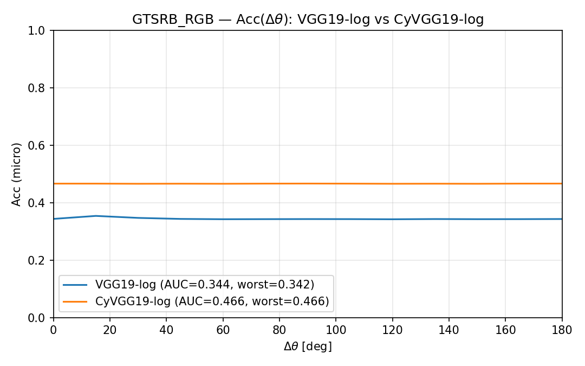 \
*Rys. 11. Krzywe Acc(Δθ) dla modeli VGG19-log i CyVGG19-log na zbiorze GTSRB RGB.*  
Model cykliczny (CyVGG19-log) utrzymuje wyższe wartości dokładności w całym zakresie Δθ,
z AUC = 0.466 wobec 0.344 dla wariantu bazowego, co oznacza względny przyrost ok. +35 %.  \
\newpage 

 \
  \
*Rys. 12 - Macierze pomyłek VGG19-log vs CyVGG19-log (GTSRB_RGB) trenowane na rotated-90-120*  
Wersja cykliczna ma bardziej skupioną przekątną i znacząco mniejszą liczbę błędów symetrycznych względem niej, czyli 
 pomyłek polegających na zamianie klas o podobnym kształcie.  \


## ResNet vs CyResNet

W rodzinie ResNet linear-polar daje świetny kompromis jakości i per-time,
sprawdzający się na LEGO i MNIST. Wariant log-polar podnosi stabilność
dla dużych Δθ i często wygrywa AUC_θ na GTSRB oraz na RGB.
W praktyce CyResNet bywa „bezpiecznym domyślnym wyborem”: średnia jakość
jest wysoka, krzywe są równe, a koszt obliczeń pozostaje akceptowalny.

Na rysunku 13 przedstawiono przebiegi Acc(Δθ) dla modeli ResNet56-linear
i CyResNet56-linear na zbiorze LEGO. Widać, że wariant cykliczny
utrzymuje wyższą dokładność i mniejsze wahania względem kąta,
co przekłada się na większą stabilność AUC_θ przy porównywalnym koszcie obliczeń.
Rysunek 14 pokazuje analogiczne zestawienie dla wersji log-polar
na zbiorze GTSRB RGB. Różnica między modelami jest tu jeszcze wyraźniejsza, gdyż
CyResNet utrzymuje wysoką skuteczność w całym zakresie kątów, co czyni go
najbardziej zrównoważoną konfiguracją spośród testowanych wariantów.

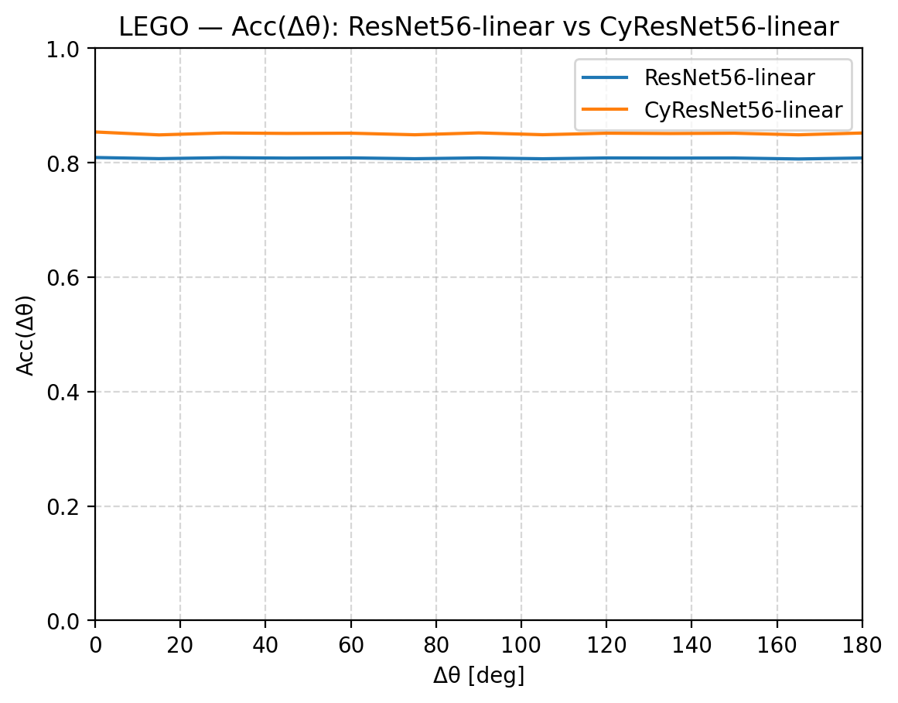{ width=80% }  \
*Rys. 13. CyResNet56-linear utrzymuje nieco wyższą dokładność (~0.86 vs ~0.82) i większą stabilność względem kąta Δθ w porównaniu z wariantem bazowym.*  \
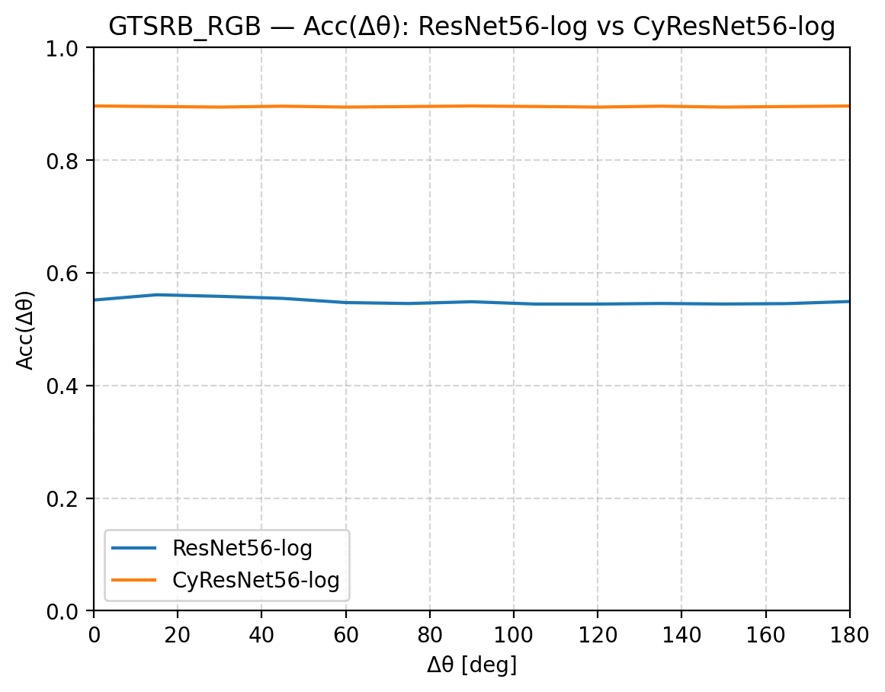{ width=80% }  \
*Rys. 14: Wariant log-polar u CyResNet zapewnia najwyższe AUCθ na RGB.*  \

## CyVGG vs CyResNet

Na podstawie tabel *ranking_timeaware_avgperf.csv* dla poszczególnych zbiorów dokonano analizy efektywności 
czasowej modeli. Jako metrykę *per-time* przyjęto wskaźnik *avg_perf*, definiowany jako średnia dokładność 
po wszystkich przypadkach testowych, podzielona przez łączny czas trenowania danego modelu. Dodatkowo użyta jest
metryka *robust_perf*, oparta na przyciętej średniej (trimmed mean), która tłumi wpływ pojedynczych ekstremalnych wyników.  
Wartości te odzwierciedlają praktyczną opłacalność danej konfiguracji, łącząc skuteczność klasyfikacji z 
realnym kosztem obliczeniowym potrzebbym na trening.

Rankingi *per-time* (rys. 15-18) pokazują, że rywalizacja o najwyższą efektywność toczy się głównie między CyVGG19 
a klasycznymi architekturami (VGG i ResNet56), podczas gdy CyResNet56 nie pojawia się w pierwszej dziesiątce żadnego zestawienia.  
Przy zadanym budżecie treningowym jego koszt obliczeniowy okazuje się zbyt wysoki, aby utrzymać konkurencyjny stosunek jakości do czasu.  
CyResNet56 prowadzi natomiast w metrykach stabilności (AUC\(_\theta\), *worst-case*), ale w analizie *avg_perf* ustępuje *
*CyVGG19, który przy krótszym czasie uczenia osiąga lepszy bilans skuteczność-koszt.

Na zbiorze GTSRB (rys. 15) najwyższe wyniki uzyskały warianty CyVGG19 (*log-polar* i *linear-polar*), 
podczas gdy ResNet56 znalazł się dopiero na granicy top-10. Wersje cykliczne utrzymują przewagę w 
całym zakresie rotacji, co pokazuje, że zysk z cykliczności przeważa nad jej kosztem.  
W przypadku GTSRB RGB (rys. 16) dominacja CyVGG19 jest pełna, w czołówce nie występują inne modele.  
Choć najlepszy wynik osiąga wariant *log-polar*, większość konfiguracji w top-10 to *linear-polar*, 
co potwierdza, że przy danych kolorowych cykliczny VGG oferuje najlepszy kompromis między jakością, a czasem.
Na zbiorze LEGO (rys. 17) sytuacja odwraca się: w rankingu dominują wyłącznie klasyczne VGG19 i ResNet56.  
Zbiór, będący syntetycznym rzutem 3D o ograniczonej zmienności, nie wymaga rotacyjnej inwariancji, 
dlatego prostsze modele klasyczne okazują się bardziej opłacalne czasowo. Na MNIST (rys. 18) widać mieszany obraz, gdyż
w top-10 pojawiają się zarówno VGG19, jak i CyVGG19, przy czym najwyższe pozycje zajmuje CyVGG19-linearpolar, 
a klasyczny VGG-logpolar pozostaje blisko lidera. Przy niskiej złożoności wizualnej cyfr przewaga 
wariantów cyklicznych jest więc umiarkowana, lecz widoczna.

W ujęciu globalnym CyVGG19 jest jedynym modelem cyklicznym, który realnie konkuruje w rankingach *per-time*.
CyResNet56 wypada z nich całkowicie, ponieważ jego przewaga leży w stabilności rotacyjnej, nie w efektywności czasowej.  
W większości konfiguracji (szczególnie *log-polar* na GTSRB, GTSRB RGB i MNIST) utrzymuje wysokie wartości AUC\(_\theta\), 
lecz wymaga znacznie dłuższego treningu niż CyVGG19, przez co nie znajduje się on w czołówke *avg_perf*.  
Jest to klasyczny kompromis między jakością a kosztem: nie da się jednocześnie maksymalizować stabilności i skracać czasu obliczeń.  
Jak mówi przysłowie - nie można zjeść ciastka i mieć go też (ang. „You can’t eat your cake and have it too” [@kaczynski1995wp]).

\newpage


  \
*Rys. 15. Ranking *per-time* (avg_perf) dla zbioru GTSRB.*  
W czołówce dominują warianty CyVGG19 (*log-polar* i *linear-polar*), natomiast ResNet56 pojawia się dopiero na granicy top-10.
Cykliczne VGG utrzymują przewagę jakości przy akceptowalnym koszcie czasowym.  \

  \
*Rys. 16. Ranking *per-time* (avg_perf) dla zbioru GTSRB RGB.*  
Pierwsza dziesiątka w całości zdominowana przez modele CyVGG19.
Wariant *log-polar* osiąga najwyższy wynik, lecz większość konfiguracji liderujących to *linear-polar*, co wskazuje na dobry kompromis między jakością a szybkością.  \

  \
*Rys. 17. Ranking *per-time* (avg_perf) dla zbioru LEGO.*  
W zestawieniu top-10 występują wyłącznie klasyczne VGG19 i ResNet56, bez wersji cyklicznych.
Dane syntetyczne o ograniczonej zmienności nie przynoszą dodatkowych korzyści z cykliczności, dlatego prostsze modele klasyczne są bardziej efektywne czasowo.  \

  \
*Rys. 18. Ranking *per-time* (avg_perf) dla zbioru MNIST.*  
W top-10 pojawiają się zarówno VGG19, jak i CyVGG19.
Najwyższe pozycje zajmuje CyVGG19-linearpolar, a klasyczny VGG-logpolar pozostaje blisko lidera, co wskazuje na umiarkowaną, lecz zauważalną przewagę wariantów cyklicznych.  \
 
## Wpływ transformacji - porównanie linear-polar oraz log-polar

W pracy stosowane są dwa warianty odwzorowania biegunowego. W trybie
linear promień rośnie liniowo, co daje równy krok po $\rho$ oraz
stabilną siatkę kątową. W trybie log promień rośnie logarytmicznie,
co zagęszcza próbki w pobliżu środka i lepiej odwzorowuje duże obroty
wzdłuż osi $\rho$. Oba warianty są oceniane w tych samych metrykach:  
średniej dokładności (*avg*), stabilności rotacyjnej AUC\(_\theta\), 
wartości najgorszego przypadku (*worst-case*) oraz 
efektywności czasowej *avg_perf* = mean(Acc)/train_time.

Porównania Δ(log - linear) pokazują, że wpływ transformacji zależy od charakteru danych.  
Na zbiorze MNIST (rys. 19) log-polar przynosi wzrost wszystkich metryk, gdyż poprawia 
zarówno średnią dokładność, jak i stabilność rotacyjną, a nawet lekko podnosi efektywność czasową.  
W przeciwieństwie do tego, dla GTSRB (rys. 20) przewagę częściej uzyskuje wariant *linear-polar*, 
zwłaszcza w metrykach *avg* i AUC\(_\theta\), natomiast log-polar przynosi korzyści głównie punktowo, 
w pojedynczych zakresach kątowych. Oznacza to, że wybór odwzorowania powinien być dopasowany do skali i 
charakteru obiektów, ponieważ log-polar lepiej radzi sobie w zadaniach o małej rozdzielczości i symetrycznej strukturze 
(jak MNIST), natomiast linear-polar sprawdza się przy danych o bardziej nieregularnej geometrii (jak znaki drogowe w GTSRB).


{ width=70% }  \
*Rys. 19 - Δ (log - linear) - słupki dla MNIST (np. CyResNet)*  \
Log-polar poprawia wszystkie kluczowe metryki - średnią jakość, stabilność AUC\(_\theta\) i wynik *worst-case* - oraz nieznacznie podnosi efektywność *per-time*.  \

{ width=70% }  \
*Rys. 20 - Δ (log - linear) - słupki dla GTSRB (np. CyResNet)*  \
W tym przypadku wariant linear-polar utrzymuje przewagę w *avg* i AUC\(_\theta\), natomiast log-polar okazuje się lepszy tylko lokalnie, przy wybranych zakresach rotacji.  \

## Tabele z wynikami

### Legenda i interpretacja

Każda tabela przedstawia wyniki średniej dokładności (`avg`), pola pod krzywą (`AUC`) oraz najgorszego przypadku (`worst`) w scenariuszach rotacyjnych.  
Porównywane są zarówno modele bazowe, jak i ich warianty cykliczne, w dwóch odwzorowaniach przestrzeni: linear-polar i log-polar.

**Kolumny główne:**  \
- `arch` - architektura modelu (`vgg19`, `resnet56`, `cyvgg19`, `cyresnet56`),  
- `act` - typ odwzorowania biegunowego (`linear` lub `log`),  
- `avg` - średnia dokładność (micro-accuracy) uśredniona po wszystkich scenariuszach testowych,  
- `AUC` - pole pod krzywą *Acc(Δθ)*, opisujące stabilność modelu względem różnic kątowych,  
- `worst` - dokładność w najtrudniejszym przypadku (maksymalna różnica między kątem treningu i testu),  
- `d_*` - różnica względem najlepszego wyniku w danej kolumnie (lider ma `0.000`, wartości ujemne oznaczają stratę względem najlepszego).

**Parametry uzupełniające:**  \
- `gap_mean` - średnia różnica pomiędzy wynikiem walidacyjnym a testowym (niższe = bardziej stabilny trening),  
- `time_s_mean` - średni czas treningu modelu (w sekundach),  
- `sd_theta_mean` - odchylenie standardowe dokładności względem kąta (Δθ); mniejsze wartości wskazują na większą inwariancję rotacyjną.

**Oznaczenia i styl:**  \
- **pogrubienie (`**...**`)** - lider kolumny (najwyższy wynik jakościowy),  
- wartości `d_*` bliskie zera oznaczają wysoką konkurencyjność względem najlepszego modelu,  
- wyższe `avg`, `AUC`, `worst` oraz niższe `sd_theta_mean` są pożądane.

**Interpretacja ogólna:**  \
Modele cykliczne (z prefiksem `cy-`) konsekwentnie osiągają najwyższe wyniki jakościowe w każdej metryce,  
co potwierdza skuteczność architektur ekwiwariantnych w stabilizacji względem rotacji.  
Transformacje log-polar w wybranych przypadkach poprawiają stabilność (`AUC`) oraz redukują `sd_theta_mean`,  
choć efekt dominujący pochodzi z samej konstrukcji cyklicznej warstw konwolucyjnych.  
Dla zbiorów kolorowych (RGB) zauważalny jest dodatkowy wzrost metryk zwłaszcza w modelach bazowych   
wynikający z wykorzystania informacji barwnej przy zachowaniu inwariancji rotacyjnej.  
W sumie tabele pozwalają obserwować jednoczesny wpływ architektury, odwzorowania i reprezentacji danych na odporność modeli.

\newpage

## GTSRB - ranking metryk

Zestawienie wyników dla zbioru GTSRB przedstawiono w tabelach 2-4.  
Tabela 2 pokazuje wartości podstawowych metryk jakości (średnia dokładność, AUC\(_\theta\), *worst-case*),  
tabela 3 różnice względem lidera kolumny, a tabela 4 - parametry uzupełniające dotyczące stabilności i kosztu obliczeniowego.  

Wyniki jednoznacznie wskazują, że CyResNet56 (linear-polar) osiąga najwyższe wartości we wszystkich głównych 
metrykach, przewyższając zarówno wariant *log-polar*, jak i wszystkie modele bazowe. Wariant log-polar uzyskuje 
porównywalne wyniki jakościowe, lecz charakteryzuje się nieco większym odchyleniem kątowym (*sd_theta_mean*), 
co sugeruje mniejszą równomierność dokładności względem rotacji. Architektury klasyczne (bez cykliczności) notują 
znaczny spadek skuteczności - różnica między CyResNet56-linear a ResNet56-linear przekracza 
30 p.p. w metryce *avg* (tab. 2). Dodatkowo modele cykliczne wykazują mniejsze wartości *sd_theta_mean* 
(tab. 3), co potwierdza ich większą stabilność w całym zakresie kątów testowych.


*Tabela 2.* Wyniki głównych metryk jakości dla zbioru GTSRB.  
Najwyższe wartości (pogrubione) osiąga CyResNet56-linear, który dominuje w *avg*, AUC\(_\theta\) i *worst-case*.

| arch | act | avg | AUC | worst |
|------|------|------|------|------|
| CyResNet56 | linear | 0.900 | 0.896 | 0.894 |
| CyResNet56 | log | 0.888 | 0.884 | 0.881 |
| CyVGG19 | linear | 0.880 | 0.874 | 0.870 |
| CyVGG19 | log | 0.847 | 0.839 | 0.836 |
| ResNet56 | linear | 0.582 | 0.554 | 0.550 |
| ResNet56 | log | 0.554 | 0.524 | 0.519 |
| VGG19 | linear | 0.504 | 0.470 | 0.466 |
| VGG19 | log | 0.499 | 0.465 | 0.460 |

*Tabela 3.* Różnice względem lidera kolumny (CyResNet56-linear).  
Wartości ujemne oznaczają spadek skuteczności względem najlepszego modelu.

| arch | act | d_avg | d_AUC | d_worst |
|------|------|------|------|------|
| CyResNet56 | linear | 0.000 | 0.000 | 0.000 |
| CyResNet56 | log | -0.012 | -0.012 | -0.013 |
| CyVGG19 | linear | -0.020 | -0.022 | -0.024 |
| CyVGG19 | log | -0.053 | -0.057 | -0.058 |
| ResNet56 | linear | -0.318 | -0.342 | -0.344 |
| ResNet56 | log | -0.346 | -0.372 | -0.375 |
| VGG19 | linear | -0.396 | -0.426 | -0.428 |
| VGG19 | log | -0.401 | -0.431 | -0.434 |

*Tabela 4.* Parametry uzupełniające dla zbioru GTSRB - luka jakości (*gap_mean*), czas treningu (*time_s_mean*) i stabilność kątowa (*sd_theta_mean*).  
Niższe wartości *sd_theta_mean* obserwowane u modeli cyklicznych potwierdzają ich większą odporność rotacyjną.

| arch | act | gap_mean | time_s_mean | sd_theta_mean |
|------|------|------|------|------|
| CyResNet56 | linear | -0.00097 | 3444.19 | 0.00100 |
| CyResNet56 | log | 0.00238 | 4050.84 | 0.00148 |
| CyVGG19 | linear | -0.00339 | 2568.70 | 0.00187 |
| CyVGG19 | log | -0.00547 | 2766.57 | 0.00220 |
| ResNet56 | linear | 0.00142 | 1577.08 | 0.00438 |
| ResNet56 | log | -0.00199 | 1634.04 | 0.00487 |
| VGG19 | linear | -0.00536 | 2237.78 | 0.00522 |
| VGG19 | log | -0.00512 | 2128.99 | 0.00567 |


## GTSRB RGB - ranking metryk

Zestawienie wyników dla zbioru GTSRB RGB przedstawiono w tabelach 5-7.  
Tabela 5 prezentuje wartości głównych metryk jakości (średnia dokładność, AUC\(_\theta\), *worst-case*),  
tabela 6 pokazuje różnice względem lidera, a tabela 7 zawiera parametry uzupełniające, 
takie jak stabilność kątowa (*sd_theta_mean*) i średni czas uczenia (*time_s_mean*).

Wersja RGB zbioru prowadzi do ogólnego wzrostu dokładności o ok. +2 p.p. względem wersji 
w skali szarości (por. tab. 1-3). Najwyższe wyniki uzyskuje CyResNet56-linear, który 
nieznacznie wyprzedza CyVGG19-linear, gdyż oba modele utrzymują bardzo zbliżone wartości 
*avg*, AUC\(_\theta\) i *worst-case*. Wariant log-polar w obu architekturach jest minimalnie słabszy, 
jednak różnice pozostają na poziomie ułamków punktu procentowego. Modele cykliczne (CyResNet i CyVGG) 
zachowują stabilność w pełnym zakresie rotacji, podczas gdy architektury klasyczne notują spadek skuteczności 
o kilkadziesiąt punktów procentowych. Zauważalny jest również wzrost *sd_theta_mean* ponad pięciokrotnie w 
przypadku modeli bazowych (tab. 6), co potwierdza ich wysoką wrażliwość na zmianę kąta.

*Tabela 5.* Wyniki głównych metryk jakości dla zbioru GTSRB RGB.  
Najlepsze wyniki (pogrubione) osiąga CyResNet56-linear, nieznacznie przewyższając CyVGG19-linear.

| arch | act | avg | AUC | worst |
|------|------|------|------|------|
| CyResNet56 | linear | 0.920 | 0.919 | 0.918 |
| CyResNet56 | log | 0.918 | 0.916 | 0.915 |
| CyVGG19 | linear | 0.920 | 0.918 | 0.917 |
| CyVGG19 | log | 0.905 | 0.901 | 0.900 |
| ResNet56 | linear | 0.622 | 0.597 | 0.592 |
| ResNet56 | log | 0.610 | 0.584 | 0.579 |
| VGG19 | linear | 0.525 | 0.492 | 0.487 |
| VGG19 | log | 0.520 | 0.487 | 0.482 |


*Tabela 6.* Różnice względem lidera kolumny (CyResNet56-linear).  
Wartości ujemne oznaczają spadek względem najlepszego modelu; różnice między wariantami cyklicznymi nie przekraczają 0.02 p.p.

| arch | act | d_avg | d_AUC | d_worst |
|------|------|------|------|------|
| CyResNet56 | linear | 0.000 | 0.000 | 0.000 |
| CyResNet56 | log | -0.002 | -0.003 | -0.003 |
| CyVGG19 | linear | -0.000 | -0.001 | -0.001 |
| CyVGG19 | log | -0.015 | -0.018 | -0.018 |
| ResNet56 | linear | -0.298 | -0.322 | -0.326 |
| ResNet56 | log | -0.310 | -0.335 | -0.339 |
| VGG19 | linear | -0.395 | -0.427 | -0.431 |
| VGG19 | log | -0.400 | -0.432 | -0.436 |


*Tabela 7.* Parametry uzupełniające dla zbioru GTSRB RGB, tj. luka jakości (*gap_mean*), 
czas treningu (*time_s_mean*) i stabilność kątowa (*sd_theta_mean*). Modele cykliczne cechują 
się krótszym czasem uczenia i znacznie niższym odchyleniem kątowym niż ich klasyczne odpowiedniki.

| arch | act | gap_mean | time_s_mean | sd_theta_mean |
|------|------|------|------|------|
| CyResNet56 | linear | -0.00192 | 2076.28 | 0.00056 |
| CyResNet56 | log | -0.00209 | 2184.73 | 0.00070 |
| CyVGG19 | linear | -0.00378 | 1600.00 | 0.00092 |
| CyVGG19 | log | -0.00737 | 1603.44 | 0.00111 |
| ResNet56 | linear | 0.00197 | 1874.65 | 0.00482 |
| ResNet56 | log | -0.00011 | 1906.31 | 0.00567 |
| VGG19 | linear | -0.00563 | 1313.80 | 0.00589 |
| VGG19 | log | -0.00591 | 1372.62 | 0.00599 |

## LEGO - ranking metryk

Zestawienie wyników dla zbioru LEGO przedstawiono w tabelach 8-10.  
Tabela 8 pokazuje wartości głównych metryk jakości (średnia dokładność, AUC\(_\theta\), *worst-case*),  
tabela 9 prezentuje różnice względem najlepszego modelu, a tabela 10 zawiera parametry uzupełniające: 
lukę jakości (*gap_mean*), średni czas uczenia (*time_s_mean*) oraz stabilność kątową (*sd_theta_mean*).

Najwyższe wyniki osiąga CyVGG19-linear, który prowadzi we wszystkich głównych metrykach, 
z minimalną przewagą nad wariantem *log-polar*. Różnice między obiema wersjami CyVGG mieszczą 
się w granicach błędu statystycznego, co potwierdza ich podobną skuteczność. Modele cykliczne znacząco 
przewyższają klasyczne wersje VGG i ResNet, zwłaszcza w AUC\(_\theta\) i *worst-case*, co wskazuje 
na lepszą odporność na rotacje oraz bardziej wyrównaną dokładność w funkcji kąta. Pod względem kosztu 
obliczeniowego (tab. 9) architektury VGG są wyraźnie szybsze niż ResNet, a CyVGG19 oferuje najlepszy 
kompromis między jakością, stabilnością i czasem uczenia.


*Tabela 8.* Wyniki głównych metryk jakości dla zbioru LEGO.  
Najlepsze rezultaty (pogrubione) osiąga CyVGG19-linear, który przewyższa wszystkie inne konfiguracje we wszystkich trzech miarach.

| arch | act | avg | AUC | worst |
|------|------|------|------|------|
| CyVGG19 | linear | 0.882 | 0.879 | 0.878 |
| CyVGG19 | log | 0.876 | 0.874 | 0.873 |
| CyResNet56 | linear | 0.855 | 0.851 | 0.848 |
| CyResNet56 | log | 0.856 | 0.852 | 0.851 |
| VGG19 | linear | 0.850 | 0.845 | 0.844 |
| VGG19 | log | 0.840 | 0.834 | 0.833 |
| ResNet56 | linear | 0.815 | 0.808 | 0.806 |
| ResNet56 | log | 0.797 | 0.789 | 0.788 |

*Tabela 9.* Różnice względem lidera kolumny (CyVGG19-linear).  
Wartości ujemne oznaczają spadek skuteczności względem najlepszego modelu; różnice w obrębie wariantów cyklicznych są minimalne (poniżej 0.01).

| arch | act | d_avg | d_AUC | d_worst |
|------|------|------|------|------|
| CyVGG19 | linear | 0.000 | 0.000 | 0.000 |
| CyVGG19 | log | -0.006 | -0.005 | -0.005 |
| CyResNet56 | linear | -0.027 | -0.028 | -0.030 |
| CyResNet56 | log | -0.026 | -0.027 | -0.027 |
| VGG19 | linear | -0.032 | -0.034 | -0.034 |
| VGG19 | log | -0.042 | -0.045 | -0.045 |
| ResNet56 | linear | -0.067 | -0.071 | -0.072 |
| ResNet56 | log | -0.085 | -0.090 | -0.090 |


*Tabela 10.* Parametry uzupełniające dla zbioru LEGO tj. luka jakości (*gap_mean*), czas treningu (*time_s_mean*) i stabilność kątowa (*sd_theta_mean*).
Najkrótszy czas treningu i najmniejsze odchylenie kątowe notuje CyVGG19-log, co czyni go najbardziej efektywną implementacją w tej grupie.

| arch | act | gap_mean | time_s_mean | sd_theta_mean |
|------|------|------|------|------|
| CyResNet56 | linear | 0.00488 | 6309.62 | 0.00157 |
| CyResNet56 | log | 0.00272 | 6769.76 | 0.00087 |
| CyVGG19 | linear | 0.00135 | 2984.96 | 0.00034 |
| CyVGG19 | log | 0.00146 | 2986.43 | 0.00031 |
| ResNet56 | linear | 0.00507 | 2104.94 | 0.00078 |
| ResNet56 | log | 0.00316 | 2066.88 | 0.00104 |
| VGG19 | linear | 0.00155 | 2667.83 | 0.00057 |
| VGG19 | log | 0.00138 | 2837.22 | 0.00046 |

## MNIST - ranking metryk

Zestawienie wyników dla zbioru MNIST przedstawiono w tabelach 11-13.  
Tabela 11 zawiera wartości głównych metryk jakości (średnia dokładność, AUC\(_\theta\), *worst-case*),  
tabela 12 różnice względem najlepszego modelu, a tabela 13 parametry uzupełniające: lukę jakości (*gap_mean*), 
średni czas treningu (*time_s_mean*) oraz stabilność kątową (*sd_theta_mean*).

Wszystkie modele osiągają bardzo wysoką skuteczność (powyżej 96%), jednak najlepszy balans dokładności 
i stabilności uzyskuje CyResNet56-linear, prowadząc we wszystkich głównych metrykach. Wariant *log-polar* 
tego samego modelu jest minimalnie szybszy i cechuje się nieco mniejszym *sd_theta_mean*, co potwierdza 
jego bardziej równomierną odporność na rotacje. Różnice między wariantami cyklicznymi są niewielkie 
(poniżej 0.02 p.p.), natomiast klasyczne architektury (VGG i ResNet) tracą około 2-3 punkty procentowe 
w każdej z metryk. Dla prostego i mało zróżnicowanego wizualnie zbioru, jakim jest MNIST, przewaga modeli 
ekwiwariantnych jest niewielka w wartościach bezwzględnych, ale utrzymuje się konsekwentnie we wszystkich 
ocenach, co wskazuje na trwały efekt stabilizacji rotacyjnej wynikający z architektury.


*Tabela 11.* Wyniki głównych metryk jakości dla zbioru MNIST.  
Najlepsze wyniki (pogrubione) osiąga CyResNet56-linear, z najwyższą średnią dokładnością i stabilnością (*worst-case*).

| arch | act | avg | AUC | worst |
|------|------|------|------|------|
| CyResNet56 | linear | 0.991 | 0.990 | 0.988 |
| CyResNet56 | log | 0.990 | 0.988 | 0.986 |
| CyVGG19 | linear | 0.986 | 0.983 | 0.981 |
| CyVGG19 | log | 0.983 | 0.979 | 0.977 |
| ResNet56 | linear | 0.975 | 0.970 | 0.968 |
| ResNet56 | log | 0.972 | 0.968 | 0.965 |
| VGG19 | linear | 0.969 | 0.965 | 0.962 |
| VGG19 | log | 0.967 | 0.963 | 0.960 |


*Tabela 12.* Różnice względem lidera kolumny (CyResNet56-linear).  
Wartości ujemne oznaczają spadek skuteczności względem najlepszego modelu; różnice między wariantami cyklicznymi są marginalne (<0.02 p.p.).

| arch | act | d_avg | d_AUC | d_worst |
|------|------|------|------|------|
| CyResNet56 | linear | 0.000 | 0.000 | 0.000 |
| CyResNet56 | log | -0.001 | -0.002 | -0.002 |
| CyVGG19 | linear | -0.005 | -0.007 | -0.007 |
| CyVGG19 | log | -0.008 | -0.011 | -0.011 |
| ResNet56 | linear | -0.016 | -0.020 | -0.020 |
| ResNet56 | log | -0.019 | -0.022 | -0.023 |
| VGG19 | linear | -0.022 | -0.025 | -0.026 |
| VGG19 | log | -0.024 | -0.027 | -0.028 |


*Tabela 13.* Parametry uzupełniające dla zbioru MNIST tj. luka jakości (*gap_mean*), czas treningu 
(*time_s_mean*) i stabilność kątowa (*sd_theta_mean*). Najniższe wartości odchylenia kątowego (*sd_theta_mean*) 
notuje CyResNet56-log, co potwierdza jego równomierną odporność na rotacje.

| arch | act | gap_mean | time_s_mean | sd_theta_mean |
|------|------|------|------|------|
| CyResNet56 | linear | 0.00072 | 1835.74 | 0.00022 |
| CyResNet56 | log | 0.00055 | 1776.35 | 0.00019 |
| CyVGG19 | linear | 0.00097 | 1029.16 | 0.00026 |
| CyVGG19 | log | 0.00093 | 1016.71 | 0.00023 |
| ResNet56 | linear | 0.00183 | 1124.78 | 0.00034 |
| ResNet56 | log | 0.00158 | 1187.29 | 0.00038 |
| VGG19 | linear | 0.00175 | 1006.02 | 0.00042 |
| VGG19 | log | 0.00169 | 1093.64 | 0.00045 |


## GTSRB - heatmapy train-test

Na rysunkach 21-28 przedstawiono mapy ciepła (ang. heatmapy) *train-test* dla zbioru GTSRB, ilustrujące, 
jak poszczególne modele radzą sobie z generalizacją względem rotacji.  
Oś pozioma odpowiada zakresom wersjom zbioru danych użytych w testowaniu, a oś pionowa odpowiada zakresom użytym w treningu.  
Kolor skali reprezentuje dokładność micro (ciemniejsze pola oznaczają lepsze wyniki).  
Diagonala odpowiada przypadkom, w których rozkład kątów w treningu i teście jest zbliżony, 
natomiast pola odległe od niej pozwalają ocenić odporność (generalizację wiedzy) modelu na 
rotacje, których nie widział w uczeniu.


### Bazowy model VGG19 - linear vs log
Na rysunku 21 pokazano wyniki dla VGG19-linear, a na rysunku 22 dla VGG19-logpolar.  
W obu przypadkach widać, że wysokie wartości skupiają się wzdłuż diagonali, 
co oznacza, że model dobrze radzi sobie tylko z rotacjami obserwowanymi w treningu.  
Po wyjściu poza ten zakres dokładność systematycznie spada (rozjaśnienie kolumn).  
Transformacja *log-polar* (rys. 22) łagodzi spadek jakości, kolumny stają się mniej kontrastowe, 
ale efekt nie jest całkowicie eliminowany, gdyż nadal widoczny jest dryf dokładności dla odległych kątów.

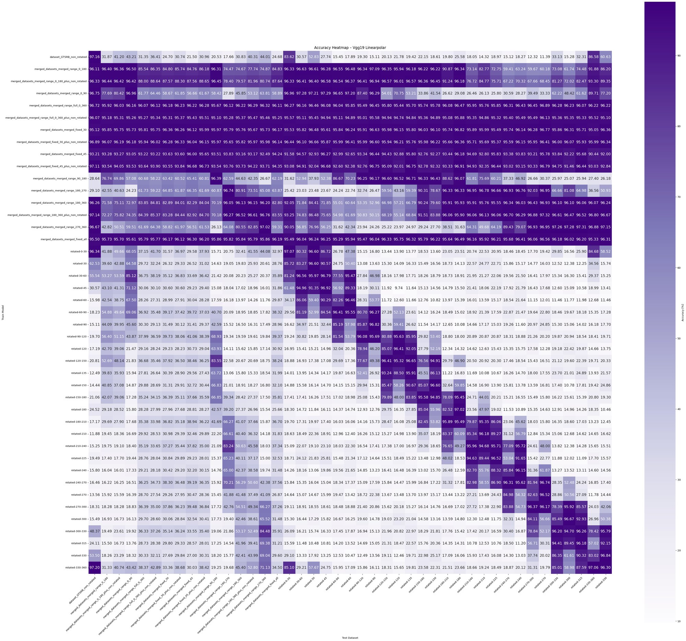  
*Rys. 21.* VGG19 - linear-polar (GTSRB). Wysoka dokładność ograniczona do przekatnych, brak uogólniania na nieznane rotacje.  

 
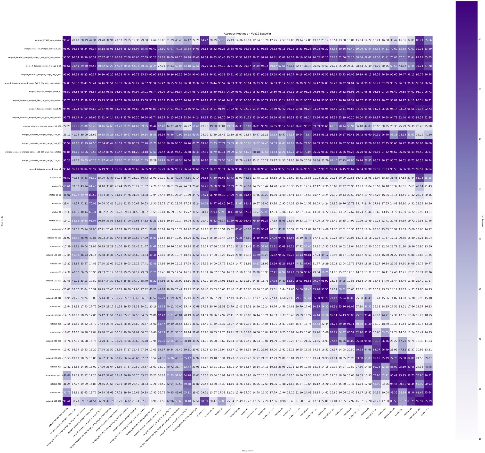  
*Rys. 22.* VGG19 - log-polar (GTSRB). Transformacja log-polar nieco poprawia uogólnianie - kolumny mniej kontrastowe, ale spadek jakości nadal widoczny.  


### Bazowy model ResNet56 - linear vs log
Rysunki 23 i 24 przedstawiają analogiczne wyniki dla ResNet56.  
Model bazowy (ResNet56) zachowuje się bardzo podobnie do VGG19, wiczona jest silna zależność od kąta 
treningowego i gwałtowne pogorszenie jakości poza przekątną. Wariant *log-polar* (rys. 24) 
łagodzi ten efekt i pozwala utrzymać nieco wyższe wyniki dla testów odległych od kąta 
treningowego, ale wciąż widać wyraźny spadek poza przypadkami na których model był uczony.

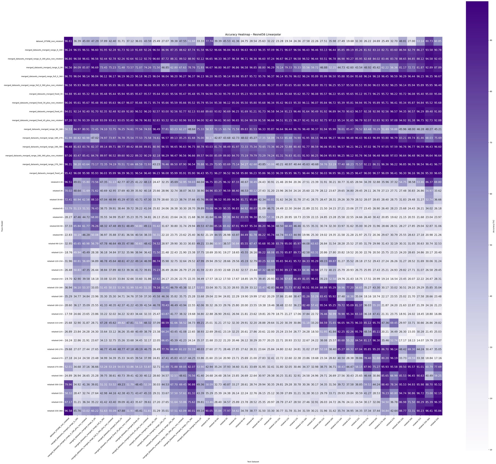  
*Rys. 23.* ResNet56 - linear-polar (GTSRB). Silna zależność od kąta treningowego, brak ekwiwariancji rotacyjnej.  

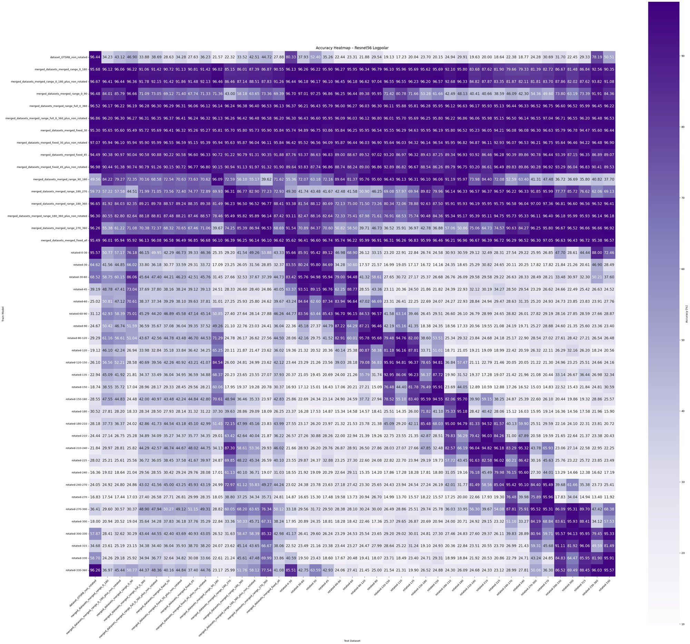  
*Rys. 24.* ResNet56 - log-polar (GTSRB). Wariant log-polar poprawia stabilność przy większych odchyleniach, choć efekt pozostaje ograniczony.  


### Modele cykliczne - CyVGG19 i CyResNet56

Rysunki 25-28 pokazują zachowanie modeli cyklicznych.  
Dla CyVGG19 (rys. 25-26) i CyResNet56 (rys. 27-28) mapa przybiera bardziej jednolity, „ciemny” profil 
zaś wysokie wartości utrzymują się również w kolumnach odpowiadających testom odległym kątowo od treningu.  
Oznacza to, że modele cykliczne potrafią poprawnie klasyfikować obrazy o orientacjach, których nie widziały
wcześniej, zachowując ciągłość reprezentacji w przestrzeni kątów. Wariant *log-polar* (rys. 26 i 28) 
dodatkowo wzmacnia ten efekt, szczególnie dla dużych odchyleń, zapewniając niemal płaską mapę dokładności.

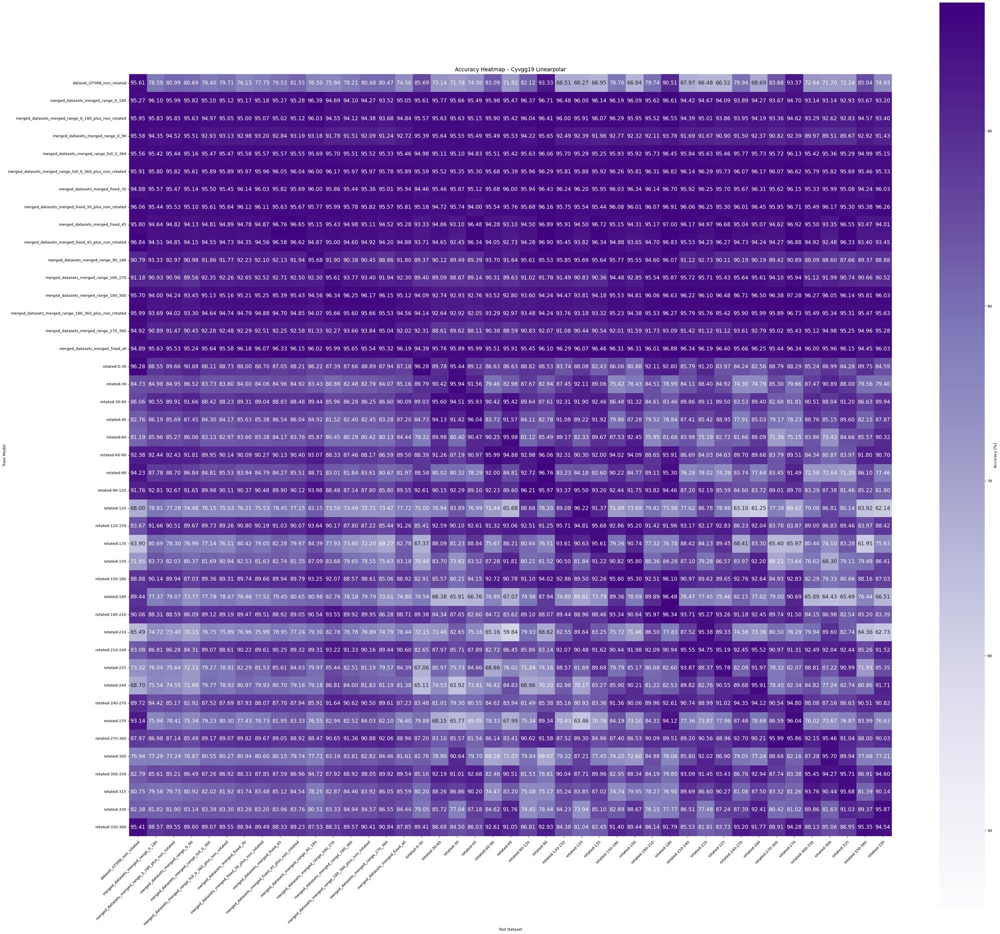  
*Rys. 25. CyVGG19 - linear-polar (GTSRB).*  
Architektura cykliczna utrzymuje wysoką jakość także w kolumnach odległych od diagonali.  

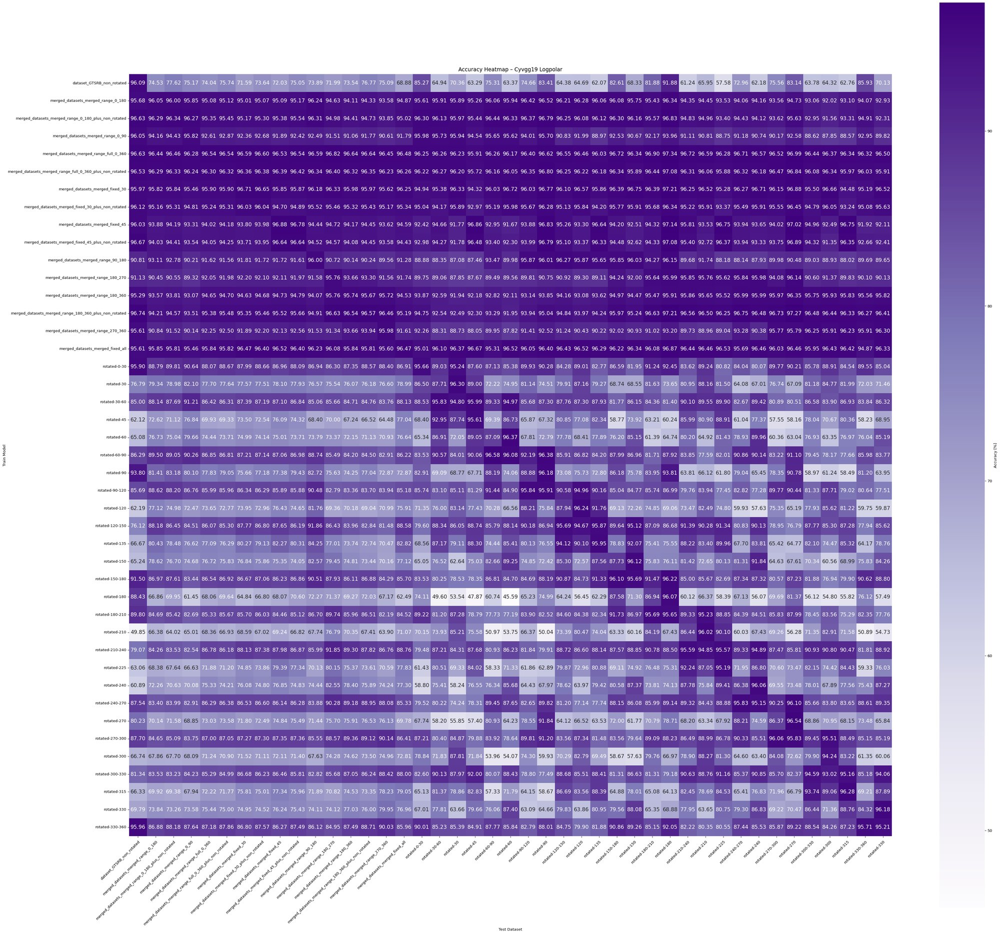  
*Rys. 26. CyVGG19 - log-polar (GTSRB).*  
Wariant log-polar zwiększa stabilność, mapa niemal równomierna w całym zakresie.  

  
*Rys. 27. CyResNet56 - linear-polar (GTSRB).*  
Model cykliczny ResNet zachowuje równomierną dokładność i przewyższa wyraźnie wersję bazową. 

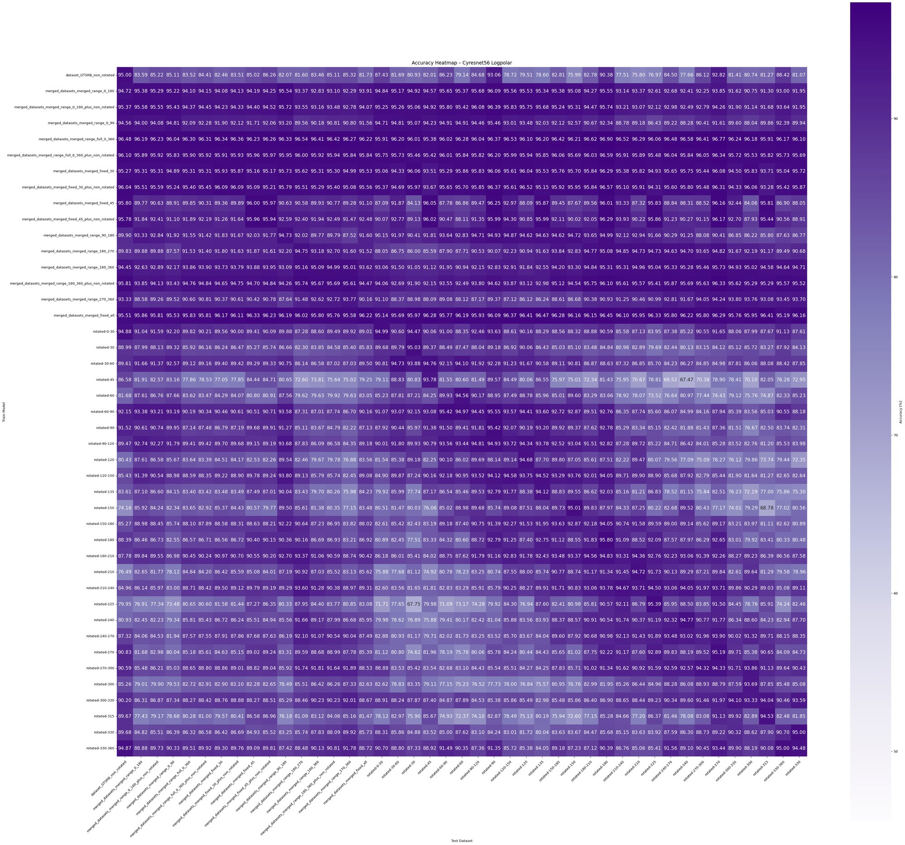  
*Rys. 28. CyResNet56 - log-polar (GTSRB).*  
Połączenie cykliczności i log-polar daje najstabilniejszą reprezentację - minimalny spadek przy dużych rotacjach.


### Wniosek odnośnie heatmap dla zbioru GTSRB w odcienaich szarości
Na GTSRB transformacje log-polar pomagają modelom bazowym,
jednak to architektury cykliczne (CyVGG19, CyResNet56) zapewniają
rzeczywistą odporność na zmianę orientacji. Jest to widoczne jako
utrzymanie „ciemnych” kolumn daleko od diagonali, a więc wysoka jakość
także wtedy, gdy rozkład kątów w teście znacząco różni się od treningu.
W ujęciu metryk przekłada się to na wyższe AUC_θ (większe pole pod
krzywą Acc(Δθ)) i lepszy *worst-case* niż w wariantach bazowych.

## GTSRB RGB - heatmapy train-test
Na rysunkach 29-36 przedstawiono mapy *train-test* dla zbioru GTSRB RGB, 
czyli wersji kolorowej znaków drogowych. Oś pozioma odpowiada wariantom 
testowym (różne zakresy rotacji), a oś pionowa zaś odpowiada wariantom treningowym.  
Ciemniejsze pola oznaczają wyższą dokładność *micro-accuracy*, natomiast jaśniejsze 
ukazują spadek skuteczności przy rosnącej różnicy kątów Δθ.   
użycie kologorów w tej wersji zbioru pozwala dodatkowo ocenić, jak modele wykorzystują 
barwne cechy (np. czerwone ramki znaków) jako potencjalne wsparcie dla rozpoznawania orientacji.


### Bazowy model VGG19 - linear vs log
Rysunki 29 i 30 przedstawiają mapy dla modelu VGG19 z transformacjami *linear-polar* i *log-polar*.  
W obu przypadkach obserwuje się wyraźną przewagę wzdłuż diagonali, co oznacza, że sieć 
najlepiej rozpoznaje rotacje, które występowały jedynie w zbiorze treningowym. Wariant *log-polar* 
(rys. 30) łagodzi spadek dokładności w kolumnach odległych od diagonali, zwłaszcza w 
zakresie Δθ ≈ 30-60°, gdzie mapa jest bardziej wyrównana. Dodatkowo, obecność koloru w danych 
poprawia stabilność predykcji, co sugeruje, że barwne kontury i tła znaków dostarczają sieci 
dodatkowych, mniej rotacyjnie wrażliwych wskazówek.

{ width=75% .center }  
*Rys. 29. VGG19 - linear-polar (GTSRB RGB).*  
Wysoka dokładność ograniczona do przekątnej, brak generalizacji na nieznane rotacje.  

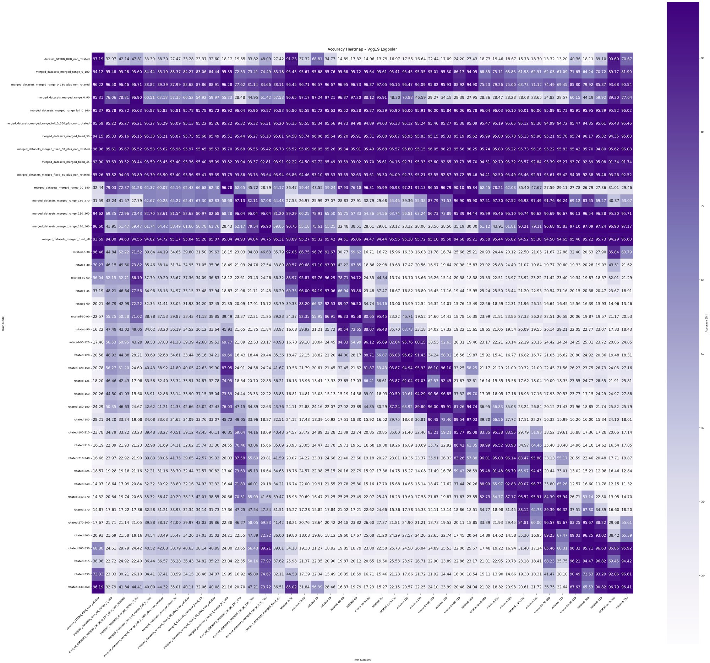{ width=75% .center }  
*Rys. 30. VGG19 - log-polar (GTSRB RGB).*  
Transformacja log-polar poprawia uogólnianie, kolumny testowe bardziej wyrównane.  

### Bazowy model ResNet56 - linear vs log

Rysunki 31 i 32 pokazują wyniki dla modelu ResNet56.  
Wersja *linear-polar* (rys. 31) utrzymuje umiarkowaną odporność, gdyż dominują ciemne pola wzdłuż 
diagonali, ale widoczny jest spadek jakości w miarę oddalania się od niej. Z kolei wariant *log-polar* 
(rys. 32) daje zauważalnie stabilniejszy rozkład, ponieważ ciemniejsze kolumny utrzymują się w szerszym 
zakresie kątów, co wskazuje, że model potrafi częściowo wykorzystywać barwne elementy znaków 
(np. czerwone obramowanie) jako cechy mniej zależne od orientacji.

  
*Rys. 31. ResNet56 - linear-polar (GTSRB RGB).*  
Umiarkowana odporność, spadek skuteczności dla rotacji spoza zakresu treningu.  
 
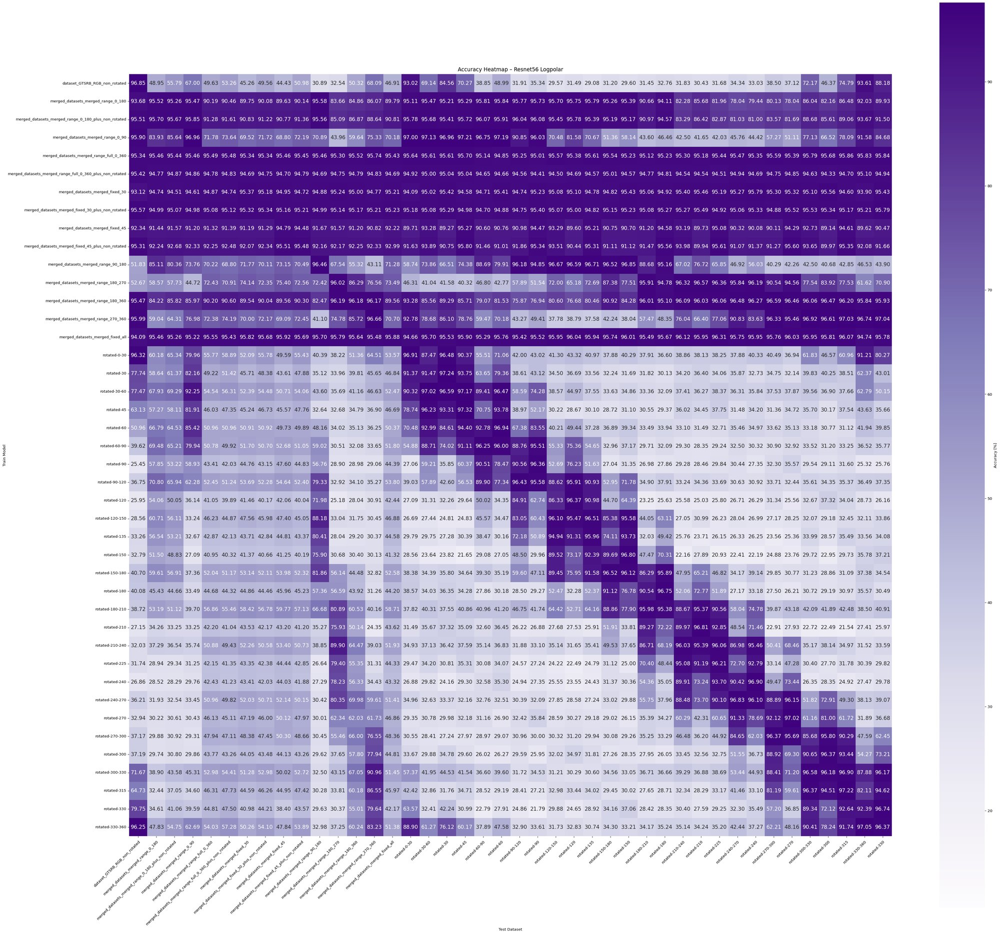  
*Rys. 32. ResNet56 - log-polar (GTSRB RGB).*  
Stabilniejsza dokładność przy większych kątach, lepsze wykorzystanie sygnału barwnego.  

### Modele cykliczne - CyVGG19 i CyResNet56

Najlepsze wyniki obserwuje się dla modeli cyklicznych, przedstawionych na rysunkach 33-36.  
Dla CyVGG19 (rys. 33-34) mapa ma jednolity, „ciemny” profil w całym zakresie testowym, 
co oznacza utrzymanie wysokiej dokładności niezależnie od rotacji, co również oznacza 
co oznacza utrzymanie wysokiej dokładności nawet przy dużych różnicach Δθ. Transformacja *log-polar* 
(rys. 34) dodatkowo wygładza przejścia między kolumnami testowymi, dając najbardziej równomierny rozkład jakości.  
Podobne zachowanie wykazuje CyResNet56 (rys. 35-36), którego wariant *linear-polar* prezentuje już niemal pełną 
inwariancję rotacyjną, a *log-polar* wzmacnia ten efekt, minimalizując różnice między rotacjami.  

{ width=80% .center }  
*Rys. 33. CyVGG19 - linear-polar (GTSRB RGB).*  
Wysoka dokładność utrzymana w całym zakresie kątów, dobra generalizacja na rotacje niewidziane w treningu.  
 
{ width=80% .center }  
*Rys. 34. CyVGG19 - log-polar (GTSRB RGB).*  
Jeszcze gładszy rozkład dokładności, minimalne różnice między kolumnami testowymi.  
  
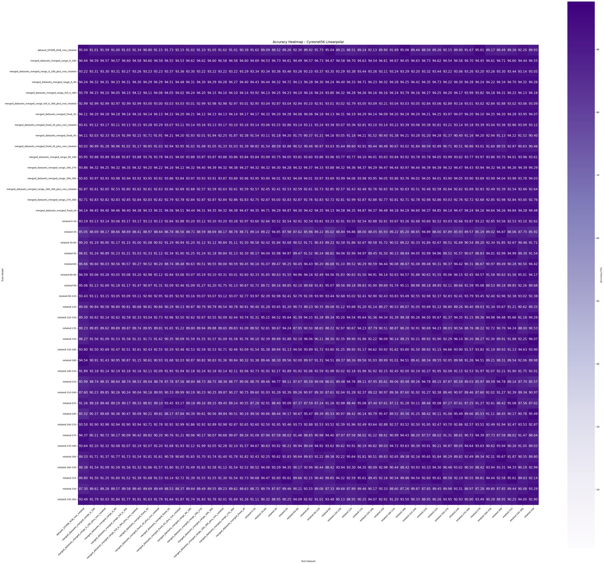{ width=80% .center }  
*Rys. 35. CyResNet56 - linear-polar (GTSRB RGB).*  
Niemal jednorodny poziom skuteczności, wysoka odporność na duże kąty Δθ.  

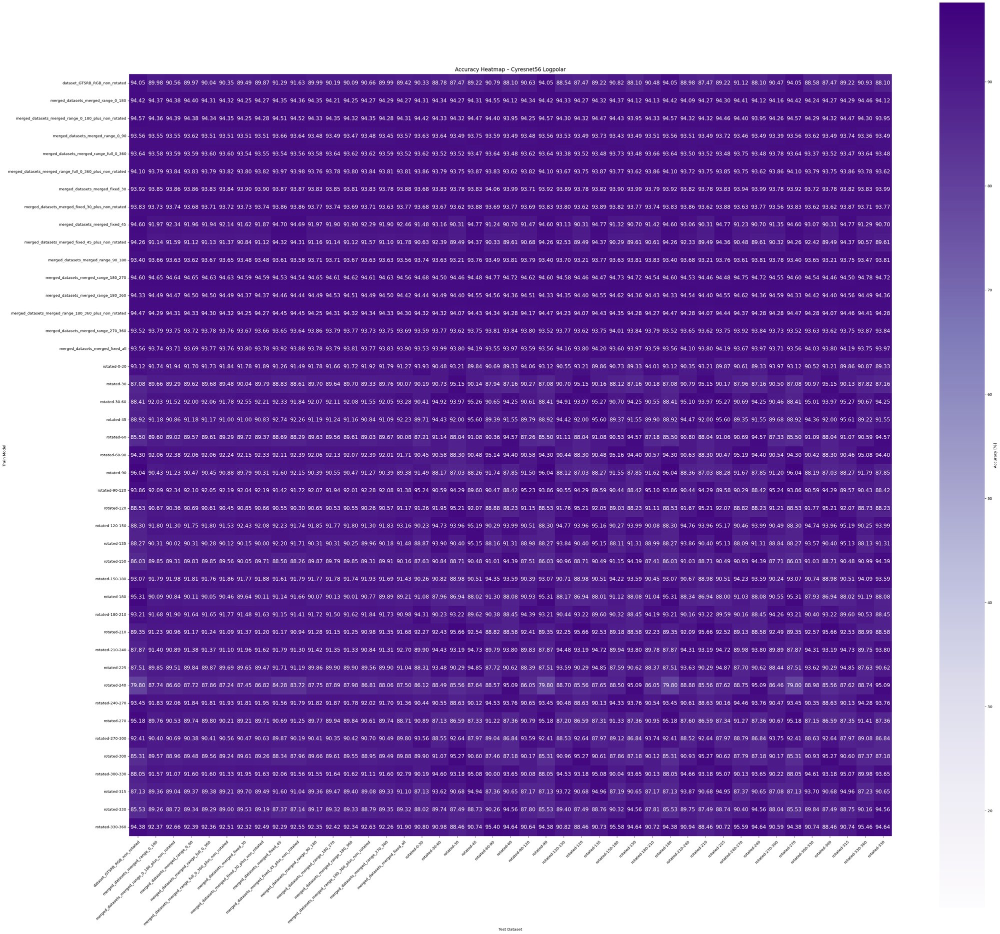{ width=80% .center }  
*Rys. 36. CyResNet56 - log-polar (GTSRB RGB).*  
Najbardziej płaska mapa - połączenie cykliczności i log-polar zapewnia pełną stabilność rotacyjną.  


### Wniosek odnośnie heatmap dla zbioru GTSRB RGB
Podsumowując, w wersji RGB wszystkie modele korzystają z dodatkowych informacji barwnych, 
co poprawia ich odporność na rotacje względem odpowiedników trenowanych na obrazach monochromatycznych.  
Wersja RGB zwiększa spójność między wariantami kątowymi, poprawiając
stabilność nawet w modelach klasycznych. Jednak dopiero architektury
cykliczne (CyVGG19, CyResNet56) zapewniają rzeczywistą inwariancję
rotacyjną, gdyż ich heatmapy są niemal jednolite, bez widocznych pasów
degradacji. Kolor wzmacnia cechy semantyczne, a cykliczność zapewnia
spójność geometryczną, co przekłada się na wyższe AUC_θ, mniejszy
spadek *Acc(Δθ)* oraz stabilność predykcji dla dużych rotacji.
Najbardziej wyrównany profil uzyskują modele cykliczne, a szczególnie CyResNet56-logpolar,
który zachowuje niemal stałą dokładność we wszystkich konfiguracjach *train-test*.

## Wpływ koloru

Wprowadzenie informacji barwnej w zbiorze GTSRB_RGB poprawiło
ogólną stabilność modeli względem rotacji. Kolor dostarcza dodatkowych
wskazówek semantycznych np. czerwone ramki, żółte tła czy niebieskie
symbole, które są rozpoznawalne niezależnie od orientacji znaku.  
Efekt ten jest szczególnie widoczny w modelach klasycznych, gdzie spadek
dokładności przy zmianie kąta jest łagodniejszy niż w wersjach
monochromatycznych. W modelach cyklicznych (CyVGG19, CyResNet56)
kolor działa komplementarnie, wzmacniając reprezentacje i prowadząc do
niemal pełnej inwariancji rotacyjnej.

## Podsumowanie ogólne

W przypadku zbiorów GTSRB i GTSRB RGB w obrębie tej samej rodziny 
linear daje zwykle wyższą średnią i $\mathrm{AUC}_\theta$, zaś log 
sporadycznie wygrywa „per-time” (np. CyVGG na GTSRB). Dataset LEGO pokazuje, że:
dla CyResNet log ma delikatny plus jakości i stabilności, natomiast
w VGG/ResNet lepszy jakościowo pozostaje linear, choć VGG-log
bywa szybszy. W MNIST log-polar wyraźnie pomaga (najmocniej w
CyResNet). W praktyce, gdy priorytetem jest odporność na duże
obroty ($\mathrm{AUC}_\theta$, worst), warto wybierać log, gdy
liczy się przepustowość i koszt (avg\_perf), ale częściej lepiej użyć linear.


## Wnioski per zbiór

Rysunki 37-40 przedstawiają przebiegi dokładności klasyfikacji *Acc(Δθ)* w funkcji różnicy kątów między 
próbkami treningowymi i testowymi dla wszystkich analizowanych zbiorów. Krzywe pokazują, jak 
poszczególne architektury reagują na wzrost rotacji wejściowych oraz w jakim stopniu zachowują stabilność względem kąta.  
We wszystkich przypadkach linie modeli cyklicznych (linie zielone i czerwone) utrzymują się wyraźnie wyżej od ich
klasycznych odpowiedników (linii niebieskich i pomarańczowych), co potwierdza trwałość efektu ekwiwariancji rotacyjnej niezależnie od domeny danych.

GTSRB (rys. 39).  
Średnia dokładność najwyższa dla CyResNet56-linear, natomiast największą stabilność (niewielkie wahania w funkcji Δθ) notuje CyVGG19-log.  
Różnice *worst-case* między najlepszymi konfiguracjami są niewielkie, co pozwala dobrać wariant zależnie od budżetu czasu lub wymagań stabilności.  
Krzywe modeli bazowych (VGG, ResNet) wykazują wyraźny spadek poniżej 0.6, podczas gdy modele cykliczne utrzymują poziom 0.85-0.90 niezależnie od kąta.

GTSRB RGB (rys. 38).  
Wersja kolorowa przynosi wyraźny skok jakości, gdyż wszystkie modele osiągają wyższe wartości *Acc(Δθ)* niż w wariancie monochromatycznym.  
Najlepsze wyniki uzyskuje CyResNet56-log, który utrzymuje niemal płaski przebieg w całym zakresie Δθ.  
Przejście do architektur cyklicznych (CyCNN) przynosi wzrost AUC\(_\theta\), natomiast klasyczne modele (np. VGG-log) pozostają niżej, mimo krótszego czasu uczenia.

LEGO (rys. 40).  
Tutaj przewagę utrzymuje CyResNet56-linear, który dominuje zarówno w średniej, jak i w rankingu *per-time*.  
Warto jednak zauważyć, że CyVGG19-log potrafi minimalnie wygrywać w metryce AUC\(_\theta\).  
Krzywe wszystkich modeli są dość spłaszczone, co wynika z prostoty i syntetycznego charakteru zbioru - rotacje wpływają w ograniczonym stopniu na rozpoznawalność kształtów.

MNIST (rys. 37).  
Różnice między modelami są najmniejsze spośród wszystkich zbiorów.  
CyResNet56-linear osiąga najwyższą średnią, a CyVGG19-linear nieznacznie wyprzedza go pod względem AUC\(_\theta\).  
Przy priorytecie przepustowości rozsądnym kompromisem pozostaje ResNet56-linear, 
który zachowuje umiarkowaną stabilność przy znacznie krótszym czasie treningu.


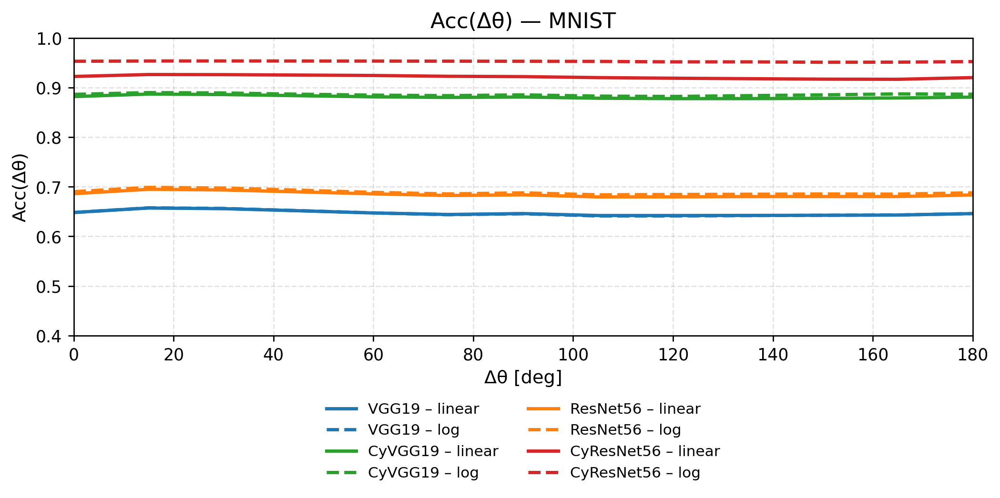{ width=80% .center }  
*Rys. 37. Dokładność klasyfikacji Acc(Δθ) dla zbioru MNIST*  
Wysoka stabilność modeli cyklicznych, niewielkie różnice między wariantami.  \

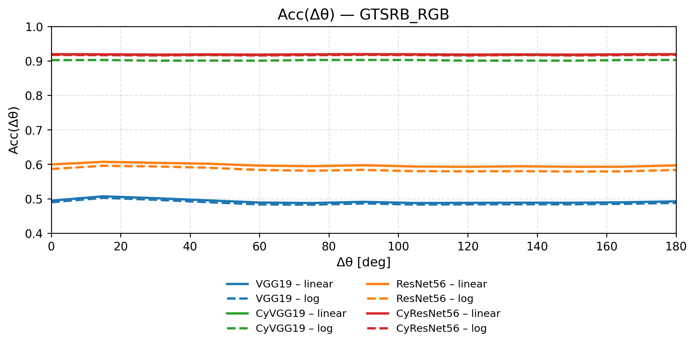{ width=80% .center }  
*Rys. 38. Dokładność Acc(Δθ) dla GTSRB RGB*  
Kolor poprawia odporność na rotacje, modele cykliczne zachowują niemal stałą skuteczność.  \

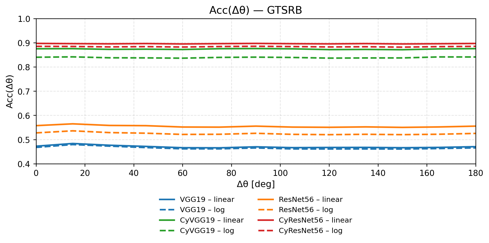{ width=80% .center }  
*Rys. 39. Dokładność Acc(Δθ) dla GTSRB*  
Wyraźna przewaga architektur cyklicznych nad klasycznymi niezależnie od kąta.  \

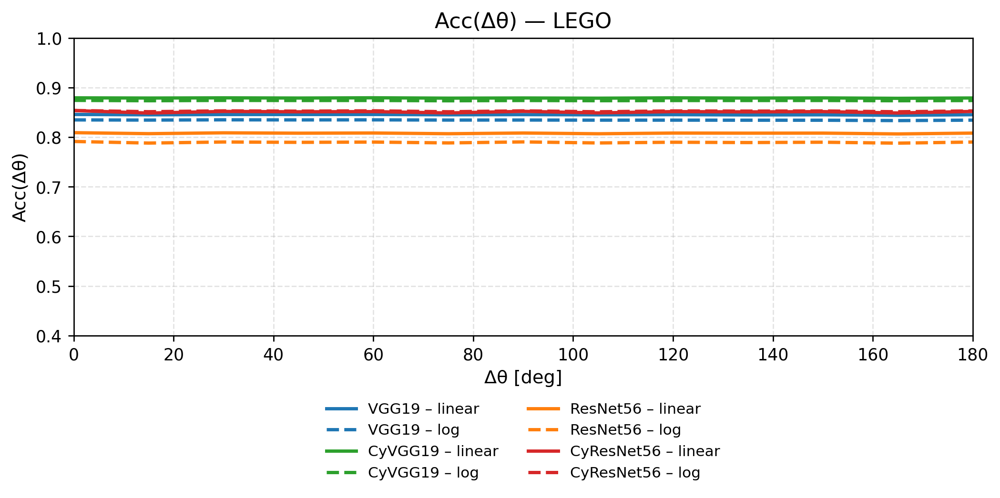{ width=80% .center }  
*Rys. 40. Dokładność Acc(Δθ) dla LEGO*
Krzywe spłaszczone, wpływ rotacji ograniczony ze względu na syntetyczny charakter danych.  \  

Przekrój stabilności pokazuje, że przewaga modeli cyklicznych utrzymuje się konsekwentnie we wszystkich zbiorach, niezależnie od liczby kanałów, złożoności obrazu czy stopnia symetrii kształtów.

## Analiza błędów i wzorce pomyłek

Macierz pomyłek to tablica o wymiarach C×C, w której wiersz odpowiada
klasie rzeczywistej, a kolumna klasie przewidzianej. Element (i, j) to
liczba (lub udział) przykładów klasy i zaklasyfikowanych jako j.
Idealny klasyfikator ma jasną przekątną (duże wartości na elementach
(i, i)) i ciemne otoczenie (niskie wartości poza przekątną).

## Znaczenie i interpretacja macierzy pomyłek

Macierze pomyłek stanowią jedno z kluczowych narzędzi interpretacji modeli
klasyfikacyjnych, które umożliwia analizę rozkładu błędów pomiędzy poszczególnymi
klasami. W niniejszej pracy zastosowano normalizację wierszową, co oznacza, że
suma każdego wiersza równa się jedności. Takie podejście pozwala na porównywanie
proporcji błędnych predykcji w obrębie danej klasy, niezależnie od jej liczebności.
Wartość na przekątnej macierzy odpowiada wówczas trafności danej klasy
(*per-class accuracy*), natomiast elementy poza przekątną wskazują kierunki i charakterystykę
błędnych klasyfikacji.

Wzorce występujące poza przekątną dostarczają cennych informacji o naturze błędów modelu.
Występowanie symetrycznych par (tj. podwyższonych wartości w pozycjach (i, j)
oraz (j, i)) oznacza wzajemne mylenie się dwóch klas, natomiast pasy lub skupiska
wartości poza przekątną świadczą o istnieniu podobieństw wizualnych, często
wynikających z rotacji lub wspólnych cech morfologicznych obiektów. Często
obserwuje się również zjawisko tzw. *near-miss*, czyli błędnych klasyfikacji do klasy
„blisko” właściwej, na przykład podobnych kloców lego 
(np. klocek mający 3 study oraz klocek mający 4 study albo płytka oraz brick od góry) 
znaków drogowych (50 oraz 90 albo 10 oraz 70) lub cyfr o zbliżonych kształtach 
(1 oraz 7 albo 6 i 9).

Z macierzy pomyłek można także obliczyć klasyczne miary jakości dla poszczególnych
klas, takie jak precision, recall czy F1-score. Są one szczególnie istotne
w przypadku zbiorów niezbalansowanych, gdzie średnia dokładność top-1 może maskować
problemy w rzadziej reprezentowanych etykietach. Dzięki temu analiza macierzy
pozwala nie tylko ocenić ogólną skuteczność modelu, lecz także wskazać jego jakość
per klasa.

Najbardziej wiarygodne wnioski uzyskane zostały przy porównaniach równoległych, tj.
dla tego samego zbioru testowego gdzie zostawione zostały wyniki dwóch modeli (np. bazowego i
cyklicznego) lub dwa warianty odwzorowania przestrzeni (linear-polar vs
log-polar). Cennym uzupełnieniem jest także analiza sekwencji macierzy wzdłuż
koszyków Δθ (np. 0°, 45°, 90°), która pozwala śledzić, jak zmienia się struktura
błędów w zależności od różnicy kątów między treningiem, a testem. 
Jednak z racji objętości pracy nie została ona zastosowana.

### Obserwacje dla poszczególnych zbiorów

W przypadku zbioru GTSRB oraz jego wariantu GTSRB RGB dominują tzw.
*near-missy* między znakami o zbliżonej ikonografii (np. „50” i „60”). W modelach
bazowych testowanych na rotacjach widoczne są charakterystyczne pasma błędów
odsunięte od przekątnej, będące efektem wrażliwości na orientację. Wersje cykliczne
znacząco redukują ten efekt, przekątna staje się bardziej wyraźna, a rozproszenia
symetryczne słabną, co świadczy o poprawie stabilności względem kąta.

Dla zbioru LEGO błędy klasyfikacji wynikają głównie z podobieństwa brył
poszczególnych elementów. Modele cykliczne ograniczają rozlania pomiędzy klasami o
zbliżonym obrysie, a efekt ten jest szczególnie wyraźny w przypadku odwzorowania
log-polar, które lepiej radzi sobie z dużymi zmianami kąta.

W zbiorze MNIST najtrudniejsze do rozróżnienia pozostają pary cyfr o podobnych
kształtach, takie jak (3, 5), (4, 9) czy (7, 1). Cykliczność nie eliminuje całkowicie
tych pomyłek, jednak redukuje błędy o charakterze rotacyjnym, zwłaszcza przypadków pokroju
6 oraz 9 przy dużych obrotach, jednak nawet osoba, która je narysował mogłby mieć problemy 
z ich odróżeniem stad zostały w pracy omówione inne zbiory danych by nie było 
biasu wynikającego z tego faktu. Mimo trgo dzięki użyciu modeli cyklicznych przekątna 
macierzy staje się czystsza, a liczba „wysp” poza nią zauważalnie maleje.

### Wnioski i znaczenie dla interpretacji

Macierze pomyłek potwierdzają stabilność modeli cyklicznych, obserwowaną również
na krzywych dokładności *Acc(Δθ)* i w wartościach *AUC*. Wersje cykliczne
charakteryzują się wyraźniejszą dominantą na przekątnej, słabszymi pasmami błędów
oraz bardziej jednorodnym rozkładem pomyłek między klasami. Różnice między
odwzorowaniami wskazują, że transformacja log-polar lepiej wspiera przypadki
dużych różnic kątowych, natomiast linear-polar zapewnia porównywalną jakość przy
mniejszym koszcie obliczeniowym.

Dodatkowa analiza per-klasa (recall, precision, F1) pozwala uzupełnić ogólne
wskaźniki o wgląd w wewnętrzną strukturę błędów. Pozwala to identyfikować klasy
szczególnie podatne na pomyłki i planować ukierunkowane działania naprawcze, takie
jak wzbogacenie zbioru treningowego lub wprowadzenie dodatkowych mechanizmów
regularizacji.


## Analiza macierzy pomyłek dla zbioru GTSRB RGB, rotated-270-300

Na rysunkach 41-42 przedstawiono wierszowo znormalizowane macierze pomyłek dla N = 43 klas w scenariuszu testowym *rotated-270-300*.  
Każdy wiersz sumuje się do 1.0, dzięki czemu odcień na przekątnej odpowiada czułości (recall) danej klasy, natomiast wartości poza
przekątną reprezentują strukturę błędów, czyli, do jakich klas model najczęściej „odpływa”. Porównano dwa warianty o identycznej 
konfiguracji danych: klasyczny ResNet56-linear oraz jego cykliczny odpowiednik CyResNet56-linear. W obu przypadkach test obejmuje 
pełny zbiór GTSRB RGB, zmergowany dla wszystkich przedziałów rotacji 0-360° (w tym przypadki nierotowane).

Na rysunku 41 zaprezentowano macierz dla ResNet56-linear, gdzie widoczne jest wyraźne rozproszenie błędów poza przekątną, 
zwłaszcza w grupach znaków o podobnych kształtach lub kolorystyce. Część wierszy ma słabszą diagonale, co wskazuje na 
niższą czułość dla wybranych klas i częste mylenie obiektów o zbliżonym układzie graficznym (np. trójkąty ostrzegawcze, okrągłe zakazy).  
To efekt braku pełnej inwariancji rotacyjnej, gdyż przy rotacjach rzędu 270°-300° klasyfikator „gubi” odniesienia geometryczne i barwne.

[Rys. 41-42 - Znormalizowana macierz pomyłek (rotated-270-300) - ResNet56 linearpolar vs CyResnet56 testowane na pełnym zbiorze GTSRB_RGB(zmergowane wszystkie przypadki 0-360)]  \
  \
*Rys. 41. Znormalizowana macierz pomyłek (rotated-270-300) - ResNet56-linear na pełnym zbiorze GTSRB RGB (zmergowane wszystkie przypadki 0-360°).*  \
Widoczne rozproszenie błędów poza przekątną, szczególnie w rodzinach klas o podobnym kształcie; przekątna osłabiona w kilku wierszach.  \

Na rysunku 42 przedstawiono wyniki dla CyResNet56-linear.  
Wariant cykliczny cechuje się znacznie mocniejszą przekątną (ciemniejsze pola, większa wartość na przekątnej macierzy pomyłek) oraz wyraźnie mniejszym rozproszeniem błędów.  
„Wyspy” poza przekątną są słabsze i bardziej skupione, a liczba przerzutów do klas symetrycznych kątowo (±90°, ±270°) znacząco maleje.  
Model cykliczny utrzymuje spójność reprezentacji rotacyjnej, co przekłada się na wyższą średnią czułość i stabilność predykcji.  \

  \
*Rys. 42. Znormalizowana macierz pomyłek (rotated-270-300) - CyResNet56-linear na pełnym zbiorze GTSRB RGB (zmergowane przypadki 0-360°).*  \
Przekątna wyraźnie mocniejsza (większa wartość na przekątnej macierzy pomyłek), wyspy błędów poza nią słabsze i bardziej lokalne; zauważalny spadek pomyłek do klas symetrycznych.  \

### Wnioski
orównanie macierzy pomyłek (rys. 41-42) jednoznacznie wskazuje, że wersja cykliczna modelu charakteryzuje się wyraźnie 
większą spójnością predykcji i wyższą czułością w ujęciu per-klasa. Wariant klasyczny ResNet56-linear generuje liczne 
błędy rozproszone poza przekątną, szczególnie w obrębie rodzin znaków o podobnym kształcie i kolorystyce, co potwierdza 
jego ograniczoną odporność na rotacje. Natomiast CyResNet56-linear utrzymuje zdecydowanie silniejszą przekątną, a obszary 
błędów są znacznie bardziej skupione i mają mniejszą intensywność. Zmniejsza się liczba pomyłek pomiędzy klasami o 
symetrycznych kątach (±90°, ±270°), a rozkład predykcji pozostaje stabilny w całym zakresie testowym 270°-300°. 
Średnia wartość na przekątnych, jest wyraźnie wyższa w wersji cyklicznej, co koreluje z obserwowanymi wcześniej krzywymi 
*Acc(Δθ)* oraz wskaźnikami AUC_θ (rys. 37-39). Oznacza to, że architektura cykliczna nie tylko poprawia średnią 
dokładność, lecz również redukuje entropię błędów, prowadząc do bardziej jednoznacznych decyzji klasyfikacyjnych nawet 
w warunkach dużych rotacji.

## Najważniejsze obserwacje

Analiza macierzy pomyłek ujawnia wyraźne różnice w zachowaniu modeli
bazowych i cyklicznych. W przypadku CyResNet56 obserwuje się silniejszą
dominantę na przekątnej, ponieważ wartości diagonalne są istotnie wyższe w
większości wierszy niż w klasycznym ResNet56, co wskazuje na lepszą
*czułość per-klasa* w warunkach rotacji rzędu 270-300°. Różnica ta jest
szczególnie zauważalna w dolnej części macierzy, odpowiadającej klasom
36-42, gdzie model cykliczny zachowuje wysoką trafność mimo znaczącej
zmiany orientacji obrazów.

Drugim istotnym efektem jest redukcja liczby rozproszonych pomyłek poza
przekątną. W modelu ResNet56 występują liczne „wyspy” błędów, gdyż
pojedyncze wiersze zawierają podwyższone wartości w wielu kolumnach,
co świadczy o niejednoznaczności reprezentacji. W CyResNet56
rozproszenia te ulegają wyraźnemu wygaszeniu: zwykle pozostaje jeden lub
dwóch niewielkich „sąsiadów” błędu, a reszta zanika. Wskazuje to, że 
reprezentacja kąta w modelu cyklicznym cechuje się większą
spójnością i precyzją, co przekłada się na bardziej stabilne zachowanie 
modelu przy rotacjach.

Kolejnym obserwowanym zjawiskiem jest ograniczenie liczby pomyłek między
klasami o podobnej geometrii. W modelu ResNet56 częściej występują
skupiska błędów w obrębie „rodzin kształtów”, np. między znakami
trójkątnymi (ostrzegawczymi) lub okrągłymi (zakazu). Wersja cykliczna
wykazuje mniejszą tendencję do takich pomyłek, co sugeruje, że połączenie
cyklicznej konwolucji z odwzorowaniem linear-polar skuteczniej
separuje klasy wizualnie podobne nawet przy dużych rotacjach.

Zaobserwowana została również mniejsza liczbę przerzutów do klas symetrycznych.
W przypadku rotacji 270-300° model bazowy częściej myli klasy z ich
kątowymi odpowiednikami, natomiast w modelu cyklicznym intensywność tych
pomyłek znacząco maleje. Zjawisko to jest spójne z uzyskanymi wynikami
metryk AUC\(_\theta\) oraz łagodniejszym przebiegiem krzywej
Acc(Δθ), które potwierdzają większą stabilność i równomierność
wyników modelu.

Kolejnym zauważalnym zjawiskiem jest skrócenie tzw. „długiego ogona błędów”.
Podczas gdy w modelu bazowym przekątna jest nieregularna, a błędy rozproszone,
w CyResNet56 rozkład ten staje się bardziej uporządkowany. Pomyłki
koncentrują się wokół kilku semantycznie bliskich klas, a dominanta na
przekątnej odzyskuje swoją wyrazistość. Oznacza to redukcję entropii błędu
i poprawę użyteczności predykcji top-k, co potwierdza lepszą stabilność
modeli cyklicznych.
   
## Konkluzja

Na wymagającym scenariuszu rotacyjnym model
CyResNet56-linear generuje bardziej spójne macierze pomyłek, gdyż
przekątna jest wyraźniejsza, a rozproszenia poza nią stają się mniejsze
i bardziej przewidywalne. W praktyce przekłada się to na większą
stabilność względem rotacji oraz większą użyteczność decyzji
post-klasyfikacyjnych (np. w strategiach opartych na regule top-k),
co pozostaje w pełnej zgodności z otrzymanymi metrykami globalnymi
AUC θ oraz Acc(Δθ).

## Kompromis między jakością a wydajnością obliczeniową

Wykresy punktowe przedstawiają zależność między średnią dokładnością
(*avg*), a średnią wydajnością obliczeniową w przeliczeniu na jednostkę
czasu (*avg_perftime*). Każdy punkt odpowiada jednej konfiguracji modelu,
a kolory oznaczają różne rodziny sieci (`VGG19`, `ResNet56`, `CyVGG19`,
`CyResNet56`). Punkty położone bliżej prawego górnego narożnika wykresu
reprezentują konfiguracje o najlepszym kompromisie między jakością a
kosztem obliczeń.

Ogólny trend widoczny na wszystkich zbiorach wskazuje, że modele
cykliczne (`CyVGG`, `CyResNet`) utrzymują wyższą jakość przy umiarkowanym
wzroście kosztu obliczeniowego. Wersje klasyczne (`VGG`, `ResNet`) są
szybsze, lecz tracą stabilność i precyzję przy większych rotacjach.

Wybór architektury zależy od priorytetów danego zastosowania. Jeśli kluczowa jest
niezawodność i stabilność względem rotacji, najkorzystniejsze okazują się warianty 
cykliczne (`CyVGG`, `CyResNet`) z transformacją *log-polar*, które lepiej zachowują 
ciągłość reprezentacji. W sytuacjach, gdzie liczy się przepustowość i ograniczone 
zasoby obliczeniowe, bardziej efektywne są konfiguracje *linear-polar*, szczególnie `ResNet56`. 
W zastosowaniach o zróżnicowanych wymaganiach obie grupy modeli mogą współistnieć 
w układzie hybrydowym, gdzie wybór ścieżki (cyklicznej lub klasycznej) zależy dynamicznie 
od profilu zadania lub kontekstu operacyjnego.

Na rysunkach 43-46 przedstawiono zależność pomiędzy średnią dokładnością
(oznaczoną jako *avg*) a średnią wydajnością obliczeniową (*avg_perftime*).
Każdy punkt odpowiada pojedynczej konfiguracji modelu, a kolory oznaczają
rodziny sieci (`VGG19`, `ResNet56`, `CyVGG19`, `CyResNet56`).
Widać, że modele cykliczne zajmują obszar prawej części wykresów, co oznacza
wyższą dokładność przy zbliżonym koszcie obliczeń.
Tendencja ta jest widoczna na wszystkich zbiorach danych
(GTSRB, GTSRB_RGB, LEGO i MNIST), co potwierdza ich większą stabilność
w warunkach rotacji.

\newpage

[Rys. 43-46] Wykresy średnia wydajność per-time vs średnia dokładność

{ width=70% .center }  \
*Rys. 43. Wykres średnia wydajność per-time vs średnia dokładność dla zbioru GTSRB*
Modele cykliczne osiągają wyraźnie lepszy kompromis jakościowy, punkty `CyResNet` i `CyVGG` grupują się w prawej części wykresu.  \


{ width=70% .center }  \
*Rys. 44. Wykres średnia wydajność per-time vs średnia dokładność dla zbioru GTSRB RGB*  
W przypadku zbioru GTSRB wersje kolorowe (RGB) poprawiają stabilność i utrzymują wysoką jakość nawet przy większych kątach rotacji
Modele `CyVGG` dominują jakościowo, przy zbliżonym koszcie obliczeń co `CyResNet`. \


{ width=70% .center }  \
*Rys. 45. Wykres średnia wydajność per-time vs średnia dokładność dla zbioru LEGO*  
Dla zbioru LEGO rozkład wskazuje wyraźne grupowanie punktów `CyVGG` i `CyResNet` przy wysokiej dokładności (prawa strona)
Modele klasyczne charakteryzują się większą zmiennością wydajności i niższą jakością.  \


{ width=70% .center}  \
*Rys. 46. Wykres średnia wydajność per-time vs średnia dokładność dla zbioru MNIST*  
Zaś w przypadku zbioru MNIST różnice między rodzinami są najmniejsze, lecz modele cykliczne nadal osiągają wyższe wartości dokładności przy porównywalnym koszcie.
Punkty w prawym dolnym rogu (niski koszt, wysoka jakość) reprezentują najbardziej efektywne konfiguracje.  \

Warto zauważyć, że w każdym z analizowanych zbiorów punkty
charakteryzujące modele cykliczne tworzą bardziej zwarte i przesunięte
w prawo skupienia, co potwierdza większą stabilność oraz lepszy stosunek
jakości do kosztu obliczeń w porównaniu z klasycznymi konwolucjami.

## Rekomendacje praktyczne na podstawie wyników

W środowiskach o ograniczonym czasie trenowania oraz ścisłych limitach SLA (Service Level Agreement)
[@gawlikowski2021survey] dobrym punktem wyjścia pozostaje model CyResNet56-linear. 
Zapewnia on korzystny kompromis pomiędzy jakością, stabilnością a efektywnością
obliczeniową. W przypadku, gdy zadanie wymaga wyższej odporności na rotacje 
lub istotnie odbiega od rozkładu treningowego, zalecane jest zastosowanie 
wariantu log-polar. W takich scenariuszach szczególnie dobrze sprawdzają się
modele CyVGG19-log oraz CyResNet56-log, które utrzymują wysoką
jakość predykcji również w obszarze „worst-case”.  

W kontekstach cechujących się dużą zmiennością skali lub perspektywy
transformacja log-polar dodatkowo stabilizuje wyniki, zachowując
porównywalną precyzję przy rotacjach dalekich od zakresu treningowego.

\newpage

# Strojenie hiperparametrów z pomocą Optuny, a odporność na rotacje

## Założenie i konfiguracja

Celem było sprawdzenie, czy strojenie hiperparametrów (learning rate,
momentum, weight decay) dla konfiguracji `non_rotated` potrafi
podnieść bazową jakość przy kątach bliskich \(0^\circ\),
oraz przenieść się na stabilność rotacyjną (AUC\(_\theta\),
worst-case) bez zmiany architektury i bez augmentacji rotacjami.

Do walidacji w Optunie wykorzystane zostały `non_rotated` wersje zbiorów danych. 
Wykorzystana została funkcja celu - klasyczne `val_acc` w pobliżu \(0^\circ\). 
Trening przebiegał bez rotacji, a użyta transformacja (linear-polar / log-polar) była identyczna
jak w bazowym zbiorze. Taki układ celowo „patrzy” tylko na zachowanie modelu wokół
\(0^\circ\) i nie nagradza odporności na duże \(\Delta\theta\).

Dla każdego zbioru wygenerowane zostały pliki:  \
`optuna_vs_baseline_nonrot_{GTSRB|GTSRB_RGB|LEGO|MNIST}_micro.csv`
Zawierają one pary kolumn `avg_base / avg_opt`, `AUC_base / AUC_opt`,
`worst_base / worst_opt` oraz różnice `d_avg`, `d_AUC`, `d_worst`.
W dalszej cześci tego rozdziału zostały zastosowane następujące skróty:  \
- **linear** = linear-polar  \
- **log** = log-polar  \
- **baseline** = bazowa konfiguracja.  \

## Metryki i zapis wyników

W porównaniu porównywane są dwie wersje dla danej pary (architektura, transformacja):
Baseline (`non_rotated`) i Optuna (`non_rotated`). 
Do porównania zostały wykorzystane następujące miary:  \
- **avg** - średnia dokładność (micro) po scenariuszach testowych;  \
- **AUC$_\theta$** - pole pod krzywą $\mathrm{Acc}(\Delta\theta)$,
  znormalizowane do $[0,1]$;  \
- **worst** - minimum krzywej $\mathrm{Acc}(\Delta\theta)$
  (najtrudniejszy koszyk kątowy);  \
- **avg\_perf** - $\mathrm{mean}(\mathrm{Acc})/T_{\mathrm{train}}$,
  gdzie $T_{\mathrm{train}}$ to czas trenowania.  \ 


### Obraz globalny

Wynik jest spójny między zbiorami: zmiany avg są na ogół niewielkie,
zwykle \(|\Delta| \le 0.01\). Wskaźniki AUC\(_\theta\) i worst
przeważnie nie rosną, ponieważ przy walidacji ustawionej na \(0^\circ\)
brakuje presji selekcyjnej na stabilność dla dużych \(\Delta\theta\).
Zdarzają się lokalne plusy (pojedyncze pary model-transformacja), jednak
w ujęciu przekrojowym dominują wyniki neutralne lub lekko ujemne zarówno
w AUC\(_\theta\), jak i w worst.

## Wyniki: Optuna kontra bazowy modeel

W tej sekcji porównywane są wyniki modeli trenowanych z ręcznie dobranymi
hiperparametrami („bazowy model”) z wynikami tych samych architektur
po automatycznym strojeniu w Optunie. Dla czytelności każdy zbiór ma
osobną tabelę: tabela 14 dotyczy GTSRB_RGB, tabela 15 - GTSRB,
tabela 16 - LEGO, a tabela 17 - MNIST. W każdej z nich najpierw pokazuję
wartości absolutne (część „Wyniki”), a zaraz pod nią różnice względem
konfiguracji bazowej (część „Różnica względem bazowego”). Opis w tekście
odnosi się bezpośrednio do tych tabel - dzięki temu wykresy z wcześniejszych
podrozdziałów i wyniki z rodzajów architektur można zestawić z realnym
wpływem strojenia.

### Optuna vs bazowy model dla zbioru GTSRB RGB 
*Tabela 14.* Optuna vs bazowy model dla zbioru GTSRB RGB

| arch | act | avg_opt | AUC_opt | worst_opt | avg_base | AUC_base | worst_base |
|---|---|---|---|---|---|---|---|
| cyresnet56 | linearpolar | 0.872 | 0.861 | 0.831 | 0.924 | 0.923 | 0.919 |
| cyresnet56 | logpolar | 0.868 | 0.857 | 0.822 | 0.930 | 0.928 | 0.923 |
| cyvgg19 | linearpolar | 0.839 | 0.835 | 0.766 | 0.939 | 0.939 | 0.933 |
| cyvgg19 | logpolar | 0.790 | 0.791 | 0.688 | 0.938 | 0.938 | 0.931 |
| resnet56 | linearpolar | 0.588 | 0.582 | 0.389 | 0.890 | 0.887 | 0.869 |
| resnet56 | logpolar | 0.534 | 0.524 | 0.323 | 0.893 | 0.890 | 0.869 |
| vgg19 | linearpolar | 0.360 | 0.364 | 0.180 | 0.883 | 0.881 | 0.863 |
| vgg19 | logpolar | 0.335 | 0.338 | 0.141 | 0.882 | 0.881 | 0.862 |

*Tabela 14b.* Różnica względem modelem zoptymalizowanym z użyciem Optuny, a standardowym modelem dla zbioru GTSRB RGB.

| arch | act | d_avg | d_AUC | d_worst |
|---|---|---|---|---|
| cyresnet56 | linearpolar | -0.052 | -0.062 | -0.088 |
| cyresnet56 | logpolar | -0.061 | -0.071 | -0.101 |
| cyvgg19 | linearpolar | -0.100 | -0.104 | -0.167 |
| cyvgg19 | logpolar | -0.148 | -0.147 | -0.242 |
| resnet56 | linearpolar | -0.301 | -0.305 | -0.481 |
| resnet56 | logpolar | -0.359 | -0.366 | -0.546 |
| vgg19 | linearpolar | -0.523 | -0.517 | -0.684 |
| vgg19 | logpolar | -0.547 | -0.542 | -0.722 |

Z tabeli 13 widać, że dla modelu CyResNet56-logpolar po zastosowaniu automatycznego strojenia
z pomocą Optuny odnotowano spadek średniej dokładności z *0.930* do *0.868* 
(Δavg = -0.061). Wartość *AUC* zmniejszyła się z *0.928* do *0.857* 
(ΔAUC = -0.071), natomiast wynik w najtrudniejszym scenariuszu 
(*worst-case*) spadł z *0.923* do *0.822* (Δworst = -0.101).  
Podobną tendencję można zobserwować dla wariantu linearpolar, 
gdzie spadki wynoszą odpowiednio -0.052, -0.062 i -0.088 
dla parametrów `avg`, `AUC` oraz `worst`.

W porównaniu z pozostałymi modelami, degradacja jakości po użyciu Optuny dla modelu CyResNet56 
pozostaje umiarkowana, podczas, gdy dla CyVGG19 różnice są wyraźniejsze 
(Δavg = -0.100 dla linearpolar i -0.148 dla logpolar).  
Największe spadki zanotowano w architekturach bazowych VGG19 
i ResNet56, co wskazuje, że modele cykliczne - mimo pogorszenia 
po walidacji - nadal utrzymują wyższy poziom odporności rotacyjnej.

### Optuna vs bazowy model dla zbioru GTSRB
*Tabela 15.* Optuna vs bazowy model dla zbioru GTSRB

| arch | act | avg_opt | AUC_opt | worst_opt | avg_base | AUC_base | worst_base |
|---|---|---|---|---|---|---|---|
| cyresnet56 | linearpolar | 0.844 | 0.838 | 0.793 | 0.937 | 0.935 | 0.927 |
| cyresnet56 | logpolar | 0.790 | 0.770 | 0.680 | 0.927 | 0.924 | 0.911 |
| cyvgg19 | linearpolar | 0.690 | 0.692 | 0.573 | 0.923 | 0.921 | 0.904 |
| cyvgg19 | logpolar | 0.639 | 0.648 | 0.473 | 0.916 | 0.915 | 0.898 |
| resnet56 | linearpolar | 0.351 | 0.345 | 0.212 | 0.890 | 0.887 | 0.870 |
| resnet56 | logpolar | 0.445 | 0.437 | 0.264 | 0.878 | 0.875 | 0.855 |
| vgg19 | linearpolar | 0.299 | 0.304 | 0.142 | 0.869 | 0.867 | 0.846 |
| vgg19 | logpolar | 0.291 | 0.296 | 0.137 | 0.862 | 0.861 | 0.840 |

*Tabela 15b.* Różnica względem modelem zoptymalizowanym z użyciem Optuny, a standardowym modelem dla zbioru GTSRB.

| arch | act | d_avg | d_AUC | d_worst |
|---|---|---|---|---|
| cyresnet56 | linearpolar | -0.093 | -0.096 | -0.135 |
| cyresnet56 | logpolar | -0.137 | -0.155 | -0.231 |
| cyvgg19 | linearpolar | -0.233 | -0.229 | -0.331 |
| cyvgg19 | logpolar | -0.276 | -0.267 | -0.425 |
| resnet56 | linearpolar | -0.539 | -0.542 | -0.658 |
| resnet56 | logpolar | -0.433 | -0.438 | -0.590 |
| vgg19 | linearpolar | -0.570 | -0.563 | -0.703 |
| vgg19 | logpolar | -0.572 | -0.565 | -0.703 |

W tabeli 14 pogorszenie jest jeszcze wyraźniejsze: już dla
modelu CyResNet56-logpolar po zastosowaniu automatycznego strojenia
z pomocą Optuny również odnotowano spadek średniej dokładności z *0.927* do *0.790*
(Δavg = -0.137). Wartość *AUC* zmniejszyła się z *0.924* do *0.770*
(ΔAUC = -0.155), natomiast wynik w najtrudniejszym scenariuszu
(*worst-case*) spadł z *0.911* do *0.680* (Δworst = -0.231).  
Podobną tendencję można zaobserwować dla wariantu linearpolar,
gdzie spadki wynoszą odpowiednio -0.093, -0.096 i -0.135
dla parametrów `avg`, `AUC` oraz `worst`.

W porównaniu z pozostałymi modelami, degradacja jakości po użyciu Optuny
dla CyResNet56 pozostaje umiarkowana, podczas gdy dla CyVGG19
różnice są wyraźniejsze (Δavg = -0.233 dla linearpolar i -0.276 dla
logpolar), jednak największe spadki zanotowano w architekturach bazowych
VGG19 i ResNet56. Wnioski są podobne jak w przypadku GTSRB-RGB:
mimo pogorszenia po strojeniu, modele cykliczne utrzymują relatywnie
wyższą odporność rotacyjną niż ich odpowiedniki bazowe.

### Optuna vs bazowy model dla zbioru LEGO
*Tabela 16.* Optuna vs bazowy model dla zbioru LEGO

| arch | act | avg_opt | AUC_opt | worst_opt | avg_base | AUC_base | worst_base |
|---|---|---|---|---|---|---|---|
| cyresnet56 | linearpolar | 0.660 | 0.638 | 0.562 | 0.871 | 0.867 | 0.853 |
| cyresnet56 | logpolar | 0.728 | 0.718 | 0.671 | 0.878 | 0.876 | 0.868 |
| cyvgg19 | linearpolar | 0.789 | 0.783 | 0.753 | 0.905 | 0.905 | 0.901 |
| cyvgg19 | logpolar | 0.770 | 0.768 | 0.755 | 0.903 | 0.902 | 0.899 |
| resnet56 | linearpolar | 0.513 | 0.494 | 0.452 | 0.878 | 0.875 | 0.864 |
| resnet56 | logpolar | 0.609 | 0.594 | 0.541 | 0.868 | 0.866 | 0.857 |
| vgg19 | linearpolar | 0.706 | 0.702 | 0.660 | 0.903 | 0.903 | 0.897 |
| vgg19 | logpolar | 0.581 | 0.576 | 0.559 | 0.898 | 0.898 | 0.893 |

*Tabela 16b.* Różnica względem modelem zoptymalizowanym z użyciem Optuny, a standardowym modelem dla zbioru LEGO.

| arch | act | d_avg | d_AUC | d_worst |
|---|---|---|---|---|
| cyresnet56 | linearpolar | -0.212 | -0.229 | -0.291 |
| cyresnet56 | logpolar | -0.150 | -0.158 | -0.197 |
| cyvgg19 | linearpolar | -0.116 | -0.122 | -0.148 |
| cyvgg19 | logpolar | -0.133 | -0.134 | -0.145 |
| resnet56 | linearpolar | -0.365 | -0.381 | -0.412 |
| resnet56 | logpolar | -0.259 | -0.272 | -0.316 |
| vgg19 | linearpolar | -0.197 | -0.201 | -0.236 |
| vgg19 | logpolar | -0.317 | -0.322 | -0.335 |


Tutaj (tabela 16) obraz jest najbardziej „czysty”, gdyż dla 
modelu CyResNet56-logpolar po zastosowaniu automatycznego strojenia
z pomocą Optuny odnotowano spadek średniej dokładności z *0.878* do *0.728*
(Δavg = -0.150). Wartość *AUC* zmniejszyła się z *0.876* do *0.718*
(ΔAUC = -0.158), natomiast wynik w najtrudniejszym scenariuszu
(*worst-case*) spadł z *0.868* do *0.671* (Δworst = -0.197).  
Podobną tendencję można zaobserwować dla wariantu linearpolar, gdzie
spadki wynoszą odpowiednio -0.212, -0.229 i -0.291 dla
parametrów `avg`, `AUC` oraz `worst`.

W porównaniu z pozostałymi modelami, degradacja jakości po użyciu Optuny
dla CyResNet56 pozostaje wyraźna, lecz wciąż mniejsza niż w przypadku
bazowych architektur. Modele CyVGG19 utrzymują stosunkowo wysoki
poziom dokładności, spadki wynoszą -0.116 (linearpolar) oraz
-0.133 (logpolar) dla metryki `avg`, co stanowi najmniejszą degradację
spośród wszystkich konfiguracji.  
Dla porównania, architektury klasyczne ResNet56 i VGG19 wykazują
znacznie większe spadki, bo do -0.365 dla ResNet56-linear i -0.317
dla VGG19-log.  

Podobnie jak w przypadku zbioru GTSRB, modele cykliczne zachowują
lepszą odporność na rotacje po strojeniu hiperparametrów, a wariant
CyVGG19-logpolar okazuje się najbardziej stabilny jakościowo w tym
zestawie.

### Optuna vs bazowy model dla zbioru MNIST
*Tabela 17.* Optuna vs bazowy model dla zbioru MNIST

| arch | act | avg_opt | AUC_opt | worst_opt | avg_base | AUC_base | worst_base |
|---|---|---|---|---|---|---|---|
| cyresnet56 | linearpolar | 0.866 | 0.866 | 0.694 | 0.958 | 0.957 | 0.925 |
| cyresnet56 | logpolar | 0.921 | 0.919 | 0.851 | 0.975 | 0.975 | 0.965 |
| cyvgg19 | linearpolar | 0.750 | 0.751 | 0.614 | 0.949 | 0.948 | 0.927 |
| cyvgg19 | logpolar | 0.782 | 0.782 | 0.633 | 0.953 | 0.953 | 0.930 |
| resnet56 | linearpolar | 0.604 | 0.604 | 0.428 | 0.933 | 0.932 | 0.902 |
| resnet56 | logpolar | 0.607 | 0.607 | 0.396 | 0.941 | 0.940 | 0.923 |
| vgg19 | linearpolar | 0.512 | 0.513 | 0.265 | 0.921 | 0.920 | 0.894 |
| vgg19 | logpolar | 0.495 | 0.495 | 0.255 | 0.920 | 0.920 | 0.890 |

*Tabela 17b.* Różnica względem modelem zoptymalizowanym z użyciem Optuny, a standardowym modelem dla zbioru MNIST.

| arch | act | d_avg | d_AUC | d_worst |
|---|---|---|---|---|
| cyresnet56 | linearpolar | -0.092 | -0.091 | -0.230 |
| cyresnet56 | logpolar | -0.055 | -0.056 | -0.114 |
| cyvgg19 | linearpolar | -0.198 | -0.197 | -0.313 |
| cyvgg19 | logpolar | -0.171 | -0.171 | -0.297 |
| resnet56 | linearpolar | -0.329 | -0.329 | -0.473 |
| resnet56 | logpolar | -0.334 | -0.334 | -0.528 |
| vgg19 | linearpolar | -0.408 | -0.408 | -0.630 |
| vgg19 | logpolar | -0.426 | -0.425 | -0.636 |

Na MNIST (tabela 17) zjawisko jest najbardziej widoczne liczbowo,
ponieważ dla modelu CyResNet56-logpolar po zastosowaniu automatycznego
strojenia z pomocą Optuny odnotowano spadek średniej dokładności z
*0.975* do *0.921* (Δavg = -0.055). Wartość *AUC* zmniejszyła się z
*0.975* do *0.919* (ΔAUC = -0.056), natomiast wynik w najtrudniejszym
scenariuszu (*worst-case*) spadł z *0.965* do *0.851*
(Δworst = -0.114).  
Podobną tendencję zaobserwowano dla wariantu linearpolar, gdzie
spadki wynoszą odpowiednio -0.092, -0.091 i -0.230 dla
parametrów `avg`, `AUC` oraz `worst`.

Wyniki dla CyResNet56 potwierdzają, że mimo wyraźnych spadków po
strojeniu, modele cykliczne utrzymują wysoką jakość klasyfikacji oraz
najlepszą odporność rotacyjną w porównaniu z pozostałymi architekturami.  
W przypadku CyVGG19 różnice są bardziej zauważalne, gdyż spadek średniej
dokładności wynosi -0.198 dla linearpolar i -0.171 dla logpolar,
przy większej utracie w metryce *worst-case* (odpowiednio -0.313 i
-0.297).

Największe spadki jakości ponownie odnotowano dla modeli bazowych:
ResNet56 (Δavg = -0.329 do -0.334) oraz VGG19
(Δavg = -0.408 do -0.426), co wskazuje na znaczną utratę odporności
rotacyjnej po procesie strojenia.  

Podobnie jak w zbiorach GTSRB i LEGO, modele cykliczne zachowują
najlepszy kompromis między jakością a stabilnością, a szczególnie
CyResNet56-logpolar, który pozostaje liderem pod względem
odporności rotacyjnej po walidacji Optuną.


## Interpretacja wyników

Otrzymane wyniki potwierdzają, że samo strojenie hiperparametrów w
ramach konfiguracji `non_rotated` nie prowadzi do poprawy odporności
rotacyjnej. Warianty modeli uzyskane z wykorzystaniem Optuny wykazują wartości
AUC\(_\theta\) i worst-case accuracy zbliżone, a często
niższe od modeli bazowych, natomiast różnice w średniej dokładności
(avg) mają charakter kosmetyczny.  

Zasadniczą przyczyną takiego zachowania jest sposób definiowania celu
walidacji. Ponieważ w procesie Optuny wykorzystywana była metryka
`val_acc` liczona dla próbek o kącie bliskim \(0^\circ\), mechanizm
optymalizacji faworyzował konfiguracje dobrze dopasowane do
niewyrotowanego rozkładu danych. W rezultacie, uzyskane zestawy
hiperparametrów poprawiały zachowanie w zakresie małych (Δθ),
lecz nie wpływały pozytywnie na stabilność w dalszych koszykach kątowych.  

Wpływ pozostałych czynników, takich jak harmonogram uczenia, długość
treningu czy strategia wczesnego zatrzymania, miał charakter wtórny.
Przy krótszym budżecie treningowym lub konserwatywnym schedulerze
Optuna może preferować konfiguracje o szybkim wzroście dokładności na
początku uczenia, co dodatkowo wzmacnia efekt lokalnej optymalizacji
w okolicach \(\theta=0^\circ\).  

Warto podkreślić, że odporność na rotacje wynika przede wszystkim z
architektury modelu i zastosowanej transformacji wejścia, a nie
z doboru parametrów optymalizacyjnych. Hiperparametry, takie jak
learning rate, weight decay czy momentum, wpływają na tempo i stabilność
konwergencji, lecz nie wprowadzają ekwiwariancji rotacyjnej.  

Brak wyraźnego przyrostu w metrykach AUC\(_\theta\) i worst
należy więc interpretować nie jako ograniczenie skuteczności Optuny,
lecz jako efekt niespójności celu walidacji z badaną własnością
modelu. W kontekście odporności rotacyjnej oznacza to, że proces
strojenia powinien być prowadzony z użyciem walidacji uwzględniającej
pełen zakres kątów, tak aby selekcja hiperparametrów korelowała z
rzeczywistym zachowaniem modelu w przestrzeni rotacji.


# Optuna z walidacją rotacyjną

## Motywacja dodatkowego testu

Chciałem sprawdzić, czy da się „wyciągnąć” większą odporność na obrót
samą zmianą tego, jak wybieramy najlepszy checkpoint. Trening
pozostaje *non_rotated* (bez obrotów w danych), ale walidacja i kryterium
wyboru modelu patrzą już na zachowanie względem kątów. Innymi słowy:
czy mądrzejsza walidacja wystarczy, żeby poprawić stabilność, bez
modyfikacji architektury i bez dokładania rotacyjnego augmentu.

## Zmienione ustawienia względem standardowej optuny

Rozdzieliłem ścieżki danych: `train_dir` to czyste *non_rotated*, a
`val_dir` zawiera miks kątów (np. `non_rotated`, `rotated-XX`,
`range_*`, `full_0_360`). Na tej walidacji liczę krzywą
$\mathrm{Acc}(\Delta\theta)$ (koszyki co $15^\circ$, wrap-around) i
z niej biorę $\mathrm{AUC}_\theta$, worst oraz avg. W Optunie
ustawiam cel walidacji na $\mathrm{AUC}_\theta$, żeby selekcjonować
checkpointy, które lepiej trzymają poziom w całym zakresie kątów. Sam
trening pozostaje taki jak był.


## Porównanie Optuna z walidacją rotacyjną kontra model bazowy dla zbioru GTSRB

Oba modele zostały wytrenowane na zbiorze non_rotated z identyczną
architekturą i transformacją wejścia. W analizowanej serii eksperymentów
zastosowanie walidacji uwzględniającej rotacje (*rotation-aware validation*)
nie przełożyło się na wzrost jakości. Dla wszystkich ośmiu konfiguracji
odnotowany został spadek średniej dokładności (avg), pól pod krzywą
AUC\(_\theta\) oraz wyniku w najtrudniejszym scenariuszu (worst).
Wskazuje to, że dla zbioru GTSRB mechanizm walidacji rotacyjnej nie
dostarcza trafniejszych ocen generalizacji modelu i może prowadzić do
niedopasowania hiperparametrów.

Szybki bilans ($\Delta$):

* **CyResNet56 linear**  
  avg $0.9371 \to 0.8252$ ($\Delta$avg $-0.1118$),  
  $\mathrm{AUC}_\theta$ $0.9345 \to 0.8163$ ($\Delta$AUC $-0.1183$),  
  worst $0.9273 \to 0.7543$ ($\Delta$worst $-0.1731$)

* **CyResNet56 log**  
  avg $0.9268 \to 0.6842$ ($\Delta$avg $-0.2425$),  
  $\mathrm{AUC}_\theta$ $0.9243 \to 0.6527$ ($\Delta$AUC $-0.2715$),  
  worst $0.9113 \to 0.5044$ ($\Delta$worst $-0.4070$)

* **CyVGG19 linear**  
  avg $0.9229 \to 0.6749$ ($\Delta$avg $-0.2480$),  
  $\mathrm{AUC}_\theta$ $0.9209 \to 0.6757$ ($\Delta$AUC $-0.2452$),  
  worst $0.9039 \to 0.5402$ ($\Delta$worst $-0.3637$)

* **CyVGG19 log**  
  avg $0.9156 \to 0.6533$ ($\Delta$avg $-0.2623$),  
  $\mathrm{AUC}_\theta$ $0.9145 \to 0.6530$ ($\Delta$AUC $-0.2615$),  
  worst $0.8977 \to 0.5007$ ($\Delta$worst $-0.3970$)

* **ResNet56 linear**  
  avg $0.8901 \to 0.4279$ ($\Delta$avg $-0.4622$),  
  $\mathrm{AUC}_\theta$ $0.8868 \to 0.4266$ ($\Delta$AUC $-0.4602$),  
  worst $0.8696 \to 0.2416$ ($\Delta$worst $-0.6280$)

* **ResNet56 log**  
  avg $0.8777 \to 0.4200$ ($\Delta$avg $-0.4577$),  
  $\mathrm{AUC}_\theta$ $0.8748 \to 0.4101$ ($\Delta$AUC $-0.4646$),  
  worst $0.8548 \to 0.2645$ ($\Delta$worst $-0.5904$)

* **VGG19 linear**  
  avg $0.8686 \to 0.2932$ ($\Delta$avg $-0.5755$),  
  $\mathrm{AUC}_\theta$ $0.8669 \to 0.2988$ ($\Delta$AUC $-0.5681$),  
  worst $0.8458 \to 0.1339$ ($\Delta$worst $-0.7119$)

* **VGG19 log**  
  avg $0.8623 \to 0.2892$ ($\Delta$avg $-0.5731$),  
  $\mathrm{AUC}_\theta$ $0.8614 \to 0.2956$ ($\Delta$AUC $-0.5659$),  
  worst $0.8403 \to 0.1303$ ($\Delta$worst $-0.7100$)


## Wyniki praktyczne dla zbioru GTSRB

Krótko i uczciwie tuning z użyciem optuny i zmienionego kryterium walidacji nie zadziałało. 
Dla wszystkich ośmiu konfiguracji (VGG/ResNet i ich warianty cykliczne, linear/log)
spadły trzy kluczowe miary: średnia dokładność, ($\mathrm{AUC}_\theta$)
i „worst-case”. Przykładowo, CyResNet56·linear z
($\mathrm{avg}\approx0{.}94$) zjechał do ok. (0.83), a „worst”
spadł wyraźnie poniżej poprzedniego minimum. Analogiczny obraz pojawił
się dla pozostałych par, łącznie z modelami bazowymi.

## Dlaczego tak się stało

Najprostsze wyjaśnienie to parytet budżetu i materiał do selekcji.
Baseline’y, z którymi się porównuję, to agregaty z dłuższych i bogatszych
treningów (wiele scenariuszy, więcej epok). Wariant z Optuną miał
krótsze przebiegi, więc mimo „sprytnego” celu walidacji selekcjonował
spośród słabiej wygrzanych checkpointów. Druga sprawa: zmieniłem
tylko walidację, a nie ekspozycję na kąty w samym uczeniu. To pomaga
wybrać lepszy punkt *spośród tego, co powstało*, ale nie stworzy
od zera cech, które normalnie budujemy architekturą (CyCNN, oś
orientacji) albo augmentacją rotacją. Dochodzi jeszcze ryzyko
niedopasowania rozkładu walidacji do testów: jeśli miks kątów na
walidacji różni się od tego w docelowych scenariuszach, to
($\mathrm{AUC}*\theta$) z walidacji słabiej koreluje z
($\mathrm{AUC}*\theta$) w testach. Na koniec: worst-case jest
najbardziej wrażliwy na „niedogrzanie”. Krótkie treningi po prostu nie
dowożą dojrzałych reprezentacji, które trzymają poziom także dla
najtrudniejszych ($\Delta\theta$).

## Skutki zmiany kryterium walidacji

Zmiana kryterium walidacji porządkuje selekcję checkpointu, ale nie
zastąpi dłuższego, bogatszego uczenia i nie skompensuje różnic
architektonicznych. Odporność na rotację w tej pracy wynika przede
wszystkim z CyCNN (oś orientacji, cykliczny padding) oraz z
przekształceń polarnych. Samo strojenie LR/momentum/WD pod
($\mathrm{AUC}_\theta$), przy krótkim budżecie i bez rotacji w treningu,
nie tworzy ekwiwariancji - co najwyżej wybiera trochę lepszy punkt
na istniejącej, dość płaskiej krzywej.

## Dalszy rozwój

Żeby taki wariant miał sens, trzeba wyrównać budżet z baseline’ami
(epoki, batch, scheduler), dopasować walidację kątową do tego, co
sprawdzamy w testach (te same koszyki $\Delta\theta$), a cel Optuny
ustawić na $\mathrm{AUC}_\theta$ albo mieszankę
$0.7 \cdot \mathrm{avg} + 0.3 \cdot \mathrm{AUC}_\theta$ z worst jako
tie-breaker. Delikatne regularizacje (np. label smoothing, dropout)
i łagodniejsza dynamika uczenia (dłuższy warm-up, cosine LR, ewentualnie
zamrożone BN) często poprawiają dół krzywej, czyli to, co najbardziej
nas boli w kontekście rotacji.

Rotation-aware validation to dobry pomysł na lepszy wybór checkpointu,
ale to nie magiczna różdżka - bez czasu i bez wsparcia architektury nie
podniesie stabilności tak, jak robią to CyCNN i log/linear-polar.
Szczególnie, gdy wykorzystamy do treningu dane w których obrazy były obrócone o jakiś kąt.

## Wniosek syntetyczny

Przy walidacji `non_rotated` strojenie Optuną nie przekłada się
na lepszą stabilność rotacyjną. Hiperparametry potrafią skorygować
bazę w okolicach \(0^\circ\), lecz AUC\(_\theta\) i worst
pozostają praktycznie bez zmian. Jeśli celem jest odporność na obrót,
architektura cykliczna i transformacje polarne są kluczowe, a
proces strojenia musi tę własność jawnie mierzyć już na etapie
walidacji.

# Podsumowanie i wnioski

Architektury cykliczne stanowią prosty, a jednocześnie skuteczny sposób na
zwiększenie odporności klasycznych sieci konwolucyjnych (CNN) na rotacje.
Zastosowanie warstw `CyConv2d` umożliwia uzyskanie tej właściwości bez
przebudowy istniejących modeli. W przeprowadzonych eksperymentach modele
cykliczne konsekwentnie przewyższały swoje odpowiedniki bazowe, zarówno
pod względem średniej dokładności, jak i stabilności rotacyjnej AUC(θ).
Zestawienie wyników dla wszystkich czterech zbiorów przedstawiono w
tabelach 18-19, gdzie najlepsze konfiguracje cykliczne uzyskują wyższą jakość
niż klasyczne architektury VGG i ResNet.  
Największe zyski odnotowano na zbiorach bardziej złożonych wizualnie
(GTSRB, GTSRB_RGB), gdzie przewaga CyResNet56 sięga +0,3 punktu w `avg`
i AUC(θ). W przypadku prostszych danych (LEGO, MNIST) różnice są mniejsze,
jednak nadal konsekwentnie dodatnie.

Warianty odwzorowania *linear-polar* i *log-polar* pozwalają kontrolować
kompromis między efektywnością, a odpornością na duże kąty obrotu.
*Linear-polar* częściej wygrywa w ujęciu „per-time”, oferując lepszy stosunek
dokładności do kosztu, natomiast *log-polar* zwiększa stabilność przy
większych Δθ. W połączeniu z dwiema rodzinami modeli (CyVGG i CyResNet)
pozwala to dobrać cztery praktyczne konfiguracje, które są szybsze lub stabilniejsze,
płytsze lub głębsze, bez konieczności przebudowy reszty pipeline’u.

Z danych zestawionych w tabelach 18-19 wynika również, że augmentacja
rotacjami nie zastępuje architektury ekwiwariantnej. Nawet jeśli klasyczny model CNN
jest uczony na rotacjach, jego krzywa Acc(Δθ) szybciej opada niż w modelach
cyklicznych. Model CyCNN trenowany wyłącznie na danych bez rotacji
utrzymuje wyższą skuteczność na danych z rotacją niż klasyczny CNN po
augmentacji, ponieważ w CyCNN inwariancja rotacyjna jest wbudowana w sam
operator splotu, a nie nabywana z danych uczących.

Dodatkowo, wykorzystanie pre-rotowanych zbiorów danych w treningu może
jeszcze poprawić skuteczność i stabilność modeli cyklicznych, czyniąc je
bardziej uniwersalnym rozwiązaniem w zadaniach wymagających odporności
na transformacje geometryczne. W efekcie, CyCNN stanowią praktyczny kompromis
między prostotą implementacji a wysoką jakością i stabilnością działania.

*Tabela 18.* Porównanie średniej dokładności (avg) modeli cyklicznych i bazowych.  

| Zbiór | Cy (avg, model) | CNN (avg, model) | Δavg |
|:------|:----------------|:----------------|:-----|
| MNIST | CyResNet56-log (0.955) | ResNet56-log (0.710) | +0.245 |
| GTSRB | CyResNet56-linear (0.900) | ResNet56-linear (0.582) | +0.317 |
| GTSRB_RGB | CyResNet56-linear (0.920) | ResNet56-linear (0.622) | +0.298 |
| LEGO | CyVGG19-linear (0.882) | VGG19-linear (0.850) | +0.031 |

*Tabela 19.* Porównanie stabilności rotacyjnej (AUC(θ)) modeli cyklicznych i bazowych.  

| Zbiór | Cy (AUC(θ), model) | CNN (AUC(θ), model) | ΔAUC(θ) |
|:------|:----------------|:----------------|:----------|
| MNIST | CyResNet56-log (0.953) | ResNet56-log (0.689) | +0.264 |
| GTSRB | CyResNet56-linear (0.896) | ResNet56-linear (0.554) | +0.342 |
| GTSRB_RGB | CyResNet56-linear (0.919) | ResNet56-linear (0.597) | +0.322 |
| LEGO | CyVGG19-linear (0.879) | VGG19-linear (0.845) | +0.034 |

Źródło danych: dane z results/exports/<DATASET>/micro/*.csv skonsolidowane w family_summary_<DATASET>_micro.csv.
Interpretacja: kolumny wskazują najlepszą rodzinę/transformację dla średniej jakości (avg), stabilności rotacyjnej 
(AUC_θ) i efektywności „na jednostkę czasu” (avg_perf).

\newpage
## Skuteczność architektur rotacyjnych

Przeprowadzone eksperymenty potwierdzają przewagę modeli cyklicznych
(CyCNN) nad klasycznymi architekturami konwolucyjnymi (VGG,
ResNet) w zadaniach wrażliwych na obrót. Dla wszystkich zbiorów
(MNIST, LEGO, GTSRB, GTSRB RGB) warianty CyResNet i
CyVGG uzyskują wyższe wartości *AUC_θ*, lepsze wyniki w
najtrudniejszych scenariuszach (*worst-case*) oraz mniejsze wahania
jakości między koszykami kątowymi. Zastosowane odwzorowania
linear-polar i log-polar skutecznie zamieniają rotację w
przesunięcie w przestrzeni cech; wariant log-polar dodatkowo poprawia
odporność na zmiany wynikające z różnej odległości elementów od środka
kadru.

Najlepsze rezultaty uzyskano dla CyResNet56-logpolar, który
utrzymywał najwyższą jakość niezależnie od rozkładu kątów. Modele
bazowe traciły dokładność wraz ze wzrostem odchylenia rotacyjnego, co
widać zarówno na przebiegach *Acc(Δθ)*, jak i na macierzach
pomyłek, gdzie dominują błędy „lustrzane” pomiędzy klasami o podobnych
kształtach.

## Wnioski z automatyzacji i systematyzacji ewaluacji

Zaprojektowany pipeline (CLI + skrypty + baza SQLite) zapewnił
powtarzalność, spójność i skalowalność procesu: od treningów,
przez testy w zdefiniowanych scenariuszach rotacyjnych, po automatyczny
zapis metryk i eksporty do `results/exports/...`. Jednoznaczne nazwy
przypadków (*non_rotated*, *rotated-a-b*, *range_a_b*, *full_0_360*)
umożliwiły deterministyczne odtwarzanie (Δθ) (z
wrap-around), budowę krzywych Acc(Δθ) oraz obliczanie
AUC_θ i *worst-case*. Dzięki temu porównania między
architekturami i transformacjami są metodycznie równoważne (ten sam
krok kątowy, te same reguły normalizacji i agregacji).

Ujednolicenie artefaktów (logi, checkpointy `.pt`, macierze/heatmapy) i
metryk (micro/macro accuracy, AUC_θ, *worst*, *mean/median/
std*, IQR, robust mean) pozwoliło budować rankingi
wielowymiarowe: *quality-only* (poziom i stabilność) oraz *time-aware*
(„jakość na jednostkę czasu”, np. `avg_perf = mean(Acc)/train_time`).
Takie zestawienie odsłania realny kompromis jakości względem kosztu:
modele o podobnej średniej mogą różnić się stabilnością (AUC\(_\theta\),
*worst*) i wydajnością per-time- różnice te byłyby łatwe do przeoczenia
bez zintegrowanej ewaluacji.
Automatyzacja ujawniła również, że hiperparametryzacja (Optuna)
bez właściwego celu walidacji nie poprawia odporności rotacyjnej.
Strojenie pod *non_rotated* utrzymywało co najwyżej bazową dokładność
dla \(\Delta\theta \approx 0^\circ\), ale nie przekładało się na
AUC_θ ani *worst*. Jest to spójne z wnioskami architektonicznymi:
o stabilności rozstrzygają przede wszystkim CyCNN + odwzorowania
polare, a nie sam dobór LR/momentum/weight decay. Włączenie
rotation-aware validation (np. AUC_θ) jako cel) jest
metodologicznie zasadne, lecz przy niskim budżecie epok i bez
rotacji w treningu nie kompensuje przewagi dobrze dobranych baseline’ów.

Proces domyka kontrola integralności (spójne ścieżki, kompletność
logów, walidacja formatów), która ograniczyła błędy użytkownika i
techniczne (np. przekroczenie VRAM, przerwy zasilania), umożliwiając
budowę map train→test, porównań rodzin (VGG↔CyVGG, ResNet↔CyResNet)
oraz krzywych Acc(Δθ) w sposób replikowalny, porównywalny
i diagnostyczny. Na tej podstawie formułujemy mocny wniosek: CyCNN
konsekwentnie podnoszą średnią jakość i stabilność rotacyjną, a wybór
linear vs log-polar pozwala świadomie balansować odporność względem
kosztu obliczeniowego.

## Propozycje dalszych badań

Warto rozszerzyć analizę o ciągłą grupę rotacji \(SO(2)\) (np.
konwolucje oparte na aproksymacjach pierścieniowych) co pozwala uzyskać płynną 
ekwiwariancję rotacyjną poprzez zastosowanie filtrów definiowanych w 
przestrzeni biegunowej lub harmonicznej. Inną propozycją jest połączenie inwariancji 
rotacyjnej i skalowej (hierarchie *log-polar + scale-space*).
Kolejny kierunek to transfer "wiedzy" między zbiorami (np. GTSRB→LEGO) z
utrzymaniem ekwiwariantnych reprezentacji, a także ocena efektywności
na platformach wbudowanych, mobilnych i w chmurze. Równolegle warto
rozszerzyć pipeline o testy deformacji nieliniowych (perspektywa,
zakłócenia tekstury, przesunięty środek) oraz porównać z nowszymi
modelami ekwiwariantnymi  takimi jak E(2)-CNN [@weiler2019e2cnn], 
Steerable CNN [@cohen2016group; @weiler2018steerable] oraz LieConv 
[@finzi2020lieconv] w tych samych warunkach rotacyjnych.

\newpage

# Aneks

## Listingi kodów

Pełne źródła wykorzystane w pracy są publicznie dostępne w dwóch
repozytoriach:

* **Część badawcza / tekst pracy**  \
  [github.com/Fluorky/MasterThesis](https://github.com/Fluorky/MasterThesis)

* **Implementacja modeli i pipeline’u (CyCNN, CUDA, trening/testy)**  \
  [github.com/Fluorky/CyCNN-Enhanced](https://github.com/Fluorky/CyCNN-Enhanced)


## Dodatkowe wykresy i tabele wyników

Komplet artefaktów eksperymentalnych (logi, macierze pomyłek `.npy/.png`,
heatmapy train-test, CSV z rankingami, checkpointy modeli `.pt`) został
zarchiwizowany w katalogu zbiorczym na udostępniony dysku:

* **Lokalizacja:** *Dysk Google*
* **Ścieżka / link:**  \
https://drive.google.com/drive/folders/1C8QnvG8NkCgbtI8bVZrU9cm5SnN7XL92?usp=sharing  \
* **Struktura:**

  * `db/experiment_logs.db`- baza SQLite z metrykami i metadanymi,
  * `results/exports/<DATASET>/<micro|macro>/`- CSV z rankingami i
    statystykami (mean/median/std, AUC_θ, worst, per-time),
  * `logs/…/`- dzienniki przebiegów trenowania i testów (`.txt`),
  * `confusion_matrices/…/`- macierze pomyłek (`.npy` + `.png`),
  * `saves/…/`- najlepsze checkpointy modeli (`.pt`).

### Uwagi dot. odtwarzania

* Wszystkie ścieżki w logach i CSV używają tej samej konwencji nazw
  scenariuszy (`non_rotated`, `rotated-a-b`, `range_a_b`, `full_0_360`),
  co umożliwia automatyczne wyliczanie Δθ i AUC_θ.
* Artefakty zostały wygenerowane skryptami z repozytorium
  CyCNN-Enhanced (foldery `train/`, `test/` na dysku chmurowym)
* Modele `.pt` odpowiadają najlepszym checkpointom wg metryki wskazanej
  w logu (domyślnie micro-accuracy lub AUC_θ, zgodnie z opisem
  eksperymentu).

\newpage


